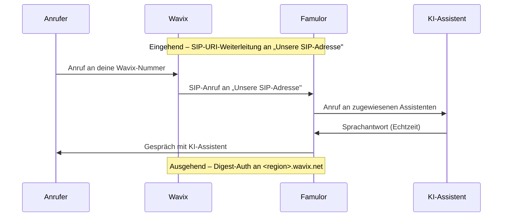

import SipDoneForYou from '/de/snippets/sip-done-for-you-partner-de.mdx';

<SipDoneForYou />


# Wavix-Nummer mit Famulor verbinden

In dieser Anleitung verbindest du eine **Wavix**-Telefonnummer über einen **SIP-Trunk** mit Famulor.

<Note>
  Famulor hat **kein** spezielles Wavix-Import-Feature. Du legst in Wavix einen **SIP-Trunk** an und verbindest ihn über **SIP-Trunk integrieren** in Famulor.

  - **Ausgehende Anrufe:** Famulor sendet Anrufe an das **Wavix-Gateway** und authentifiziert sich per **Digest** (SIP-Trunk-ID + Passwort).
  - **Eingehende Anrufe:** Auf der Wavix-Nummer richtest du eine **SIP-URI-Weiterleitung** an die **SIP-Adresse von Famulor** ein.
</Note>

## Funktionsweise



## Voraussetzungen

- Aktives **Wavix**-Konto mit mindestens einer Telefonnummer
- Famulor-Konto

---

## Schritt 1: SIP-Trunk in Wavix erstellen

1. Öffne im Wavix-Portal **Numbers & Trunks → Trunks** und klicke auf **Create new**.
2. Wähle als **Authentication Method** die Option **Digest** (Benutzername/Passwort).
3. Lege ein **Passwort** fest und wähle eine **Caller ID** aus deinen Wavix-Nummern.
4. Notiere dir nach dem Speichern:

| Feld | Bedeutung |
| --- | --- |
| **SIP trunk ID** | Automatisch erzeugte **5-stellige** ID – dein Benutzername |
| **Passwort** | Das von dir festgelegte Trunk-Passwort |
| **Gateway** | Dein regionales Wavix-Gateway, z. B. `us.wavix.net` (vollständige Liste unten auf der Wavix-Trunks-Seite) |

<Note>
  Bewahre **SIP trunk ID** und **Passwort** sicher auf. Du brauchst beide in Schritt 2.
</Note>

---

## Schritt 2: SIP-Trunk in Famulor einrichten

1. Öffne Famulor unter [app.famulor.de/phone-numbers?lang=de](https://app.famulor.de/phone-numbers?lang=de) → **Deine Telefonnummern** → **+ SIP-Trunk integrieren**.
2. Trage die Daten wie folgt ein:

| Feld | Wert |
| --- | --- |
| **SIP-Trunk-Typ** | **Telefonnummer (DID)** |
| **Telefonnummer** | Deine Wavix-Nummer im E.164-Format (z. B. `+12025550123`) |
| **Benutzername** | Die **5-stellige SIP-Trunk-ID** aus Schritt 1 |
| **Passwort** | Das **Trunk-Passwort** aus Schritt 1 |
| **SIP-Adresse** (ausgehend) | Dein Wavix-Gateway (z. B. `us.wavix.net`, ohne Port) |
| **Format der ausgehenden Telefonnummer** | **International (mit + vorne)** |
| **Land** | Das Land deines Wavix-Trunks |

3. Kopiere unter **Einstellungen für eingehende Anrufe** den Wert **Unsere SIP-Adresse** (z. B. `xxxxxx.eu.sip.livekit.cloud`). Du brauchst ihn in Schritt 3.
4. Klicke auf **SIP-Nummer hinzufügen**.


---

## Schritt 3: Eingehende Anrufe in Wavix weiterleiten

Damit Anrufe bei Famulor ankommen, leitest du die Wavix-Nummer per **SIP-URI** an die SIP-Adresse von Famulor weiter.

1. Öffne im Wavix-Portal **Numbers & Trunks → My numbers**.
2. Klicke bei der gewünschten Nummer im **(⋮)**-Menü auf **Edit number**.
3. Wähle unter **Destination → Configure inbound call routing** die Option **SIP URI**.
4. Trage als Ziel ein:

```text
[did]@<Unsere SIP-Adresse>;transport=tcp
```

**Beispiel:**

```text
[did]@xxxxxx.eu.sip.livekit.cloud;transport=tcp
```

<Note>
  Den Platzhalter **`[did]`** ersetzt Wavix automatisch durch deine Wavix-Rufnummer. Übernimm die **genaue** „Unsere SIP-Adresse" aus Famulor und behalte **`;transport=tcp`** bei.
</Note>

---

## Schritt 4: Assistenten zuweisen und testen

1. Öffne in Famulor den Bereich **Assistenten** und bearbeite den gewünschten Assistenten.
2. Wähle den passenden **Empfangstyp** (eingehende Anrufe).
3. Wähle deine verbundene Wavix-Telefonnummer aus der Liste.
4. Klicke auf **Assistent speichern**.
5. Führe einen **Testanruf** auf deine Wavix-Nummer durch und prüfe, ob der KI-Assistent antwortet.

---

## Häufige Probleme

<AccordionGroup>
  <Accordion title="Eingehende Anrufe kommen nicht an" icon="phone-slash">
    Prüfe die **SIP-URI-Weiterleitung** auf der Wavix-Nummer (Schritt 3): Format `[did]@<Unsere SIP-Adresse>;transport=tcp`, die **genaue** „Unsere SIP-Adresse" aus Famulor und der angehängte **`;transport=tcp`**.
  </Accordion>

  <Accordion title="Ausgehende Anrufe schlagen fehl" icon="arrow-up-right-from-square">
    Prüfe in Famulor die **SIP-Adresse** (dein Wavix-Gateway, z. B. `us.wavix.net`), die **SIP-Trunk-ID** als Benutzername und das **Passwort**. Stelle sicher, dass die Authentifizierung in Wavix auf **Digest** steht.
  </Accordion>

  <Accordion title="Ausgehende Anrufe werden abgewiesen (Nummernformat)" icon="hashtag">
    Wavix verlangt für ausgehende Anrufe das **E.164-Format**. Wähle in Famulor **International (mit + vorne)** und vermeide Präfixe wie `0`, `00` oder `011`.
  </Accordion>

  <Accordion title="Falsche oder unbekannte SIP-Adresse" icon="server">
    Verwende immer die **exakte** „Unsere SIP-Adresse" aus Famulor (Telefonnummern → SIP-Trunk integrieren → Einstellungen für eingehende Anrufe).
  </Accordion>
</AccordionGroup>

---

## Hilfe

<Tip>
  Bei Problemen kontaktiere unser Support-Team unter [support@famulor.io](mailto:support@famulor.io). Allgemeine Hinweise findest du unter [SIP-Integration](/de/provisioning/sip-ai/sip-integration) und [SIP-Integrationsprobleme](/de/troubleshooting/sip-integration-issues).
</Tip>
