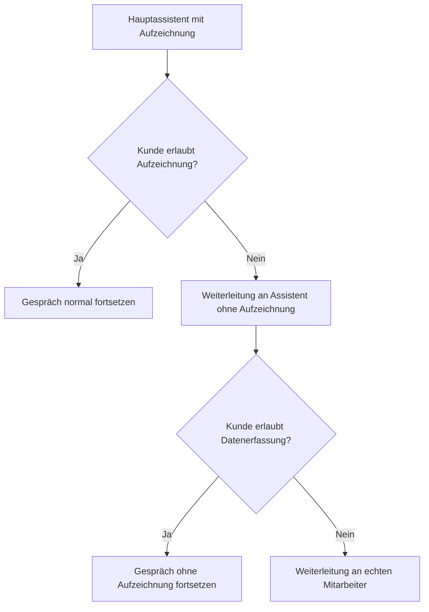

<iframe
  className="w-full aspect-video rounded-xl"
  src="https://www.youtube.com/embed/aYlsDNXrnLk"
  title="DSGVO im KI-Telefonassistenten: Automatische Weiterleitung bei Ablehnung"
  frameBorder="0"
  allow="accelerometer; autoplay; clipboard-write; encrypted-media; gyroscope; picture-in-picture"
  allowFullScreen
></iframe>

> So richtest du eine DSGVO-konforme Weiterleitung ein, wenn Kunden keine Aufzeichnung oder keine Datenerfassung wünschen.

Diese Lösung deckt zwei typische DSGVO-Szenarien ab:

1. Der Kunde möchte **nicht**, dass das Gespräch aufgezeichnet wird.
2. Der Kunde möchte **keine sensiblen persönlichen Daten** an eine KI weitergeben.

In beiden Fällen kannst du den Anruf automatisch an eine sichere Alternative weiterleiten:

- entweder an einen **zweiten Assistenten ohne Aufzeichnung**
- oder direkt an einen **menschlichen Mitarbeiter**

## Wann diese Lösung sinnvoll ist

Nutze diese Einrichtung, wenn dein Assistent:

- zu Beginn des Gesprächs um Zustimmung zur Aufzeichnung bittet
- Termine bucht oder andere sensible Daten abfragt
- DSGVO-konform auf Ablehnung reagieren soll

<Info>
  **Empfohlene Logik:** Wenn der Kunde die Aufzeichnung ablehnt, leite zuerst an einen zweiten Assistenten **ohne Aufzeichnung** weiter. Wenn der Kunde zusätzlich die Erfassung persönlicher Daten ablehnt, leite direkt an einen **echten Mitarbeiter** weiter.
</Info>

## Voraussetzungen

Bevor du startest, benötigst du:

- einen bestehenden Hauptassistenten
- eine **zweite Telefonnummer**
- eine Zielnummer für die Weiterleitung an einen echten Mitarbeiter
- Zugriff auf **Prompt & Werkzeuge**

## Einrichtung Schritt für Schritt

### 1. Hauptassistenten duplizieren

1. Öffne deinen bestehenden Assistenten.
2. Dupliziere ihn.
3. Benenne die Kopie eindeutig, z. B. `Heidi ohne Aufzeichnung`.

Diese Kopie wird dein Fallback-Assistent ohne Recording.

### 2. Zweite Telefonnummer zuweisen

1. Öffne den duplizierten Assistenten.
2. Weise ihm deine **zweite Telefonnummer** zu.
3. Klicke auf **Speichern**.

### 3. Aufzeichnung beim kopierten Assistenten deaktivieren

1. Scrolle im kopierten Assistenten nach unten bis zu **Anruf aufzeichnen**.
2. Deaktiviere die Aufzeichnung.
3. Klicke erneut auf **Speichern**.

<Warning>
  Dieser zweite Assistent darf keine Aufzeichnung aktiv haben. Nur so ist die Weiterleitung bei Ablehnung sauber getrennt.
</Warning>

### 4. Weiterleitung vom Non-Record-Assistenten an einen Menschen einrichten

1. Öffne beim duplizierten Assistenten den Bereich **Prompt & Werkzeuge**.
2. Füge eine **Anrufweiterleitung** hinzu.
3. Trage dort die Telefonnummer des Mitarbeiters oder Geschäftsführers ein.
4. Hinterlege die Prompt-Regel für die Weiterleitung bei Ablehnung sensibler Daten.
5. Speichere den Assistenten.

#### Prompt Nr. 1: Non-Record auf echten Menschen

```txt
Wenn der Kunde zusätzlich ablehnt dass sensible persönliche Daten erfasst oder gespeichert werden, oder Aussagen macht wie "ich möchte keine Daten angeben", "bitte keine persönlichen Informationen speichern" oder ähnliches, leite den Anruf sofort an einen menschlichen Mitarbeiter weiter.
```

## 5. Nummer des Non-Record-Assistenten kopieren

1. Öffne den kopierten Assistenten ohne Aufzeichnung.
2. Kopiere dessen zugewiesene Telefonnummer.

Diese Nummer wird nun als Ziel für die Weiterleitung aus dem Hauptassistenten verwendet.

### 6. Weiterleitung vom Hauptassistenten zum Non-Record-Assistenten einrichten

1. Öffne wieder deinen ursprünglichen Hauptassistenten.
2. Geh zu **Prompt & Werkzeuge**.
3. Füge eine **Anrufweiterleitung** hinzu.
4. Trage als Ziel die Telefonnummer des Assistenten **ohne Aufzeichnung** ein.
5. Hinterlege die Prompt-Regel für den Fall, dass der Kunde die Aufzeichnung ablehnt.
6. Speichere den Hauptassistenten.

#### Prompt Nr. 2: Record auf Non-Record

```txt
Wenn der Kunde sagt dass er nicht möchte dass das Gespräch aufgezeichnet wird, oder Aussagen macht wie "nein", "lieber nicht", "kein Interesse an Aufzeichnung" oder ähnliches, leite den Anruf sofort an den Assistenten ohne Aufzeichnung weiter.
```

### 7. System-Prompt des Hauptassistenten ergänzen

Damit die Weiterleitung zuverlässig ausgelöst wird, muss der Hauptassistent die Frage zur Aufzeichnung überhaupt aktiv stellen.

Ergänze daher im System-Prompt eine klare Regel, dass:

- zu Beginn nach Zustimmung zur Aufzeichnung gefragt wird
- bei Ablehnung die Weiterleitung zum Non-Record-Assistenten erfolgt

Wenn du den Prompt-Editor mit KI nutzt, kannst du sinngemäß eingeben:

```txt
Ich möchte eine DSGVO-konforme Weiterleitung einrichten mit der Frage, ob Anrufe aufgezeichnet werden dürfen. Wenn der Kunde ablehnt, soll direkt an den Assistenten ohne Aufzeichnung weitergeleitet werden.
```

## Empfohlener Gesprächsfluss



## Testen der Einrichtung

Teste die komplette Kette mit echten Testanrufen:

1. Ruf deinen Hauptassistenten an.
2. Lehne die Aufzeichnung ab.
3. Prüfe, ob der Anruf an den zweiten Assistenten ohne Recording weitergeleitet wird.
4. Lehne dort zusätzlich die Angabe persönlicher Daten ab.
5. Prüfe, ob die Weiterleitung an den menschlichen Mitarbeiter funktioniert.

<Check>
  Teste beide Szenarien getrennt:

  - **Ablehnung der Aufzeichnung**
  - **Ablehnung sensibler Datenerfassung**
</Check>

## Häufige Fehler

### Die Weiterleitung wird nicht ausgelöst

- Prüfe, ob die Regel zusätzlich im **System-Prompt** steht
- Prüfe, ob die Weiterleitungslogik im richtigen Assistenten hinterlegt wurde
- Teste mit klaren Formulierungen wie `Ich möchte keine Aufzeichnung`

### Der zweite Assistent zeichnet trotzdem auf

- Kontrolliere beim duplizierten Assistenten die Einstellung **Anruf aufzeichnen**
- Speichere nach der Änderung erneut

### Die Weiterleitung an den Mitarbeiter funktioniert nicht

- Prüfe die Zielnummer im Weiterleitungs-Tool
- Teste die Nummer direkt manuell
- Prüfe, ob die Telefonnummer im internationalen Format hinterlegt ist

## Verwandte Seiten

- [Prompt & Werkzeuge](/de/ai-assistants/prompt-and-tools)
- [Deinen Assistenten testen](/de/ai-assistants/testing)
- [Allgemeine Setup-Probleme](/de/troubleshooting/setup-issues)
- [KI-Verhalten](/de/troubleshooting/ai-behavior)
