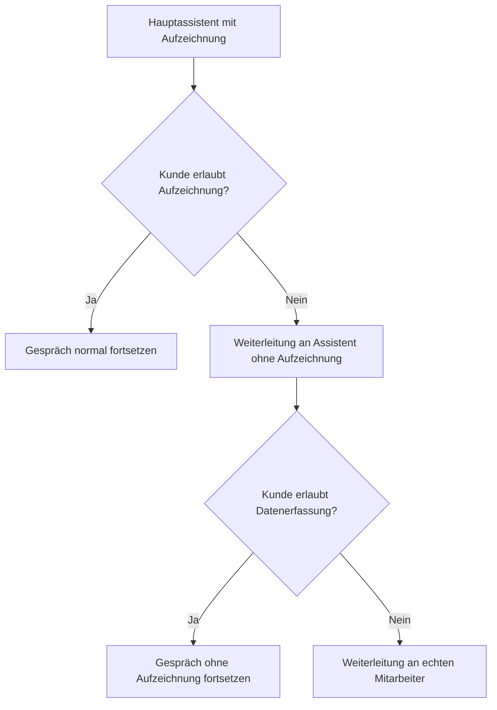

<iframe
  className="w-full aspect-video rounded-xl"
  src="https://www.youtube.com/embed/aYlsDNXrnLk"
  title="DSGVO im KI-Telefonassistenten: Automatische Weiterleitung bei Ablehnung"
  frameBorder="0"
  allow="accelerometer; autoplay; clipboard-write; encrypted-media; gyroscope; picture-in-picture"
  allowFullScreen
></iframe>

> So richten Sie eine DSGVO-konforme Weiterleitung ein, wenn Kunden keine Aufzeichnung oder keine Datenerfassung wünschen.

Diese Lösung deckt zwei typische DSGVO-Szenarien ab:

1. Der Kunde möchte **nicht**, dass das Gespräch aufgezeichnet wird.
2. Der Kunde möchte **keine sensiblen persönlichen Daten** an eine KI weitergeben.

In beiden Fällen können Sie den Anruf automatisch an eine sichere Alternative weiterleiten:

- entweder an einen **zweiten Assistenten ohne Aufzeichnung**
- oder direkt an einen **menschlichen Mitarbeiter**

## Wann diese Lösung sinnvoll ist

Nutzen Sie diese Einrichtung, wenn Ihr Assistent:

- zu Beginn des Gesprächs um Zustimmung zur Aufzeichnung bittet
- Termine bucht oder andere sensible Daten abfragt
- DSGVO-konform auf Ablehnung reagieren soll

<Info>
  **Empfohlene Logik:** Wenn der Kunde die Aufzeichnung ablehnt, leiten Sie zuerst an einen zweiten Assistenten **ohne Aufzeichnung** weiter. Wenn der Kunde zusätzlich die Erfassung persönlicher Daten ablehnt, leiten Sie direkt an einen **echten Mitarbeiter** weiter.
</Info>

## Voraussetzungen

Bevor Sie starten, benötigen Sie:

- einen bestehenden Hauptassistenten
- eine **zweite Telefonnummer**
- eine Zielnummer für die Weiterleitung an einen echten Mitarbeiter
- Zugriff auf **Prompt & Werkzeuge**

## Einrichtung Schritt für Schritt

### 1. Hauptassistenten duplizieren

1. Öffnen Sie Ihren bestehenden Assistenten.
2. Duplizieren Sie ihn.
3. Benennen Sie die Kopie eindeutig, z. B. `Heidi ohne Aufzeichnung`.

Diese Kopie wird Ihr Fallback-Assistent ohne Recording.

### 2. Zweite Telefonnummer zuweisen

1. Öffnen Sie den duplizierten Assistenten.
2. Weisen Sie ihm Ihre **zweite Telefonnummer** zu.
3. Klicken Sie auf **Speichern**.

### 3. Aufzeichnung beim kopierten Assistenten deaktivieren

1. Scrollen Sie im kopierten Assistenten nach unten bis zu **Anruf aufzeichnen**.
2. Deaktivieren Sie die Aufzeichnung.
3. Klicken Sie erneut auf **Speichern**.

<Warning>
  Dieser zweite Assistent darf keine Aufzeichnung aktiv haben. Nur so ist die Weiterleitung bei Ablehnung sauber getrennt.
</Warning>

### 4. Weiterleitung vom Non-Record-Assistenten an einen Menschen einrichten

1. Öffnen Sie beim duplizierten Assistenten den Bereich **Prompt & Werkzeuge**.
2. Fügen Sie eine **Anrufweiterleitung** hinzu.
3. Tragen Sie dort die Telefonnummer des Mitarbeiters oder Geschäftsführers ein.
4. Hinterlegen Sie die Prompt-Regel für die Weiterleitung bei Ablehnung sensibler Daten.
5. Speichern Sie den Assistenten.

#### Prompt Nr. 1: Non-Record auf echten Menschen

```txt
Wenn der Kunde zusätzlich ablehnt dass sensible persönliche Daten erfasst oder gespeichert werden, oder Aussagen macht wie "ich möchte keine Daten angeben", "bitte keine persönlichen Informationen speichern" oder ähnliches, leite den Anruf sofort an einen menschlichen Mitarbeiter weiter.
```

## 5. Nummer des Non-Record-Assistenten kopieren

1. Öffnen Sie den kopierten Assistenten ohne Aufzeichnung.
2. Kopieren Sie dessen zugewiesene Telefonnummer.

Diese Nummer wird nun als Ziel für die Weiterleitung aus dem Hauptassistenten verwendet.

### 6. Weiterleitung vom Hauptassistenten zum Non-Record-Assistenten einrichten

1. Öffnen Sie wieder Ihren ursprünglichen Hauptassistenten.
2. Gehen Sie zu **Prompt & Werkzeuge**.
3. Fügen Sie eine **Anrufweiterleitung** hinzu.
4. Tragen Sie als Ziel die Telefonnummer des Assistenten **ohne Aufzeichnung** ein.
5. Hinterlegen Sie die Prompt-Regel für den Fall, dass der Kunde die Aufzeichnung ablehnt.
6. Speichern Sie den Hauptassistenten.

#### Prompt Nr. 2: Record auf Non-Record

```txt
Wenn der Kunde sagt dass er nicht möchte dass das Gespräch aufgezeichnet wird, oder Aussagen macht wie "nein", "lieber nicht", "kein Interesse an Aufzeichnung" oder ähnliches, leite den Anruf sofort an den Assistenten ohne Aufzeichnung weiter.
```

### 7. System-Prompt des Hauptassistenten ergänzen

Damit die Weiterleitung zuverlässig ausgelöst wird, muss der Hauptassistent die Frage zur Aufzeichnung überhaupt aktiv stellen.

Ergänzen Sie daher im System-Prompt eine klare Regel, dass:

- zu Beginn nach Zustimmung zur Aufzeichnung gefragt wird
- bei Ablehnung die Weiterleitung zum Non-Record-Assistenten erfolgt

Wenn Sie den Prompt-Editor mit KI nutzen, können Sie sinngemäß eingeben:

```txt
Ich möchte eine DSGVO-konforme Weiterleitung einrichten mit der Frage, ob Anrufe aufgezeichnet werden dürfen. Wenn der Kunde ablehnt, soll direkt an den Assistenten ohne Aufzeichnung weitergeleitet werden.
```

## Empfohlener Gesprächsfluss



## Testen der Einrichtung

Testen Sie die komplette Kette mit echten Testanrufen:

1. Rufen Sie Ihren Hauptassistenten an.
2. Lehnen Sie die Aufzeichnung ab.
3. Prüfen Sie, ob der Anruf an den zweiten Assistenten ohne Recording weitergeleitet wird.
4. Lehnen Sie dort zusätzlich die Angabe persönlicher Daten ab.
5. Prüfen Sie, ob die Weiterleitung an den menschlichen Mitarbeiter funktioniert.

<Check>
  Testen Sie beide Szenarien getrennt:

  - **Ablehnung der Aufzeichnung**
  - **Ablehnung sensibler Datenerfassung**
</Check>

## Häufige Fehler

### Die Weiterleitung wird nicht ausgelöst

- Prüfen Sie, ob die Regel zusätzlich im **System-Prompt** steht
- Prüfen Sie, ob die Weiterleitungslogik im richtigen Assistenten hinterlegt wurde
- Testen Sie mit klaren Formulierungen wie `Ich möchte keine Aufzeichnung`

### Der zweite Assistent zeichnet trotzdem auf

- Kontrollieren Sie beim duplizierten Assistenten die Einstellung **Anruf aufzeichnen**
- Speichern Sie nach der Änderung erneut

### Die Weiterleitung an den Mitarbeiter funktioniert nicht

- Prüfen Sie die Zielnummer im Weiterleitungs-Tool
- Testen Sie die Nummer direkt manuell
- Prüfen Sie, ob die Telefonnummer im internationalen Format hinterlegt ist

## Verwandte Seiten

- [Prompt & Werkzeuge](/de/ai-assistants/prompt-and-tools)
- [Ihren Assistenten testen](/de/ai-assistants/testing)
- [Allgemeine Setup-Probleme](/de/troubleshooting/setup-issues)
- [KI-Verhalten](/de/troubleshooting/ai-behavior)
