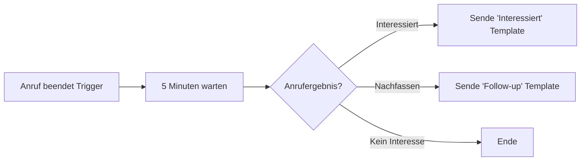
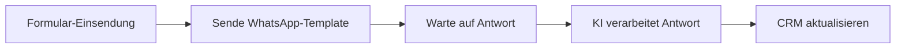
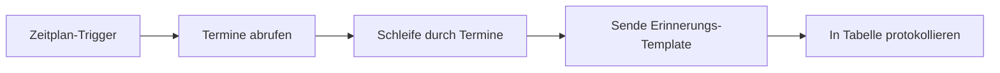

Die Automatisierungs-Plattform integriert sich mit WhatsApp, damit du Nachrichten automatisch senden, Flows durch WhatsApp-Ereignisse auslösen und KI-Antworten programmgesteuert generieren kannst.

### Medien & Vision

- **Bildanalyse (Vision)** — Wenn Kunden Bilder senden, kann dein KI-Assistent sie mit vision-fähigen LLMs (OpenAI, Claude, Gemini) analysieren. Die KI beschreibt den Bildinhalt und antwortet direkt in der Konversation.
- **Transkription von Sprachnachrichten** — Eingehende Sprachnotizen werden basierend auf den Spracheinstellungen deines Assistenten automatisch transkribiert. Der transkribierte Text wird von der KI wie eine normale Nachricht verarbeitet.
- **Medien-Anhänge** — Alle eingehenden Medien (Bilder, Audio, Video, Dokumente) werden als Anhänge in der Konversation gespeichert und sind in deinem Dashboard verfügbar.

## Verfügbare Aktionen

### WhatsApp-Template-Nachricht senden

Sende eine vorab genehmigte Template-Nachricht an einen Kunden.

**Anwendungsfälle:**

* Bestellbestätigungen nach einem Kauf senden
* Terminerinnerungen nach Zeitplan auslösen
* Follow-up-Nachrichten nach Anrufen zustellen
* Kunden erneut ansprechen, die nicht geantwortet haben

**Konfiguration:**

| Feld                  | Beschreibung                                              |
| --------------------- | --------------------------------------------------------- |
| **Absender**          | Wähle deinen WhatsApp-Absender (muss online sein)         |
| **Template**          | Wähle aus genehmigten Templates                           |
| **Empfänger-Telefon** | Kunden-Telefonnummer (E.164 Format: +491234567890)       |
| **Empfänger-Name**    | Optionaler Kundenname zur Personalisierung                |
| **Variablen**         | Dynamische Werte für Template-Platzhalter                 |

<Tip>
  **E.164 Format** — Telefonnummern müssen im internationalen Format mit Ländercode vorliegen. Beispiele:

  * ✅ `+4915112345678`
  * ✅ `+436641234567`
  * ❌ `0151/12345678`
  * ❌ `+49 (0) 151 12345678`
</Tip>

### WhatsApp-Nachricht senden (Freitext)

Sende eine Freitextnachricht an einen Kunden innerhalb des 24-Stunden-Messaging-Fensters.

<Warning>
  **24-Stunden-Fenster erforderlich** — Freitextnachrichten können nur an Kunden gesendet werden, die dir innerhalb der letzten 24 Stunden eine Nachricht geschickt haben. Für Kunden außerhalb dieses Fensters nutze bitte eine Template-Nachricht.
</Warning>

**Anwendungsfälle:**

* Sofortiges Follow-up zu aktuellen Gesprächen
* Zustellung zeitkritischer Informationen
* Automatische Reaktion auf Kundenanfragen

**Konfiguration:**

| Feld                  | Beschreibung                                     |
| --------------------- | ------------------------------------------------ |
| **Absender**          | Wähle deinen WhatsApp-Absender                   |
| **Empfänger-Telefon** | Kunden-Telefonnummer (E.164 Format)              |
| **Nachricht**         | Nachrichtentext (max. 4096 Zeichen)              |

### KI-Antwort generieren

Generiere eine KI-Antwort mithilfe deines Assistenten, identifiziert durch einen externen Kunden-Identifikator.

**Anwendungsfälle:**

* Aufbau eigener Chat-Schnittstellen
* Integration von WhatsApp in externe CRM-Systeme
* Erstellung kanalübergreifender KI-Antworten
* Verarbeitung von Nachrichten von externen Plattformen

**Konfiguration:**

| Feld                      | Beschreibung                                                  |
| ------------------------- | ------------------------------------------------------------- |
| **Assistent**             | Wähle den zu verwendenden KI-Assistenten                       |
| **Kunden-Identifikator**  | Eindeutige Kunden-ID (z. B. Telefonnummer, E-Mail, CRM-ID)    |
| **Nachricht**             | Die Nachricht, auf die geantwortet werden soll                |
| **Variablen**             | Optionale Kontextvariablen für den Assistenten                |

**Wie es funktioniert:**

1. Die Aktion findet oder erstellt ein Gespräch für den Kunden-Identifikator
2. Die Nachricht wird an deinen KI-Assistenten gesendet
3. Die KI-generierte Antwort wird zurückgegeben
4. Du kannst diese Antwort dann über WhatsApp oder andere Kanäle senden

## Trigger (Auslöser)

### WhatsApp-Nachricht erhalten

Löse einen Flow aus, wenn ein Kunde eine WhatsApp-Nachricht sendet.

**Verfügbare Daten:**

* Kunden-Telefonnummer
* Nachrichtentest
* Absender-ID
* Zeitstempel
* Gesprächs-ID

**Beispielhafte Anwendungsfälle:**

* Nachrichten in einem CRM oder einer Datenbank protokollieren
* Benachrichtigungen an dein Team senden
* Follow-up-Sequenzen auslösen
* Kundendaten sammeln und verarbeiten

### WhatsApp-Gespräch gestartet

Löse einen Flow aus, wenn ein neues WhatsApp-Gespräch beginnt.

**Verfügbare Daten:**

* Kunden-Telefonnummer
* Erster Nachrichtentext
* Absenderinformationen
* Gesprächs-ID

## Beispiellose Workflows

### WhatsApp-Follow-up nach Anruf

Sende eine WhatsApp-Template-Nachricht, nachdem ein Anruf abgeschlossen wurde:



**Einrichtung:**

1. Trigger **Anruf beendet** hinzufügen
2. Aktion **Verzögerung** (Delay) hinzufügen (optional)
3. **Verzweigung** (Branch) basierend auf Anrufergebnis hinzufügen
4. Aktion **WhatsApp-Template senden** für jeden Zweig hinzufügen
5. Template und Variablen konfigurieren

### Lead-Qualifizierung via WhatsApp

Qualifiziere Leads durch WhatsApp-Gespräche:



### Flow für Terminerinnerungen

Automatisierte Terminerinnerungen senden:



## Variablen-Mapping

Wenn du Template-Nachrichten sendest, ordne deine Flow-Daten den Template-Variablen zu:

**Template:**

```
Hallo {{1}}, Ihr Termin mit {{2}} am {{3}} wurde bestätigt.

Ort: {{4}}
```

**Variablen-Mapping:**

| Template-Variable | Flow-Daten                     |
| ----------------- | ------------------------------ |
| `{{1}}`           | `{{trigger.customer_name}}`    |
| `{{2}}`           | `{{trigger.agent_name}}`       |
| `{{3}}`           | `{{trigger.appointment_date}}` |
| `{{4}}`           | `{{trigger.location}}`         |

## Fehlerbehandlung

### Häufige Fehler

| Fehler                             | Ursache                                         | Lösung                                               |
| ---------------------------------- | ----------------------------------------------- | ---------------------------------------------------- |
| **Template nicht gefunden**       | Template-ID ungültig oder nicht genehmigt       | Prüfen, ob Template genehmigt und ID korrekt ist    |
| **Absender offline**              | WhatsApp-Absender ist nicht online              | Absenderstatus prüfen, Verbindung sicherstellen      |
| **Ungültige Telefonnummer**       | Telefonnummer nicht im E.164-Format             | Format als +[Ländercode][Nummer] anpassen            |
| **Außerhalb des 24-Std.-Fensters** | Versuch, Freitext außerhalb des Fensters zu senden | Nutze stattdessen eine Template-Nachricht           |
| **Rate limited**                  | Zu viele Nachrichten gesendet                   | Verzögerungen zwischen Nachrichten einbauen          |

### Strategie für erneute Versuche (Retry)

Implementiere bei fehlgeschlagenen Nachrichten eine Retry-Strategie:

1. 1 Minute warten
2. Aktion erneut versuchen
3. Falls es immer noch fehlschlägt: Fehler protokollieren und dein Team benachrichtigen

## Best Practices

### 1. Immer Templates für Outbound nutzen

Wenn du den Kontakt mit Kunden initiierst, nutze immer genehmigte Templates. Freitextnachrichten funktionieren nur innerhalb des 24-Stunden-Fensters.

### 2. Opt-Out-Optionen einbeziehen

Füge bei Marketing-Nachrichten Abmeldehinweise ein, um Vorschriften einzuhalten und deine Qualitätsbewertung hochzuhalten.

### 3. Rate-Limits respektieren

Sende nicht zu viele Nachrichten zu schnell. Implementiere angemessene Verzögerungen bei Batch-Versendungen.

### 4. Fehler elegant behandeln

Füge deinen Flows immer eine Fehlerbehandlung hinzu. Protokolliere Fehlschläge und informiere dein Team bei Problemen.

### 5. Zuerst mit Einzelempfängern testen

Bevor du Massenkampagnen startest, teste deinen Flow mit einem einzelnen Empfänger, um die korrekte Funktionsweise sicherzustellen.

### 6. Qualitätsbewertung überwachen

Behalte die Qualitätsbewertung deines Absenders im Auge. Pausiere Kampagnen, wenn du eine sinkende Qualität bemerkst.

## Nächste Schritte

* Erfahre mehr über [Nachrichten-Templates](/de/whatsapp/templates) und deren Erstellung
* Richte [WhatsApp-Absender](/de/whatsapp/senders) für deine Telefonnummern ein
* Erkunde die [Automatisierungs-Plattform](/de/automation-platform/introduction) für weitere Workflow-Optionen
