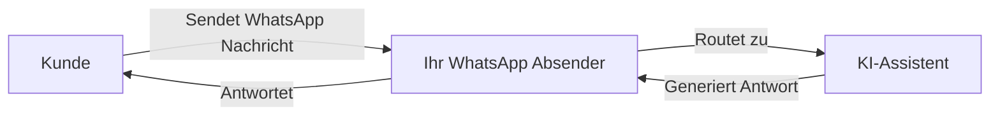

<iframe
  className="w-full aspect-video rounded-xl"
  src="https://www.youtube.com/embed/mmextF-oulc"
  title="WhatsApp Business Integration mit Famulor"
  frameBorder="0"
  allow="accelerometer; autoplay; clipboard-write; encrypted-media; gyroscope; picture-in-picture"
  allowFullScreen
></iframe>

> Verbinde deine KI-Assistenten mit WhatsApp Business für automatisierte textbasierte Kundenkommunikation

<Note>
  **Neu: Externe Nummern** — Du kannst jetzt deine eigene Mobilnummer zu WhatsApp bringen! Nutze Plattform-Nummern oder verbinde deine bestehende Mobilnummer mit SMS/Sprach-Verifizierung.
</Note>

## Was ist die WhatsApp Business Integration?

Die WhatsApp Business Integration ermöglicht es dir, deine KI-Assistenten mit WhatsApp zu verbinden. Dies ermöglicht automatisierte textbasierte Gespräche mit Kunden über die weltweit beliebteste Messaging-Plattform.

Mit dieser Integration kannst du:

* **Kunden-Nachrichten empfangen** und automatisch mit KI antworten
* **Template-Nachrichten senden**, um Gespräche zu beginnen oder Kunden erneut anzusprechen
* **KI-gestützte Antworten** für 24/7 Kundensupport nutzen
* **Automatisierungs-Flows auslösen**, basierend auf WhatsApp-Gesprächen
* **Alle Gespräche verfolgen** in deinem Dashboard

## Wie es funktioniert

1. **Erstelle einen WhatsApp-Absender** mit einer Plattform-Nummer oder deiner eigenen externen Nummer
2. **Verbinde einen KI-Assistenten**, um eingehende Nachrichten automatisch zu bearbeiten
3. **Erstelle Nachrichten-Templates** für Outbound-Gespräche (von Meta erforderlich)
4. **Kunden schreiben dir** und erhalten sofort KI-basierte Antworten

## Kernkomponenten

<CardGroup cols={2}>
  <Card title="WhatsApp-Absender" icon="phone" href="/de/whatsapp/senders">
    Telefonnummern, die für WhatsApp Business Messaging registriert sind
  </Card>

  <Card title="Nachrichten-Templates" icon="file-lines" href="/de/whatsapp/templates">
    Vorab genehmigte Nachrichtenformate für geschäftlich initiierte Gespräche
  </Card>

  <Card title="KI-Konversationen" icon="robot" href="/de/whatsapp/conversations">
    KI-gestützte automatisierte Antworten auf Kunden-Nachrichten
  </Card>

  <Card title="Automatisierung" icon="bolt" href="/de/whatsapp/automation">
    Flows auslösen und Nachrichten über die Automatisierungs-Plattform senden
  </Card>
</CardGroup>

## WhatsApp Business Regeln verstehen

WhatsApp hat spezifische Regeln für Business-Messaging, die du verstehen musst:

### Das 24-Stunden-Messaging-Fenster

<Info>
  Wenn ein Kunde dir eine Nachricht sendet, öffnet sich ein **24-Stunden-Fenster**, in dem du freie Nachrichten senden kannst. Nachdem dieses Fenster geschlossen ist, musst du ein **genehmigtes Template** verwenden, um den Kunden erneut anzusprechen.
</Info>

* **Innerhalb von 24 Stunden**: Sende jede Nachricht direkt
* **Nach 24 Stunden**: Muss eine vorab genehmigte Template-Nachricht verwendet werden

### Template-Nachrichten

Template-Nachrichten sind vorab genehmigte Nachrichtenformate, die erforderlich sind für:

* Das Starten neuer Gespräche mit Kunden
* Das erneute Ansprechen von Kunden nach Ablauf des 24-Stunden-Fensters
* Das Senden von Benachrichtigungen, Updates oder Marketing-Nachrichten

Templates müssen zur Genehmigung bei Meta eingereicht werden (dauert in der Regel Minuten bis 24 Stunden).

### Qualitätsbewertung & Limits

Meta überwacht deine Messaging-Qualität. Neue Absender beginnen mit begrenzter Kapazität, die sich erhöht, wenn du eine gute Qualität beibehältst:

| Qualitätsstufe | Tägliches Nachrichten-Limit |
| -------------- | --------------------------- |
| Neuer Absender | \~250 Nachrichten           |
| Niedrig        | 1.000 Nachrichten           |
| Mittel         | 10.000 Nachrichten          |
| Hoch           | 100.000+ Nachrichten        |

<Warning>
  Hohe Blockierraten oder Spam-Meldungen senken deine Qualitätsbewertung und reduzieren deine Messaging-Limits. Sende immer relevante, angeforderte Inhalte.
</Warning>

## Unterstützte Funktionen

### Was wird unterstützt

* **Plattform-Nummern** — Nutze über unsere Plattform erworbene Nummern mit automatisierter KI-Verifizierung
* **Externe Nummern** — Bring deine eigene Mobilnummer mit und verifiziere diese per SMS oder Sprachanruf
* KI-gestützte automatisierte Antworten
* Template-Nachrichten (Utility, Marketing, Authentifizierung)
* Voice Call Request Templates (Anforderung der Erlaubnis zum Anruf via WhatsApp)
* Gesprächsverlauf und Tracking
* Integration der Automatisierungs-Plattform

### Medien & Vision

- **Bildanalyse (Vision)** — Wenn Kunden Bilder senden, kann dein KI-Assistent sie mit vision-fähigen LLMs (OpenAI, Claude, Gemini) analysieren. Die KI beschreibt den Bildinhalt und antwortet direkt in der Konversation.
- **Transkription von Sprachnachrichten** — Eingehende Sprachnotizen werden basierend auf den Spracheinstellungen deines Assistenten automatisch transkribiert. Der transkribierte Text wird von der KI wie eine normale Nachricht verarbeitet.
- **Medien-Anhänge** — Alle eingehenden Medien (Bilder, Audio, Video, Dokumente) werden als Anhänge in der Konversation gespeichert und sind in deinem Dashboard verfügbar.

### Demnächst verfügbar

* WhatsApp-Sprachanrufe

## Erste Schritte

<Steps>
  <Step title="Wähle deinen Nummerntyp">
    Entscheide, ob du eine **Plattform-Nummer** (von uns erworben) oder deine eigene **externe Mobilnummer** verwenden möchtest. Externe Nummern müssen SMS oder Sprachanrufe zur Verifizierung empfangen können.
  </Step>

  <Step title="WhatsApp-Absender erstellen">
    Navigiere zu **WhatsApp-Absender** und folge dem Einrichtungs-Assistenten, um deine Nummer mit WhatsApp Business zu verbinden.
  </Step>

  <Step title="KI-Assistent verbinden">
    Verknüpfe einen KI-Assistenten, um automatisch auf eingehende Nachrichten zu antworten.
  </Step>

  <Step title="Templates erstellen">
    Richte Nachrichten-Templates für Outbound-Gespräche ein und warte auf die Genehmigung durch Meta.
  </Step>

  <Step title="Messaging starten">
    Dein WhatsApp-Absender ist bereit! Kunden können dir Nachrichten senden und erhalten KI-gestützte Antworten.
  </Step>
</Steps>

## Nächste Schritte

* Erfahre, wie du [WhatsApp-Absender erstellst](/de/whatsapp/senders)
* [Nachrichten-Templates](/de/whatsapp/templates) und den Genehmigungsprozess verstehen
* [Automatisierungs-Trigger](/de/whatsapp/automation) für WhatsApp einrichten
