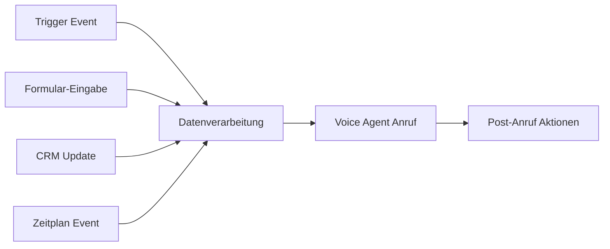

# Famulor Developer Documentation

Willkommen zur Famulor Developer Documentation! Hier finden Sie alles, was Sie benötigen, um Voice Agents mit Famulor zu erstellen und zu deployen.

## Einführung

Famulor bietet Ihnen leistungsstarke Tools zur Integration von KI-gesteuerten Voice Agents in Ihre Anwendungen. Mit unserer API und Automatisierungsplattform können Sie:

- **Voice Agents programmatisch auslösen** - Direkte API-Aufrufe für Echtzeit-Integration
- **Automatisierte Workflows erstellen** - No-Code-Lösungen für komplexe Geschäftsprozesse  
- **Anrufe in bestehende Systeme integrieren** - Nahtlose CRM- und Business-Tool-Verbindungen

<CardGroup cols={2}>
  <Card title="API Integration" icon="code" href="/api-reference/introduction">
    Direkter programmatischer Zugriff auf alle Famulor-Funktionen
  </Card>
  <Card title="No-Code Automatisierung" icon="wand-magic-sparkles" href="/automation-platform/introduction">
    Visuelle Workflow-Erstellung ohne Programmierung
  </Card>
</CardGroup>

## Anrufe auslösen: Zwei Ansätze

### 1. Anruf über API auslösen (Programmatisch)

Für Entwickler, die direkte Kontrolle über Anrufauslösung benötigen:

```javascript
const response = await fetch('https://app.famulor.de/api/user/make_call', {
  method: 'POST',
  headers: {
    'Authorization': 'Bearer YOUR_API_KEY',
    'Content-Type': 'application/json'
  },
  body: JSON.stringify({
    phone_number: '+4915123456789',
    assistant_id: 123,
    variables: {
      customer_name: 'Max Mustermann',
      email: 'max.mustermann@example.com'
    }
  })
});
```

**Ideal für:**
- Echtzeit-Anrufauslösung
- Dynamische Parameter-Injection
- Sofortige Antwort-Verarbeitung
- Integration in bestehende Anwendungen

<Card title="API Anruf-Dokumentation" icon="phone" href="/api-reference/calls/make">
  Vollständige Referenz für programmatische Anrufauslösung
</Card>

### 2. Anruf über Automatisierung auslösen (Empfohlen)

Für komplexere Business-Workflows mit mehreren Schritten:



**Vorteile:**
- **Keine Programmierung erforderlich** - Visuelle Workflow-Erstellung
- **Integrierte Datenverarbeitung** - Automatische Lead-Anreicherung
- **Multi-Step-Workflows** - Pre- und Post-Call-Automatisierung
- **Vorgefertigte Integrationen** - CRM, E-Mail, Calendar Tools

<Card title="Automatisierung Tutorial" icon="magic-wand" href="/automation-platform/tutorials/outbound-form-call">
  Schritt-für-Schritt Anleitung für automatisierte Anruf-Workflows
</Card>

## Authentifizierung

Alle API-Aufrufe erfordern einen gültigen API-Schlüssel:

<Steps>
  <Step title="API-Schlüssel erhalten">
    Melden Sie sich bei [Ihrem Famulor Dashboard](https://app.famulor.de) an und navigieren Sie zur "API-Schlüssel" Seite
  </Step>
  <Step title="Schlüssel sicher speichern">
    Kopieren Sie den API-Schlüssel und speichern Sie ihn sicher in Ihren Umgebungsvariablen
  </Step>
  <Step title="In Anfragen verwenden">
    Fügen Sie den Schlüssel im `Authorization: Bearer YOUR_API_KEY` Header hinzu
  </Step>
</Steps>

<Warning>
Halten Sie Ihren API-Schlüssel vertraulich und committen Sie ihn niemals in Versionskontrollsysteme.
</Warning>

<Card title="Vollständige Authentifizierungs-Anleitung" icon="key" href="/api-reference/authentication">
  Detaillierte Informationen zur API-Authentifizierung
</Card>

## Quick Start: Ihr erster Anruf

```bash
# 1. API-Schlüssel setzen (ersetzen Sie YOUR_API_KEY)
export FAMULOR_API_KEY="your_actual_api_key_here"

# 2. Assistenten auflisten
curl -X GET "https://app.famulor.de/api/user/assistants" \
  -H "Authorization: Bearer $FAMULOR_API_KEY"

# 3. Anruf tätigen
curl -X POST "https://app.famulor.de/api/user/make_call" \
  -H "Authorization: Bearer $FAMULOR_API_KEY" \
  -H "Content-Type: application/json" \
  -d '{
    "phone_number": "+4915123456789",
    "assistant_id": 123,
    "variables": {
      "customer_name": "Test Kunde"
    }
  }'
```

## Voice Agent Deployment-Strategien

### Echtzeit-Integration
- **Web-Anwendungen**: Sofortige Anrufauslösung durch Benutzerinteraktion
- **CRM-Integration**: Anrufe direkt aus Kundendatensätzen
- **Support-Systeme**: Automatische Eskalation zu Voice Agents

### Kampagnen-basiertes Deployment
- **Bulk-Lead-Verarbeitung**: Große Anzahl von Leads automatisch abarbeiten
- **Zeitgesteuerte Ausführung**: Anrufe zu optimalen Zeiten planen
- **Fortschritts-Tracking**: Detaillierte Kampagnen-Analytics

### Event-gesteuerte Aktivierung
- **Webhook-Trigger**: Anrufe durch externe Ereignisse auslösen
- **Automatisierungsplattform**: Komplexe Multi-Step-Workflows
- **Conditional Logic**: Intelligente Anruf-Routing-Entscheidungen

## Entwickler-Ressourcen

<CardGroup cols={2}>
  <Card title="API Referenz" icon="book" href="/api-reference/introduction">
    Vollständige API-Dokumentation mit Beispielen
  </Card>
  <Card title="Automatisierungsplattform" icon="flow" href="/automation-platform/introduction">
    No-Code-Workflow-Erstellung für Voice Agents
  </Card>
  <Card title="Integration Beispiele" icon="puzzle-piece" href="/automation-platform/integrations/overview">
    Vorgefertigte Integrationen für beliebte Tools
  </Card>
  <Card title="Webhooks" icon="webhook" href="/api-reference/webhooks/post-call">
    Post-Call-Datenverarbeitung und Automatisierung
  </Card>
</CardGroup>

## Nächste Schritte

1. **[API-Schlüssel erstellen](/api-reference/authentication)** - Authentifizierung einrichten
2. **[Ersten Anruf tätigen](/api-reference/calls/make)** - API-Integration testen
3. **[Automatisierung erkunden](/automation-platform/introduction)** - No-Code-Workflows erstellen
4. **[Integrationen konfigurieren](/automation-platform/integrations/overview)** - Business-Tools verbinden

<Tip>
Beginnen Sie mit der Automatisierungsplattform, wenn Sie komplexere Geschäftsprozesse abbilden möchten. Nutzen Sie die direkte API für einfache, programmatische Integrationen.
</Tip>