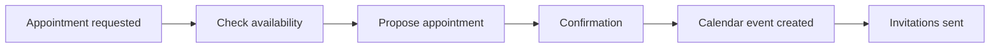

# Calendar & Appointment Scheduling Integrations

Optimize your appointment scheduling and turn every phone interaction into perfectly orchestrated meetings and appointments. Famulor Automation connects your AI phone assistants with leading calendar systems for seamless scheduling automation.

## Google Calendar Integration

### Overview
Google Calendar is the world’s leading calendar platform with powerful collaboration and scheduling features.

### AI Phone Assistant Use Cases

#### 📅 Intelligent Appointment Scheduling
**Description**: Check availability and book appointments directly during phone calls.

**Automation Workflow**:

**Appointment Types**:
- **Sales Demos**: With product presentation agenda
- **Consultations**: With preparation checklists
- **Support Sessions**: With technical requirements
- **Follow-up Meetings**: With previous call notes

#### ⏰ Buffer Time Management
**Description**: Automatically add preparation time before important customer appointments.

**Buffer Time Strategies**:
- 15 min before sales calls for customer research
- 30 min before demos for setup and testing
- 10 min before support calls for case review
- 5 min after appointments for note taking

#### 🌍 Multi-Timezone Coordination
**Description**: Manage international customer appointments with automatic timezone conversion.

**Timezone Features**:
- Automatic detection of customer timezone
- Optimal appointment time suggestions
- Multiple timezone display in invitations
- Reminders in local time

---

## Calendly Integration

### Overview
Calendly specializes in automated appointment scheduling with intelligent booking workflows.

### AI Phone Assistant Use Cases

#### 🔗 Instant Booking Links
**Description**: Share booking links via SMS immediately after calls for effortless appointment scheduling.

**Booking Link Strategies**:
- **Demo Slots**: 45-60 min slots for product demos
- **Consultation Calls**: 30 min for consultations
- **Quick Check-ins**: 15 min for status updates
- **Deep Dives**: 90 min for technical discussions

#### 🎯 Service-Specific Scheduling
**Description**: Route different appointment types to appropriate calendars based on call content.

**Routing Logic**:
- **Sales Calls** → Sales team calendar
- **Technical Support** → Support engineer calendar
- **Billing Issues** → Finance team calendar
- **Product Feedback** → Product manager calendar

#### ⚡ Follow-up Automation
**Description**: Automatically schedule follow-up calls based on conversation outcomes.

**Follow-up Scenarios**:
- Interest shown → Demo in 2-3 days
- Demo completed → Decision call in 1 week
- Proposal presented → Follow-up in 3 days
- Objections → Objection-handling call next week

---

## Microsoft Outlook Calendar Integration

### Overview
Microsoft Outlook Calendar is the enterprise standard for calendar management with deep Office 365 integration.

### AI Phone Assistant Use Cases

#### 🏢 Enterprise Meeting Coordination
**Description**: Schedule complex multi-party meetings discussed during sales calls.

**Meeting Orchestration**:
- **Stakeholder identification**: Based on call contents
- **Availability check**: For all relevant participants
- **Resource booking**: Conference rooms and equipment
- **Agenda creation**: Generated from call notes

#### 📚 Resource Allocation
**Description**: Book conference rooms and equipment when customers plan on-site visits.

**Resource Management**:
- Room size based on participant count
- AV equipment for presentations
- Catering for longer sessions
- Parking reservations for visitors

#### 🔔 Reminder Automation
**Description**: Set automatic reminders for important customer commitments.

**Reminder Types**:
- Contract deadlines from negotiations
- Follow-up commitments
- Product launch dates
- Renewal appointments

---

## Cal.com Integration

### Overview
Cal.com is an open-source scheduling platform with high customization.

### AI Phone Assistant Use Cases

#### 🔧 Custom Booking Workflows
**Description**: Create tailored booking flows for specific customer types.

#### 🔗 API-First Scheduling
**Description**: Leverage advanced API features for complex scheduling logic.

#### 🎨 White-Label Booking
**Description**: Offer appointment booking with your branding to customers.

---

## Acuity Scheduling Integration

### AI Phone Assistant Use Cases

#### 💳 Payment Integration
**Description**: Collect payments for paid consultations during booking.

#### 📋 Intake Forms
**Description**: Gather preparatory information before appointments.

---

## When2meet Integration

### AI Phone Assistant Use Cases

#### 👥 Group Meeting Coordination
**Description**: Coordinate group meetings based on call discussions.

---

## SimplyBook.me Integration

### AI Phone Assistant Use Cases

#### 🏪 Service Business Booking
**Description**: Book specific services based on customer requests.

---

## Calendar Integration Best Practices

### 🎯 Appointment Optimization
- **Buffer times**: Schedule preparation and follow-up time
- **Meeting hygiene**: Avoid back-to-back appointments
- **Prime time**: Reserve best times for key customers
- **Break scheduling**: Consider team breaks

### 📊 Availability Management
- **Real-time sync**: Synchronize calendars in real time
- **Multi-calendar**: Consider personal and business calendars
- **Conflict resolution**: Automatic conflict handling
- **Backup options**: Alternative appointment suggestions

### 🔄 Automation Workflows
- **Pre-meeting**: Automatic preparation and reminders
- **During meeting**: Meeting notes and action items
- **Post-meeting**: Follow-up and documentation
- **Rescheduling**: Intelligent rescheduling in case of conflicts

### 📱 Mobile Integration
- **App notifications**: Push notifications for important appointments
- **Location services**: GPS-based arrival reminders
- **Quick actions**: Fast appointment actions from mobile
- **Offline access**: Functionality without internet connection

## Advanced Scheduling Scenarios

### Multi-Location Coordination
- **Office locations**: Consideration of multiple office sites
- **Remote options**: Automatic video call links
- **Travel time**: Calculation of travel time between appointments
- **Time zone mastery**: Complex international scheduling

### Industry-Specific Scheduling
- **Healthcare**: Patient appointments with compliance requirements
- **Legal**: Client appointments with confidentiality
- **Consulting**: Project-based appointment blocks
- **Sales**: Pipeline-driven meeting strategies

### AI-Enhanced Scheduling
- **Predictive booking**: AI prediction of optimal appointment times
- **Dynamic pricing**: Time-based appointment pricing
- **Behavior analysis**: Customer behavior-based optimization
- **Smart rescheduling**: Intelligent rescheduling on changes

## Getting Started

<Steps>
  <Step title="Select Calendar System">
    Choose your primary calendar system for integration
  </Step>
  <Step title="API Setup">
    Configure API access and permissions
  </Step>
  <Step title="Booking Rules">
    Define rules for automatic appointment booking
  </Step>
  <Step title="Create Workflows">
    Build scheduling workflows using the visual builder
  </Step>
  <Step title="Team Synchronization">
    Synchronize all relevant team calendars
  </Step>
</Steps>

## Next Steps

<CardGroup cols={2}>
  <Card title="CRM Integration" icon="users" href="/en/automation-platform/integrations/crm">
    Link appointments with customer data
  </Card>
  <Card title="Email Marketing" icon="envelope" href="/en/automation-platform/integrations/email-marketing">
    Automated appointment confirmations and reminders
  </Card>
  <Card title="Communication" icon="comments" href="/en/automation-platform/integrations/communication">
    Team notifications about new appointments
  </Card>
  <Card title="Productivity" icon="tasks" href="/en/automation-platform/integrations/productivity">
    Task creation from meeting outcomes
  </Card>
</CardGroup>

---

**Support**: For assistance with calendar integrations, contact us at [support@famulor.io](mailto:support@famulor.io).

<Tip>
Related pages: [Introduction](/en/automation-platform/introduction) and [Building Flows](/en/automation-platform/building-flows), and [Debugging Runs](/en/automation-platform/debugging-runs).
</Tip>
