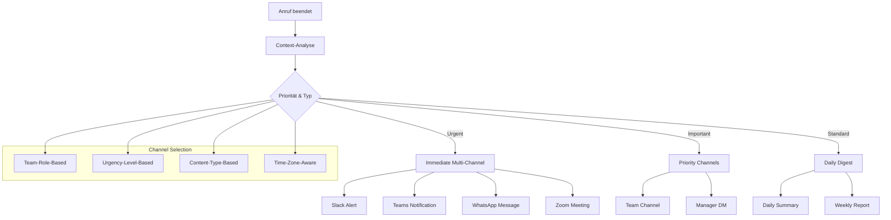

# Communication & Collaboration Integration Hub

Revolutionieren Sie Ihre Team-Kommunikation mit intelligenten Collaboration-Integrationen. Famulor Automation verbindet Ihre KI-Telefonassistenten mit führenden Communication-Plattformen für automatische Team-Updates, Meeting-Intelligence und optimierte Workflow-Koordination.

<Note>
**Team-Produktivitäts-Boost**: Teams mit Communication-Integrationen berichten von 67% schnellerer Informationsverteilung und 45% weniger Meeting-Overhead.
</Note>

## Warum Communication-Integration für Voice-AI?

### 💬 Sofortige Team-Synchronisation
Alle wichtigen Anruf-Updates werden automatisch an die richtigen Team-Channels weitergeleitet für nahtlose Information-Flows.

### 🔄 Nahtlose Workflow-Integration
Anruf-basierte Actions triggern automatisch Team-Workflows und halten alle Stakeholder im Loop.

### 🎥 Hybrid-Communication-Excellence
Intelligente Eskalation von Telefon- zu Video-Gesprächen für optimale Kommunikationserfahrungen.

### 👥 Advanced Collaboration-Features
Nutzen Sie Bots, Adaptive Cards und Workflow-Automation für sophisticated Team-Koordination.

## Verfügbare Communication & Collaboration-Integrationen

### 🏆 Enterprise Team-Platforms

<CardGroup cols={2}>
  <Card title="Slack" icon="slack" href="/automation-platform/integrations/einzelintegrations/slack">
    **Team-Produktivitäts-Champion**
    
    Automatische Channel-Updates, Rich-Message-Formatting und Interactive-Workflows für optimale Team-Koordination.
    
    ✅ Real-time Team-Updates  
    ✅ Custom-Workflow-Builder  
    ✅ Adaptive-Bot-Integration  
    ✅ Cross-Channel-Coordination
  </Card>
  
  <Card title="Microsoft Teams" icon="microsoft" href="/automation-platform/integrations/einzelintegrations/microsoft-teams">
    **Enterprise-Collaboration-Suite**
    
    Vollständige Microsoft 365-Integration mit Adaptive Cards, Power Platform und Enterprise-Security.
    
    ✅ Enterprise-Grade-Security  
    ✅ Office 365-Integration  
    ✅ Power Platform-Workflows  
    ✅ Compliance-Features
  </Card>
  
  <Card title="Zoom" icon="video" href="/automation-platform/integrations/einzelintegrations/zoom">
    **Video-Communication-Leader**
    
    Automatische Meeting-Erstellung, Phone-to-Video-Escalation und intelligente Participant-Management.
    
    ✅ Seamless Phone-to-Video  
    ✅ Meeting-Intelligence  
    ✅ Webinar-Integration  
    ✅ Zoom-Phone-Compatibility
  </Card>
  
  <Card title="Discord" icon="discord" href="/automation-platform/integrations/einzelintegrations/discord">
    **Community-Driven-Communication**
    
    Server-basierte Team-Organisation mit Voice-Channels, Bots und Gaming-Community-Features.
    
    ✅ Voice-Channel-Integration  
    ✅ Bot-Command-System  
    ✅ Role-based-Permissions  
    ✅ Community-Management
  </Card>
</CardGroup>

### 📱 Mobile & Messaging-Platforms

<CardGroup cols={3}>
  <Card title="WhatsApp Business" icon="whatsapp" href="/automation-platform/integrations/einzelintegrations/whatsapp-business">
    **Business-Messaging-Leader**
    
    Automatische WhatsApp-Nachrichten, Template-Messages und Business-API-Integration.
  </Card>
  
  <Card title="Telegram Bot" icon="telegram" href="/automation-platform/integrations/einzelintegrations/telegram">
    **Secure Messaging-Platform**
    
    Bot-Integration für automatische Updates, Command-System und Group-Management.
  </Card>
  
  <Card title="Signal" icon="signal" href="/automation-platform/integrations/einzelintegrations/signal">
    **Privacy-First-Messaging**
    
    End-to-End-verschlüsselte Team-Kommunikation für sicherheitskritische Organisationen.
  </Card>
</CardGroup>

## Communication-Workflow-Automation

### 1. Multi-Channel-Notification-System



### 2. Intelligent Escalation-Workflows

**Automatische Communication-Escalation:**
- 📞 **Phone-to-Chat**: Standard-Updates in Team-Channels
- 💬 **Chat-to-Video**: Komplexe Diskussionen automatisch eskaliert
- 🎥 **Video-to-Conference**: Multi-Stakeholder-Coordination
- 🚨 **Emergency-Protocols**: Critical-Issues sofort an alle Channels

## Team-Coordination-Scenarios

### 🚀 Sales-Team-Coordination

```
Sales-Lead-Update-Flow:
├─ Slack #sales-pipeline: Lead-Details + Action-Buttons
├─ Teams Sales-Channel: CRM-Integration + Follow-up-Tasks
├─ WhatsApp Sales-Manager: Mobile-Alert für Hot-Leads
├─ Zoom Demo-Meeting: Automatisch geplant bei Demo-Interest
└─ Email Sales-Team: Daily-Digest mit Lead-Summary
```

### 🔧 Support-Team-Coordination

```
Support-Escalation-Flow:
├─ Slack #support-urgent: P1-Issues mit War-Room-Link
├─ Teams IT-Channel: Technical-Details + Expert-Assembly
├─ Discord Dev-Server: Code-related Issues für Developer
├─ Zoom War-Room: Screen-Share-Session für complex Problems
└─ WhatsApp On-Call: After-Hours-Emergency-Notifications
```

### 💼 Executive-Team-Coordination

```
Executive-Briefing-Flow:
├─ Teams Executive-Channel: Strategic-Updates + Board-Prep
├─ Slack C-Level: Confidential-Communications
├─ Zoom Executive-Meeting: Quarterly-Reviews + Strategy-Sessions
├─ WhatsApp Executive-Group: Urgent-Decision-Making
└─ Email Board-Members: Formal-Documentation + Minutes
```

## Advanced Communication-Features

### 1. AI-Powered-Message-Intelligence

**Smart-Content-Generation:**
```
Intelligent Message Creation:
📝 Context-Aware-Messaging:
├─ Anruf-Summary automatisch generiert
├─ Action-Items extrahiert und zugewiesen
├─ Key-Decisions dokumentiert
├─ Follow-up-Tasks erstellt
└─ Stakeholder-Updates personalisiert

🎯 Audience-Appropriate-Messaging:
├─ Technical-Details für Developer-Channels
├─ Business-Impact für Management-Updates
├─ Customer-Perspective für Support-Teams
├─ Financial-Implications für Finance-Teams
└─ Strategic-Context für Executive-Briefings
```

### 2. Cross-Platform-Workflow-Orchestration

**Multi-Platform-Automation:**
```
Unified-Workflow-Examples:
🔄 Lead-Qualification-Workflow:
   Anruf → Slack-Alert → Teams-CRM-Update → Zoom-Demo → WhatsApp-Follow-up

⚠️ Incident-Response-Workflow:
   Crisis-Call → Multi-Channel-Alert → Zoom-War-Room → Teams-Documentation → Slack-Status-Updates

📊 Performance-Review-Workflow:
   Review-Call → Teams-Performance-Dashboard → Slack-Team-Update → Zoom-1on1-Meetings → Email-Action-Plans
```

### 3. Integration-Health-Monitoring

**Platform-Performance-Tracking:**
- 📊 **Message-Delivery-Rates**: Erfolgsrate für alle Channels
- ⏱️ **Response-Time-Analytics**: Team-Reaktionszeiten messen
- 👥 **Engagement-Metrics**: Channel-Activity und Participation
- 🔧 **Integration-Status**: Real-time-Health-Monitoring aller Platforms

## Branchenspezifische Communication-Setups

### 🏥 Healthcare & Medical Teams
```
HIPAA-Compliant-Communication:
├─ Encrypted-Channels für Patient-Data
├─ Audit-Logs für alle Communications
├─ Role-based-Access für Medical-Records
├─ Emergency-Protocols für Critical-Care
└─ Telemedicine-Integration für Remote-Consultations
```

### 🏢 Remote-First-Organizations
```
Global-Team-Coordination:
├─ Timezone-Aware-Notifications
├─ Asynchronous-Communication-Workflows
├─ Cultural-Sensitivity-Settings
├─ Language-Translation-Integration
└─ 24/7-Follow-the-Sun-Support-Handoffs
```

### 🏭 Manufacturing & Operations
```
Real-time-Operations-Communication:
├─ Shop-Floor-Integration mit Mobile-Devices
├─ Emergency-Response-Protocols
├─ Shift-Handoff-Automation
├─ Quality-Control-Issue-Escalation
└─ Supply-Chain-Communication-Workflows
```

## Security & Compliance-Features

### 🔐 Enterprise-Security-Standards

**Multi-Platform-Security-Integration:**
```
Security-Framework:
├─ Single-Sign-On (SSO) für alle Platforms
├─ Multi-Factor-Authentication (MFA)
├─ End-to-End-Encryption für sensitive Communications
├─ Data-Loss-Prevention (DLP) policies
├─ Audit-Logging für Compliance-Requirements
└─ Geographic-Data-Residency-Controls
```

### 📋 Compliance-Automation

**Regulatory-Compliance-Features:**
- **GDPR/DSGVO**: Automatische Daten-Retention und -Deletion
- **SOX-Compliance**: Financial-Communication-Audit-Trails
- **HIPAA**: Healthcare-Communication-Encryption und Access-Controls
- **SOC-2**: Security-Monitoring und Incident-Response-Automation

## Setup & Best-Practices

### Quick-Start-Communication-Setup

<Steps>
  <Step title="Platform-Prioritäten definieren">
    Bestimmen Sie Ihre primären Communication-Channels basierend auf Team-Präferenzen und Use-Cases.
  </Step>
  
  <Step title="Channel-Mapping konfigurieren">
    Ordnen Sie verschiedene Anruf-Typen den entsprechenden Team-Channels zu.
  </Step>
  
  <Step title="Notification-Rules einrichten">
    Definieren Sie Urgency-Level und entsprechende Multi-Channel-Notification-Strategien.
  </Step>
  
  <Step title="Workflow-Automation aktivieren">
    Aktivieren Sie Cross-Platform-Workflows für nahtlose Team-Koordination.
  </Step>
  
  <Step title="Team-Training durchführen">
    Schulen Sie Ihr Team in der optimalen Nutzung der integrierten Communication-Tools.
  </Step>
</Steps>

### Communication-Excellence-Framework

```
Best-Practice-Guidelines:
📋 Channel-Organization:
☐ Department-specific Channels etabliert
☐ Project-based Communication-Channels
☐ Urgency-Level-based Notification-Channels
☐ Cross-functional Collaboration-Spaces

💬 Message-Quality-Standards:
☐ Consistent-Messaging-Templates
☐ Action-oriented Communication-Style
☐ Context-rich Information-Sharing
☐ Thread-Management für organized Discussions

🔔 Notification-Management:
☐ Smart-Notification-Schedules
☐ Do-Not-Disturb-Policies respektiert
☐ Mobile-vs-Desktop-Notification-Preferences
☐ Escalation-Protocols für urgent Issues

🤝 Collaboration-Protocols:
☐ Meeting-vs-Async-Communication-Guidelines
☐ File-Sharing-Standards etabliert
☐ Decision-Making-Processes dokumentiert
☐ Cross-Platform-Etiquette-Training
```

## ROI & Team-Productivity-Metrics

### Communication-Integration-Performance

| Metrik | Ohne Integration | Mit Communication+Voice | Verbesserung |
|--------|------------------|------------------------|--------------|
| **Information-Sharing-Speed** | 4-6 Stunden | 2-5 Minuten | 95% schneller |
| **Team-Response-Time** | 45 Minuten | 8 Minuten | 82% schneller |
| **Meeting-Overhead** | 12h/Woche/Person | 6h/Woche/Person | 50% Reduktion |
| **Cross-Team-Collaboration** | 23% Projects | 78% Projects | +239% |
| **Employee-Satisfaction** | 6.8/10 | 9.2/10 | +35% |

### Team-Productivity-ROI

```
Monthly-Productivity-Gains (50-Person-Organization):
├─ Communication-Efficiency: 125 Stunden/Monat gespart
├─ Faster-Decision-Making: 67 Stunden/Monat weniger Delays
├─ Reduced-Meeting-Time: 89 Stunden/Monat Meeting-Optimization
├─ Improved-Information-Flow: 156 Stunden/Monat weniger Information-Gaps

Financial-Impact:
├─ Productivity-Savings: €24,750/Monat (bei €75/h Average)
├─ Faster-Issue-Resolution: €12,300/Monat
├─ Better-Customer-Experience: €8,900/Monat
├─ Integration-Costs: €1,200/Monat
├─ Net-ROI: €44,750/Monat (3,729% ROI)
└─ Payback-Period: 1 Tag
```

---

**Bereit für intelligente Team-Communication?**

<CardGroup cols={2}>
  <Card title="Integration starten" icon="comments" href="https://app.famulor.de/integrations">
    Verbinden Sie Ihre Communication-Tools
  </Card>
  <Card title="Team-Demo buchen" icon="users" href="https://cal.com/bek-group/demotermine">
    Live-Demo für Ihr gesamtes Team
  </Card>
  <Card title="Workflow-Templates" icon="workflow" href="/automation-platform/integrations/communication-templates">
    Vorgefertigte Communication-Workflows
  </Card>
  <Card title="Support kontaktieren" icon="life-ring" href="mailto:support@famulor.io">
    Fragen zur Communication-Integration?
  </Card>
</CardGroup>