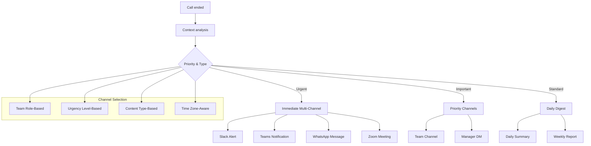

# Communication & Collaboration Integration Hub

Revolutionize your team communication with intelligent collaboration integrations. Famulor Automation connects your AI phone assistants with leading communication platforms for automatic team updates, meeting intelligence, and optimized workflow coordination.

<Note>
**Team Productivity Boost**: Teams using communication integrations report 67% faster information distribution and 45% less meeting overhead.
</Note>

## Why Communication Integration for Voice AI?

### 💬 Instant Team Synchronization  
All key call updates are automatically forwarded to the right team channels for seamless information flow.

### 🔄 Seamless Workflow Integration  
Call-based actions automatically trigger team workflows, keeping all stakeholders in the loop.

### 🎥 Hybrid Communication Excellence  
Intelligent escalation from phone to video calls for optimal communication experiences.

### 👥 Advanced Collaboration Features  
Leverage bots, adaptive cards, and workflow automation for sophisticated team coordination.

## Available Communication & Collaboration Integrations

### 🏆 Enterprise Team Platforms

<CardGroup cols={2}>
  <Card title="Slack" icon="slack" href="/automation-platform/integrations/einzelintegrations/slack">
    **Team Productivity Champion**
    
    Automatic channel updates, rich message formatting, and interactive workflows for optimal team coordination.
    
    ✅ Real-time Team Updates  
    ✅ Custom Workflow Builder  
    ✅ Adaptive Bot Integration  
    ✅ Cross-Channel Coordination
  </Card>
  
  <Card title="Microsoft Teams" icon="microsoft" href="/automation-platform/integrations/einzelintegrations/microsoft-teams">
    **Enterprise Collaboration Suite**
    
    Full Microsoft 365 integration with adaptive cards, Power Platform, and enterprise security.
    
    ✅ Enterprise-Grade Security  
    ✅ Office 365 Integration  
    ✅ Power Platform Workflows  
    ✅ Compliance Features
  </Card>
  
  <Card title="Zoom" icon="video" href="/automation-platform/integrations/einzelintegrations/zoom">
    **Video Communication Leader**
    
    Automatic meeting creation, phone-to-video escalation, and intelligent participant management.
    
    ✅ Seamless Phone-to-Video  
    ✅ Meeting Intelligence  
    ✅ Webinar Integration  
    ✅ Zoom Phone Compatibility
  </Card>
  
  <Card title="Discord" icon="discord" href="/automation-platform/integrations/einzelintegrations/discord">
    **Community-Driven Communication**
    
    Server-based team organization with voice channels, bots, and gaming community features.
    
    ✅ Voice Channel Integration  
    ✅ Bot Command System  
    ✅ Role-Based Permissions  
    ✅ Community Management
  </Card>
</CardGroup>

### 📱 Mobile & Messaging Platforms

<CardGroup cols={3}>
  <Card title="WhatsApp Business" icon="whatsapp" href="/automation-platform/integrations/einzelintegrations/whatsapp-business">
    **Business Messaging Leader**
    
    Automatic WhatsApp messages, template messages, and business API integration.
  </Card>
  
  <Card title="Telegram Bot" icon="telegram" href="/automation-platform/integrations/einzelintegrations/telegram">
    **Secure Messaging Platform**
    
    Bot integration for automatic updates, command system, and group management.
  </Card>
  
  <Card title="Signal" icon="signal" href="/automation-platform/integrations/einzelintegrations/signal">
    **Privacy-First Messaging**
    
    End-to-end encrypted team communication for security-critical organizations.
  </Card>
</CardGroup>

## Communication Workflow Automation

### 1. Multi-Channel Notification System


```mermaid
graph TB
    A[Call ended] --> B[Context analysis]
    B --> C{Priority & Type}
    C -->|Urgent| D[Immediate Multi-Channel]
    C -->|Important| E[Priority Channels]
    C -->|Standard| F[Daily Digest]
    
    D --> G[Slack Alert]
    D --> H[Teams Notification]
    D --> I[WhatsApp Message]
    D --> J[Zoom Meeting]
    
    E --> K[Team Channel]
    E --> L[Manager DM]
    
    F --> M[Daily Summary]
    F --> N[Weekly Report]
    
    subgraph "Channel Selection"
        O[Team Role-Based]
        P[Urgency Level-Based]
        Q[Content Type-Based]
        R[Time Zone-Aware]
    end
    
    C --> O
    C --> P
    C --> Q
    C --> R
```

### 2. Intelligent Escalation Workflows

**Automatic Communication Escalation:**  
- 📞 **Phone-to-Chat**: Standard updates in team channels  
- 💬 **Chat-to-Video**: Complex discussions automatically escalated  
- 🎥 **Video-to-Conference**: Multi-stakeholder coordination  
- 🚨 **Emergency Protocols**: Critical issues immediately sent to all channels

## Team Coordination Scenarios

### 🚀 Sales Team Coordination

```
Sales Lead Update Flow:
├─ Slack #sales-pipeline: Lead details + action buttons
├─ Teams Sales Channel: CRM integration + follow-up tasks
├─ WhatsApp Sales Manager: Mobile alerts for hot leads
├─ Zoom Demo Meeting: Automatically scheduled on demo interest
└─ Email Sales Team: Daily digest with lead summary
```

### 🔧 Support Team Coordination

```
Support Escalation Flow:
├─ Slack #support-urgent: P1 issues with war room link
├─ Teams IT Channel: Technical details + expert assembly
├─ Discord Dev Server: Code-related issues for developers
├─ Zoom War Room: Screen share session for complex problems
└─ WhatsApp On-Call: After-hours emergency notifications
```

### 💼 Executive Team Coordination

```
Executive Briefing Flow:
├─ Teams Executive Channel: Strategic updates + board prep
├─ Slack C-Level: Confidential communications
├─ Zoom Executive Meeting: Quarterly reviews + strategy sessions
├─ WhatsApp Executive Group: Urgent decision-making
└─ Email Board Members: Formal documentation + minutes
```

## Advanced Communication Features

### 1. AI-Powered Message Intelligence

**Smart Content Generation:**  
```
Intelligent Message Creation:
📝 Context-Aware Messaging:
├─ Call summary auto-generated
├─ Action items extracted and assigned
├─ Key decisions documented
├─ Follow-up tasks created
└─ Stakeholder updates personalized

🎯 Audience-Appropriate Messaging:
├─ Technical details for developer channels
├─ Business impact for management updates
├─ Customer perspective for support teams
├─ Financial implications for finance teams
└─ Strategic context for executive briefings
```

### 2. Cross-Platform Workflow Orchestration

**Multi-Platform Automation:**  
```
Unified Workflow Examples:
🔄 Lead Qualification Workflow:
   Call → Slack Alert → Teams CRM Update → Zoom Demo → WhatsApp Follow-up

⚠️ Incident Response Workflow:
   Crisis Call → Multi-Channel Alert → Zoom War Room → Teams Documentation → Slack Status Updates

📊 Performance Review Workflow:
   Review Call → Teams Performance Dashboard → Slack Team Update → Zoom 1-on-1 Meetings → Email Action Plans
```

### 3. Integration Health Monitoring

**Platform Performance Tracking:**  
- 📊 **Message Delivery Rates**: Success rate across all channels  
- ⏱️ **Response Time Analytics**: Measuring team reaction times  
- 👥 **Engagement Metrics**: Channel activity and participation  
- 🔧 **Integration Status**: Real-time health monitoring of all platforms

## Industry-Specific Communication Setups

### 🏥 Healthcare & Medical Teams
```
HIPAA-Compliant Communication:
├─ Encrypted channels for patient data
├─ Audit logs for all communications
├─ Role-based access for medical records
├─ Emergency protocols for critical care
└─ Telemedicine integration for remote consultations
```

### 🏢 Remote-First Organizations
```
Global Team Coordination:
├─ Timezone-aware notifications
├─ Asynchronous communication workflows
├─ Cultural sensitivity settings
├─ Language translation integration
└─ 24/7 follow-the-sun support handoffs
```

### 🏭 Manufacturing & Operations
```
Real-time Operations Communication:
├─ Shop floor integration with mobile devices
├─ Emergency response protocols
├─ Shift handoff automation
├─ Quality control issue escalation
└─ Supply chain communication workflows
```

## Security & Compliance Features

### 🔐 Enterprise Security Standards

**Multi-Platform Security Integration:**  
```
Security Framework:
├─ Single Sign-On (SSO) for all platforms
├─ Multi-Factor Authentication (MFA)
├─ End-to-End Encryption for sensitive communications
├─ Data Loss Prevention (DLP) policies
├─ Audit logging for compliance requirements
└─ Geographic data residency controls
```

### 📋 Compliance Automation

**Regulatory Compliance Features:**  
- **GDPR/DSGVO**: Automated data retention and deletion  
- **SOX Compliance**: Financial communication audit trails  
- **HIPAA**: Healthcare communication encryption and access controls  
- **SOC-2**: Security monitoring and incident response automation

## Setup & Best Practices

### Quick-Start Communication Setup

<Steps>
  <Step title="Define platform priorities">
    Determine your primary communication channels based on team preferences and use cases.
  </Step>
  
  <Step title="Configure channel mapping">
    Assign different call types to the appropriate team channels.
  </Step>
  
  <Step title="Set up notification rules">
    Define urgency levels and corresponding multi-channel notification strategies.
  </Step>
  
  <Step title="Activate workflow automation">
    Enable cross-platform workflows for seamless team coordination.
  </Step>
  
  <Step title="Conduct team training">
    Train your team on the optimal use of integrated communication tools.
  </Step>
</Steps>

### Communication Excellence Framework

```
Best Practice Guidelines:
📋 Channel Organization:
☐ Established department-specific channels
☐ Project-based communication channels
☐ Urgency-level-based notification channels
☐ Cross-functional collaboration spaces

💬 Message Quality Standards:
☐ Consistent messaging templates
☐ Action-oriented communication style
☐ Context-rich information sharing
☐ Thread management for organized discussions

🔔 Notification Management:
☐ Smart notification schedules
☐ Do-not-disturb policies respected
☐ Mobile vs desktop notification preferences
☐ Escalation protocols for urgent issues

🤝 Collaboration Protocols:
☐ Meeting vs async communication guidelines
☐ Established file-sharing standards
☐ Documented decision-making processes
☐ Cross-platform etiquette training
```

## ROI & Team Productivity Metrics

### Communication Integration Performance

| Metric                      | Without Integration | With Communication+Voice | Improvement    |
|-----------------------------|--------------------|-------------------------|----------------|
| **Information Sharing Speed** | 4-6 hours          | 2-5 minutes             | 95% faster     |
| **Team Response Time**       | 45 minutes         | 8 minutes               | 82% faster     |
| **Meeting Overhead**         | 12h/week/person    | 6h/week/person          | 50% reduction  |
| **Cross-Team Collaboration** | 23% projects       | 78% projects            | +239%          |
| **Employee Satisfaction**    | 6.8/10             | 9.2/10                  | +35%           |

### Team Productivity ROI

```
Monthly Productivity Gains (50-Person Organization):
├─ Communication Efficiency: 125 hours/month saved
├─ Faster Decision Making: 67 hours/month fewer delays
├─ Reduced Meeting Time: 89 hours/month optimized meetings
├─ Improved Information Flow: 156 hours/month fewer information gaps

Financial Impact:
├─ Productivity Savings: €24,750/month (at €75/h average)
├─ Faster Issue Resolution: €12,300/month
├─ Better Customer Experience: €8,900/month
├─ Integration Costs: €1,200/month
├─ Net ROI: €44,750/month (3,729% ROI)
└─ Payback Period: 1 day
```

---

**Ready for intelligent team communication?**

<CardGroup cols={2}>
  <Card title="Start Integration" icon="comments" href="https://app.famulor.de/integrations">
    Connect Your Communication Tools
  </Card>
  <Card title="Book Team Demo" icon="users" href="https://cal.com/bek-group/demotermine">
    Live Demo for Your Entire Team
  </Card>
  <Card title="Workflow Templates" icon="workflow" href="/automation-platform/integrations/communication-templates">
    Pre-Built Communication Workflows
  </Card>
  <Card title="Contact Support" icon="life-ring" href="mailto:support@famulor.io">
    Questions About Communication Integration?
  </Card>
</CardGroup>