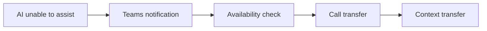

# Communication Platform Integrations

Ensure seamless team communication and instant notifications by integrating your AI phone assistants with modern communication platforms. Famulor Automation enables you to automatically share important call information with your team.

## Slack Integration

### Overview
Slack is the leading business communication platform for teams. The integration with Famulor Automation brings call intelligence directly into your Slack workflows.

### Integration Capabilities
- **Channel messaging and notifications**
- **File sharing and collaboration**
- **Workflow automation**
- **Custom bot integration**
- **Rich message formatting**

### AI Phone Assistant Use Cases

#### 🚨 Instant Call Notifications
**Description**: Notify sales teams immediately when high-quality prospects call.

**Notification Triggers**:
- High-value leads (based on company size/budget)
- Existing customers with upgrade interest
- Urgent support requests
- At-risk customers

**Slack message example**:
```
🔥 HOT LEAD ALERT
Customer: Max Mustermann (Mustermann GmbH)
Phone: +49 30 12345678
Interest: Enterprise Solution
Budget: €50,000+
Next Steps: Demo requested
Responsible: @sales-team
```

#### 📋 Automated Call Summaries
**Description**: Post automated call summaries in relevant team channels.

**Channel Routing**:
- **#sales**: Sales-related calls
- **#support**: Support and service inquiries  
- **#product**: Feature requests and product feedback
- **#management**: Executive-level conversations

**Summary template**:
```
📞 CALL SUMMARY
Time: 2024-01-15 14:30
Duration: 12 minutes
Customer: TechCorp AG
Status: Qualified lead

Key Points:
• Interest in AI phone solution
• Budget: €25,000 available
• Decision by end of Q1
• Demo scheduled for next week

Action Items:
- [ ] Confirm demo appointment (@sales-rep)
- [ ] Prepare proposal (@sales-manager)
- [ ] Collect technical requirements (@solutions-engineer)
```

#### ⚠️ Escalation Management
**Description**: Notify managers immediately when calls require human intervention.

**Escalation Scenarios**:
- Customer dissatisfied with service
- Technical issues beyond AI capabilities
- Pricing negotiations exceeding limits
- Legal or compliance questions

### Setup
1. Install the Famulor Automation Slack app
2. Configure workspace permissions
3. Map channels for different call types
4. Set up custom bot commands

---

## Microsoft Teams Integration

### Overview
Microsoft Teams is the central communication platform within the Microsoft 365 ecosystem. The integration enables seamless collaboration and call handoffs.

### Integration Capabilities
- **Team collaboration and messaging**
- **Meeting scheduling and management**
- **File and document sharing**
- **Power Platform integration**
- **Adaptive Cards for rich content**

### AI Phone Assistant Use Cases

#### 🤝 Seamless Team Call Handoffs
**Description**: Transfer calls seamlessly to available team members using Teams integration.

**Handoff Workflow**:

```mermaid
graph LR
    A[AI unable to assist] --> B[Teams notification]
    B --> C[Availability check]
    C --> D[Call transfer]
    D --> E[Context transfer]
```

**Availability Check**:
- Online/offline status
- Calendar availability
- "Do Not Disturb" settings
- Skills match for the request

#### 📅 Automated Meeting Scheduling
**Description**: Schedule follow-up meetings directly through Teams based on call discussions.

**Meeting Types**:
- **Sales Demo**: After product interest
- **Technical Discussion**: For technical questions
- **Contract Review**: During contract negotiations
- **Support Session**: For complex support cases

**Automated Meeting Invitation**:
- Relevant participants based on conversation content
- Agenda generated from call notes
- Attached documents and resources
- Calendar integration for all involved

#### 📢 Department Notifications
**Description**: Notify specific departments when calls mention their services or products.

**Department Mapping**:
- **Marketing**: Mention of campaigns or marketing materials
- **Product**: Feature requests or product feedback
- **Finance**: Billing or payment inquiries
- **Legal**: Compliance or contract questions

---

## Discord Integration

### Overview
Discord is especially popular within gaming, tech, and community-focused companies. The integration is ideal for community support and informal team communication.

### Integration Capabilities
- **Community messaging and voice**
- **Bot integration**
- **Server management**
- **Rich embeds and reactions**
- **Webhook support**

### AI Phone Assistant Use Cases

#### 👥 Community Support Connection
**Description**: Link phone support with Discord community channels for ongoing assistance.

**Support Workflow**:
1. Call identifies community-relevant topic
2. Discord invitation sent automatically
3. Support ticket created in appropriate channel
4. Community moderators notified

#### 🎉 Event Notifications
**Description**: Announce scheduled calls or important customer contacts to community moderators.

**Event Types**:
- **VIP Customer Calls**: Key customer conversations
- **Product Launch Calls**: Discussions about new features
- **Community Feedback Sessions**: Calls for community input
- **Support Escalations**: When community help is needed

#### 🔄 Customer Feedback Loop
**Description**: Share anonymized call feedback with community teams for product improvements.

**Feedback Categories**:
- Feature requests and improvement suggestions
- Bug reports and technical issues
- User experience feedback
- Performance issues

### Discord Bot Commands
```
/call-summary - Shows recent call summaries
/escalate - Escalates current support case
/feedback - Collects community feedback on calls
/stats - Shows call statistics for today
```

---

## Telegram Integration

### Overview
Telegram offers secure messaging features and is especially popular among international teams.

### AI Phone Assistant Use Cases

#### 🌍 International Team Notifications
**Description**: Notify global teams about important calls across multiple time zones.

#### 🔐 Secure Call Updates
**Description**: Utilize Telegram’s encryption for sensitive call information.

#### 📱 Mobile-First Notifications
**Description**: Instant push notifications for time-critical calls.

---

## WhatsApp Business Integration

### Overview
WhatsApp Business enables professional communication with customers through the world’s most popular messaging app.

### AI Phone Assistant Use Cases

#### 💬 Seamless Call-to-Chat Transitions
**Description**: Switch from phone calls to WhatsApp chats for ongoing communication.

**Transition Workflow**:
1. Call ends with follow-up actions
2. WhatsApp link sent automatically
3. Conversation context transferred to chat
4. Continued support via WhatsApp

#### 📋 Call Follow-ups via WhatsApp
**Description**: Send automated follow-up messages after calls.

**Follow-up Types**:
- Call summary and next steps
- Documents and resource links
- Appointment confirmations
- Feedback requests

#### 🌐 International Customer Communication
**Description**: Use WhatsApp for cost-effective international customer communication.

---

## Zoom Integration

### Overview
Zoom is the leading video conferencing platform for business meetings and webinars.

### AI Phone Assistant Use Cases

#### 🎥 Automatic Demo Scheduling
**Description**: Automatically schedule Zoom demos based on call interest.

#### 📺 Webinar Registration
**Description**: Register interested callers automatically for relevant webinars.

#### 🔄 Meeting-to-Call Workflows
**Description**: Create follow-up calls based on Zoom meeting outcomes.

---

## Communication Integration Best Practices

### 🎯 Channel Management
- **Clear channel assignment**: Define specific channels for different call types
- **Spam prevention**: Implement filters for relevant notifications
- **Message formatting**: Use consistent, readable message formats
- **Threading**: Utilize threads for follow-up discussions

### ⚡ Real-time Responsiveness
- **Instant notifications**: Ensure minimal latency for critical alerts
- **Status indicators**: Display handling status of call items
- **Auto-acknowledge**: Implement automatic acknowledgements
- **Escalation timers**: Set timeouts for response times

### 🔔 Notification Management
- **Priority levels**: Implement different priority tiers
- **Quiet hours**: Respect team quiet times
- **Role-based routing**: Send relevant messages to appropriate roles
- **Digest options**: Offer summarized updates

### 📊 Analytics Integration
- **Response time tracking**: Measure team response times
- **Engagement metrics**: Track message effectiveness
- **Channel performance**: Analyze channel-specific metrics
- **Team productivity**: Assess impact on team efficiency

## Advanced Integration Scenarios

### Multi-Platform Orchestration
- **Cross-platform workflows**: Orchestrate messages across multiple platforms
- **Unified inbox**: Centralize responses from different channels
- **Smart routing**: Intelligent forwarding based on team preferences
- **Context preservation**: Maintain context across platform boundaries

### AI-Enhanced Communication
- **Sentiment-based routing**: Route messages based on call sentiment
- **Auto-summarization**: Generate automatic summaries
- **Language translation**: Translate messages for international teams
- **Predictive notifications**: Forecast important notification needs

## Getting Started

<Steps>
  <Step title="Select Platform">
    Choose your primary communication platform for integration
  </Step>
  <Step title="Install Bot/App">
    Install the corresponding Famulor Automation app
  </Step>
  <Step title="Configure Channels">
    Set up specific channels for different notification types
  </Step>
  <Step title="Notification Rules">
    Define rules for when and how notifications are sent
  </Step>
  <Step title="Team Training">
    Train your team on using the new communication workflows
  </Step>
</Steps>

## Next Steps

<CardGroup cols={2}>
  <Card title="Email Integration" icon="envelope" href="/automation-platform/integrations/email-marketing">
    Expand communication with email automation
  </Card>
  <Card title="CRM Integration" icon="users" href="/automation-platform/integrations/crm">
    Connect communication with customer data
  </Card>
  <Card title="Project Management" icon="tasks" href="/automation-platform/integrations/productivity">
    Automated task creation from communication
  </Card>
  <Card title="Analytics" icon="chart-line" href="/automation-platform/integrations/analytics">
    Measure communication effectiveness
  </Card>
</CardGroup>

---

**Support**: For assistance with communication integrations, contact us at [support@famulor.de](mailto:support@famulor.de).