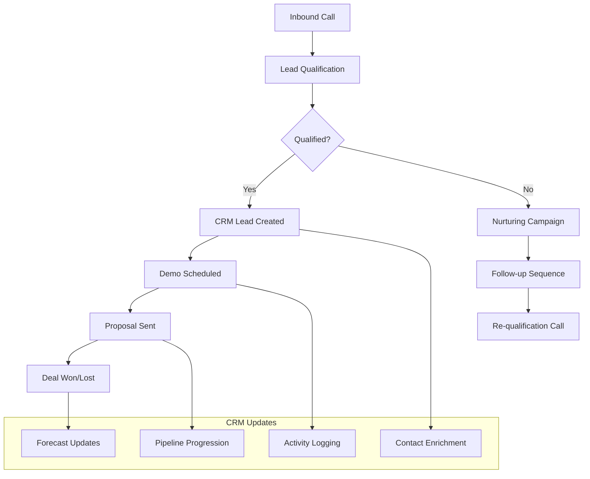

# CRM & Sales Integration Hub

Transform your sales process with intelligent CRM integrations. Famulor Automation connects your AI phone assistants with leading CRM and sales platforms for automatic lead capture, pipeline management, and data-driven sales optimization.

<Note>
**Sales Excellence**: Over 95% of our customers report significantly improved conversion rates and shorter sales cycles through CRM integration.
</Note>

## Why CRM Integration for Voice AI?

### 📊 Automatic Pipeline Management
Every call is automatically logged in your CRM with accurate deal stages, lead scores, and follow-up activities.

### 🎯 360° Customer View
Combine phone insights with CRM data for complete customer intelligence and personalized conversations.

### ⚡ Real-Time Sales Intelligence
Your CRM data is retrieved and updated during the call to enable contextual, data-driven sales conversations.

### 📈 Performance Tracking Revolution
Automatic capture of all sales activities for precise forecasting, team performance analysis, and ROI tracking.

## Available CRM & Sales Integrations

### 🏆 Enterprise CRM Solutions

<CardGroup cols={2}>
  <Card title="HubSpot" icon="hubspot" href="/automation-platform/integrations/einzelintegrations/hubspot">
    **All-in-One CRM & Marketing**
    
    Automatic contact creation, deal management, email sequences, and marketing automation directly from calls.
    
    ✅ Free tier available  
    ✅ Comprehensive API integration  
    ✅ Marketing Hub integration  
    ✅ Sales pipeline automation
  </Card>
  
  <Card title="Salesforce" icon="salesforce" href="/automation-platform/integrations/einzelintegrations/salesforce">
    **Enterprise CRM Market Leader**
    
    Full Salesforce integration with Lightning Experience, custom objects, and advanced workflows.
    
    ✅ Enterprise-grade security  
    ✅ Custom object support  
    ✅ Apex trigger integration  
    ✅ Einstein AI enhancement
  </Card>
  
  <Card title="Pipedrive" icon="chart-line" href="/automation-platform/integrations/einzelintegrations/pipedrive">
    **Sales Pipeline Specialist**
    
    Visual pipeline management with automatic deal updates and intelligent sales forecasting.
    
    ✅ Intuitive pipeline visualization  
    ✅ Automatic deal progression  
    ✅ Sales forecasting tools  
    ✅ Mobile-first design
  </Card>
  
  <Card title="ActiveCampaign" icon="envelope" href="/automation-platform/integrations/einzelintegrations/activecampaign">
    **CRM + Marketing Automation**
    
    Intelligent lead nurturing combinations with email marketing and customer journey automation.
    
    ✅ Behavior-based automation  
    ✅ Advanced segmentation  
    ✅ Lead scoring integration  
    ✅ Multi-channel campaigns
  </Card>
</CardGroup>

### 💼 Specialized Sales Tools

<CardGroup cols={3}>
  <Card title="Airtable" icon="table" href="/automation-platform/integrations/einzelintegrations/airtable">
    **Flexible CRM Alternative**
    
    No-code CRM construction with customizable fields, relations, and workflow automation.
  </Card>
  
  <Card title="Notion" icon="notion" href="/automation-platform/integrations/einzelintegrations/notion">
    **All-in-One Workspace**
    
    CRM features combined with documentation, project management, and team collaboration.
  </Card>
  
  <Card title="Monday.com" icon="monday" href="/automation-platform/integrations/einzelintegrations/monday">
    **Visual Project CRM**
    
    Board-based CRM with timeline views, automation, and team coordination.
  </Card>
</CardGroup>

## Sales Process Automation Flows

### 1. Lead-to-Customer Journey



### 2. Multi-Touch Attribution

**Automatic Sales Activity Tracking:**
- 📞 **Call Attribution**: Every touchpoint automatically assigned in the CRM  
- 📧 **Email Integration**: Follow-up emails based on call outcomes  
- 📅 **Meeting Coordination**: Automatic calendar integration  
- 📊 **Performance Analytics**: ROI tracking for each sales channel

## Industry-Specific CRM Setups

### 🏥 Healthcare & Medical
```
Specialized Features:
├─ HIPAA compliance integration
├─ Patient relationship management
├─ Appointment scheduling automation
├─ Medical records integration
└─ Insurance verification workflows
```

### 🏢 B2B Software & SaaS
```
Enterprise Sales Features:
├─ Multi-stakeholder account management
├─ Technical evaluation tracking
├─ Contract negotiation workflows
├─ Onboarding process automation
└─ Expansion revenue tracking
```

### 🏪 E-Commerce & Retail
```
Commerce-Optimized CRM:
├─ Customer lifetime value tracking
├─ Purchase history integration
├─ Inventory-aware sales calls
├─ Return management workflows
└─ Loyalty program integration
```

### 🏦 Financial Services
```
FinTech Compliance Features:
├─ KYC integration workflows
├─ Compliance documentation automation
├─ Risk assessment integration
├─ Regulatory reporting automation
└─ Client onboarding compliance
```

## Advanced CRM Features

### 1. AI-Enhanced Lead Scoring

**Smart Lead Scoring:**
```
Multi-Dimensional Lead Scoring:
📞 Call Quality Indicators:
├─ Conversation length (>10min = +15 points)
├─ Engagement level (Questions asked = +10 points)
├─ Decision-maker language (+20 points)
├─ Budget mentions (+25 points)
└─ Timeline urgency (+30 points)

🎯 Behavioral Scoring:
├─ Website activity integration
├─ Email engagement history
├─ Social media interactions
├─ Content download patterns
└─ Previous call history analysis

💼 Firmographic Scoring:
├─ Company size relevance
├─ Industry fit assessment
├─ Technology stack compatibility
├─ Geographic market potential
└─ Competitive landscape position
```

### 2. Predictive Sales Analytics

**Machine Learning for Sales Optimization:**
- 📈 **Win/Loss Prediction**: ML models for deal probabilities  
- ⏰ **Optimal Timing**: Best times for follow-up calls  
- 🎯 **Next-Best Action**: AI recommendations for sales activities  
- 📊 **Churn Prevention**: Early warning systems for account risks

### 3. Revenue Operations Integration

**End-to-End Revenue Tracking:**
```
Revenue Pipeline Visibility:
├─ Marketing-qualified leads (MQL)
├─ Sales-qualified leads (SQL)  
├─ Opportunity creation rates
├─ Deal progression velocity
├─ Win rate optimization
├─ Average deal size trends
├─ Sales cycle length analysis
└─ Customer acquisition cost (CAC)
```

## Setup Guides & Best Practices

### Quick-Start Integration (5 Minutes)

<Steps>
  <Step title="Select CRM Platform">
    Choose your CRM from the list of available integrations. Each integration offers specific benefits.
  </Step>
  
  <Step title="Establish API Connection">
    Follow the specific setup guide for your CRM. All guides provide step-by-step instructions.
  </Step>
  
  <Step title="Configure Field Mapping">
    Map call data to the corresponding CRM fields. Default mappings are preconfigured.
  </Step>
  
  <Step title="Activate Workflows">
    Enable automatic workflows for lead creation, deal updates, and follow-up activities.
  </Step>
  
  <Step title="Testing & Go-Live">
    Conduct test calls, validate the CRM integration, and launch the live usage.
  </Step>
</Steps>

### Enterprise Integration Checklist

```
Pre-Implementation:
☐ Ensure CRM administrator access
☐ Backup existing CRM data
☐ Document integration requirements
☐ Review security compliance
☐ Create team training plan

During Implementation:
☐ Configure API permissions correctly
☐ Create custom fields for voice data
☐ Define workflow automation rules
☐ Optimize data sync intervals
☐ Test error handling mechanisms

Post-Implementation:
☐ Conduct user acceptance testing
☐ Enable performance monitoring
☐ Complete team training
☐ Define and track success metrics
☐ Establish continuous improvement process
```

## ROI & Performance Benchmarks

### Typical Improvements Through CRM Integration

| Metric | Without Integration | With CRM+Voice | Average Improvement |
|--------|---------------------|---------------|---------------------|
| **Lead Conversion Rate** | 8-15% | 25-42% | +180% |
| **Sales Cycle Length** | 60-90 days | 35-55 days | -40% |
| **Data Entry Time** | 15-25 min/call | 30 sec/call | -95% |
| **Pipeline Accuracy** | 60-75% | 85-95% | +25% |
| **Rep Productivity** | 20 calls/day | 35+ calls/day | +75% |
| **Customer Satisfaction** | 7.2/10 | 9.1/10 | +26% |

### ROI Calculator Framework

```
Monthly ROI Calculation (10-Person Sales Team):
├─ Time savings: 250 hours/month (data entry automation)
├─ Increased conversions: +67% more deals
├─ Shorter sales cycles: 25 days average improvement
├─ Better forecasting: 15% accuracy improvement

Financial Impact:
├─ Additional revenue: €125,000/month
├─ Productivity gains: €18,750/month (time savings)
├─ Integration costs: €2,500/month
├─ Net ROI: €141,250/month (5,650% ROI)
└─ Payback period: 5 days
```

## Support & Training Resources

### 📚 Comprehensive Documentation
- **Setup Guides**: Detailed instructions for each CRM platform  
- **Best Practices**: Proven strategies from successful implementations  
- **API Documentation**: Technical details for advanced integrations  
- **Troubleshooting**: Solutions for common challenges

### 🎓 Training & Onboarding
- **Live Demos**: Interactive demonstrations of CRM features  
- **Team Workshops**: Customizable training sessions for your sales team  
- **Certification Program**: Famulor CRM Integration Certification  
- **Ongoing Support**: 24/7 support for technical questions

### 📞 Professional Services
- **Custom Integration**: Tailored integrations for special requirements  
- **Data Migration**: Secure migration of existing CRM data  
- **Workflow Optimization**: Continuous process improvement  
- **Change Management**: Assistance with team adoption

---

**Ready for intelligent CRM integration?**

<CardGroup cols={2}>
  <Card title="Start Integration" icon="rocket" href="https://app.famulor.de/integrations">
    Choose your CRM and get started in 5 minutes
  </Card>
  <Card title="Personal Demo" icon="calendar" href="https://cal.com/bek-group/demotermine">
    Live demo with your CRM system
  </Card>
  <Card title="ROI Calculator" icon="calculator" href="/automation-platform/integrations/roi-calculator">
    Calculate your expected ROI
  </Card>
  <Card title="Contact Support" icon="life-ring" href="mailto:support@famulor.io">
    Questions about CRM integration?
  </Card>
</CardGroup>