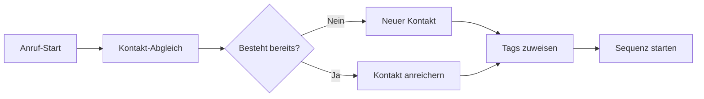

# ActiveCampaign Integration mit KI-Telefonassistenten

Revolutionieren Sie Ihre Marketing-Automatisierung mit intelligenten Telefonassistenten. Famulor Automation verbindet Ihre Anrufe nahtlos mit ActiveCampaign für automatisierte Lead-Nurturing, personalisierte E-Mail-Sequenzen und datengetriebene Customer Journeys.

<Note>
**Marketing-Revolution**: ActiveCampaign-Integration ermöglicht es, aus jedem Anruf eine personalisierte Marketing-Journey zu starten.
</Note>

## Warum ActiveCampaign + KI-Telefonassistent?

### 🎯 Hyper-personalisierte Automation
Nutzen Sie Anruf-Insights für ultra-personalisierte E-Mail-Kampagnen und Marketing-Workflows.

### 📈 360° Customer View
Kombinieren Sie Telefon-Interaktionen mit E-Mail-Verhalten für ein vollständiges Kundenbild.

### ⚡ Echtzeit-Segmentierung
Automatische Zielgruppen-Segmentierung basierend auf Gesprächsinhalten und Kundenverhalten.

### 🔄 Intelligente Lead-Scoring
Erweiterte Lead-Bewertung durch Kombination von Anruf-Daten und Digital-Verhalten.

## Hauptfunktionen der Integration

### 1. Automatische Kontakt-Erstellung & -Anreicherung

**Intelligente Datensammlung:**


**Automatisch erfasste Daten:**
- ✅ **Basisdaten**: Name, Telefon, E-Mail, Unternehmen
- ✅ **Behavioral Data**: Interesse-Level, Pain Points, Budget
- ✅ **Conversation Intelligence**: Sentiment, Kaufbereitschaft
- ✅ **Custom Fields**: Branche, Unternehmensgröße, Rolle
- ✅ **Lead Source**: Anruf-Kontext und Herkunft
- ✅ **Engagement Score**: Gesprächslänge und -qualität

### 2. Intelligente Tag-Automatisierung

**Automatische Tag-Vergabe basierend auf Gesprächsinhalten:**

| Gespräch-Inhalt | Automatische Tags | Triggered Action |
|-----------------|-------------------|------------------|
| "Preise für Enterprise" | `Enterprise-Interest`, `Budget-High` | Enterprise-Sequence |
| "Kleines Team, 5 Leute" | `SMB`, `Team-Small` | SMB-Nurturing |
| "Zeitdruck, nächste Woche" | `Urgent`, `Hot-Lead` | Sales-Alert + Fast-Track |
| "Vergleiche Anbieter" | `Evaluation-Phase`, `Competitive` | Comparison-Guide-Serie |
| "Budget ist knapp" | `Price-Sensitive`, `Startup` | Value-Focused-Content |

### 3. Dynamische E-Mail-Sequenzen

**Personalisierte Automation-Pfade:**

#### Post-Call-Sequenz für Interessenten:
```
Tag 0 (Sofort): Dankeschön + Gesprächs-Zusammenfassung
├─ Personalisierter Content basierend auf Interesse
├─ Relevante Case Studies
└─ Nächste Schritte aus Gespräch

Tag 1: Vertiefende Informationen
├─ Produktdetails zu erwähnten Features
├─ ROI-Calculator mit Gesprächsdaten vorbefüllt
└─ Industry-spezifische Insights

Tag 3: Social Proof
├─ Testimonials ähnlicher Unternehmen
├─ Success Stories der Branche
└─ Video-Case-Studies

Tag 7: Soft-Close
├─ Demo-Einladung
├─ Persönlicher Beratungstermin
└─ Limited-Time-Offer (bei Qualifikation)
```

#### Nurturing für kältere Leads:
```
Wöchentliche Educational Serie:
🎓 Woche 1: Industry Best Practices
📊 Woche 2: Trends & Benchmarks  
🛠️ Woche 3: Tools & Templates
📈 Woche 4: Success Metrics
🔄 Loop mit neuen Inhalten
```

### 4. Advanced Lead Scoring

**Multi-Channel Scoring-System:**

```
ActiveCampaign Lead Score = Base Score + Call Score + Behavior Score

Call Score Komponenten:
• Gesprächsdauer (>10min: +15 Punkte)
• Interesse-Level (Hoch: +25 Punkte)
• Budget-Erwähnung (+20 Punkte)
• Timeline urgent (+30 Punkte)
• Decision Maker (+25 Punkte)

Behavior Score Komponenten:
• E-Mail-Öffnungsrate (+1-10 Punkte)
• Link-Clicks (+5-15 Punkte)
• Website-Zeit (+1-20 Punkte)
• Content-Downloads (+10-30 Punkte)
```

**Automatische Score-Actions:**
- **90+**: Sofortiger Sales-Call + Hot-Lead-Alert
- **70-89**: Demo-Einladung + Prioritäts-Behandlung  
- **50-69**: Nurturing-Intensivierung + Re-targeting
- **30-49**: Standard-Nurturing + Quarterly Check-in
- **&lt;30**: Long-term Nurturing + Industry-Content

## Erweiterte Marketing-Automatisierung

### 1. Behavioral Trigger Integration

**Cross-Channel-Automation:**

```mermaid
graph TD
    A[Anruf: "Interesse an Feature X"] --> B[Tag: Feature-X-Interest]
    B --> C[E-Mail: Feature X Deep-Dive]
    C --> D{E-Mail geöffnet?}
    D -->|Ja| E[Website-Tracking aktiviert]
    D -->|Nein| F[Re-engagement Sequence]
    E --> G{Feature-Seite besucht?}
    G -->|Ja| H[Demo-Einladung senden]
    G -->|Nein| I[Educational Content]
```

### 2. Dynamic Content Personalization

**Anruf-Data für E-Mail-Personalisierung:**
```
E-Mail-Template mit Anruf-Variablen:

Hallo {{contact.first_name}},

vielen Dank für unser {{call.duration}}-minütiges Gespräch heute zu 
{{call.main_topic}}. 

Wie besprochen, ist {{call.pain_point}} eine wichtige Herausforderung 
für {{contact.company}}. Basierend auf Ihrer {{contact.team_size}}-
köpfigen Teamgröße habe ich {{relevant_case_study}} für Sie vorbereitet.

{{#if call.budget_mentioned}}
Mit Ihrem Budget von {{call.budget_range}} können wir definitiv eine 
passende Lösung für {{call.timeline}} realisieren.
{{/if}}

Beste Grüße,
{{user.signature}}
```

### 3. Win-Back & Re-engagement

**Intelligente Reaktivierung:**

| Inaktivitäts-Periode | Anruf-Trigger | ActiveCampaign-Reaktion |
|---------------------|---------------|-------------------------|
| 30 Tage ohne E-Mail-Öffnung | Check-in Call | Preference-Update-Survey |
| 60 Tage keine Website-Besuche | Value-Call | "Wir vermissen Sie"-Serie |
| 90 Tage keine Interaktion | Persönlicher Call | Win-Back-Campaign |
| 180 Tage komplett inaktiv | Letzter Versuch-Call | Opt-out oder Re-qualification |

## Praxisbeispiele: ActiveCampaign Voice Automation

### Beispiel 1: SaaS-Unternehmen Lead-Qualification

**Szenario:** Software-Firma mit verschiedenen Zielgruppen

**Voice-to-Marketing-Automation:**
```
Inbound-Call von Startup:
├─ Tag: "Startup" hinzugefügt
├─ Lead-Score: 45 (SMB-Segment)
├─ Sequenz: "Startup Success Stories"
├─ Content: Growth-Hacking, Bootstrapping
└─ CTA: Kostenlose Tools & Templates

Enterprise-Call:
├─ Tag: "Enterprise" hinzugefügt  
├─ Lead-Score: 85 (Enterprise-Segment)
├─ Sequenz: "Enterprise Evaluation Kit"
├─ Content: Security, Compliance, Integration
└─ CTA: Executive Demo + ROI-Assessment
```

### Beispiel 2: E-Commerce-Beratung

**Szenario:** Marketing-Agentur segmentiert nach Shop-Größe

**Automatische Segmentierung:**
```
Call-Qualifier: "Unser Shop macht 50k/Monat"
ActiveCampaign-Response:
✅ Segment: "Mid-Market E-Commerce"
✅ Lead-Score: +35 (Revenue Indicator)
✅ Automation: "E-Commerce Growth 50k+"
✅ Content: Scale-up Strategies, Advanced Tactics
✅ Custom Fields: Monthly_Revenue = 50000
✅ Next Action: Growth-Audit Angebot
```

### Beispiel 3: B2B-Services Komplexer Sales-Cycle

**Szenario:** Beratungsunternehmen mit langen Verkaufszyklen

**Multi-Touch-Automation:**
```
Erstkontakt via Telefon:
├─ Qualification Call → ActiveCampaign Lead
├─ 6-monatige Nurturing-Serie startet
├─ Quarterly Check-in Calls geplant
├─ Industry-Newsletter Subscription
└─ Event-Einladungen für Zielgruppe

Touchpoint-Tracking:
📞 Call 1: Problem-Exploration (Lead-Score: 45)
📧 E-Mail Series: Industry Insights (Open-Rate: 65%)
📞 Call 2: Solution-Fit (Lead-Score: 70)
📅 Event: Workshop-Teilnahme (Lead-Score: 85)
📞 Call 3: Proposal-Phase (Lead-Score: 95)
💰 Conversion: Projekt-Start
```

## Setup-Guide: ActiveCampaign Integration

### Schritt 1: API-Verbindung herstellen
```
1. ActiveCampaign → Settings → Developer
2. API-Key generieren und kopieren
3. Famulor → Integrations → ActiveCampaign
4. API-Key einfügen und Verbindung testen

Berechtigungen überprüfen:
✅ Contacts: Read/Write
✅ Tags: Read/Write
✅ Custom Fields: Read/Write
✅ Automations: Trigger
✅ Lists: Read/Write
```

### Schritt 2: Field-Mapping konfigurieren
```
Standard-Mappings:
📞 Telefonnummer → Phone Field
👤 Name → First Name / Last Name
🏢 Firma → Organization
💬 Gesprächsnotizen → Custom Field: "Call_Notes"
⭐ Lead-Score → Custom Field: "Call_Score"
📅 Anrufdatum → Custom Field: "Last_Call_Date"

Custom-Mappings für Ihre Needs:
🎯 Interesse → Custom Field: "Primary_Interest"
💰 Budget → Custom Field: "Budget_Range"
⏰ Timeline → Custom Field: "Decision_Timeline"
👥 Team-Größe → Custom Field: "Team_Size"
```

### Schritt 3: Automation-Trigger einrichten
```
Call-Based Triggers:
🔄 "Contact Created from Call" → Welcome-Serie
🎯 "High Interest Call" → Sales-Alert + Demo-Invitation
💰 "Budget Qualified" → Enterprise-Track
⚠️ "Objection Raised" → Objection-Handling-Serie
📞 "Follow-up Requested" → Scheduler-Link + Reminder
```

### Schritt 4: Segmentation & Tagging Rules
```
Automatische Tags basierend auf:
📊 Unternehmensgröße: SMB, Mid-Market, Enterprise
🏭 Branche: Technology, Healthcare, Finance, etc.
🎯 Use-Case: Marketing, Sales, Support, HR
📈 Funnel-Stage: Awareness, Consideration, Decision
💡 Interest-Level: Cold, Warm, Hot, On-Fire
```

## Advanced Features & Best Practices

### 1. Conditional Logic für Automations

**Smart Automation Paths:**
```
IF Contact.Call_Score > 80 AND Contact.Company_Size = "Enterprise"
THEN 
    → Add to "Enterprise Hot Leads"
    → Send to Sales within 1 hour
    → Start "Enterprise Evaluation" sequence
    → Assign to Senior Account Executive

ELSE IF Contact.Call_Score > 60 AND Contact.Budget_Mentioned = TRUE
THEN
    → Add to "Qualified Prospects" 
    → Schedule demo within 48 hours
    → Start "Product Demo Prep" sequence
    → Assign to Inside Sales Rep

ELSE
    → Add to "Nurturing Pipeline"
    → Start "Educational" sequence
    → Monthly check-in scheduled
    → Assign to Marketing Qualified Lead pool
```

### 2. A/B Testing für Call-Response Sequences

**Optimierung der Post-Call Experience:**
```
Test-Varianten für Follow-up:
Variant A: Sofort-Dankeschön + Ressourcen
Variant B: 2h Delay + personalisierte Video-Message
Variant C: Next-Day + handgeschriebene E-Mail

Metriken:
• Open-Rate
• Click-Rate  
• Reply-Rate
• Demo-Buchungen
• Conversion-to-Customer
```

### 3. Progressive Profiling

**Schrittweise Datensammlung:**
```
Call 1: Basis-Informationen (Name, Firma, Interesse)
Call 2: Details (Team-Größe, Budget-Range, Timeline)  
Call 3: Technical Requirements (Integration, Features)
Call 4: Decision Process (Stakeholders, Evaluation-Kriterien)

Jeder Call reichert ActiveCampaign-Profil weiter an
→ Bessere Segmentierung
→ Präzisere Personalisierung
→ Höhere Conversion-Rates
```

## ROI & Performance-Tracking

### Key Performance Indicators:

| Metrik | Ohne Integration | Mit AC+Voice | Verbesserung |
|--------|------------------|--------------|--------------|
| **Lead-Conversion** | 12% | 28% | +133% |
| **E-Mail Open-Rate** | 22% | 45% | +105% |
| **Demo-Buchungen** | 8% | 34% | +325% |
| **Sales-Cycle-Zeit** | 60 Tage | 35 Tage | -42% |
| **Customer-LTV** | €5,200 | €8,900 | +71% |

### ROI-Berechnung:
```
Monatliche Anrufe: 500
Conversion-Uplift: +16% (von 12% auf 28%)
Zusätzliche Conversions: 80
Durchschnittlicher Deal-Wert: €3,500
Zusätzlicher Umsatz: €280,000/Monat

Integration-Kosten: €2,000/Monat
ROI: 14,000% (oder 140:1)
Break-Even: Tag 3
```

## Troubleshooting & Support

### Häufige Herausforderungen:

**Problem**: Tags werden nicht automatisch zugewiesen
**Lösung**: Überprüfung der Keyword-Detection-Settings in Famulor

**Problem**: Duplikate-Kontakte entstehen
**Lösung**: Eindeutige Identifiers (Telefon/E-Mail) als Dedupe-Felder

**Problem**: Automations triggern nicht
**Lösung**: ActiveCampaign-Berechtigungen und Webhook-Status prüfen

### Support-Optionen:
- 📚 **Integration-Guide**: Detaillierte Setup-Dokumentation
- 🎥 **Video-Tutorials**: ActiveCampaign Best Practices
- 💬 **Live-Chat**: Technischer Support
- 📞 **Onboarding-Call**: Persönliche Einrichtung

---

**Bereit für intelligente Marketing-Automatisierung?**

<CardGroup cols={2}>
  <Card title="Integration aktivieren" icon="rocket" href="https://app.famulor.de/integrations/activecampaign">
    ActiveCampaign jetzt verbinden
  </Card>
  <Card title="Demo anfordern" icon="calendar" href="https://cal.com/bek-group/demotermine">
    Live-Demo der Marketing-Automatisierung
  </Card>
  <Card title="Best-Practice-Guide" icon="lightbulb" href="/automation-platform/integrations/einzelintegrations/activecampaign/best-practices">
    Optimale Nutzung von ActiveCampaign + Voice
  </Card>
  <Card title="API-Dokumentation" icon="code" href="/api-reference/integrations/activecampaign">
    Technische Details und erweiterte Features
  </Card>
</CardGroup>