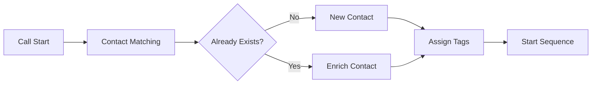

# ActiveCampaign Integration with AI Phone Assistants

Revolutionize your marketing automation with intelligent phone assistants. Famulor Automation seamlessly connects your calls with ActiveCampaign to automate lead nurturing, personalized email sequences, and data-driven customer journeys.

<Note>
**Marketing Revolution**: The ActiveCampaign integration lets you launch a personalized marketing journey from every call.
</Note>

## Why ActiveCampaign + AI Phone Assistant?

### 🎯 Hyper-Personalized Automation
Leverage call insights for ultra-personalized email campaigns and marketing workflows.

### 📈 360° Customer View
Combine phone interactions with email behavior for a complete customer picture.

### ⚡ Real-Time Segmentation
Automatic audience segmentation based on conversation content and customer behavior.

### 🔄 Intelligent Lead Scoring
Advanced lead scoring by combining call data and digital behavior.

## Key Features of the Integration

### 1. Automatic Contact Creation & Enrichment

**Intelligent Data Collection:**

```mermaid
graph LR
    A[Call Start] --> B[Contact Matching]
    B --> C{Already Exists?}
    C -->|No| D[New Contact]
    C -->|Yes| E[Enrich Contact]
    D --> F[Assign Tags]
    E --> F
    F --> G[Start Sequence]
```

**Automatically Captured Data:**
- ✅ **Basic Data**: Name, phone, email, company
- ✅ **Behavioral Data**: Interest level, pain points, budget
- ✅ **Conversation Intelligence**: Sentiment, purchase readiness
- ✅ **Custom Fields**: Industry, company size, role
- ✅ **Lead Source**: Call context and origin
- ✅ **Engagement Score**: Call duration and quality

### 2. Intelligent Tag Automation

**Automatic Tagging Based on Conversation Content:**

| Conversation Content            | Automatic Tags            | Triggered Action      |
|-------------------------------|---------------------------|----------------------|
| "Enterprise pricing"           | `Enterprise-Interest`, `Budget-High` | Enterprise Sequence  |
| "Small team, 5 people"         | `SMB`, `Team-Small`       | SMB Nurturing        |
| "Time pressure, next week"     | `Urgent`, `Hot-Lead`      | Sales Alert + Fast-Track |
| "Comparing providers"          | `Evaluation-Phase`, `Competitive` | Comparison Guide Series |
| "Budget is tight"              | `Price-Sensitive`, `Startup` | Value-Focused Content |

### 3. Dynamic Email Sequences

**Personalized Automation Paths:**

#### Post-Call Sequence for Leads:
```
Day 0 (Immediate): Thank you + Call Summary
├─ Personalized content based on interests
├─ Relevant case studies
└─ Next steps from the call

Day 1: In-depth Information
├─ Product details for mentioned features
├─ ROI calculator prefilled with call data
└─ Industry-specific insights

Day 3: Social Proof
├─ Testimonials from similar companies
├─ Industry success stories
└─ Video case studies

Day 7: Soft Close
├─ Demo invitation
├─ Personal consultation appointment
└─ Limited-time offer (if qualified)
```

#### Nurturing for Cooler Leads:
```
Weekly educational series:
🎓 Week 1: Industry best practices
📊 Week 2: Trends & benchmarks  
🛠️ Week 3: Tools & templates
📈 Week 4: Success metrics
🔄 Loop with fresh content
```

### 4. Advanced Lead Scoring

**Multi-Channel Scoring System:**

```
ActiveCampaign Lead Score = Base Score + Call Score + Behavior Score

Call Score Components:
• Call duration (>10 min: +15 points)
• Interest level (High: +25 points)
• Budget mentioned (+20 points)
• Urgent timeline (+30 points)
• Decision maker (+25 points)

Behavior Score Components:
• Email open rate (+1-10 points)
• Link clicks (+5-15 points)
• Website time spent (+1-20 points)
• Content downloads (+10-30 points)
```

**Automatic Score Actions:**
- **90+**: Immediate sales call + hot lead alert
- **70-89**: Demo invitation + priority handling  
- **50-69**: Intensified nurturing + re-targeting
- **30-49**: Standard nurturing + quarterly check-in
- **&lt;30**: Long-term nurturing + industry content

## Advanced Marketing Automation

### 1. Behavioral Trigger Integration

**Cross-Channel Automation:**

```mermaid
graph TD
    A[Call: "Interest in Feature X"] --> B[Tag: Feature-X-Interest]
    B --> C[Email: Feature X Deep Dive]
    C --> D{Email opened?}
    D -->|Yes| E[Website tracking activated]
    D -->|No| F[Re-engagement sequence]
    E --> G{Feature page visited?}
    G -->|Yes| H[Send demo invitation]
    G -->|No| I[Educational content]
```

### 2. Dynamic Content Personalization

**Call Data for Email Personalization:**
```
Email template with call variables:

Hello {{contact.first_name}},

Thank you for our {{call.duration}}-minute conversation today about 
{{call.main_topic}}.

As discussed, {{call.pain_point}} is an important challenge 
for {{contact.company}}. Based on your team size of {{contact.team_size}}, 
I have prepared {{relevant_case_study}} for you.

{{#if call.budget_mentioned}}
With your budget of {{call.budget_range}}, we can definitely create a 
solution fitting for {{call.timeline}}.
{{/if}}

Best regards,
{{user.signature}}
```

### 3. Win-Back & Re-Engagement

**Intelligent Reactivation:**

| Inactivity Period          | Call Trigger       | ActiveCampaign Reaction        |
|---------------------------|--------------------|-------------------------------|
| 30 days no email opens    | Check-in call      | Preference update survey       |
| 60 days no website visits | Value call        | "We miss you" series          |
| 90 days no interaction    | Personal call     | Win-back campaign              |
| 180 days completely inactive | Last attempt call | Opt-out or requalification     |

## Use Cases: ActiveCampaign Voice Automation

### Use Case 1: SaaS Company Lead Qualification

**Scenario:** Software firm with multiple target groups

**Voice-to-Marketing Automation:**
```
Inbound call from startup:
├─ Tag "Startup" added
├─ Lead score: 45 (SMB segment)
├─ Sequence: "Startup Success Stories"
├─ Content: Growth hacking, bootstrapping
└─ CTA: Free tools & templates

Enterprise call:
├─ Tag "Enterprise" added  
├─ Lead score: 85 (Enterprise segment)
├─ Sequence: "Enterprise Evaluation Kit"
├─ Content: Security, compliance, integration
└─ CTA: Executive demo + ROI assessment
```

### Use Case 2: E-Commerce Consultancy

**Scenario:** Marketing agency segmenting by shop size

**Automatic Segmentation:**
```
Call qualifier: "Our shop does 50k/month"
ActiveCampaign response:
✅ Segment: "Mid-Market E-Commerce"
✅ Lead score: +35 (revenue indicator)
✅ Automation: "E-Commerce Growth 50k+"
✅ Content: Scale-up strategies, advanced tactics
✅ Custom fields: Monthly_Revenue = 50000
✅ Next action: Growth audit offer
```

### Use Case 3: B2B Services Complex Sales Cycle

**Scenario:** Consulting firm with long sales cycles

**Multi-Touch Automation:**
```
Initial contact via phone:
├─ Qualification call → ActiveCampaign lead
├─ 6-month nurturing series starts
├─ Quarterly check-in calls planned
├─ Industry newsletter subscription
└─ Event invitations for segment

Touchpoint tracking:
📞 Call 1: Problem exploration (Lead score: 45)
📧 Email series: Industry insights (Open rate: 65%)
📞 Call 2: Solution fit (Lead score: 70)
📅 Event: Workshop attendance (Lead score: 85)
📞 Call 3: Proposal phase (Lead score: 95)
💰 Conversion: Project start
```

## Setup Guide: ActiveCampaign Integration

### Step 1: Establish API Connection
```
1. ActiveCampaign → Settings → Developer
2. Generate and copy API key
3. Famulor → Integrations → ActiveCampaign
4. Paste API key and test connection

Check permissions:
✅ Contacts: Read/Write
✅ Tags: Read/Write
✅ Custom Fields: Read/Write
✅ Automations: Trigger access
✅ Lists: Read/Write
```

### Step 2: Configure Field Mapping
```
Standard mappings:
📞 Phone number → Phone field
👤 Name → First name / Last name
🏢 Company → Organization
💬 Call notes → Custom field "Call_Notes"
⭐ Lead score → Custom field "Call_Score"
📅 Call date → Custom field "Last_Call_Date"

Custom mappings for your needs:
🎯 Interest → Custom field "Primary_Interest"
💰 Budget → Custom field "Budget_Range"
⏰ Timeline → Custom field "Decision_Timeline"
👥 Team size → Custom field "Team_Size"
```

### Step 3: Set Up Automation Triggers
```
Call-based triggers:
🔄 "Contact Created from Call" → Welcome series
🎯 "High Interest Call" → Sales alert + demo invitation
💰 "Budget Qualified" → Enterprise track
⚠️ "Objection Raised" → Objection handling series
📞 "Follow-up Requested" → Scheduler link + reminder
```

### Step 4: Segmentation & Tagging Rules
```
Automatic tags based on:
📊 Company size: SMB, Mid-Market, Enterprise
🏭 Industry: Technology, Healthcare, Finance, etc.
🎯 Use case: Marketing, Sales, Support, HR
📈 Funnel stage: Awareness, Consideration, Decision
💡 Interest level: Cold, Warm, Hot, On-Fire
```

## Advanced Features & Best Practices

### 1. Conditional Logic for Automations

**Smart Automation Paths:**
```
IF Contact.Call_Score > 80 AND Contact.Company_Size = "Enterprise"
THEN 
    → Add to "Enterprise Hot Leads"
    → Send to sales within 1 hour
    → Start "Enterprise Evaluation" sequence
    → Assign to senior account executive

ELSE IF Contact.Call_Score > 60 AND Contact.Budget_Mentioned = TRUE
THEN
    → Add to "Qualified Prospects"
    → Schedule demo within 48 hours
    → Start "Product Demo Prep" sequence
    → Assign to inside sales rep

ELSE
    → Add to "Nurturing Pipeline"
    → Start "Educational" sequence
    → Schedule monthly check-in
    → Assign to marketing qualified lead pool
```

### 2. A/B Testing for Call-Response Sequences

**Optimizing the Post-Call Experience:**
```
Test variants for follow-up:
Variant A: Immediate thank-you + resources
Variant B: 2-hour delay + personalized video message
Variant C: Next-day + handwritten email

Metrics:
• Open rate
• Click rate  
• Reply rate
• Demo bookings
• Conversion to customer
```

### 3. Progressive Profiling

**Stepwise Data Collection:**
```
Call 1: Basic info (name, company, interest)
Call 2: Details (team size, budget range, timeline)  
Call 3: Technical requirements (integration, features)
Call 4: Decision process (stakeholders, evaluation criteria)

Each call enriches ActiveCampaign profile further
→ Better segmentation
→ More precise personalization
→ Higher conversion rates
```

## ROI & Performance Tracking

### Key Performance Indicators:

| Metric             | Without Integration | With AC+Voice | Improvement |
|--------------------|---------------------|--------------|-------------|
| **Lead Conversion** | 12%                 | 28%          | +133%       |
| **Email Open Rate** | 22%                 | 45%          | +105%       |
| **Demo Bookings**   | 8%                  | 34%          | +325%       |
| **Sales Cycle Time**| 60 days             | 35 days      | -42%        |
| **Customer LTV**    | €5,200              | €8,900       | +71%        |

### ROI Calculation:
```
Monthly calls: 500
Conversion uplift: +16% (from 12% to 28%)
Additional conversions: 80
Average deal value: €3,500
Additional revenue: €280,000/month

Integration cost: €2,000/month
ROI: 14,000% (or 140:1)
Break-even: Day 3
```

## Troubleshooting & Support

### Common Challenges:

**Issue**: Tags not assigned automatically  
**Solution**: Check keyword detection settings in Famulor

**Issue**: Duplicate contacts created  
**Solution**: Use unique identifiers (phone/email) as dedupe fields

**Issue**: Automations not triggering  
**Solution**: Verify ActiveCampaign permissions and webhook status

### Support Options:
- 📚 **Integration Guide**: Detailed setup documentation
- 🎥 **Video Tutorials**: ActiveCampaign best practices
- 💬 **Live Chat**: Technical support
- 📞 **Onboarding Call**: Personalized setup assistance

---

**Ready for smart marketing automation?**

<CardGroup cols={2}>
  <Card title="Activate Integration" icon="rocket" href="https://app.famulor.de/integrations/activecampaign">
    Connect ActiveCampaign now
  </Card>
  <Card title="Request Demo" icon="calendar" href="https://cal.com/bek-group/demotermine">
    Live demo of marketing automation
  </Card>
  <Card title="Best Practice Guide" icon="lightbulb" href="/en/automation-platform/integrations/einzelintegrations/activecampaign/best-practices">
    Optimize your use of ActiveCampaign + Voice
  </Card>
  <Card title="API Documentation" icon="code" href="/en/automation-platform/integrations/einzelintegrations/activecampaign">
    Technical details and advanced features
  </Card>
</CardGroup>
