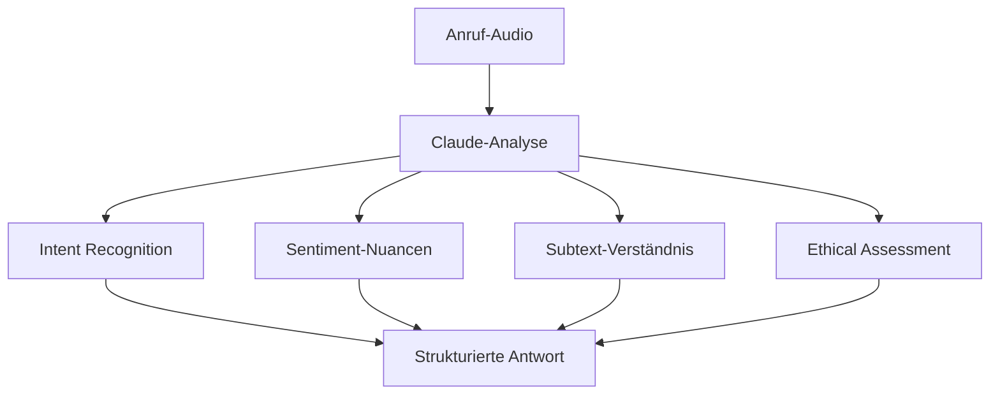

# Anthropic Claude Integration für KI-Telefonassistenten

Revolutionieren Sie Ihre Telefonassistenten mit Anthropic Claudes überlegener Reasoning-Kraft. Nutzen Sie Constitutional AI für ethischere, durchdachtere und präzisere Kundengespräche mit branchenführender Sicherheit.

<Note>
**Next-Gen AI**: Claude bietet überlegene Reasoning-Fähigkeiten und Constitutional AI für ethischere, sicherere KI-Interaktionen.
</Note>

## Warum Claude + KI-Telefonassistent?

### 🧠 Überlegene Reasoning-Fähigkeiten
Claude versteht komplexe Zusammenhänge und kann nuancierte, durchdachte Antworten in anspruchsvollen Gesprächen geben.

### 🛡️ Constitutional AI für Sicherheit
Eingebaute Sicherheitsmechanismen sorgen für ethische, sichere und vertrauenswürdige KI-Interaktionen.

### 📚 Erweiterte Kontextverarbeitung
Verarbeitung von bis zu 200.000 Token ermöglicht vollständige Kundenhistorien und komplexe Dokumentenanalyse.

### 🎯 Präzise Informationsextraktion
Claudes Fähigkeit zur genauen Informationsextraktion und -strukturierung optimiert Post-Call-Workflows.

## Claudes Kernstärken für Telefonie

### 1. Advanced Conversation Intelligence

**Mehrschichtige Gesprächsanalyse:**


**Claudes Analyse-Dimensionen:**
- ✅ **Explicit Intent**: Direkt geäußerte Wünsche und Bedürfnisse
- ✅ **Implicit Intent**: Zwischen den Zeilen liegende Anliegen
- ✅ **Emotional Subtext**: Unausgesprochene Frustration, Begeisterung, Skepsis
- ✅ **Logical Reasoning**: Schlussfolgernde Argumentationsketten
- ✅ **Ethical Considerations**: Potentielle ethische Konflikte
- ✅ **Context Integration**: Vollständige Situationseinschätzung

### 2. Constitutional AI für Business-Gespräche

**Ethische KI-Interaktionen:**

| Gesprächssituation | Claude's Constitutional Response | Business-Vorteil |
|-------------------|----------------------------------|------------------|
| 🔒 **Datenschutz-Bedenken** | Proaktive Datenschutz-Aufklärung | Vertrauen aufbauen |
| ⚖️ **Rechtliche Grauzonen** | Vorsichtige, konforme Antworten | Haftungsminimierung |
| 💰 **Überteuerte Angebote** | Transparente Preis-Kommunikation | Langfristige Kundenbindung |
| 🤝 **Interessenskonflikte** | Ehrliche Problem-Kommunikation | Ethische Glaubwürdigkeit |
| 🚫 **Unmögliche Versprechen** | Realistische Erwartungs-Setzung | Kunde-Zufriedenheit |

### 3. Complex Multi-Turn Reasoning

**Erweiterte Gesprächslogik:**

#### Beispiel: B2B-Software-Beratung
```
Kunde: "Wir haben 500 Mitarbeiter, aber nur 200 brauchen Lizenzen. 
Allerdings wächst unser Team schnell und wir planen eine Akquisition."

Claude's Reasoning-Chain:
1. Aktuelle Anforderung: 200 Lizenzen
2. Wachstumsfaktor: "schnell wachsend" → Skalierungsplanung nötig
3. Akquisition geplant → Zusätzliche User wahrscheinlich
4. Kostenoptimierung vs. Zukunftssicherheit abwägen
5. Empfehlung: Flexible Lizenzstruktur vorschlagen

Antwort:
"Verstehe. Für Ihre aktuellen 200 Nutzer können wir mit einem 
skalierbaren Plan starten. Da Sie eine Akquisition planen, 
empfehle ich unsere Enterprise-Flex-Lizenz, die monatliche 
Anpassungen ohne Setup-Gebühren ermöglicht..."
```

### 4. Nuanced Objection Handling

**Intelligente Einwandbehandlung:**

| Klassischer Einwand | Standard-KI-Response | Claude's Nuanced Response |
|-------------------|---------------------|---------------------------|
| "Zu teuer" | Preis-Rechtfertigung | Verstehen der Budgetsituation + Value-Mapping |
| "Brauchen wir nicht" | Feature-Auflistung | Exploration der aktuellen Lösung + Gap-Analysis |
| "Haben schon Anbieter" | Konkurrenz-Kritik | Respektvolle Differenzierung + Ergänzungsoptionen |
| "Keine Zeit" | Terminvorschlag | Verständnis für Prioritäten + Minimal-Engagement |

## Praxis-Anwendungen: Claude-Enhanced Calls

### Use Case 1: Legal & Compliance Consulting

**Szenario:** Rechtsberatung mit komplexen Sachverhalten

**Claude's Advanced Reasoning:**
```
Client: "Wir haben einen Compliance-Fall. DSGVO-Verstoß möglich, 
aber Situation ist unklar. Mitarbeiter hat persönliche Daten 
per WhatsApp geteilt, aber war es geschäftlich oder privat?"

Claude's Multi-Layer-Analysis:
🔍 Faktenlage:
• DSGVO-relevante Daten identifiziert
• Übertragungskanal (WhatsApp) bewertet
• Geschäftlicher vs. privater Kontext analysiert

⚖️ Rechtliche Einschätzung:
• Potentielle Verstoß-Kategorien
• Meldepflicht-Relevanz
• Schadensminimierungs-Optionen

🛡️ Compliance-Strategie:
• Sofortmaßnahmen-Empfehlung
• Dokumentations-Anforderungen
• Präventions-Maßnahmen

Antwort: Strukturierte, vorsichtige aber hilfreiche Guidance
```

### Use Case 2: Financial Advisory with Complex Portfolios

**Szenario:** Vermögensberatung mit Multi-Asset-Portfolios

**Claude's Analytical Depth:**
```
Anruf: "Ich habe €2M verteilt auf Aktien, Immobilien und Crypto. 
Inflation steigt, Rezession möglich. Was empfehlen Sie?"

Claude's Financial Reasoning:
📊 Portfolio-Analyse:
• Asset-Allocation-Bewertung
• Inflation-Hedging-Eigenschaften
• Rezessions-Resistenz-Assessment

🔮 Scenario-Modeling:
• Inflation-Szenario: Real-Asset-Vorteile
• Rezessions-Szenario: Liquiditäts-Bedarf
• Stagflations-Risiko: Diversifikations-Gaps

💡 Personalisierte Strategie:
• Risk-Tolerance-Integration
• Liquidity-Requirements-Assessment
• Tax-Efficiency-Considerations

Antwort: Nuancierte, mehrschichtige Empfehlung mit Risiko-Aufklärung
```

### Use Case 3: Technical Support Level 3

**Szenario:** Komplexe Software-Architektur-Beratung

**Claude's Technical Excellence:**
```
Call: "Unsere Microservices-Architektur hat Latenz-Probleme. 
Database-Sharding funktioniert, aber Service-Mesh ist langsam. 
API-Gateway zeigt 99th-Percentile von 2.5s."

Claude's Technical Deep-Dive:
🔧 Problem-Decomposition:
• Service-Mesh-Overhead identifiziert
• Database-Performance isoliert
• API-Gateway-Bottleneck analysiert

🏗️ Architecture-Assessment:
• Inter-Service-Communication-Patterns
• Load-Balancing-Strategien
• Caching-Layer-Opportunities

⚡ Optimization-Strategy:
• Prioritäre Performance-Wins
• Architecture-Evolution-Pfad
• Monitoring-Enhancement

Antwort: Technisch präzise, umsetzbare Optimierungs-Roadmap
```

## Claudes Spezialisierte Business-Features

### 1. Ethical Decision-Making Framework

**Constitutional AI in Business-Kontexten:**

```
Ethische Entscheidungsmatrix für jeden Anruf:

1. Stakeholder-Impact-Assessment:
   • Kunde-Interesse vs. Unternehmens-Interesse
   • Kurz- vs. Langfrist-Auswirkungen
   • Gesellschaftliche Implikationen

2. Transparenz-Evaluation:
   • Information-Vollständigkeit
   • Potentielle Interessenskonflikte
   • Hidden-Costs oder -Risiken

3. Fairness-Check:
   • Gleichbehandlung verschiedener Kunden
   • Angemessene Preis-Leistung
   • Zugänglichkeit von Services

4. Harm-Prevention:
   • Potentielle negative Konsequenzen
   • Risiko-Mitigation-Strategien
   • Schutz vulnerabler Kunden
```

### 2. Advanced Context Integration

**200k Token Context für komplette Customer-Journey:**

```
Claude's Kontext-Verarbeitung:

Historische Daten (50k Token):
├─ Alle vorherigen Anrufe (Transkriptionen)
├─ E-Mail-Kommunikation-Historie
├─ Support-Ticket-Verläufe
├─ Purchase-History und Returns
└─ Interaction-Sentiment-Trends

Aktuelle Session (20k Token):
├─ Real-time Anruf-Transkription
├─ Emotion-Detection-Stream
├─ Intent-Recognition-Updates
└─ Context-Switch-Detection

Business-Context (30k Token):
├─ Company-Profile und Industry-Insights
├─ Competitive-Landscape
├─ Product-Knowledge-Base
├─ Pricing und Promotion-Informationen
└─ Policy und Compliance-Guidelines

Daraus resultiert: Vollständig kontextualisierte Antworten
```

### 3. Sophisticated Language Understanding

**Mehrsprachige Nuancen-Erkennung:**

| Sprach-Nuance | Claude's Verständnis | Business-Application |
|---------------|---------------------|---------------------|
| 🇩🇪 Deutsche Höflichkeitsformen | "Sie" vs "Du" Angemessenheit | Kunden-Respekt und Professionalität |
| 🇬🇧 Britische Understatements | "Quite good" = Sehr zufrieden | Echte Satisfaction-Level erkennen |
| 🇺🇸 Amerikanische Direktheit | "Let's cut to the chase" | Effizienz-Präferenz erkennen |
| 🇫🇷 Französische Formalität | Kulturelle Kommunikations-Erwartungen | Angemessene Ansprache wählen |

## Setup-Guide: Claude-Integration

### Schritt 1: Anthropic-API-Zugang
```
1. Anthropic Console → API-Keys
2. Neue API-Key für Famulor generieren
3. Rate-Limits für Produktions-Use konfigurieren

Claude-Modell-Auswahl:
🧠 Claude-3-Opus: Maximum Intelligence (Complex B2B)
⚡ Claude-3-Sonnet: Optimal Balance (Standard Business)
💨 Claude-3-Haiku: Fast Response (High-Volume Support)
```

### Schritt 2: Constitutional AI Configuration
```
Ethical Guidelines für Ihr Business:
✅ Industry-spezifische Compliance-Rules
✅ Company-Values-Integration
✅ Customer-Protection-Standards
✅ Legal-Risk-Mitigation-Protocols

Beispiel Financial Services:
- Keine Anlageberatung ohne Qualifikation
- Transparente Risiko-Kommunikation
- FINRA/MiFID-konforme Sprache
- Schutz vor Misselling
```

### Schritt 3: Context-Window-Optimierung
```
Context-Priorisierung:
🏆 Priorität 1: Aktuelle Anruf-Session
📊 Priorität 2: Recent Customer-Interactions  
📋 Priorität 3: Business-Context & Policies
📚 Priorität 4: Historische Daten
🔍 Priorität 5: Industry-Knowledge

Dynamic-Context-Loading:
• Relevanz-basierte Token-Allocation
• Real-time Context-Compression
• Intelligent Information-Retrieval
```

### Schritt 4: Advanced Reasoning Activation
```
Reasoning-Modi für verschiedene Call-Types:

🧩 Analytical Reasoning:
• Financial Planning Calls
• Technical Architecture Discussions
• Complex Problem-Solving

🤝 Empathetic Reasoning:
• Customer Complaint Handling
• Emotional Support Situations
• Relationship-Building

⚖️ Ethical Reasoning:
• Legal Compliance Questions
• Whistleblowing Situations
• Conflict-of-Interest Cases

🎯 Strategic Reasoning:
• Business Development Calls
• Partnership Negotiations
• Long-term Planning
```

## ROI & Performance Metrics

### Advanced KPIs für Claude-Integration:

| Metrik | Standard-KI | Claude-Enhanced | Verbesserung |
|--------|-------------|-----------------|--------------|
| **Complex-Query-Resolution** | 67% | 94% | +40% |
| **Ethical-Compliance-Score** | 78% | 97% | +24% |
| **Customer-Trust-Rating** | 7.8/10 | 9.4/10 | +21% |
| **Multi-Turn-Conversation-Success** | 43% | 81% | +88% |
| **Legal-Risk-Incidents** | 12/Monat | 2/Monat | -83% |

### Qualitative Verbesserungen:
```
Customer-Feedback-Themes:

Vor Claude:
❌ "KI wirkte roboterhaft"
❌ "Verstand meinen Fall nicht ganz"
❌ "Musste mich mehrfach wiederholen"

Mit Claude:
✅ "Fühlte sich wie menschlicher Experte an"
✅ "Verstand komplexe Situation sofort"
✅ "Durchdachte, nuancierte Antworten"
✅ "Ethisch verantwortungsvolle Beratung"
```

## Best Practices für Claude-Business-Integration

### 1. Constitutional AI Customization
```
Branchen-spezifische Ethics-Templates:

Healthcare:
- Patient-Privacy-First
- Hippocratic-Oath-Principles
- Evidence-based Information-only

Finance:
- Fiduciary-Duty-Awareness
- Risk-Disclosure-Requirements
- Regulatory-Compliance-Priority

Legal:
- Attorney-Client-Privilege-Respect
- Conflict-of-Interest-Detection
- Unauthorized-Practice-Prevention
```

### 2. Advanced Prompt Engineering
```
Claude-optimierte Prompts:

Analytical Tasks:
"Please analyze the following situation step-by-step, 
considering multiple perspectives and potential implications..."

Ethical Dilemmas:
"Before responding, please consider the ethical dimensions 
of this situation and any potential conflicts of interest..."

Complex Reasoning:
"Think through this problem methodically, showing your 
reasoning process and acknowledging any uncertainties..."
```

### 3. Context-Optimization-Strategien
```
Information-Hierarchie:
1. Mission-Critical-Context (Current-Problem)
2. Relationship-Context (Customer-History)
3. Business-Context (Policies, Products)
4. Industry-Context (Best-Practices, Trends)
5. Background-Knowledge (General-Information)

Dynamic-Context-Management:
• Relevance-Scoring für alle Context-Chunks
• Automatic-Pruning von veralteten Informationen
• Intelligent-Summarization für Token-Effizienz
```

---

**Bereit für Next-Generation KI-Telefonie?**

<CardGroup cols={2}>
  <Card title="Claude-Integration aktivieren" icon="brain" href="https://app.famulor.de/integrations/anthropic-claude">
    Anthropic Claude jetzt verbinden
  </Card>
  <Card title="Ethical AI Demo" icon="shield" href="https://cal.com/bek-group/demotermine">
    Constitutional AI in Aktion erleben
  </Card>
  <Card title="Advanced Reasoning Guide" icon="lightbulb" href="/automation-platform/integrations/einzelintegrations/claude/advanced-reasoning">
    Optimale Nutzung von Claudes Reasoning
  </Card>
  <Card title="Constitutional AI Setup" icon="scale" href="/automation-platform/integrations/einzelintegrations/claude/constitutional-ai">
    Ethical Guidelines konfigurieren
  </Card>
</CardGroup>