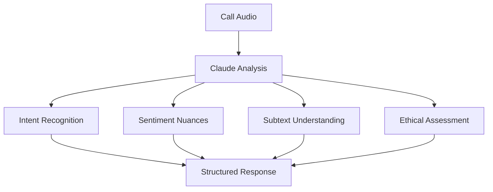

# Anthropic Claude Integration for AI Phone Assistants

Revolutionize your phone assistants with Anthropic Claude’s superior reasoning power. Harness Constitutional AI for more ethical, thoughtful, and accurate customer conversations with industry-leading safety.

<Note>
**Next-Gen AI**: Claude delivers superior reasoning capabilities and Constitutional AI for more ethical, safer AI interactions.
</Note>

## Why Claude + AI Phone Assistant?

### 🧠 Superior Reasoning Capabilities  
Claude understands complex contexts and can provide nuanced, well-considered answers in challenging conversations.

### 🛡️ Constitutional AI for Safety  
Built-in safety mechanisms ensure ethical, secure, and trustworthy AI interactions.

### 📚 Enhanced Context Processing  
Handling up to 200,000 tokens enables complete customer histories and complex document analysis.

### 🎯 Precise Information Extraction  
Claude’s ability for accurate data extraction and structuring optimizes post-call workflows.

## Claude’s Core Strengths for Telephony

### 1. Advanced Conversation Intelligence

**Multi-layered Conversation Analysis:**

```mermaid
graph TD
    A[Call Audio] --> B[Claude Analysis]
    B --> C[Intent Recognition]
    B --> D[Sentiment Nuances]
    B --> E[Subtext Understanding]
    B --> F[Ethical Assessment]
    C --> G[Structured Response]
    D --> G
    E --> G
    F --> G
```

**Claude’s Analysis Dimensions:**
- ✅ **Explicit Intent**: Directly expressed wishes and needs  
- ✅ **Implicit Intent**: Underlying concerns between the lines  
- ✅ **Emotional Subtext**: Unspoken frustration, enthusiasm, skepticism  
- ✅ **Logical Reasoning**: Inferential argument chains  
- ✅ **Ethical Considerations**: Potential ethical conflicts  
- ✅ **Context Integration**: Complete situational assessment  

### 2. Constitutional AI for Business Conversations

**Ethical AI Interactions:**

| Conversation Scenario          | Claude's Constitutional Response       | Business Benefit                |
|-------------------------------|---------------------------------------|--------------------------------|
| 🔒 **Data Privacy Concerns**     | Proactive privacy disclosure           | Build trust                    |
| ⚖️ **Legal Gray Areas**           | Careful, compliant answers              | Minimize liability            |
| 💰 **Overpriced Offers**          | Transparent price communication         | Long-term customer loyalty    |
| 🤝 **Conflicts of Interest**      | Honest problem disclosure               | Ethical credibility           |
| 🚫 **Impossible Promises**        | Realistic expectation setting           | Customer satisfaction         |

### 3. Complex Multi-Turn Reasoning

**Enhanced Conversation Logic:**

#### Example: B2B Software Consulting
```
Client: "We have 500 employees, but only 200 need licenses.
However, our team is growing quickly and we’re planning an acquisition."

Claude's Reasoning Chain:
1. Current requirement: 200 licenses
2. Growth factor: "rapidly growing" → scaling plan needed
3. Acquisition planned → additional users likely
4. Balance cost optimization vs. future-proofing
5. Recommendation: suggest flexible license structure

Response:
"I understand. For your current 200 users we can start with a
scalable plan. Since you’re planning an acquisition,
I recommend our Enterprise-Flex license, which allows monthly
adjustments without setup fees..."
```

### 4. Nuanced Objection Handling

**Intelligent Objection Management:**

| Typical Objection          | Standard AI Response    | Claude's Nuanced Response                        |
|---------------------------|------------------------|------------------------------------------------|
| "Too expensive"            | Price justification    | Understand budget situation + value mapping    |
| "We don’t need it"         | Feature listing        | Explore current solutions + gap analysis       |
| "We already have providers"| Critique competitors   | Respectful differentiation + complementary options |
| "No time"                  | Propose appointment    | Recognize priorities + minimal engagement      |

## Practical Applications: Claude-Enhanced Calls

### Use Case 1: Legal & Compliance Consulting

**Scenario:** Legal advice with complex cases

**Claude’s Advanced Reasoning:**
```
Client: "We have a compliance issue. Possible GDPR violation,
but the situation is unclear. An employee shared personal data
via WhatsApp, but was it personal or business use?"

Claude's Multi-Layer Analysis:
🔍 Facts:
• Identified GDPR-relevant data
• Evaluated transmission channel (WhatsApp)
• Analyzed business vs. private context

⚖️ Legal Assessment:
• Potential violation categories
• Reporting obligations relevance
• Damage mitigation options

🛡️ Compliance Strategy:
• Immediate action recommendations
• Documentation requirements
• Preventive measures

Response: Structured, cautious but helpful guidance
```

### Use Case 2: Financial Advisory with Complex Portfolios

**Scenario:** Wealth management with multi-asset portfolios

**Claude’s Analytical Depth:**
```
Call: "I have €2M split across stocks, real estate, and crypto.
Inflation is rising, recession possible. What do you recommend?"

Claude's Financial Reasoning:
📊 Portfolio Analysis:
• Asset allocation review
• Inflation hedging characteristics
• Recession resilience assessment

🔮 Scenario Modeling:
• Inflation scenario: advantages of real assets
• Recession scenario: liquidity needs
• Stagflation risk: diversification gaps

💡 Personalized Strategy:
• Risk tolerance integration
• Liquidity requirements assessment
• Tax efficiency considerations

Response: Nuanced, multi-layered recommendation with risk clarification
```

### Use Case 3: Technical Support Level 3

**Scenario:** Complex software architecture consultation

**Claude’s Technical Excellence:**
```
Call: "Our microservices architecture has latency issues.
Database sharding works, but the service mesh is slow.
API gateway shows 99th percentile of 2.5s."

Claude's Technical Deep Dive:
🔧 Problem Decomposition:
• Identified service mesh overhead
• Isolated database performance
• Analyzed API gateway bottleneck

🏗️ Architecture Assessment:
• Inter-service communication patterns
• Load balancing strategies
• Caching layer opportunities

⚡ Optimization Strategy:
• Priority performance wins
• Architecture evolution path
• Monitoring enhancements

Response: Technically precise, actionable optimization roadmap
```

## Claude’s Specialized Business Features

### 1. Ethical Decision-Making Framework

**Constitutional AI in Business Contexts:**

```
Ethical decision matrix for each call:

1. Stakeholder Impact Assessment:
   • Customer interest vs. company interest
   • Short-term vs. long-term effects
   • Societal implications

2. Transparency Evaluation:
   • Information completeness
   • Potential conflicts of interest
   • Hidden costs or risks

3. Fairness Check:
   • Equal treatment of different customers
   • Appropriate price-performance ratio
   • Accessibility of services

4. Harm Prevention:
   • Potential negative consequences
   • Risk mitigation strategies
   • Protection of vulnerable customers
```

### 2. Advanced Context Integration

**200k Token Context for Complete Customer Journey:**

```
Claude’s Context Processing:

Historical Data (50k tokens):
├─ All previous calls (transcripts)
├─ Email communication history
├─ Support ticket threads
├─ Purchase history and returns
└─ Interaction sentiment trends

Current Session (20k tokens):
├─ Real-time call transcription
├─ Emotion detection stream
├─ Intent recognition updates
└─ Context switch detection

Business Context (30k tokens):
├─ Company profile and industry insights
├─ Competitive landscape
├─ Product knowledge base
├─ Pricing and promotion information
└─ Policy and compliance guidelines

Result: Fully contextualized responses
```

### 3. Sophisticated Language Understanding

**Multilingual Nuance Recognition:**

| Language Nuance                | Claude’s Understanding              | Business Application                 |
|-------------------------------|-----------------------------------|------------------------------------|
| 🇩🇪 German formalities          | Appropriate use of "Sie" vs "Du"  | Customer respect and professionalism |
| 🇬🇧 British understatement      | "Quite good" = Very satisfied     | Detect genuine satisfaction level  |
| 🇺🇸 American directness         | "Let's cut to the chase"          | Recognize preference for efficiency |
| 🇫🇷 French formality            | Cultural communication expectations| Choose appropriate address         |

## Setup Guide: Claude Integration

### Step 1: Anthropic API Access  
```
1. Anthropic Console → API Keys
2. Generate new API key for Famulor
3. Configure rate limits for production use

Claude Model Selection:
🧠 Claude-3-Opus: Maximum Intelligence (Complex B2B)
⚡ Claude-3-Sonnet: Optimal Balance (Standard Business)
💨 Claude-3-Haiku: Fast Response (High-Volume Support)
```

### Step 2: Constitutional AI Configuration  
```
Ethical Guidelines for Your Business:
✅ Industry-specific compliance rules
✅ Company values integration
✅ Customer protection standards
✅ Legal risk mitigation protocols

Example: Financial Services:
- No investment advice without qualification
- Transparent risk communication
- FINRA/MiFID-compliant language
- Protection against mis-selling
```

### Step 3: Context Window Optimization  
```
Context Prioritization:
🏆 Priority 1: Current call session
📊 Priority 2: Recent customer interactions  
📋 Priority 3: Business context & policies
📚 Priority 4: Historical data
🔍 Priority 5: Industry knowledge

Dynamic Context Loading:
• Relevance-based token allocation
• Real-time context compression
• Intelligent information retrieval
```

### Step 4: Advanced Reasoning Activation  
```
Reasoning Modes for Different Call Types:

🧩 Analytical Reasoning:
• Financial planning calls
• Technical architecture discussions
• Complex problem-solving

🤝 Empathetic Reasoning:
• Customer complaint handling
• Emotional support situations
• Relationship building

⚖️ Ethical Reasoning:
• Legal compliance questions
• Whistleblowing cases
• Conflict of interest situations

🎯 Strategic Reasoning:
• Business development calls
• Partnership negotiations
• Long-term planning
```

## ROI & Performance Metrics

### Advanced KPIs for Claude Integration:

| Metric                          | Standard AI | Claude-Enhanced | Improvement |
|--------------------------------|-------------|-----------------|-------------|
| **Complex Query Resolution**    | 67%         | 94%             | +40%        |
| **Ethical Compliance Score**    | 78%         | 97%             | +24%        |
| **Customer Trust Rating**       | 7.8/10      | 9.4/10          | +21%        |
| **Multi-Turn Conversation Success** | 43%     | 81%             | +88%        |
| **Legal Risk Incidents**        | 12/month    | 2/month         | -83%        |

### Qualitative Improvements:
```
Customer Feedback Themes:

Before Claude:
❌ "The AI felt robotic"
❌ "Didn’t fully understand my case"
❌ "Had to repeat myself multiple times"

With Claude:
✅ "Felt like a human expert"
✅ "Understood complex situation immediately"
✅ "Thoughtful, nuanced answers"
✅ "Ethically responsible advice"
```

## Best Practices for Claude Business Integration

### 1. Constitutional AI Customization  
```
Industry-Specific Ethics Templates:

Healthcare:
- Patient privacy first
- Hippocratic oath principles
- Evidence-based information only

Finance:
- Fiduciary duty awareness
- Risk disclosure requirements
- Regulatory compliance priority

Legal:
- Attorney-client privilege respect
- Conflict of interest detection
- Unauthorized practice prevention
```

### 2. Advanced Prompt Engineering  
```
Claude-Optimized Prompts:

Analytical Tasks:
"Please analyze the following situation step-by-step, 
considering multiple perspectives and potential implications..."

Ethical Dilemmas:
"Before responding, please consider the ethical dimensions 
of this situation and any potential conflicts of interest..."

Complex Reasoning:
"Think through this problem methodically, showing your 
reasoning process and acknowledging any uncertainties..."
```

### 3. Context Optimization Strategies  
```
Information Hierarchy:
1. Mission-critical context (current problem)
2. Relationship context (customer history)
3. Business context (policies, products)
4. Industry context (best practices, trends)
5. Background knowledge (general information)

Dynamic Context Management:
• Relevance scoring for all context chunks
• Automatic pruning of outdated information
• Intelligent summarization for token efficiency
```

---

**Ready for next-generation AI telephony?**

<CardGroup cols={2}>
  <Card title="Enable Claude Integration" icon="brain" href="https://app.famulor.de/integrations/anthropic-claude">
    Connect Anthropic Claude now
  </Card>
  <Card title="Ethical AI Demo" icon="shield" href="https://cal.com/bek-group/demotermine">
    Experience Constitutional AI in action
  </Card>
  <Card title="Advanced Reasoning Guide" icon="lightbulb" href="/en/automation-platform/integrations/einzelintegrations/claude/advanced-reasoning">
    Make the most of Claude’s reasoning
  </Card>
  <Card title="Constitutional AI Setup" icon="scale-balanced" href="/en/automation-platform/integrations/einzelintegrations/claude/constitutional-ai">
    Configure ethical guidelines
  </Card>
</CardGroup>

<Tip>
Related pages: [Introduction](/en/automation-platform/introduction) and [Building Flows](/en/automation-platform/building-flows), and [Debugging Runs](/en/automation-platform/debugging-runs).
</Tip>
