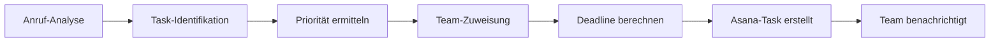
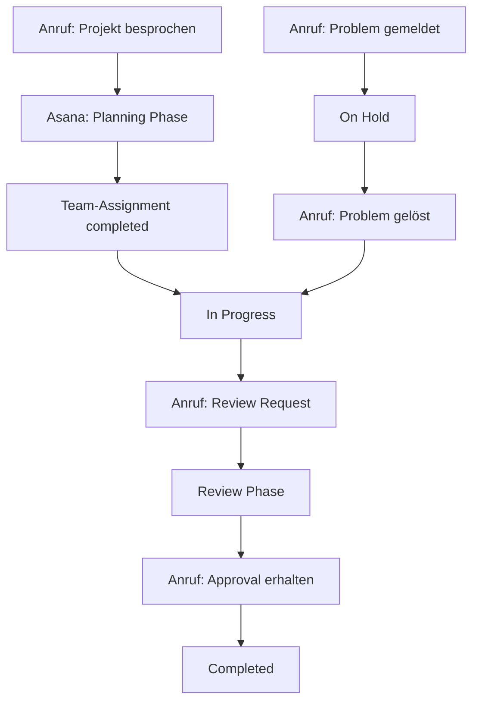

# Asana Integration mit KI-Telefonassistenten

Transformieren Sie Ihr Projektmanagement mit intelligenten Telefonassistenten. Famulor Automation verbindet Ihre Anrufe nahtlos mit Asana für automatische Task-Erstellung, Projekt-Updates und effiziente Team-Koordination.

<Note>
**Produktivitäts-Boost**: Mit Asana-Integration werden aus Anrufen automatisch strukturierte Aufgaben mit Prioritäten, Zuweisungen und Deadlines.
</Note>

## Warum Asana + KI-Telefonassistent?

### 📋 Automatische Task-Generierung
Jeder Anruf wird automatisch in strukturierte Asana-Tasks mit korrekten Zuweisungen und Prioritäten umgewandelt.

### ⚡ Echtzeit-Projektupdates
Ihre Asana-Projekte werden während des Gesprächs aktualisiert - alle Teammitglieder sehen Änderungen sofort.

### 🎯 Intelligente Priorisierung
KI analysiert Gespräche und setzt automatisch angemessene Prioritäten und Deadlines für neue Aufgaben.

### 🔄 Workflow-Automatisierung
Triggern Sie komplexe Asana-Workflows basierend auf Anrufinhalten und aktivieren Sie Team-Benachrichtigungen.

## Hauptfunktionen der Integration

### 1. Intelligente Task-Erstellung aus Gesprächen

**Automatische Task-Generierung:**


**Automatisch erkannte Task-Elemente:**
- ✅ **Task-Titel**: Aus Gesprächskontext extrahiert
- ✅ **Beschreibung**: Vollständige Anruf-Notizen
- ✅ **Priorität**: Basierend auf Urgency-Indikatoren
- ✅ **Zuständigkeit**: Team-Mitglied-Zuweisung
- ✅ **Deadline**: Termine aus Gespräch oder Standard-SLA
- ✅ **Tags**: Automatische Kategorisierung
- ✅ **Projekt**: Intelligente Projekt-Zuordnung

### 2. Projekt-Status-Management

**Automatische Projekt-Updates:**

| Anruf-Typ | Asana-Aktion | Automatische Updates |
|-----------|--------------|-------------------|
| 🚀 Projekt-Kickoff | Neues Projekt erstellt | Team-Zuweisung, Meilensteine |
| 📊 Status-Update | Projekt-Fortschritt aktualisiert | Timeline, Completion % |
| ⚠️ Problem-Eskalation | Blocker-Tasks erstellt | High Priority, Manager-Alert |
| ✅ Meilenstein erreicht | Projekt-Phase abgeschlossen | Next Phase aktiviert |
| 🔄 Scope-Änderung | Change-Request-Task | Approval-Workflow |

### 3. Team-Koordination & Kommunikation

**Intelligente Team-Benachrichtigungen:**

#### Sofortige Benachrichtigungen:
```
High-Priority Task aus Anruf:
├─ Asana-Notification an Assignee
├─ Slack/Teams-Message an Team
├─ E-Mail an Projektmanager
└─ Mobile-Push für Urgent-Tasks

Standard-Task:
├─ Asana-Inbox-Notification
├─ Daily-Summary-E-Mail
└─ Weekly-Team-Meeting-Agenda
```

#### Escalation-Management:
```
Blockierte Tasks aus Anruf:
├─ Automatische Manager-Eskalation
├─ Dependency-Chain-Analyse
├─ Alternative-Resource-Vorschläge
└─ Timeline-Impact-Assessment
```

### 4. Client-Project-Management

**Kunden-spezifische Projektabwicklung:**

| Client-Anruf-Szenario | Asana-Workflow | Team-Response |
|-------------------|----------------|---------------|
| 🎯 Neuer Client-Request | Client-Projekt erstellt | Account Manager assigned |
| 📝 Feature-Request | Enhancement-Task | Product-Team benachrichtigt |
| 🐛 Bug-Report | Bug-Fix-Task | Development-Team Alert |
| 📞 Support-Anfrage | Support-Ticket | Support-Team Rotation |
| 💰 Upselling-Chance | Sales-Opportunity | Sales-Team Lead-Zuweisung |

## Praxisbeispiele: Asana Voice Automation

### Beispiel 1: Software-Entwicklung Agentur

**Szenario:** Entwicklungsagentur verwaltet Client-Projekte

**Voice-to-Asana Workflow:**
```
Client-Call: "Bug in der App, Nutzer können sich nicht einloggen"

Automatisch erstellt:
🐛 Task: "Login-Bug: Authentifizierung fehlgeschlagen"
👨‍💻 Assigned: Frontend-Developer (verfügbar)
⚠️ Priorität: High (Service-affecting)
📅 Deadline: Heute 18:00 (SLA: 4h)
📋 Projekt: Client XY - App Development
🏷️ Tags: Bug, Frontend, Authentication, Client-reported
📞 Note: Vollständige Anruf-Transkription
✅ Subtasks: 
  ├─ Problem reproduzieren
  ├─ Root-Cause analysieren  
  ├─ Fix implementieren
  └─ Client informieren
```

### Beispiel 2: Marketing-Agentur Kampagnen-Management

**Szenario:** Marketing-Team koordiniert Kampagnen

**Campaign-Launch Anruf:**
```
Anruf: "Kampagne muss nächste Woche starten, Creative braucht noch 2 Tage"

Asana-Automatisierung:
📊 Projekt: "Campaign Launch - Client ABC"
📅 Timeline: Rückwärts von Launch-Date
🎨 Task 1: "Creative finalisieren" (2 Tage, Designer)
📝 Task 2: "Copy approval" (1 Tag, Copywriter)  
🔧 Task 3: "Tech Setup" (1 Tag, Developer)
📊 Task 4: "Analytics Setup" (Parallel, Analyst)
🚀 Task 5: "Go-Live" (Launch-Day, Account Manager)

Dependencies automatisch gesetzt:
Copy approval → Creative finalisiert
Tech Setup → Copy approval
Go-Live → Tech Setup + Analytics Setup
```

### Beispiel 3: Consultant/Freelancer Projekt-Juggling

**Szenario:** Freiberufler verwaltet multiple Clients

**Multi-Client Task-Management:**
```
Client A Call: "Report bis Freitag fertig"
├─ Projekt: Client A - Q4 Analysis
├─ Task: "Q4 Report erstellen"
├─ Deadline: Freitag 17:00
├─ Zeitschätzung: 8 Stunden
└─ Kalender-Block: Automatisch reserviert

Client B Call: "Dringende Präsentation morgen"
├─ Projekt: Client B - Strategy Workshop
├─ Task: "Präsentation vorbereiten" 
├─ Priorität: URGENT (trumpt andere Tasks)
├─ Deadline: Morgen 09:00
└─ Schedule-Konflikt-Warnung ausgelöst

Asana Resource-Balancing:
⚖️ Automatische Kapazitäts-Prüfung
📊 Workload-Verteilung-Visualisierung
⚠️ Bottleneck-Erkennung
🔄 Task-Rescheduling-Vorschläge
```

## Advanced Project Management Features

### 1. Predictive Project Planning

**KI-gestützte Projekt-Optimierung:**
```
Anruf-Input: "Projekt ähnlich wie Website-Relaunch letztes Jahr"

Asana-Template-Application:
📊 Ähnliche Projekte identifiziert
⏱️ Historische Timeline analysiert
👥 Erfolgreiche Team-Zusammenstellung repliziert
🎯 Meilensteine automatisch gesetzt
📈 Risk-Faktoren aus Vergangenheit berücksichtigt
💰 Budget-Template angewendet
```

### 2. Intelligent Resource Allocation

**Smart Team-Assignment:**

| Anruf-Indikator | Team-Assignment-Logic | Asana-Action |
|-----------------|----------------------|-------------|
| "Technisches Problem" | Skill-Match: Developer | Assign verfügbaren Dev |
| "Design-Feedback" | Creative-Team | Designer + Art Director |
| "Client-Meeting" | Account-Management | Account Manager + PM |
| "Budget-Diskussion" | Finance-Skills | Project Manager + Finance |
| "Deadline-Stress" | Performance-History | Top-Performer assigned |

### 3. Automated Workflow States

**Status-Progression durch Anrufe:**


## Setup-Guide: Asana-Integration

### Schritt 1: Asana-Autorisierung
```
1. Asana-Account → Apps & Integrations
2. "Famulor Automation" autorisieren
3. Workspace-Berechtigung erteilen

Erforderliche Permissions:
✅ Tasks: Create, Read, Update
✅ Projects: Read, Update
✅ Teams: Read
✅ Users: Read
✅ Attachments: Create
✅ Comments: Create
```

### Schritt 2: Projekt-Mapping
```
Asana-Projekte für Voice-Integration:
📞 Inbound-Requests → "Client Support"
🚀 Neue Projekte → "Project Pipeline"  
🐛 Bug-Reports → "Issue Tracking"
💡 Feature-Requests → "Product Backlog"
📊 Internal-Tasks → "Internal Operations"

Template-Projekte:
🏗️ Standard-Projekt-Template
👤 Client-Onboarding-Template
🎯 Campaign-Launch-Template
```

### Schritt 3: Task-Automatisierung
```
Automatische Task-Felder:
📝 Titel: Aus Anruf-Zusammenfassung
📋 Beschreibung: Vollständige Anruf-Notizen
👤 Assignee: Smart-Assignment-Rules
📅 Due Date: SLA-basiert oder Anruf-spezifisch
⭐ Priorität: Urgency-Detection
🏷️ Tags: Content-Analysis-basiert

Custom Fields:
📞 Call-ID: Referenz zum Original-Anruf
⭐ Client-Priority: A/B/C Classification
💰 Revenue-Impact: Low/Medium/High
⏰ Estimated-Hours: ML-basierte Schätzung
```

### Schritt 4: Team-Benachrichtigungen
```
Notification-Rules:
🔥 High-Priority → Sofort-Benachrichtigung
📧 Standard-Task → Daily-Digest
📊 Project-Update → Weekly-Summary
⚠️ Blocker → Immediate-Escalation

Integration-Channels:
📱 Asana Mobile-App
💬 Slack-Integration
📧 E-Mail-Notifications
📅 Kalender-Events für Deadlines
```

## Best Practices für Asana + Voice

### 1. Task-Naming Conventions
```
Voice-friendly Task-Titel:
✅ "Client XY: Website-Bug-Fix" 
✅ "Q4 Report für ABC Corp"
✅ "Meeting-Nachbereitung: Projekt Z"

Vermeiden:
❌ "URGENT!!!" (ohne Kontext)
❌ "Fix this" (zu unspezifisch)  
❌ "Call follow-up" (zu generisch)
```

### 2. Prioritäts-Matrix für Voice-Input
```
Automatic Priority Assignment:

🔥 URGENT (Drop everything):
• "Production down", "Client kann nicht arbeiten"
• "Meeting in 1 Stunde", "Deadline heute"

⚠️ HIGH:
• "End of week deadline", "Important client"
• "Blocking other work", "Manager request"

📊 MEDIUM:
• "Next week", "When possible"
• "Improvement", "Nice to have"

📋 LOW:
• "Sometime", "Future consideration"
• "Documentation", "Internal optimization"
```

### 3. Dependency-Management
```
Automatische Abhängigkeiten aus Anrufen:
"Erst Design, dann Development" 
→ Task-Dependency: Design → Development

"Nach Client-Approval weitermachen"
→ Approval-Gate mit Client-Tag

"Wartet auf externe Lieferung"
→ External-Dependency mit Reminder
```

## Performance & ROI Tracking

### Productivity Metrics:

| KPI | Ohne Voice-Integration | Mit Asana+Voice | Verbesserung |
|-----|----------------------|-----------------|--------------|
| **Task-Creation-Zeit** | 5-10 min | 30 sek | 90% Reduktion |
| **Project-Update-Frequenz** | Weekly | Real-time | Kontinuierlich |
| **Team-Response-Zeit** | 4-8 h | 30 min | 85% schneller |
| **Missing-Deadline-Rate** | 23% | 8% | 65% Verbesserung |
| **Client-Satisfaction** | 7.2/10 | 9.1/10 | +26% |

### ROI-Berechnung:
```
Zeitersparnis pro Task: 7 Minuten
Tasks pro Tag: 25
Tägliche Zeitersparnis: 175 Minuten (2.9h)
Hourly-Rate: €75
Tägliche Kosteneinsparung: €217
Monatliche Einsparung: €4,550

Integration-Kosten: €500/Monat
Netto-ROI: €4,050/Monat (810% ROI)
```

## Erweiterte Features

### 1. Multi-Project-Coordination
```
Cross-Project-Dependencies aus Anrufen:
"Projekt A braucht Ergebnisse von Projekt B"
→ Automatische Cross-Project-Dependency
→ Timeline-Synchronisation
→ Resource-Conflict-Detection
```

### 2. Client-Portal-Integration
```
Client-sichtbare Updates:
✅ Task-Progress-Updates
✅ Milestone-Completion-Notifications  
✅ Timeline-Changes mit Begründung
✅ Deliverable-Ready-Alerts
```

### 3. Predictive Analytics
```
ML-basierte Insights:
📊 Projekt-Completion-Wahrscheinlichkeit
⏰ Realistic-Timeline-Suggestions
👥 Optimal-Team-Composition
💰 Budget-Overrun-Predictions
```

---

**Bereit für intelligentes Projektmanagement?**

<CardGroup cols={2}>
  <Card title="Integration starten" icon="play" href="https://app.famulor.de/integrations/asana">
    Asana jetzt mit KI-Assistenten verbinden
  </Card>
  <Card title="Demo buchen" icon="calendar" href="https://cal.com/bek-group/demotermine">
    Live-Demo der Asana-Integration
  </Card>
  <Card title="Project-Templates" icon="folder" href="/automation-platform/integrations/einzelintegrations/asana/templates">
    Vorgefertigte Asana-Projekt-Vorlagen
  </Card>
  <Card title="Best-Practices-Guide" icon="lightbulb" href="/automation-platform/integrations/einzelintegrations/asana/best-practices">
    Optimale Nutzung von Asana + Voice
  </Card>
</CardGroup>