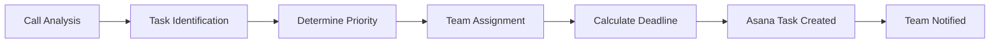
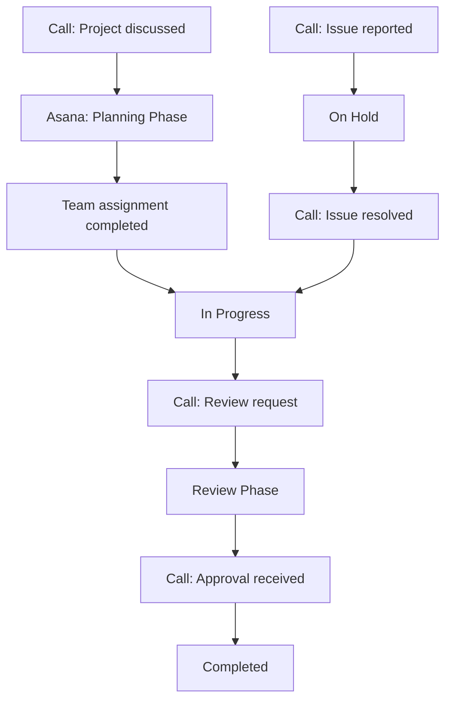

# Asana Integration with AI Phone Assistants

Transform your project management with intelligent phone assistants. Famulor Automation seamlessly links your calls to Asana for automatic task creation, project updates, and efficient team coordination.

<Note>
**Productivity Boost**: With Asana integration, calls are automatically turned into structured tasks with priorities, assignments, and deadlines.
</Note>

## Why Asana + AI Phone Assistant?

### 📋 Automatic Task Generation  
Every call is automatically converted into structured Asana tasks with correct assignments and priorities.

### ⚡ Real-time Project Updates  
Your Asana projects are updated during the conversation—team members see changes instantly.

### 🎯 Intelligent Prioritization  
AI analyzes conversations and automatically sets appropriate priorities and deadlines for new tasks.

### 🔄 Workflow Automation  
Trigger complex Asana workflows based on call content and activate team notifications.

## Key Features of the Integration

### 1. Intelligent Task Creation from Conversations

**Automatic Task Generation:**

```mermaid
graph LR
    A[Call Analysis] --> B[Task Identification]
    B --> C[Determine Priority]
    C --> D[Team Assignment]
    D --> E[Calculate Deadline]
    E --> F[Asana Task Created]
    F --> G[Team Notified]
```

**Automatically Detected Task Elements:**
- ✅ **Task Title**: Extracted from conversation context  
- ✅ **Description**: Full call notes  
- ✅ **Priority**: Based on urgency indicators  
- ✅ **Assignee**: Team member assignment  
- ✅ **Deadline**: Dates from conversation or standard SLA  
- ✅ **Tags**: Automatic categorization  
- ✅ **Project**: Intelligent project assignment  

### 2. Project Status Management

**Automatic Project Updates:**

| Call Type | Asana Action | Automatic Updates |
|-----------|--------------|-------------------|
| 🚀 Project Kickoff | New project created | Team assignment, milestones |
| 📊 Status Update | Project progress updated | Timeline, completion % |
| ⚠️ Problem Escalation | Blocker tasks created | High priority, manager alert |
| ✅ Milestone Reached | Project phase completed | Next phase activated |
| 🔄 Scope Change | Change request task | Approval workflow |

### 3. Team Coordination & Communication

**Intelligent Team Notifications:**

#### Immediate Notifications:
```
High-Priority Task from Call:
├─ Asana notification to assignee
├─ Slack/Teams message to team
├─ Email to project manager
└─ Mobile push for urgent tasks

Standard Task:
├─ Asana inbox notification
├─ Daily summary email
└─ Weekly team meeting agenda
```

#### Escalation Management:
```
Blocked Tasks from Call:
├─ Automatic manager escalation
├─ Dependency chain analysis
├─ Alternative resource suggestions
└─ Timeline impact assessment
```

### 4. Client Project Management

**Client-specific Project Handling:**

| Client Call Scenario | Asana Workflow | Team Response |
|---------------------|----------------|---------------|
| 🎯 New Client Request | Client project created | Account manager assigned |
| 📝 Feature Request | Enhancement task | Product team notified |
| 🐛 Bug Report | Bug fix task | Development team alert |
| 📞 Support Request | Support ticket | Support team rotation |
| 💰 Upselling Opportunity | Sales opportunity | Sales team lead assignment |

## Use Cases: Asana Voice Automation

### Example 1: Software Development Agency

**Scenario:** Development agency managing client projects

**Voice-to-Asana Workflow:**
```
Client Call: "Bug in the app, users can't log in"

Automatically created:
🐛 Task: "Login bug: Authentication failed"
👨‍💻 Assigned: Frontend developer (available)
⚠️ Priority: High (Service-affecting)
📅 Deadline: Today 6PM (SLA: 4h)
📋 Project: Client XY - App Development
🏷️ Tags: Bug, Frontend, Authentication, Client-reported
📞 Note: Full call transcription
✅ Subtasks: 
  ├─ Reproduce issue
  ├─ Analyze root cause  
  ├─ Implement fix
  └─ Inform client
```

### Example 2: Marketing Agency Campaign Management

**Scenario:** Marketing team coordinates campaigns

**Campaign Launch Call:**
```
Call: "Campaign must start next week, creative needs 2 more days"

Asana Automation:
📊 Project: "Campaign Launch – Client ABC"
📅 Timeline: Backwards from launch date
🎨 Task 1: "Finalize creative" (2 days, designer)
📝 Task 2: "Copy approval" (1 day, copywriter)  
🔧 Task 3: "Tech setup" (1 day, developer)
📊 Task 4: "Analytics setup" (parallel, analyst)
🚀 Task 5: "Go-live" (launch day, account manager)

Dependencies automatically set:
Copy approval → Finalize creative  
Tech setup → Copy approval  
Go-live → Tech setup + Analytics setup
```

### Example 3: Consultant/Freelancer Project Juggling

**Scenario:** Freelancer managing multiple clients

**Multi-Client Task Management:**
```
Client A Call: "Report due Friday"
├─ Project: Client A – Q4 Analysis
├─ Task: "Create Q4 report"
├─ Deadline: Friday 5PM
├─ Time estimate: 8 hours
└─ Calendar block: Automatically reserved

Client B Call: "Urgent presentation tomorrow"
├─ Project: Client B – Strategy Workshop
├─ Task: "Prepare presentation"
├─ Priority: URGENT (overrides other tasks)
├─ Deadline: Tomorrow 9AM
└─ Schedule conflict alert triggered

Asana Resource Balancing:
⚖️ Automatic capacity check
📊 Workload distribution visualization
⚠️ Bottleneck detection
🔄 Task rescheduling suggestions
```

## Advanced Project Management Features

### 1. Predictive Project Planning

**AI-powered project optimization:**
```
Call Input: "Project similar to last year's website relaunch"

Asana Template Application:
📊 Similar projects identified
⏱️ Historical timeline analyzed
👥 Successful team composition replicated
🎯 Milestones automatically set
📈 Past risk factors considered
💰 Budget template applied
```

### 2. Intelligent Resource Allocation

**Smart team assignment:**

| Call Indicator | Team Assignment Logic | Asana Action |
|----------------|----------------------|--------------|
| "Technical issue" | Skill match: developer | Assign available dev |
| "Design feedback" | Creative team | Designer + art director |
| "Client meeting" | Account management | Account manager + PM |
| "Budget discussion" | Finance skills | Project manager + finance |
| "Deadline stress" | Performance history | Assign top performer |

### 3. Automated Workflow States

**Status progression driven by calls:**

```mermaid
graph TD
    A[Call: Project discussed] --> B[Asana: Planning Phase]
    B --> C[Team assignment completed] --> D[In Progress]
    D --> E[Call: Review request] --> F[Review Phase]
    F --> G[Call: Approval received] --> H[Completed]
    
    I[Call: Issue reported] --> J[On Hold]
    J --> K[Call: Issue resolved] --> D
```

## Setup Guide: Asana Integration

### Step 1: Authorize Asana
```
1. Asana account → Apps & Integrations
2. Authorize "Famulor Automation"
3. Grant workspace permissions

Required permissions:
✅ Tasks: Create, Read, Update
✅ Projects: Read, Update
✅ Teams: Read
✅ Users: Read
✅ Attachments: Create
✅ Comments: Create
```

### Step 2: Project Mapping
```
Asana projects for voice integration:
📞 Inbound requests → "Client Support"
🚀 New projects → "Project Pipeline"
🐛 Bug reports → "Issue Tracking"
💡 Feature requests → "Product Backlog"
📊 Internal tasks → "Internal Operations"

Template projects:
🏗️ Standard project template
👤 Client onboarding template
🎯 Campaign launch template
```

### Step 3: Task Automation
```
Automatic task fields:
📝 Title: From call summary
📋 Description: Full call notes
👤 Assignee: Smart assignment rules
📅 Due date: SLA-based or call-specific
⭐ Priority: Urgency detection
🏷️ Tags: Content-analysis based

Custom fields:
📞 Call ID: Reference to original call
⭐ Client Priority: A/B/C classification
💰 Revenue Impact: Low/Medium/High
⏰ Estimated Hours: ML-based estimate
```

### Step 4: Team Notifications
```
Notification rules:
🔥 High priority → Immediate notification
📧 Standard task → Daily digest
📊 Project update → Weekly summary
⚠️ Blocker → Immediate escalation

Integration channels:
📱 Asana mobile app
💬 Slack integration
📧 Email notifications
📅 Calendar events for deadlines
```

## Best Practices for Asana + Voice

### 1. Task Naming Conventions
```
Voice-friendly task titles:
✅ "Client XY: Website bug fix"
✅ "Q4 report for ABC Corp"
✅ "Meeting follow-up: Project Z"

Avoid:
❌ "URGENT!!!" (without context)
❌ "Fix this" (too vague)
❌ "Call follow-up" (too generic)
```

### 2. Priority Matrix for Voice Input
```
Automatic priority assignment:

🔥 URGENT (drop everything):
• "Production down", "Client can't work"
• "Meeting in 1 hour", "Deadline today"

⚠️ HIGH:
• "End of week deadline", "Important client"
• "Blocking other work", "Manager request"

📊 MEDIUM:
• "Next week", "When possible"
• "Improvement", "Nice to have"

📋 LOW:
• "Sometime", "Future consideration"
• "Documentation", "Internal optimization"
```

### 3. Dependency Management
```
Automatic dependencies from calls:
"Design first, then development"
→ Task dependency: Design → Development

"Proceed after client approval"
→ Approval gate with client tag

"Waiting on external delivery"
→ External dependency with reminder
```

## Performance & ROI Tracking

### Productivity Metrics:

| KPI | Without Voice Integration | With Asana + Voice | Improvement |
|-----|---------------------------|--------------------|-------------|
| **Task creation time** | 5–10 min | 30 sec | 90% reduction |
| **Project update frequency** | Weekly | Real-time | Continuous |
| **Team response time** | 4–8 h | 30 min | 85% faster |
| **Missed deadline rate** | 23% | 8% | 65% improvement |
| **Client satisfaction** | 7.2 / 10 | 9.1 / 10 | +26% |

### ROI Calculation:
```
Time saved per task: 7 minutes
Tasks per day: 25
Daily time saved: 175 minutes (2.9 h)
Hourly rate: €75
Daily cost savings: €217
Monthly savings: €4,550

Integration cost: €500/month
Net ROI: €4,050/month (810% ROI)
```

## Advanced Features

### 1. Multi-Project Coordination
```
Cross-project dependencies from calls:
"Project A needs results from Project B"
→ Automatic cross-project dependency  
→ Timeline synchronization  
→ Resource conflict detection
```

### 2. Client Portal Integration
```
Client-visible updates:
✅ Task progress updates  
✅ Milestone completion notifications  
✅ Timeline changes with explanations  
✅ Deliverable ready alerts
```

### 3. Predictive Analytics
```
ML-based insights:
📊 Project completion probability  
⏰ Realistic timeline suggestions  
👥 Optimal team composition  
💰 Budget overrun predictions
```

---

**Ready for intelligent project management?**

<CardGroup cols={2}>
  <Card title="Start Integration" icon="play" href="https://app.famulor.de/integrations/asana">
    Connect Asana now with AI assistants
  </Card>
  <Card title="Book a Demo" icon="calendar" href="https://cal.com/bek-group/demotermine">
    Live demo of the Asana integration
  </Card>
  <Card title="Project Templates" icon="folder" href="/automation-platform/integrations/einzelintegrations/asana/templates">
    Pre-built Asana project templates
  </Card>
  <Card title="Best Practices Guide" icon="lightbulb" href="/automation-platform/integrations/einzelintegrations/asana/best-practices">
    Optimal use of Asana + Voice
  </Card>
</CardGroup>