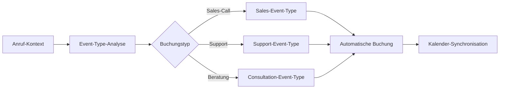

# Cal.com Integration mit KI-Telefonassistenten

Revolutionieren Sie Ihre Terminplanung mit der Open-Source-Power von Cal.com. Famulor Automation verbindet Ihre KI-Telefonassistenten mit Cal.com für automatische Buchungen, flexible Event-Konfiguration und vollständige Datenkontrolle.

<Note>
**Open-Source-Flexibilität**: Cal.com bietet unvergleichliche Anpassungsmöglichkeiten und kann self-hosted betrieben werden für maximale Datensicherheit.
</Note>

## Warum Cal.com + KI-Telefonassistent?

### 🔓 Open-Source-Freiheit
Vollständige Kontrolle über Ihre Terminplanung-Infrastruktur mit selbst gehosteten Lösungen und unbegrenzter Anpassbarkeit.

### ⚡ Intelligente Event-Types
Automatische Zuordnung zu passenden Event-Types basierend auf Gesprächskontext und Kundenanforderungen.

### 🛡️ Datenschutz-Excellence
Ihre Termindaten bleiben unter Ihrer Kontrolle - keine Third-Party-Abhängigkeiten bei Self-Hosting.

### 🔄 Flexible Workflows
Anpassbare Booking-Workflows, Custom-Fields und Integration mit bestehenden Tools.

## Hauptfunktionen der Integration

### 1. Automatische Buchungs-Intelligence

**Smart Event-Type-Matching:**


**Unterstützte Cal.com-Aktionen:**
- ✅ **Create Booking**: Automatische Termin-Erstellung aus Anrufen
- ✅ **Update Booking**: Terminänderungen basierend auf Follow-up-Calls
- ✅ **Cancel Booking**: Stornierungen via Telefon
- ✅ **Get Available Slots**: Echtzeit-Verfügbarkeits-Check
- ✅ **Create Event Type**: Dynamische Event-Type-Erstellung
- ✅ **Get User Schedule**: Komplette Kalender-Übersicht

### 2. Trigger-Based Automation

**Cal.com-Events als Workflow-Trigger:**

| Cal.com-Trigger | Famulor-Response | Automatische Aktion |
|-----------------|------------------|---------------------|
| **Booking Created** | Follow-up-Call planen | Bestätigungs-E-Mail + Vorbereitung |
| **Booking Cancelled** | Alternative Termine | Re-Booking-Workflow aktivieren |
| **Booking Rescheduled** | Team-Notification | Kalender-Updates + Stakeholder-Info |

### 3. Erweiterte Event-Type-Konfiguration

**Anruf-basierte Event-Type-Erstellung:**
```
Gespräch: "Wir brauchen eine 45-minütige Produktdemo mit Screen-Sharing"

Automatisch erstellt:
📅 Event-Type: "Produktdemo - Client XY"
⏰ Dauer: 45 Minuten
🔧 Features: Video-Call-Link, Screen-Sharing enabled
📋 Custom-Fields: Demo-Focus, Teilnehmer-Anzahl
🎯 Availability: Business Hours only
📍 Location: Zoom-Meeting (auto-generated)
```

### 4. Multi-Kalender-Orchestration

**Intelligent Calendar Management:**
- **Conflict Detection**: Automatische Überschneidungs-Prüfung
- **Buffer-Time-Management**: Intelligente Pufferzeiten zwischen Terminen
- **Team-Availability**: Koordination mit mehreren Team-Kalendern
- **Time-Zone-Intelligence**: Automatische Zeitzone-Konvertierung

## Praxisbeispiele: Cal.com Voice Automation

### Beispiel 1: Software-Beratung mit Custom Event-Types

**Szenario:** IT-Beratung mit verschiedenen Service-Levels

**Voice-to-Cal.com Workflow:**
```
Anruf-Klassifikation:
├─ "Schnelle Frage" → 15-min Quick-Consultation
├─ "Architektur-Review" → 90-min Deep-Dive-Session
├─ "Notfall-Support" → 30-min Emergency-Call (Same-Day)
└─ "Projekt-Kickoff" → 2h Workshop + Vorbereitung

Automatische Event-Type-Auswahl:
✅ Dauer basierend auf Problem-Komplexität
✅ Pricing-Information automatisch inkludiert
✅ Vorbereitung-Checkliste generiert
✅ Passende Team-Member zugewiesen
```

### Beispiel 2: Healthcare-Practice mit HIPAA-Compliance

**Szenario:** Arztpraxis mit sicherer Terminplanung

**Sichere Buchungs-Workflows:**
```
Patient-Anruf: "Termin für Nachkontrolle"

Cal.com Self-Hosted Setup:
🔒 Lokale Server-Installation
📋 HIPAA-konforme Event-Types
🔐 Verschlüsselte Patientendaten
📅 Automatische Reminder (HIPAA-compliant)
⚕️ Integration mit Praxis-Management-System

Privacy-Features:
├─ Keine Third-Party-Daten-Weitergabe
├─ Lokale Datenbank-Speicherung
├─ Audit-Logs für Compliance
└─ Patient-Consent-Management
```

### Beispiel 3: Internationale Beratung mit Multi-Timezone

**Szenario:** Global agierende Unternehmensberatung

**Global Scheduling Intelligence:**
```
Client aus Tokyo: "Meeting nächste Woche"

Automatische Timezone-Koordination:
🌏 Client-Timezone: JST (UTC+9)
🏢 Business-Timezone: CET (UTC+1)
⏰ Available-Slots: Overlap-Berechnung
📧 Invitations: Dual-Timezone-Display

Intelligente Verfügbarkeit:
├─ 09:00 JST = 01:00 CET (Outside business hours)
├─ 16:00 JST = 08:00 CET (Available slot)
├─ 20:00 JST = 12:00 CET (Optimal meeting time)
└─ Automatische "Best-Time"-Suggestion
```

## Setup-Guide: Cal.com-Integration

### Schritt 1: Cal.com-Account vorbereiten
```
Cal.com Setup-Optionen:
1️⃣ Cloud-Version: cal.com (Hosted)
2️⃣ Self-Hosted: Eigene Server-Installation
3️⃣ Enterprise: Custom-Deployment

Empfohlenes Setup für Voice-Integration:
├─ Event-Types für verschiedene Call-Kategorien
├─ Team-Member mit Specializations
├─ Custom-Fields für Call-Context
└─ API-Access aktiviert
```

### Schritt 2: API-Konfiguration
```
Cal.com Developer Settings:
1. Account → Settings → Developer
2. API-Key generieren:
   ✅ Full Calendar Access
   ✅ Booking Management
   ✅ Event-Type Creation
   ✅ User Schedule Access

3. Event-Type-IDs sammeln:
   - Sales-Calls: evt_abc123
   - Support-Calls: evt_def456
   - Consultations: evt_ghi789
```

### Schritt 3: Famulor-Integration aktivieren
```
In Famulor Dashboard:
1. Integrations → Cal.com
2. API-Key einfügen
3. Default Event-Type konfigurieren
4. Timezone-Settings prüfen

Smart-Mapping aktivieren:
📞 Sales-Keywords → Sales-Event-Type
🔧 Support-Keywords → Support-Event-Type
📊 Consultation-Keywords → Consultation-Event-Type
```

### Schritt 4: Workflow-Automation
```
Booking-Workflow konfigurieren:
├─ Pre-Booking: Verfügbarkeits-Check
├─ During-Booking: Real-time Slot-Reservation
├─ Post-Booking: Bestätigungs-Flow
└─ Follow-up: Reminder-Management

Error-Handling:
├─ No Availability → Alternative-Suggestions
├─ Double-Booking → Conflict-Resolution
├─ Timezone-Issues → Manual-Override-Option
└─ API-Errors → Fallback-to-Email-Booking
```

## Advanced Cal.com Features

### 1. Custom Event-Type-Generation

**Dynamic Event-Type-Creation:**
```javascript
// Beispiel: Event-Type basierend auf Anruf-Context
const eventTypeConfig = {
  title: `${clientName} - ${meetingType}`,
  duration: calculateDuration(complexity),
  price: determinePricing(serviceLevel),
  locations: selectLocation(clientPreference),
  customFields: extractRequirements(callTranscript),
  availability: getOptimalSlots(urgency)
};

// Cal.com API Call
const newEventType = await cal.createEventType(eventTypeConfig);
```

### 2. Intelligent Availability Management

**Smart Slot-Suggestion:**
```
Multi-Factor Availability Calculation:
├─ Calendar-Conflicts: Existing bookings
├─ Preparation-Time: Meeting-specific prep
├─ Travel-Time: Physical meeting buffers
├─ Energy-Levels: Optimal performance times
├─ Client-Preferences: Timezone + preferred times
└─ Business-Rules: Core hours, lunch breaks

Suggestion-Algorithm:
🎯 Score each available slot (1-100)
⭐ Present top 3-5 options
🕐 Include buffer explanations
📊 Optimize for both parties
```

### 3. Team-Coordination Features

**Multi-Person Meeting Orchestration:**
```
Complex-Meeting-Scenarios:
├─ Account-Review: Client + Account-Manager + Specialist
├─ Technical-Demo: Prospect + Sales + Developer + Product
├─ Strategic-Planning: Multiple stakeholders
└─ Training-Session: Trainer + Multiple participants

Coordination-Features:
✅ Group-Availability-Finding
✅ Role-based-Participant-Assignment
✅ Hierarchical-Booking-Permissions
✅ Automated-Agenda-Generation
```

## Self-Hosting & Enterprise Features

### 1. Cal.com Self-Hosted-Setup

**Enterprise-Deployment:**
```
Infrastructure-Requirements:
├─ Node.js Server (>=16.0)
├─ PostgreSQL Database
├─ Redis für Caching
├─ SMTP für E-Mail-Delivery
└─ SSL-Certificates für HTTPS

Security-Enhancements:
🔒 SSO-Integration (SAML, OAuth)
🛡️ Role-based-Access-Control
📊 Audit-Logging
🔐 Data-Encryption
🌐 VPN-Integration
```

### 2. Compliance & Governance

**Regulatory-Compliance:**
```
GDPR/DSGVO-Compliance:
├─ Data-Minimization in Bookings
├─ Right-to-Delete Implementations
├─ Consent-Management
└─ Data-Export-Capabilities

Industry-Specific:
🏥 HIPAA (Healthcare)
🏦 SOX (Financial Services)
🛡️ ISO27001 (Security Standards)
📋 Custom-Compliance-Rules
```

### 3. Advanced Analytics

**Booking-Intelligence:**
```
Analytics-Dashboards:
📊 Booking-Success-Rates per Event-Type
⏱️ Average-Time-to-Booking
🎯 Conversion-Rates by Call-Quality
📈 Revenue-Attribution per Channel
🔄 Rebooking-Patterns
⚠️ Cancellation-Trends

AI-Insights:
├─ Optimal-Meeting-Duration-Predictions
├─ Best-Time-Slots für verschiedene Client-Types
├─ Success-Probability-Scoring
└─ Capacity-Planning-Recommendations
```

## ROI & Performance-Metrics

### Cal.com Integration-Benefits:

| Metrik | Ohne Integration | Mit Cal.com+Voice | Verbesserung |
|--------|------------------|-------------------|---------------|
| **Booking-Zeit** | 5-15 min | 30 sek | 95% Reduktion |
| **Double-Booking-Rate** | 8% | 0.2% | 97% Reduktion |
| **No-Show-Rate** | 23% | 12% | 48% Verbesserung |
| **Client-Satisfaction** | 7.1/10 | 9.3/10 | +31% |
| **Scheduling-Overhead** | 25 min/Tag | 3 min/Tag | 88% Zeitersparnis |

### Open-Source-ROI:
```
Cost-Comparison (100 Bookings/Month):
├─ Calendly Business: €96/Monat
├─ Cal.com Cloud: €60/Monat
├─ Cal.com Self-Hosted: €15/Monat (Server-Kosten)
└─ + Famulor Integration: €50/Monat

Total Cost of Ownership:
├─ Setup-Time: 2-4 Stunden (einmalig)
├─ Maintenance: 1 Stunde/Monat
├─ Customization-Potential: Unbegrenzt
└─ Data-Ownership: 100% unter eigener Kontrolle
```

## Support & Community

### 📚 Umfassende Ressourcen
- **Cal.com Docs**: Offizielle Dokumentation und API-Reference
- **Community-Forum**: Active Developer-Community Support
- **GitHub-Repository**: Open-Source-Code und Issue-Tracking
- **Famulor-Integration-Guide**: Spezielle Dokumentation für Voice-Integration

### 🛠️ Technical Support
- **Self-Hosted-Setup**: Unterstützung bei Server-Installation
- **Custom-Development**: Maßgeschneiderte Feature-Entwicklung
- **Migration-Services**: Von anderen Scheduling-Tools zu Cal.com
- **Training & Onboarding**: Team-Schulungen für optimale Nutzung

---

**Bereit für Open-Source-Terminplanung?**

<CardGroup cols={2}>
  <Card title="Cal.com Integration starten" icon="calendar-days" href="https://app.famulor.de/integrations/cal-com">
    Cal.com jetzt mit KI-Assistenten verbinden
  </Card>
  <Card title="Self-Hosted Setup" icon="server" href="https://cal.com/docs/self-hosting">
    Eigene Cal.com-Instanz einrichten
  </Card>
  <Card title="Demo buchen" icon="video" href="https://cal.com/bek-group/demotermine">
    Live-Demo der Cal.com-Integration
  </Card>
  <Card title="Enterprise-Beratung" icon="users" href="mailto:enterprise@famulor.io">
    Maßgeschneiderte Enterprise-Lösungen
  </Card>
</CardGroup>