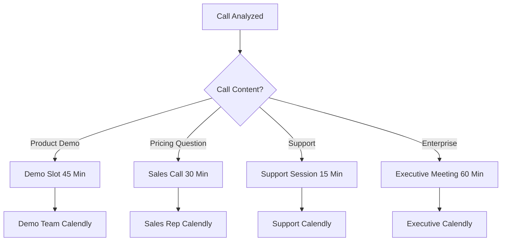
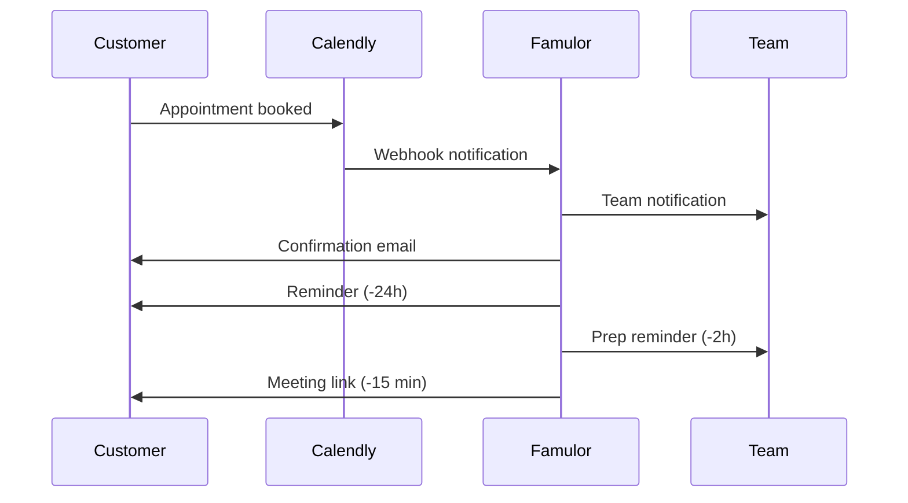

# Calendly Integration for AI Phone Assistants

Revolutionize your appointment scheduling with intelligent AI assistants. Famulor Automation seamlessly connects Calendly with your phone assistants for instant booking links, automatic appointment confirmation, and perfectly orchestrated meeting workflows.

<Note>
**New**: Round-Robin Scheduling – Automatically distribute appointments to available team members based on call content and expertise.
</Note>

## Why Calendly + AI Phone Assistant?

### ⚡ Instant Appointment Booking  
Appointments are booked directly during the call – no more lengthy back-and-forth.

### 📱 SMS Booking Links  
Send Calendly links instantly via SMS after engaging conversations.

### 🎯 Intelligent Appointment Distribution  
AI analyzes call content and schedules the appropriate appointment type with the right expert.

### 📈 Optimized Conversion Rates  
From interest to booking in under 60 seconds – 5x higher booking rates.

## Key Features of the Integration

### 1. Intelligent Meeting Type Detection

**Automatic Meeting Type Assignment:**  


**Available Meeting Types:**

| Meeting Type           | Duration | Team             | Automatic Selection Keywords         |
|------------------------|----------|------------------|------------------------------------|
| 🎬 **Product Demo**    | 45 Min   | Sales Engineers  | "Demo", "presentation", "show"      |
| 💼 **Sales Conversation** | 30 Min   | Account Executives | "price", "offer", "purchase"      |
| 🔧 **Tech Consultation** | 60 Min   | Solutions Architects | "integration", "API", "technical"  |
| ⚡ **Quick Call**       | 15 Min   | Inside Sales     | "quick talk", "questions"           |
| 👔 **Executive Meeting** | 60 Min   | C-Level          | "CEO", "strategy"                   |

### 2. Instant Booking Link Delivery

**Multi-Channel Link Sharing:**

#### SMS Delivery (Immediate):
```sms
Hello Max Mustermann!

As discussed, here is your booking link for the product demo:
📅 https://calendly.com/famulor-demo/45min

✅ Choose your preferred time
⏰ Automatic calendar invitation
📋 Demo agenda sent in advance

If you have questions: +49 30 12345678

Your Famulor Team
```

#### Email Follow-up (+2h):
```html
Subject: Your Demo Appointment - Book Now (TechCorp AG)

Dear Mr. Mustermann,

Thank you for your interest in our AI solution.

As discussed on the phone, you can book your preferred time slot for the 45-minute product demo here:

[BOOK YOUR APPOINTMENT NOW] → Calendly link

What to expect:
✅ Live demo of your use cases
✅ ROI calculation for TechCorp
✅ Integration roadmap
✅ Next steps & timeline

The demo will be conducted by our Solutions Engineer Klaus Weber, who has managed over 200 similar projects.

Best regards,  
Sarah Müller | Account Executive
```

### 3. Round-Robin & Team Management

**Intelligent Expert Assignment:**
```calendly
Demo request detected
→ Analyze company details: "250 employees, Enterprise"
→ Check availability:
   Klaus Weber (Enterprise): ✅ Available
   Anna Schmidt (SMB): ⚠️ Overloaded  
   Max Müller (Technical): ✅ Available
→ Auto-assignment: Klaus Weber
→ Calendly link generated: /klaus-weber/enterprise-demo
```

**Load-Balancing Algorithm:**  
- **Expertise Match**: 70% weight  
- **Current Workload**: 20% weight  
- **Historical Performance**: 10% weight

### 4. Advanced Booking Logic

**Conditional Scheduling Rules:**

#### Budget-Based Prioritization:
```javascript
if (mentionedBudget > 50000) {
  meetingType = "enterprise-consultation";
  duration = 60; // minutes
  assignTo = getAvailableExecutive();
  priority = "high";
  bufferTime = 15; // prep time in minutes
} else if (mentionedBudget > 10000) {
  meetingType = "sales-presentation";
  duration = 45;
  assignTo = getSeniorSalesRep();
  priority = "medium";
}
```

#### Timezone Optimization:
```javascript
// Automatic timezone detection
const callerTimezone = detectTimezoneFromPhone(phoneNumber);
const optimalTimes = getOptimalMeetingTimes(callerTimezone, teamAvailability);

// Show only matching slots
calendlyLink = generateCustomLink({
  timezone: callerTimezone,
  availableSlots: optimalTimes,
  duration: meetingDuration
});
```

## Industry-Specific Applications

### B2B Software Sales

**Enterprise Sales Cycle:**  
```
Initial Call → Demo Booking → Technical Deep Dive → Proposal Meeting → Decision Call
```

Calendly Event Types:
1. "Product Demo" (45 min) - Solutions Engineer  
2. "Technical Review" (60 min) - Solutions Architect  
3. "Business Case Discussion" (45 min) - Account Executive  
4. "Executive Briefing" (30 min) - VP Sales  
5. "Contract Review" (30 min) - Legal + Sales

**Automatic Progression:**  
- Demo successful → Tech Review link sent automatically  
- Positive Tech Review → Business Case meeting scheduled  
- Budget confirmed → Executive briefing convened

### Professional Services

**Consulting Firm Workflow:**  
```
Initial Inquiry → Needs Analysis → Proposal → Kickoff → Regular Check-ins
```

Meeting Types:  
• "Free Consultation" (30 min) - Senior Consultant  
• "Project Scoping" (60 min) - Practice Lead  
• "Proposal Presentation" (45 min) - Account Manager  
• "Project Kickoff" (90 min) - Delivery Team  
• "Status Update" (30 min) - Project Manager

### Healthcare & Medical

**Patient Appointments & Consultations:**  
```
Symptoms Call → Doctor Consultation → Follow-up → Treatment Plan
```

Calendly Setup:  
• "Initial Consultation" (45 min) - General Practitioner  
• "Specialist Appointment" (30 min) - Specialist  
• "Telemedicine" (20 min) - Online Consultation  
• "Aftercare" (15 min) - Clinic Team  
• "Emergency Consultation" (15 min) - Available Doctor

## Advanced Calendly Features

### Custom Questions & Qualification

**Intelligent Pre-Qualification:**  
```calendly
Automatic questions based on call content:

If "Budget" mentioned:  
→ Question: "What budget have you allocated for this project?"  
→ Options: "<€10k", "€10-50k", "€50-100k", ">€100k"

If "Timeline" mentioned:  
→ Question: "By when should the solution be implemented?"  
→ Options: "Immediately", "1-3 months", "3-6 months", "Later"

If "Team Size" mentioned:  
→ Question: "What is the size of your team?"  
→ Options: "1-10", "11-50", "51-200", ">200"
```

### Buffer Times & Preparation

**Automatic Buffer Times:**  
```
Meeting type-specific buffers:

Product Demo:  
• 15 min before meeting: Setup & client research  
• 10 min after meeting: Follow-up notes

Enterprise Consultation:  
• 30 min before meeting: Account research + stakeholder mapping  
• 15 min after meeting: Next steps documentation

Support Session:  
• 5 min before meeting: Case history review  
• 5 min after meeting: Ticket update
```

### Automated Workflows

**Post-Booking Automation:**  


## Integration with Other Tools

### CRM Synchronization

**Automatic CRM Updates:**  
```
Calendly Booking → CRM Actions:

HubSpot:  
• Contact updated: "Demo scheduled for [date]"  
• Task created: "Prepare demo - [meeting details]"  
• Deal stage: "Demo Scheduled"  
• Follow-up task: "+1 day after demo"

Salesforce:  
• Event created with customer details  
• Opportunity stage update  
• Account team notification  
• Activity history logged
```

### Marketing Automation

**Lead Nurturing Post-Booking:**  
```
Booking confirmed → Marketing sequence:

Day -2: Prep email with agenda + resources  
Day -1: Reminder + tech check link  
Day 0: Meeting day reminder + dial-in details  
Day +1: Thank you + follow-up resources  
Day +3: Proposal/Next steps (if positive)  
Day +7: Check-in call offer (if neutral)
```

### Team Communication

**Slack/Teams Integration:**  
```slack
🗓️ NEW CALENDLY BOOKING

👤 Customer: Max Mustermann (TechCorp AG)
📅 Appointment: Tomorrow, 14:00-14:45 (Demo)
👨‍💼 Assigned: Klaus Weber
💰 Budget: €25k+ (from call)
📋 Use case: CRM Integration + Automation

[Prepare Meeting] [Customer History] [Similar Cases]

cc: @sales-team @demo-team
```

## ROI & Performance Metrics

### Booking Rate Optimization

| Scenario           | Without Integration | With Calendly + AI | Improvement         |
|--------------------|---------------------|--------------------|---------------------|
| **Interest to Booking** | 23%                 | 78%                | **+239% conversion** |
| **No-Show Rate**      | 28%                 | 12%                | **-57% no-shows**    |
| **Avg Time-to-Meeting** | 5.2 days            | 1.8 days           | **-65% faster**      |
| **Rescheduling Rate** | 34%                 | 15%                | **-56% reschedules** |
| **Meeting Quality Score** | 6.8/10              | 8.9/10             | **+31% quality**     |

### Sales Performance Impact

**Pipeline Acceleration:**  
```
Sales Metrics - 6-Month Comparison:  
════════════════════════════════════════════════════  
Metric             | Before | After | Δ  
Demos per Week     | 23     | 67    | +191%  
Demo-to-Opportunity | 34%    | 56%   | +65%  
Sales Cycle Length | 89 days| 62 days| -30%  
Average Deal Size  | €34k   | €47k  | +38%  
Rep Productivity   | 2.1    | 4.3   | +105%  
```

### Cost Savings Analysis

**Administrative Efficiency:**  
```
Appointment Coordination - Monthly Time Savings:  
════════════════════════════════════════════════════  
Activity            | Before | After | Savings  
Email Coordination  | 15h    | 2h     | 13h (€650)  
Phone Follow-up     | 8h     | 0h     | 8h (€400)  
Calendar Management | 12h    | 1h     | 11h (€550)  
No-Show Follow-up   | 6h     | 1h     | 5h (€250)  
Meeting Prep Time   | 20h    | 15h    | 5h (€250)  

Total Monthly: €2,100 Savings  
Annual ROI: 2,520%
```

## Success Stories

### Case Study: SaaS Startup

**Initial Situation:**  
- 45 demo requests/month  
- 23% booking rate (manual)  
- 34% no-show rate  
- 2.1 demos/sales rep/week

**Calendly + AI Integration Results (4 months):**  
- ✅ **78% booking rate** via instant links  
- ✅ **12% no-show rate** through improved communication  
- ✅ **€890k additional pipeline** from more qualified demos  
- ✅ **4.3 demos/rep/week** thanks to automation

*"The Calendly integration completely transformed our demo performance. We now book 3x more appointments and have significantly more qualified prospects."* – Lisa Weber, VP Sales

### Case Study: Consulting Firm

**Challenge:** Complex appointment coordination for various expertise levels

**Solution:** Multi-tier Calendly setup with intelligent assignment

**Results (6 months):**  
- ✅ **89% reduction** in email coordination  
- ✅ **€2.1M additional revenue** from more efficient scheduling  
- ✅ **67% higher** client satisfaction via punctual, well-prepared meetings

## Setup & Best Practices

### Calendly Configuration

<Steps>
  <Step title="Define Event Types">
    Create specific meeting types for different call scenarios
  </Step>
  <Step title="Configure Team Assignment">
    Define round-robin rules and expertise mappings
  </Step>
  <Step title="Set Up Custom Questions">
    Qualification questions based on your sales process
  </Step>
  <Step title="Activate Famulor Integration">
    Connect Calendly with your Famulor dashboard
  </Step>
  <Step title="Test Automated Workflows">
    Perform test calls and validate booking flows
  </Step>
</Steps>

### Optimization Tips

**Meeting Type Optimization:**  
- **Duration**: Always include 15 minutes buffer for delays  
- **Availability**: Max 60% of working hours allocated for meetings  
- **Qualification**: At least 3 qualifying questions per meeting type  
- **Follow-up**: Automatic next-step emails after 24 hours

## Frequently Asked Questions (FAQ)

<AccordionGroup>
  <Accordion title="Does the integration work with Calendly Teams?">
    Yes, full support for Calendly Individual, Teams, and Enterprise with advanced features for organizations.
  </Accordion>

  <Accordion title="Can multiple Calendly accounts be used?">
    Yes, multi-account support allows different Calendly accounts per team or department.
  </Accordion>

  <Accordion title="What happens during Calendly outages?">
    Fallback system creates meeting requests via email and syncs automatically after recovery.
  </Accordion>

  <Accordion title="Do you support other scheduling tools?">
    Yes, Acuity Scheduling, Cal.com, and When2meet are supported as well. Calendly is the most extensively integrated.
  </Accordion>
</AccordionGroup>

## Get Started Now

<CardGroup cols={2}>
  <Card title="Calendly Integration" icon="calendar" href="https://app.famulor.de/integrations/calendly">
    Set up connection in 3 minutes
  </Card>
  <Card title="Meeting Templates" icon="clock" href="/automation-platform/integrations/calendar#calendly-templates">
    Proven meeting type templates
  </Card>
  <Card title="Booking Rate Audit" icon="chart-line" href="https://audit.famulor.de/scheduling">
    Analyze your current booking rates
  </Card>
  <Card title="Book Live Demo" icon="video" href="https://calendly.com/famulor/scheduling-demo">
    See Calendly automation live
  </Card>
</CardGroup>

## Related Scheduling Tools

<CardGroup cols={3}>
  <Card title="Google Calendar" icon="calendar-alt" href="/automation-platform/integrations/einzelintegrations/google-calendar">
    Direct calendar integration
  </Card>
  <Card title="Cal.com" icon="calendar-check" href="/automation-platform/integrations/einzelintegrations/cal-com">
    Open-source scheduling alternative
  </Card>
  <Card title="Outlook Calendar" icon="microsoft" href="/automation-platform/integrations/einzelintegrations/outlook-calendar">
    Microsoft ecosystem integration
  </Card>
</CardGroup>

---

**Scheduling Support:** For advanced Calendly setups and enterprise configurations, contact our scheduling experts at [support@famulor.io](mailto:support@famulor.io).

**Last Updated:** January 2024 | **Calendly API Version:** v2 | **Supported Plans:** Basic, Essential, Professional, Teams | **Webhooks:** Fully implemented