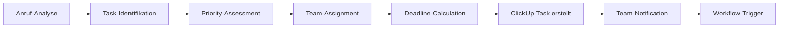

# ClickUp Integration mit KI-Telefonassistenten

Transformieren Sie Ihr Projektmanagement mit der All-in-One-Power von ClickUp. Famulor Automation verbindet Ihre KI-Telefonassistenten mit ClickUp für automatische Task-Erstellung, intelligente Projekt-Updates und nahtlose Team-Koordination.

<Note>
**All-in-One-Produktivität**: ClickUp ersetzt mehrere Tools und zentralisiert Ihr komplettes Projektmanagement in einer Plattform.
</Note>

## Warum ClickUp + KI-Telefonassistent?

### 🎯 All-in-One-Effizienz
Eine einzige Plattform für Tasks, Projekte, Dokumente, Ziele und Team-Kommunikation - alles steuerbar durch Anrufe.

### ⚡ Automatische Task-Intelligence
Jeder Anruf wird automatisch in strukturierte ClickUp-Tasks mit korrekten Prioritäten, Zuweisungen und Deadlines umgewandelt.

### 🔄 Flexible Workflow-Anpassung
Anpassbare Workflows, Custom-Fields und Automatisierungen für jede Team-Struktur und Arbeitsweise.

### 📊 Echtzeit-Projekt-Visibility
Ihre ClickUp-Projekte werden während des Gesprächs aktualisiert - vollständige Transparenz für alle Stakeholder.

## Hauptfunktionen der Integration

### 1. Intelligente Task-Generierung

**Automatische Task-Erstellung aus Gesprächen:**


**Verfügbare ClickUp-Aktionen:**
- ✅ **Create Task**: Automatische Task-Erstellung mit Rich-Content
- ✅ **Update Task**: Status-Updates basierend auf Anruf-Outcome
- ✅ **Create List**: Projekt-Listen für neue Initiativen
- ✅ **Add Comment**: Anruf-Notizen als Task-Comments
- ✅ **Create Space**: Neue Arbeitsbereiche für Clients/Projekte
- ✅ **Track Time**: Automatische Zeiterfassung für Anrufe
- ✅ **Set Due Date**: Intelligente Deadline-Berechnung

### 2. Smart Workflow-Automation

**ClickUp-Trigger für erweiterte Automation:**

| ClickUp-Event | Famulor-Response | Automatische Aktion |
|---------------|------------------|---------------------|
| **Task Created** | Follow-up-Call scheduling | Stakeholder-Benachrichtigung |
| **Task Updated** | Progress-Notification | Client-Update-Call |
| **Task Status Changed** | Workflow-Progression | Next-Phase-Activation |

### 3. Hierarchische Projekt-Struktur

**Voice-gesteuerte Projekt-Organisation:**
```
Anruf-Input: "Neues Projekt für Client ABC - Website-Redesign"

Automatische ClickUp-Struktur:
📁 Space: "Client ABC"
  ├─ 📋 Folder: "Website Redesign Q4"
  │   ├─ 📝 List: "Design Phase"
  │   │   ├─ ✅ Task: "Wireframes erstellen"
  │   │   ├─ ✅ Task: "Design-Mockups"
  │   │   └─ ✅ Task: "Client-Feedback einarbeiten"
  │   ├─ 📝 List: "Development Phase"
  │   └─ 📝 List: "Testing & Launch"
  └─ 📊 Goals: Website-Performance-Ziele
```

### 4. Advanced Task-Management

**Intelligente Task-Konfiguration:**
```
Gespräch: "Dringende Bug-Fixes für die App, muss bis Freitag fertig sein"

Automatisch erstellte Task:
📌 Title: "Kritische Bug-Fixes - Mobile App"
🔥 Priority: High (Urgency-Keywords erkannt)
👤 Assignee: Verfügbarer Developer
📅 Due Date: Freitag 17:00
⏰ Time Estimate: 8 Stunden (ML-basiert)
🏷️ Tags: Bug, Mobile, Urgent, Client-Reported
📋 Checklist: 
  ├─ Bug-Reproduktion dokumentieren
  ├─ Root-Cause-Analysis
  ├─ Fix implementieren
  ├─ Testing durchführen
  └─ Client-Benachrichtigung

Custom Fields:
├─ Client-Impact: High
├─ Revenue-Risk: €15,000
├─ Effort-Level: Medium
└─ Call-Reference-ID: [Anruf-Link]
```

## Praxisbeispiele: ClickUp Voice Automation

### Beispiel 1: Marketing-Agentur Campaign-Management

**Szenario:** Digitalagentur verwaltet Client-Kampagnen

**Voice-to-ClickUp Campaign-Setup:**
```
Client-Call: "Produktlaunch-Kampagne für Q1, Budget 50k€"

Automatische ClickUp-Orchestrierung:
📁 Space: "Client XY - Q1 Launch"

📊 Goal: "Q1 Produktlaunch - 10,000 Leads generieren"
├─ Target: 10,000 qualified leads
├─ Budget: €50,000
├─ Timeline: 12 Wochen
└─ Success-Metrics: CTR, CPL, Conversion-Rate

📋 Campaign-Lists:
├─ "Strategy & Planning" (Woche 1-2)
├─ "Creative Development" (Woche 2-4)  
├─ "Media Planning" (Woche 3-5)
├─ "Campaign Execution" (Woche 6-10)
└─ "Analysis & Optimization" (Woche 11-12)

Automatische Task-Verteilung:
👨‍💼 Strategist: Market-Research, Persona-Development
🎨 Designer: Visual-Assets, Landing-Pages
📊 Media-Buyer: Channel-Strategy, Budget-Allocation
📈 Analyst: Tracking-Setup, Reporting-Dashboard
```

### Beispiel 2: Software-Development Sprint-Management

**Szenario:** Development-Team arbeitet mit Agile-Methodologie

**Sprint-Planning via Voice:**
```
Product-Owner-Call: "User-Story: Customer-Dashboard mit Analytics"

ClickUp Sprint-Setup:
📋 List: "Sprint 23 - Analytics Dashboard"

User Stories automatisch erstellt:
🎯 Epic: "Customer Analytics Dashboard"
├─ 📝 Story: "Als Kunde möchte ich Dashboard-Übersicht"
│   ├─ ✅ Task: "Dashboard-Layout-Design"
│   ├─ ✅ Task: "API-Endpunkte für Metrics"
│   ├─ ✅ Task: "Frontend-Components entwickeln"
│   └─ ✅ Task: "Integration-Testing"
├─ 📝 Story: "Als Kunde möchte ich Real-time-Updates"
└─ 📝 Story: "Als Kunde möchte ich Export-Funktionen"

Sprint-Automation:
⏰ Sprint-Duration: 2 Wochen
📊 Story-Points: Auto-estimated basierend auf Complexity
👥 Team-Assignment: Skill-based Matching
📅 Daily-Standups: Automatisch geplant
🔄 Sprint-Review: Meeting am Sprint-Ende
```

### Beispiel 3: Consultant Multi-Client-Management

**Szenario:** Freelancer verwaltet mehrere Client-Projekte

**Client-segregierte Workspaces:**
```
Client A Call: "Strategie-Review für Q2 nötig"
Client B Call: "Website-Probleme dringend beheben"
Client C Call: "Neue Feature-Anfrage für App"

ClickUp-Organisation:
📁 Space A: "Client Alpha - Strategy Consulting"
├─ 📋 Ongoing-Projects
├─ 📋 Q2-Strategy-Review
└─ 📊 Goals: Revenue-Growth +25%

📁 Space B: "Client Beta - Technical Support"  
├─ 📋 Bug-Fixes (High Priority)
├─ 📋 Maintenance-Tasks
└─ 📊 Goals: 99% Uptime

📁 Space C: "Client Gamma - Product Development"
├─ 📋 Feature-Backlog
├─ 📋 Development-Sprint
└─ 📊 Goals: Feature-Delivery Q3

Cross-Client-Overview:
📊 Dashboard: "My Workload"
├─ Time-Tracking per Client
├─ Revenue-per-Hour Analytics  
├─ Deadline-Overview
└─ Capacity-Planning
```

## Setup-Guide: ClickUp-Integration

### Schritt 1: ClickUp-Workspace vorbereiten
```
ClickUp-Account-Setup:
1. Workspace für Voice-Integration erstellen
2. Team-Member mit korrekten Permissions
3. Custom-Fields für Call-Data definieren:
   ├─ Call-ID (Text)
   ├─ Call-Duration (Number)  
   ├─ Client-Priority (Dropdown)
   ├─ Revenue-Impact (Currency)
   └─ Follow-up-Required (Checkbox)

Template-Spaces erstellen:
📁 "Client Projects" (für neue Clients)
📁 "Internal Operations" (für interne Tasks)
📁 "Support & Maintenance" (für Service-Calls)
```

### Schritt 2: API-Integration aktivieren
```
ClickUp-API-Setup:
1. User Settings → Apps
2. Generate API Token:
   ✅ Full Workspace Access
   ✅ Read/Write Tasks
   ✅ Create Spaces/Lists
   ✅ Manage Custom Fields
   ✅ Time Tracking Access

3. Team-ID und Space-IDs notieren
4. Permission-Testing durchführen
```

### Schritt 3: Famulor-ClickUp-Mapping
```
In Famulor Dashboard:
1. Integrations → ClickUp
2. API-Token einfügen
3. Default-Workspace auswählen
4. Task-Mapping konfigurieren:

Voice-Intent-Mapping:
├─ "Bug-Report" → High-Priority-Task in Bug-List
├─ "Feature-Request" → Medium-Priority in Backlog
├─ "Client-Meeting" → Event + Follow-up-Task
├─ "Projekt-Update" → Task-Status-Update
└─ "New-Client" → Space-Creation + Onboarding-Tasks
```

### Schritt 4: Workflow-Automation aktivieren
```
Automation-Rules konfigurieren:
📥 Eingehende Anrufe:
├─ Lead-Calls → Prospect-Space + Qualification-Tasks
├─ Support-Calls → Support-List + SLA-Timer
├─ Sales-Calls → CRM-Space + Follow-up-Sequence

📤 Ausgehende Actions:
├─ Task-Completion → Client-Notification-Call
├─ Deadline-Approaching → Reminder-Call
├─ Blocker-Identified → Escalation-Call
└─ Project-Milestone → Celebration-Call 🎉
```

## Advanced ClickUp Features

### 1. Goals & OKR-Integration

**Voice-driven Goal-Setting:**
```
Strategic-Call: "Unser Ziel: 30% Umsatzsteigerung bis Q4"

ClickUp-Goals-Setup:
🎯 Goal: "Q4 Revenue Growth"
├─ Target: 30% increase (€1.2M → €1.56M)
├─ Timeline: Q1 → Q4  
├─ Owner: Sales Director
└─ Key Results:
   ├─ 200 neue Qualified Leads/Monat
   ├─ 25% Conversion-Rate-Verbesserung
   ├─ €7,800 Average Deal Size
   └─ 15% Customer-Retention-Steigerung

Automatische Task-Alignment:
✅ Alle neuen Tasks werden Goals zugeordnet
📊 Progress-Tracking in Real-time
📈 Goal-Contribution-Scoring
🎖️ Team-Member-Goal-Contribution-Analytics
```

### 2. Time-Tracking & Resource-Management

**Automatische Zeiterfassung:**
```
Anruf-basierte Time-Tracking:
├─ Anruf-Duration → Automatische Task-Time-Entry
├─ Client-Gespräche → Client-billable Hours
├─ Internal-Calls → Overhead-Time-Tracking
└─ Meeting-Follow-ups → Administrative-Time

Resource-Optimization:
📊 Team-Capacity-Dashboard
⚖️ Workload-Balancing-Alerts
🎯 Optimal-Task-Assignment-Suggestions
⏰ Realistic-Deadline-Predictions
```

### 3. Custom-Automation & Workflows

**Advanced ClickUp-Automations:**
```javascript
// Beispiel: Custom-Automation-Rule
if (taskPriority === 'High' && clientTier === 'Enterprise') {
  actions: [
    assignToSeniorDeveloper(),
    notifyManager(),
    createWarRoom(),
    escalateToDirector(),
    scheduleClientUpdate(2hours)
  ]
}

// Voice-Trigger-Examples:
"Kritischer Bug" → Emergency-Workflow
"Client-Eskalation" → Management-Alert-Chain  
"Deadline-Verschiebung" → Stakeholder-Communication
"Budget-Überschreitung" → Financial-Approval-Process
```

## Performance & ROI-Tracking

### ClickUp-Integration-Benefits:

| Metrik | Ohne Integration | Mit ClickUp+Voice | Verbesserung |
|--------|------------------|-------------------|---------------|
| **Task-Creation-Zeit** | 8-12 min | 45 sek | 90% Reduktion |
| **Project-Setup-Zeit** | 2-4 Stunden | 15 min | 95% Reduktion |
| **Team-Coordination-Effizienz** | 65% | 92% | +42% |
| **Deadline-Adherence** | 73% | 89% | +22% |
| **Client-Satisfaction** | 7.8/10 | 9.2/10 | +18% |

### All-in-One-ROI-Calculator:
```
Tool-Consolidation-Savings (10-Person-Team):
├─ Project-Management: €100/Monat gespart
├─ Time-Tracking: €80/Monat gespart
├─ Document-Management: €60/Monat gespart
├─ Goal-Tracking: €40/Monat gespart
├─ Team-Communication: €120/Monat gespart
Total-Tool-Savings: €400/Monat

Productivity-Gains:
├─ Task-Management-Efficiency: 12h/Woche gespart
├─ Communication-Overhead: 8h/Woche reduziert
├─ Status-Update-Meetings: 6h/Woche eliminiert
Total-Time-Savings: 26h/Woche × €75/h = €1,950/Woche

Monthly-ROI:
├─ Tool-Savings: €400
├─ Productivity-Gains: €7,800
├─ ClickUp+Integration-Costs: €800
├─ Net-Benefit: €7,400/Monat
└─ ROI: 925%
```

## Team-Adoption & Change-Management

### 1. Training & Onboarding

**ClickUp-Voice-Integration-Training:**
```
Team-Training-Programm:
📚 Phase 1: ClickUp-Grundlagen (2h)
🎙️ Phase 2: Voice-Integration-Workflows (1h)
🛠️ Phase 3: Custom-Setup für Team-Roles (1h)
🚀 Phase 4: Live-Practice-Sessions (2h)
📊 Phase 5: Performance-Monitoring-Setup (30min)

Role-specific-Training:
👨‍💼 Manager: Goal-Setting, Team-Oversight, Reporting
👨‍💻 Developer: Technical-Task-Management, Sprint-Planning
🎨 Designer: Creative-Workflow-Optimization
📊 Analyst: Data-Tracking, Performance-Metrics
```

### 2. Change-Management-Best-Practices

**Erfolgreiche Team-Adoption:**
```
Adoption-Strategy:
1️⃣ Champion-Program: Early-Adopter identifizieren
2️⃣ Gradual-Rollout: Schrittweise Team-Integration
3️⃣ Success-Stories: Wins kommunizieren und teilen
4️⃣ Feedback-Loops: Kontinuierliche Verbesserung
5️⃣ Incentive-Programs: Adoption-Belohnungen

Common-Resistance-Points:
❌ "Zu komplex" → Simplified-Workflows bereitstellen
❌ "Zeitaufwand" → ROI-Demonstration mit konkreten Zahlen
❌ "Gewohnheiten" → Parallele-Nutzung erlauben während Transition
❌ "Training-Zeit" → Bite-sized-Learning-Sessions
```

## Industry-Specific-Setups

### 🏗️ Construction & Project-Management
```
Construction-Workflow:
├─ Site-Inspections → Photo-Tasks mit GPS-Location
├─ Material-Orders → Procurement-Lists mit Budgets
├─ Safety-Issues → High-Priority-Emergency-Tasks
├─ Client-Changes → Change-Order-Approval-Workflows
└─ Progress-Updates → Milestone-Tracking mit Photos
```

### 🏥 Healthcare-Practice-Management
```
Medical-Practice-Setup:
├─ Patient-Follow-ups → HIPAA-compliant-Task-Management
├─ Equipment-Maintenance → Recurring-Task-Schedules
├─ Insurance-Claims → Document-Workflow mit Deadlines
├─ Staff-Training → Education-Task-Assignments
└─ Compliance-Audits → Checklist-based-Task-Templates
```

### 🎓 Educational-Institution-Management
```
Academic-Administration:
├─ Student-Issues → Case-Management-Workflows
├─ Faculty-Coordination → Academic-Project-Management
├─ Event-Planning → Multi-stakeholder-Task-Coordination
├─ Budget-Requests → Approval-Workflow-Chains
└─ Compliance-Tracking → Regulatory-Task-Management
```

---

**Bereit für All-in-One-Produktivität?**

<CardGroup cols={2}>
  <Card title="ClickUp Integration starten" icon="rocket" href="https://app.famulor.de/integrations/clickup">
    ClickUp jetzt mit KI-Assistenten verbinden
  </Card>
  <Card title="All-in-One Demo" icon="presentation-screen" href="https://cal.com/bek-group/demotermine">
    Live-Demo des kompletten ClickUp-Workflows
  </Card>
  <Card title="Workspace-Templates" icon="folder-plus" href="/automation-platform/integrations/einzelintegrations/clickup/templates">
    Vorgefertigte ClickUp-Workspace-Setups
  </Card>
  <Card title="ROI-Calculator" icon="calculator" href="/automation-platform/integrations/einzelintegrations/clickup/roi">
    Berechnen Sie Ihre All-in-One-Einsparungen
  </Card>
</CardGroup>