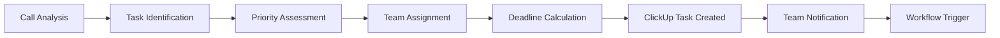

# ClickUp Integration with AI Phone Assistants

Transform your project management with the all-in-one power of ClickUp. Famulor Automation connects your AI phone assistants with ClickUp for automatic task creation, intelligent project updates, and seamless team coordination.

<Note>
**All-in-One Productivity**: ClickUp replaces multiple tools and centralizes your entire project management within a single platform.
</Note>

## Why ClickUp + AI Phone Assistant?

### 🎯 All-in-One Efficiency
A single platform for tasks, projects, documents, goals, and team communication – all controllable via calls.

### ⚡ Automatic Task Intelligence
Every call is automatically converted into structured ClickUp tasks with correct priorities, assignments, and deadlines.

### 🔄 Flexible Workflow Customization
Customizable workflows, custom fields, and automations to fit every team structure and working style.

### 📊 Real-Time Project Visibility
Your ClickUp projects are updated live during conversations – full transparency for all stakeholders.

## Key Features of the Integration

### 1. Intelligent Task Generation

**Automatic Task Creation from Conversations:**

```mermaid
graph LR
    A[Call Analysis] --> B[Task Identification]
    B --> C[Priority Assessment]
    C --> D[Team Assignment]
    D --> E[Deadline Calculation]
    E --> F[ClickUp Task Created]
    F --> G[Team Notification]
    G --> H[Workflow Trigger]
```

**Available ClickUp Actions:**
- ✅ **Create Task**: Automatic task creation with rich content  
- ✅ **Update Task**: Status updates based on call outcome  
- ✅ **Create List**: Project lists for new initiatives  
- ✅ **Add Comment**: Call notes as task comments  
- ✅ **Create Space**: New workspaces for clients/projects  
- ✅ **Track Time**: Automatic time tracking for calls  
- ✅ **Set Due Date**: Intelligent deadline calculation  

### 2. Smart Workflow Automation

**ClickUp triggers for advanced automation:**

| ClickUp Event      | Famulor Response          | Automatic Action          |
|--------------------|---------------------------|---------------------------|
| **Task Created**    | Follow-up call scheduling | Stakeholder notification  |
| **Task Updated**    | Progress notification     | Client update call        |
| **Task Status Changed** | Workflow progression    | Next phase activation     |

### 3. Hierarchical Project Structure

**Voice-controlled project organization:**
```
Call Input: "New project for Client ABC - Website redesign"

Automatic ClickUp structure:
📁 Space: "Client ABC"
  ├─ 📋 Folder: "Website Redesign Q4"
  │   ├─ 📝 List: "Design Phase"
  │   │   ├─ ✅ Task: "Create wireframes"
  │   │   ├─ ✅ Task: "Design mockups"
  │   │   └─ ✅ Task: "Incorporate client feedback"
  │   ├─ 📝 List: "Development Phase"
  │   └─ 📝 List: "Testing & Launch"
  └─ 📊 Goals: Website performance targets
```

### 4. Advanced Task Management

**Intelligent task configuration:**
```
Conversation: "Urgent bug fixes for the app, must be done by Friday"

Automatically created task:
📌 Title: "Critical Bug Fixes - Mobile App"
🔥 Priority: High (Urgency keywords detected)
👤 Assignee: Available developer
📅 Due Date: Friday 5:00 PM
⏰ Time Estimate: 8 hours (ML-based)
🏷️ Tags: Bug, Mobile, Urgent, Client-Reported
📋 Checklist: 
  ├─ Document bug reproduction
  ├─ Root cause analysis
  ├─ Implement fix
  ├─ Conduct testing
  └─ Notify client

Custom Fields:
├─ Client Impact: High
├─ Revenue Risk: €15,000
├─ Effort Level: Medium
└─ Call Reference ID: [Call Link]
```

## Practical Examples: ClickUp Voice Automation

### Example 1: Marketing Agency Campaign Management

**Scenario:** Digital agency managing client campaigns

**Voice-to-ClickUp campaign setup:**
```
Client Call: "Product launch campaign for Q1, budget €50k"

Automatic ClickUp orchestration:
📁 Space: "Client XY - Q1 Launch"

📊 Goal: "Q1 Product Launch - Generate 10,000 leads"
├─ Target: 10,000 qualified leads
├─ Budget: €50,000
├─ Timeline: 12 weeks
└─ Success Metrics: CTR, CPL, Conversion Rate

📋 Campaign Lists:
├─ "Strategy & Planning" (Week 1-2)
├─ "Creative Development" (Week 2-4)  
├─ "Media Planning" (Week 3-5)
├─ "Campaign Execution" (Week 6-10)
└─ "Analysis & Optimization" (Week 11-12)

Automatic Task Distribution:
👨‍💼 Strategist: Market research, persona development
🎨 Designer: Visual assets, landing pages
📊 Media Buyer: Channel strategy, budget allocation
📈 Analyst: Tracking setup, reporting dashboard
```

### Example 2: Software Development Sprint Management

**Scenario:** Development team working with agile methodology

**Sprint planning via voice:**
```
Product Owner Call: "User story: Customer dashboard with analytics"

ClickUp sprint setup:
📋 List: "Sprint 23 - Analytics Dashboard"

User stories automatically created:
🎯 Epic: "Customer Analytics Dashboard"
├─ 📝 Story: "As a customer, I want a dashboard overview"
│   ├─ ✅ Task: "Dashboard layout design"
│   ├─ ✅ Task: "API endpoints for metrics"
│   ├─ ✅ Task: "Develop frontend components"
│   └─ ✅ Task: "Integration testing"
├─ 📝 Story: "As a customer, I want real-time updates"
└─ 📝 Story: "As a customer, I want export functions"

Sprint automation:
⏰ Sprint duration: 2 weeks
📊 Story points: Auto-estimated based on complexity
👥 Team assignment: Skill-based matching
📅 Daily standups: Automatically scheduled
🔄 Sprint review: Meeting at sprint end
```

### Example 3: Consultant Multi-Client Management

**Scenario:** Freelancer managing multiple client projects

**Client-segregated workspaces:**
```
Client A Call: "Strategy review needed for Q2"
Client B Call: "Urgent website issues"
Client C Call: "New feature request for app"

ClickUp organization:
📁 Space A: "Client Alpha - Strategy Consulting"
├─ 📋 Ongoing Projects
├─ 📋 Q2 Strategy Review
└─ 📊 Goals: Revenue growth +25%

📁 Space B: "Client Beta - Technical Support"  
├─ 📋 Bug Fixes (High Priority)
├─ 📋 Maintenance Tasks
└─ 📊 Goals: 99% Uptime

📁 Space C: "Client Gamma - Product Development"
├─ 📋 Feature Backlog
├─ 📋 Development Sprint
└─ 📊 Goals: Feature Delivery Q3

Cross-client overview:
📊 Dashboard: "My Workload"
├─ Time tracking per client
├─ Revenue per hour analytics  
├─ Deadline overview
└─ Capacity planning
```

## Setup Guide: ClickUp Integration

### Step 1: Prepare ClickUp Workspace
```
ClickUp Account Setup:
1. Create workspace for voice integration
2. Add team members with correct permissions
3. Define custom fields for call data:
   ├─ Call ID (Text)
   ├─ Call Duration (Number)  
   ├─ Client Priority (Dropdown)
   ├─ Revenue Impact (Currency)
   └─ Follow-up Required (Checkbox)

Create template spaces:
📁 "Client Projects" (for new clients)
📁 "Internal Operations" (for internal tasks)
📁 "Support & Maintenance" (for service calls)
```

### Step 2: Enable API Integration
```
ClickUp API Setup:
1. User Settings → Apps
2. Generate API token:
   ✅ Full workspace access
   ✅ Read/write tasks
   ✅ Create spaces/lists
   ✅ Manage custom fields
   ✅ Time tracking access

3. Note team ID and space IDs
4. Perform permission testing
```

### Step 3: Famulor-ClickUp Mapping
```
In Famulor Dashboard:
1. Integrations → ClickUp
2. Insert API token
3. Select default workspace
4. Configure task mapping:

Voice Intent Mapping:
├─ "Bug Report" → High priority task in bug list
├─ "Feature Request" → Medium priority in backlog
├─ "Client Meeting" → Event + follow-up task
├─ "Project Update" → Task status update
└─ "New Client" → Space creation + onboarding tasks
```

### Step 4: Activate Workflow Automation
```
Configure automation rules:
📥 Incoming calls:
├─ Lead calls → Prospect space + qualification tasks
├─ Support calls → Support list + SLA timer
├─ Sales calls → CRM space + follow-up sequence

📤 Outgoing actions:
├─ Task completion → Client notification call
├─ Deadline approaching → Reminder call
├─ Blocker identified → Escalation call
└─ Project milestone → Celebration call 🎉
```

## Advanced ClickUp Features

### 1. Goals & OKR Integration

**Voice-driven goal setting:**
```
Strategic call: "Our goal: 30% revenue increase by Q4"

ClickUp goals setup:
🎯 Goal: "Q4 Revenue Growth"
├─ Target: 30% increase (€1.2M → €1.56M)
├─ Timeline: Q1 → Q4  
├─ Owner: Sales Director
└─ Key Results:
   ├─ 200 new qualified leads/month
   ├─ 25% conversion rate improvement
   ├─ €7,800 average deal size
   └─ 15% customer retention increase

Automatic task alignment:
✅ All new tasks assigned to goals
📊 Progress tracking in real-time
📈 Goal contribution scoring
🎖️ Team member goal contribution analytics
```

### 2. Time Tracking & Resource Management

**Automatic time tracking:**
```
Call-based time tracking:
├─ Call duration → Automatic task time entry
├─ Client calls → Client billable hours
├─ Internal calls → Overhead time tracking
└─ Meeting follow-ups → Administrative time

Resource optimization:
📊 Team capacity dashboard
⚖️ Workload balancing alerts
🎯 Optimal task assignment suggestions
⏰ Realistic deadline predictions
```

### 3. Custom Automation & Workflows

**Advanced ClickUp automations:**
```javascript
// Example: Custom automation rule
if (taskPriority === 'High' && clientTier === 'Enterprise') {
  actions: [
    assignToSeniorDeveloper(),
    notifyManager(),
    createWarRoom(),
    escalateToDirector(),
    scheduleClientUpdate(2hours)
  ]
}

// Voice trigger examples:
"Critical bug" → Emergency workflow
"Client escalation" → Management alert chain  
"Deadline extension" → Stakeholder communication
"Budget overrun" → Financial approval process
```

## Performance & ROI Tracking

### ClickUp Integration Benefits:

| Metric                 | Without Integration | With ClickUp + Voice | Improvement    |
|------------------------|---------------------|---------------------|----------------|
| **Task Creation Time**  | 8-12 min            | 45 sec              | 90% reduction  |
| **Project Setup Time**  | 2-4 hours           | 15 min              | 95% reduction  |
| **Team Coordination Efficiency** | 65%       | 92%                 | +42%           |
| **Deadline Adherence**  | 73%                 | 89%                 | +22%           |
| **Client Satisfaction** | 7.8/10              | 9.2/10              | +18%           |

### All-in-One ROI Calculator:
```
Tool Consolidation Savings (10-person team):
├─ Project management: €100/month saved
├─ Time tracking: €80/month saved
├─ Document management: €60/month saved
├─ Goal tracking: €40/month saved
├─ Team communication: €120/month saved
Total tool savings: €400/month

Productivity Gains:
├─ Task management efficiency: 12h/week saved
├─ Communication overhead: 8h/week reduced
├─ Status update meetings: 6h/week eliminated
Total time savings: 26h/week × €75/h = €1,950/week

Monthly ROI:
├─ Tool Savings: €400
├─ Productivity Gains: €7,800
├─ ClickUp + Integration Costs: €800
├─ Net Benefit: €7,400/month
└─ ROI: 925%
```

## Team Adoption & Change Management

### 1. Training & Onboarding

**ClickUp Voice Integration Training:**
```
Team Training Program:
📚 Phase 1: ClickUp basics (2h)
🎙️ Phase 2: Voice integration workflows (1h)
🛠️ Phase 3: Custom setup for team roles (1h)
🚀 Phase 4: Live practice sessions (2h)
📊 Phase 5: Performance monitoring setup (30min)

Role-specific training:
👨‍💼 Manager: Goal setting, team oversight, reporting
👨‍💻 Developer: Technical task management, sprint planning
🎨 Designer: Creative workflow optimization
📊 Analyst: Data tracking, performance metrics
```

### 2. Change Management Best Practices

**Successful team adoption:**
```
Adoption strategy:
1️⃣ Champion program: Identify early adopters
2️⃣ Gradual rollout: Stepwise team integration
3️⃣ Success stories: Communicate and share wins
4️⃣ Feedback loops: Continuous improvement
5️⃣ Incentive programs: Adoption rewards

Common resistance points:
❌ "Too complex" → Provide simplified workflows
❌ "Time consuming" → Demonstrate ROI with clear numbers
❌ "Habits" → Allow parallel usage during transition
❌ "Training time" → Bite-sized learning sessions
```

## Industry-Specific Setups

### 🏗️ Construction & Project Management
```
Construction workflow:
├─ Site inspections → Photo tasks with GPS location
├─ Material orders → Procurement lists with budgets
├─ Safety issues → High priority emergency tasks
├─ Client changes → Change order approval workflows
└─ Progress updates → Milestone tracking with photos
```

### 🏥 Healthcare Practice Management
```
Medical practice setup:
├─ Patient follow-ups → HIPAA-compliant task management
├─ Equipment maintenance → Recurring task schedules
├─ Insurance claims → Document workflow with deadlines
├─ Staff training → Education task assignments
└─ Compliance audits → Checklist-based task templates
```

### 🎓 Educational Institution Management
```
Academic administration:
├─ Student issues → Case management workflows
├─ Faculty coordination → Academic project management
├─ Event planning → Multi-stakeholder task coordination
├─ Budget requests → Approval workflow chains
└─ Compliance tracking → Regulatory task management
```

---

**Ready for all-in-one productivity?**

<CardGroup cols={2}>
  <Card title="Start ClickUp Integration" icon="rocket" href="https://app.famulor.de/integrations/clickup">
    Connect ClickUp now with AI assistants
  </Card>
  <Card title="All-in-One Demo" icon="presentation-screen" href="https://cal.com/bek-group/demotermine">
    Live demo of the complete ClickUp workflow
  </Card>
  <Card title="Workspace Templates" icon="folder-plus" href="/automation-platform/integrations/einzelintegrations/clickup/templates">
    Prebuilt ClickUp workspace setups
  </Card>
  <Card title="ROI Calculator" icon="calculator" href="/automation-platform/integrations/einzelintegrations/clickup/roi">
    Calculate your all-in-one savings
  </Card>
</CardGroup>