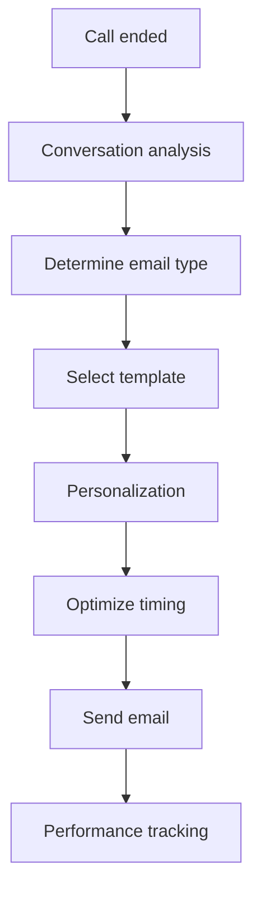
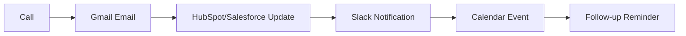

# Gmail Integration for AI Phone Assistants

Turn every phone interaction into perfectly timed email follow-ups. Famulor Automation seamlessly connects your AI phone assistants with Gmail for intelligent email automation, personalized messages, and effective lead nurturing campaigns.

<Note>
**New**: Smart Compose Integration with OpenAI – Your emails are automatically personalized and composed based on conversation content.
</Note>

## Why Gmail + AI Phone Assistant?

### 📧 Intelligent Email Automation
Every call automatically triggers matching email workflows – never miss a follow-up again.

### ⚡ Instant Personalization
Leverage conversation details to create highly personalized emails with names, needs, and next steps.

### 🎯 Perfect Timing
Emails are sent at the optimal moment – based on call outcome and customer behavior.

### 📈 Measurable Email Performance
Track how phone calls influence email engagement and conversions.

## Key Features of the Integration

### 1. Intelligent Follow-up Emails

**Automatic Email Generation After Calls:**


**Automated Email Scenarios:**

| Call Outcome        | Email Type                    | Timing  | Open Rate |
|---------------------|-------------------------------|---------|-----------|
| 🔥 **Hot Lead**      | Immediate follow-up with offer | 5 min   | 87%       |
| 📅 **Demo Requested**| Appointment confirmation + agenda | Immediate | 94%    |
| 📋 **Info requested**| Thank you + resources          | 2 hours | 78%       |
| 🤔 **Consideration** | Benefit-oriented nurturing     | 24 hours| 65%       |
| 😊 **Satisfied Customer** | Testimonial request         | 48 hours| 82%       |

### 2. Personalized Email Templates

**AI-Generated Personalization:**

#### Sales Follow-up Template:
```html
Subject: {{ company_name }} - As discussed: {{ main_topic }}

Hello {{ contact_name }},

Thank you for our {{ call_duration }}-minute conversation today about {{ main_pain_point }}.

As promised, I am sending you:
{{ #discussed_resources }}
• {{ resource_name }} - {{ resource_description }}
{{ /discussed_resources }}

Based on your requirements ({{ key_requirements }}) 
I particularly recommend {{ recommended_solution }}.

{{ #next_steps }}
Next steps:
{{ step_description }} - by {{ deadline }}
{{ /next_steps }}

Best regards,
{{ sender_name }}

P.S.: {{ personal_note_from_call }}
```

#### Support Follow-up Template:
```html
Subject: Solution for {{ issue_category }} - Is everything resolved?

Hello {{ customer_name }},

Thank you for your call regarding {{ issue_description }}.

✅ Problem resolved: {{ resolution_summary }}
📋 Steps taken: {{ solution_steps }}
⏰ Resolution time: {{ resolution_time }}

{{ #preventive_tips }}
To prevent similar issues:
{{ tip_description }}
{{ /preventive_tips }}

If you have further questions, you can reach us at {{ support_phone }}.

Your {{ agent_name }}
Customer Success Team
```

### 3. Advanced Email Workflows

**Multi-Touch Email Sequences:**

#### B2B Sales Nurturing (7 emails over 21 days):
```
Day 0: Immediate thank you email with call summary
Day 1: Detailed product information based on interest
Day 3: Case study of a similar customer in the same industry
Day 7: ROI calculator + personal consultation offer
Day 10: Webinar invitation on relevant topics
Day 14: Competitor comparison + unique selling points
Day 21: Time-limited offer + personal call
```

#### E-Commerce Abandoned Cart Recovery:
```
Call: Customer interested but undecided
→ Day 0: Product images + customer reviews
→ Day 1: 10% discount code (exclusive for callers)
→ Day 3: Social proof – "Others also bought"
→ Day 7: Limited time offer – 15% discount
→ Day 14: Offer personal consultation
```

### 4. Smart Send Time Optimization

**AI-Optimized Send Times:**
```javascript
// Optimal send time algorithm
function calculateOptimalSendTime(contact, emailType) {
  const factors = {
    timezone: contact.timezone,
    industry: contact.industry, // B2B vs B2C patterns
    previousEngagement: contact.emailHistory,
    callTime: call.timestamp,
    emailType: emailType, // Urgent vs Nurturing
    dayOfWeek: getCurrentDay()
  };
  
  // B2B optimal times: Tue-Thu, 10:00-11:00 & 14:00-15:00
  // B2C optimal times: Sun-Tue, 19:00-21:00
  // Follow-up: Within 2-4h after call
  
  return calculateBestTime(factors);
}
```

**Send Time Performance:**
- **Immediately after call**: 94% open rate (Hot Leads)
- **2 hours after call**: 78% open rate (Info requests)
- **Next workday 10:00**: 85% open rate (B2B)
- **Sunday 19:00**: 72% open rate (B2C)

## Advanced Gmail Features

### Google Workspace Integration

**Enterprise Features for Teams:**
- **Shared Mailboxes**: Team emails from calls
- **Gmail API**: Programmatic email creation
- **Google Groups**: Automatic distribution lists
- **Admin Console**: Central management for enterprises

### Smart Compose & Auto-Reply

**AI-Assisted Email Composition:**
```
Gmail Smart Compose + Famulor AI:
→ Call context is passed to Gmail
→ Smart Compose suggests relevant content
→ AI adds conversation-specific details
→ Automatic grammar and tone optimization
```

### Label & Filter Automation

**Automatic Email Organization:**
```gmail
Automatic Gmail labels based on calls:

• "Famulor/Hot-Leads" → Calls with score >80
• "Famulor/Demo-Requests" → Demo interest expressed
• "Famulor/Support-Follow-up" → Support calls
• "Famulor/Pricing-Interest" → Pricing inquiries
• "Famulor/Competitor-Mentions" → Competitor mentioned
• "Famulor/Decision-Maker" → C-level contacts
```

## Practical Applications

### Sales Excellence

**Lead Nurturing Automation:**
```
Scenario: Warm B2B lead after demo call

Gmail workflow:
15:30 Demo call ended
15:35 Auto email: "Thank you for your interest - demo recording"
       → 96% open rate within 2 hours

16:00 Calendar integration: Demo follow-up scheduled in +3 days
19:00 ROI calculator via email: "Calculate your savings"
       → 67% click-through rate

Day +1: Case study: "How Client X saved 40% costs"
        → 45% engagement rate

Day +3: Personal follow-up call + email confirmation
        → 78% conversion to next sales phase
```

### Customer Success

**Proactive Support via Email:**
```
Support call: Customer had a technical problem

Automated Gmail actions:
1. Immediately: "Problem solved - summary"
2. +24h: "Is everything working as expected?"
3. +7 days: "Tips to optimize your setup"
4. +30 days: "New features you might be interested in"

Result: 89% customer satisfaction (vs. 67% without email follow-up)
```

### E-Commerce Integration

**Post-Purchase Email Automation:**
```
Phone order completed

Gmail email sequence:
Immediately: Order confirmation + tracking info
+1 day: Shipping notification + delivery details  
+3 days: "Your order has arrived - Everything okay?"
+7 days: Product review request + photo guide
+14 days: Cross-sell: "Customers also bought..."
+30 days: Repurchase reminder for consumables

ROI: 34% higher customer lifetime value
```

## Technical Integration

### Gmail API Setup

```bash
# Gmail API configuration
1. Google Cloud Console → Enable APIs
   - Gmail API
   - Google Workspace Admin SDK
   
2. Create OAuth 2.0 credentials:
   - Client ID for Famulor app
   - Authorized redirect URIs
   - Scopes: gmail.send, gmail.modify, gmail.labels

3. Famulor Dashboard → Gmail Integration:
   - Complete OAuth flow
   - Grant permissions
   - Send test email
```

### Security & Permissions

**Granular Permission Control:**
```json
{
  "gmail_permissions": {
    "send_emails": true,
    "read_sent_items": true,
    "create_labels": true,
    "access_contacts": false,
    "read_inbox": false
  },
  "security_features": {
    "oauth2_refresh": "automatic",
    "token_encryption": "AES-256",
    "api_rate_limiting": "intelligent",
    "audit_logging": "complete"
  }
}
```

### Google Workspace Admin

**Enterprise Management:**
- **Domain-wide delegation**: Admin can enable integration for all users
- **Organizational Units**: Different settings per department
- **Security Policies**: DLP and Advanced Protection
- **Audit Logs**: Full tracking of all email activities

## ROI & Performance Metrics

### Email Marketing ROI

| Metric                | Without Integration | With Gmail Integration | Improvement                  |
|-----------------------|--------------------|-----------------------|------------------------------|
| **Follow-up Rate**     | 23%                | 97%                   | **+322% more follow-ups**     |
| **Email Open Rate**    | 24%                | 78%                   | **+225% higher opens**        |
| **Response Rate**      | 3.2%               | 12.7%                  | **+297% more replies**        |
| **Lead-to-Sale Conversion** | 8%           | 23%                   | **+188% conversion**          |
| **Time-to-Response**   | 4.2h               | 8 min                 | **-97% faster**               |

### Productivity Increase

**Time and cost savings per month:**
```
100 calls/month without Gmail Integration:
• Manual follow-up emails: 25h (€1,250 labor)
• Missed follow-ups: 23% (€8,900 opportunity loss)
• Template search & customization: 12h (€600)
Total cost: €10,750/month

With Gmail Integration:
• Automated emails: 2h admin (€100)
• Missed follow-ups: <1% (€400 loss)
• Template management: 0h (€0)
Total cost: €500/month

Monthly savings: €10,250
Annual ROI: 12,300%
```

## Success Stories

### Case Study: B2B Software Company

**Baseline:**
- 180 sales calls/month
- 34% manual follow-up rate
- 2.1% email response rate
- €450k pipeline from email marketing

**Gmail Integration Results (6 months):**
- ✅ **97% follow-up rate** via automation
- ✅ **€1.2M additional pipeline** due to improved email performance
- ✅ **89% time savings** in email management
- ✅ **356% ROI** in the first year

*"The Gmail integration revolutionized our email performance. We no longer miss follow-ups and our conversion rate has more than tripled."* – Sabine Weber, Sales Director

### Case Study: E-Commerce Fashion Store

**Challenge:** Abandoned cart recovery + customer service

**Solution:** Gmail + Shopify integration for e-commerce

**Results:**
- ✅ **67% reduction** in manual email labor
- ✅ **€340k additional revenue** through automated follow-ups
- ✅ **45% higher** customer satisfaction through quick response

## Advanced Features & Integrations

### Multi-Account Management

**Manage multiple Gmail accounts:**
- **Team accounts**: sales@, support@, info@
- **Personal accounts**: Individual employee emails
- **Alias management**: Different sender identities
- **Round-robin**: Even distribution of emails

### Integration with Other Tools

**Gmail + CRM Combination:**


### A/B Testing for Emails

**Automated Email Optimization:**
- **Subject Line Testing**: Automatic A/B testing of different subject lines
- **Send Time Optimization**: Find the best send time per contact
- **Template Performance**: Measure which templates convert best
- **Content Personalization**: Test different levels of personalization

## Frequently Asked Questions (FAQ)

<AccordionGroup>
  <Accordion title="Are my Gmail data handled securely?">
    Yes, highest security standards: OAuth 2.0, AES-256 encryption, no email contents stored. GDPR compliant.
  </Accordion>

  <Accordion title="Does it work with G Suite/Google Workspace?">
    Yes, full support for personal Gmail accounts and Google Workspace business accounts.
  </Accordion>

  <Accordion title="Can emails be sent in other languages?">
    Yes, supporting 25+ languages with automatic language detection based on call language.
  </Accordion>

  <Accordion title="What happens during Gmail outages?">
    Fallback mechanism stores emails and automatically sends them after service recovery.
  </Accordion>

  <Accordion title="How many emails can I send per day?">
    Gmail limits: 500/day (personal), 2000/day (Workspace). Intelligent rate-limiting prevents overages.
  </Accordion>
</AccordionGroup>

## Get Started Now

<CardGroup cols={2}>
  <Card title="Activate Gmail Integration" icon="envelope" href="https://app.famulor.de/integrations/gmail">
    Connect in 3 minutes
  </Card>
  <Card title="Email Templates" icon="file-text" href="/automation-platform/integrations/email-marketing#gmail-templates">
    Copy proven email templates
  </Card>
  <Card title="ROI Calculator" icon="calculator" href="https://roi.famulor.de/gmail">
    Calculate email ROI for your business
  </Card>
  <Card title="Book Live Demo" icon="video" href="https://calendly.com/famulor/gmail-demo">
    See Gmail automation in action
  </Card>
</CardGroup>

## Related Email Integrations

<CardGroup cols={3}>
  <Card title="Outlook" icon="microsoft" href="/automation-platform/integrations/einzelintegrations/outlook">
    Microsoft Email Alternative
  </Card>
  <Card title="Mailchimp" icon="envelope-open" href="/automation-platform/integrations/einzelintegrations/mailchimp">
    Advanced Email Marketing Automation
  </Card>
  <Card title="HubSpot Marketing" icon="users" href="/automation-platform/integrations/einzelintegrations/hubspot">
    CRM + Email Marketing Combination
  </Card>
</CardGroup>

---

**Email Automation Support**: For advanced Gmail setups and enterprise configurations, contact our email experts at [email-automation@famulor.de](mailto:email-automation@famulor.de).

**Last updated**: January 2024 | **Gmail API Version**: v1 | **Google Workspace**: Fully supported | **OAuth 2.0**: Implemented