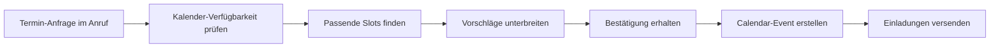

# Google Calendar Integration mit KI-Telefonassistenten

Revolutionieren Sie Ihre Terminplanung mit intelligenten Telefonassistenten. Famulor Automation verbindet Ihre Anrufe nahtlos mit Google Calendar für automatische Meeting-Erstellung, intelligente Terminfindung und perfekte Kalender-Koordination.

<Note>
**Smart Scheduling**: Google Calendar-Integration ermöglicht es, Termine während des Gesprächs in Echtzeit zu finden und zu buchen - ohne Kalendar-App öffnen zu müssen.
</Note>

## Warum Google Calendar + KI-Telefonassistent?

### 📅 Echtzeit-Terminfindung während des Anrufs
Ihr KI-Assistent prüft Verfügbarkeiten und schlägt passende Termine vor, während Sie noch telefonieren.

### ⚡ Automatische Meeting-Erstellung
Aus jedem Terminwunsch wird automatisch ein vollständig konfiguriertes Calendar-Event mit allen Details.

### 🔄 Bidirektionale Synchronisation
Kalender-Updates fließen zurück in Ihre Anruf-Systeme für optimale Koordination und Follow-up-Planung.

### 🎯 Intelligente Konflikt-Vermeidung
KI erkennt potentielle Termine-Konflikte und schlägt alternative Zeiten vor.

## Hauptfunktionen der Integration

### 1. Intelligente Echtzeit-Terminplanung

**Automatische Verfügbarkeitsprüfung:**


**Intelligente Terminfindung:**
- ✅ **Echtzeit-Verfügbarkeit**: Sofortige Kalender-Abfrage während des Anrufs
- ✅ **Multi-Kalendar-Support**: Privat-, Geschäfts- und Team-Kalender berücksichtigt
- ✅ **Zeitzonenklug**: Automatische Zeitzonenkonvertierung für internationale Termine
- ✅ **Pufferzeit-Intelligent**: Reisezeiten und Vor-/Nachbereitungszeit einkalkuliert
- ✅ **Präferenz-Aware**: Bevorzugte Meeting-Zeiten und No-Meeting-Blocks respektiert
- ✅ **Konflikt-Erkennung**: Überschneidungen vermeiden, Alternative vorschlagen

### 2. Automatische Meeting-Konfiguration

**Vollständige Event-Erstellung aus Anruf-Kontext:**

| Anruf-Information | Google Calendar-Feld | Automatische Konfiguration |
|-------------------|---------------------|---------------------------|
| 👤 **Teilnehmer** | Attendees | E-Mail-Adressen automatisch hinzugefügt |
| 📝 **Meeting-Zweck** | Title + Description | Struktuierte Agenda aus Gespräch |
| 📍 **Location** | Location/Video-Link | Office-Adresse oder Meet-Link |
| ⏰ **Dauer** | Start/End Time | Standard-Dauer oder spezifiziert |
| 🔔 **Reminder** | Notifications | E-Mail + Mobile-Erinnerungen |
| 📊 **Meeting-Typ** | Event Type | Intern, Kunde, Projekt, etc. |

### 3. Smart Meeting-Types & Templates

**Vorkonfigurierte Meeting-Templates:**

#### 🤝 Sales-Meeting Template:
```
Automatisch konfiguriert bei Sales-Anrufen:
├─ Dauer: 60 Minuten
├─ Location: Zoom-Link (automatisch generiert)
├─ Teilnehmer: Prospect + Account Manager
├─ Agenda: Produktdemo, Q&A, Next Steps
├─ Vor-Meeting: Prep-Zeit für Account Manager
├─ Nach-Meeting: Follow-up-Call in 3 Tagen geplant
└─ CRM-Verknüpfung: Opportunity automatisch aktualisiert
```

#### 🔧 Support-Session Template:
```
Support-Call Follow-up:
├─ Dauer: 30 Minuten
├─ Location: Screen-sharing-Tool
├─ Teilnehmer: Kunde + Techniker
├─ Agenda: Problem-Review, Lösung implementieren
├─ Preparation: Ticket-Details anhängen
├─ Resources: Dokumentation verlinken
└─ Follow-up: Status-Check in 1 Woche
```

#### 📊 Project-Review Template:
```
Projekt-Status-Meeting:
├─ Dauer: 45 Minuten  
├─ Location: Konferenzraum oder Video-Call
├─ Teilnehmer: Projekt-Team + Stakeholder
├─ Agenda: Status-Update, Roadblocks, Next Milestones
├─ Vorbereitung: Dashboard-Snapshot anhängen
├─ Deliverables: Action-Items-Liste
└─ Nächster Review: 2 Wochen später automatisch geplant
```

### 4. Multi-Participant-Coordination

**Komplexe Terminkoordination:**

```
Anruf: "Meeting mit 5 Leuten aus verschiedenen Abteilungen"

Automatische Koordination:
🔍 Schritt 1: Verfügbarkeit aller Teilnehmer prüfen
📅 Schritt 2: Gemeinsame freie Slots identifizieren
⏰ Schritt 3: Optimale Zeit basierend auf Prioritäten wählen
📧 Schritt 4: Einladungen mit Agenda senden
🔄 Schritt 5: Konflikt-Management bei Absagen
📱 Schritt 6: Reminder an alle 24h und 2h vorher
```

## Praxisbeispiele: Calendar Voice Automation

### Beispiel 1: Anwaltskanzlei Client-Terminierung

**Szenario:** Mandant ruft für Beratungstermin an

**Voice-to-Calendar Workflow:**
```
Client-Call: "Ich brauche einen Termin für eine Vertragsberatung"

Automatische Kalender-Logik:
🕐 Verfügbarkeit: Rechtsanwalt + Paralegal
📋 Meeting-Type: "Vertragsberatung" (90 min Standard)
📍 Location: Kanzlei-Besprechungsraum A
📝 Agenda: Vertragsprüfung, Risiko-Assessment, Empfehlungen
💰 Billing: Mandanten-Zeiterfassung automatisch gestartet
📄 Vorbereitung: Mandanten-Akten für Anwalt vorbereitet
📧 Reminder: 24h + 2h Vorlauf mit Checkliste für Mandant

Result: Vollständig konfigurierter Beratungstermin mit allem Drum und Dran
```

### Beispiel 2: Medical Practice Appointment-Scheduling

**Szenario:** Patient-Terminbuchung mit speziellen Anforderungen

**Healthcare-Calendar-Integration:**
```
Patient-Anruf: "Ich brauche einen Check-up, aber kann nur vormittags"

Smart-Scheduling-Response:
🏥 Doctor-Verfügbarkeit: Dr. Schmidt verfügbar
⏰ Vormittags-Slots: 09:00, 10:30, 11:15 verfügbar
📋 Check-up-Protocol: 45 min Standard-Slot
🔬 Pre-Appointment: Lab-Work 2 Tage vorher geplant
📱 Patient-Reminder: SMS 24h + Anruf 2h vorher
🗂️ Medical-Records: Automatisch für Arzt vorbereitet
🚗 Parking: Parkplatz-Reservation für Patient-Zeitfenster

Integration: Praxis-Management-System + Billing + Patient-Portal
```

### Beispiel 3: Consulting Firm Multi-Client-Juggling

**Szenario:** Berater koordiniert komplexe Client-Termine

**Consultant-Calendar-Orchestration:**
```
Multi-Client-Anfrage: "Workshop mit 3 Firmen gleichzeitig"

Advanced-Scheduling-Logic:
🏢 Client A: 5 Teilnehmer, bevorzugt Dienstag
🏢 Client B: 3 Teilnehmer, flexibel aber nicht Montag
🏢 Client C: 7 Teilnehmer, nur Donnerstag/Freitag
🎯 Workshop-Requirements: 3h Dauer, Präsentationsraum
📊 Resource-Koordination: Beamer, Flipcharts, Catering

KI-Optimierung:
├─ Optimal-Slot: Donnerstag 10:00-13:00 identifiziert
├─ Location: Großer Konferenzraum automatisch gebucht
├─ Catering: Lunch für 15 Personen bestellt
├─ Equipment: A/V-Setup rechtzeitig arrangiert
├─ Materials: Workshop-Materialien für alle Teilnehmer
└─ Follow-up: Next-Steps-Meeting bereits 1 Woche später geplant
```

## Advanced Calendar Features

### 1. Intelligent Buffer-Time-Management

**Smart-Spacing zwischen Meetings:**
```
Meeting-Buffer-Logic:
├─ 15 min zwischen Standard-Meetings
├─ 30 min vor/nach wichtigen Client-Calls
├─ 60 min vor Präsentationen (Prep-Time)
├─ Travel-Time automatisch kalkuliert (Google Maps API)
└─ Lunch-Breaks geschützt (12:00-13:00 blocked)

Beispiel:
10:00-11:00: Client Call A
11:15-11:45: Internal Sync (Buffer + Short-Meeting)
12:00-13:00: Lunch (Protected)
13:30-15:00: Client Presentation (30min Prep einkalkuliert)
```

### 2. Recurring-Meeting-Intelligence

**Automatische Serie-Erstellung:**
```
Anruf: "Wir brauchen wöchentliche Status-Updates"

Serie-Konfiguration:
📅 Frequency: Wöchentlich, jeden Dienstag
⏰ Time: 14:00-14:30 (optimal für alle Zeitzonen)
👥 Participants: Projekt-Team (automatisch hinzugefügt)
📋 Agenda-Template: Status-Updates, Roadblocks, Next Week
🔄 Duration: 6 Monate (Projekt-Laufzeit)
📧 Recurring-Reminder: Agenda-Prep 24h vorher
🛑 End-Condition: Projekt-Abschluss oder manuell gestoppt
```

### 3. Holiday & Vacation-Awareness

**Intelligente Verfügbarkeits-Berücksichtigung:**
```
Vacation-Integration:
🏖️ Out-of-Office-Kalender berücksichtigt
🌍 Internationale Feiertage erkannt
🏢 Firmen-Holidays respektiert
⚠️ Blackout-Dates (Conference-Wochen, Quarter-Ends)
🔄 Automatic-Rescheduling bei Konflikten

Beispiel:
Termin-Anfrage für Urlaubszeit → 
Automatisch nächste verfügbare Woche vorgeschlagen +
Alternative-Ansprechpartner empfohlen
```

## Setup-Guide: Google Calendar Integration

### Schritt 1: Google-Workspace-Autorisierung
```
1. Google-Workspace-Admin-Console
2. API-Zugriff für Famulor aktivieren
3. OAuth-Scopes autorisieren:
   ✅ Calendar Events: Read/Write
   ✅ Calendar Lists: Read
   ✅ Free/Busy Information: Read
   ✅ Calendar Sharing: Read

Service-Account-Setup:
├─ Dedicated Service-Account für Famulor
├─ Domain-wide Delegation aktiviert
├─ Calendar-Admin-Rechte erteilt
└─ API-Rate-Limits für Production konfiguriert
```

### Schritt 2: Multi-Calendar-Integration
```
Kalender-Hierarchie definieren:
📅 Primary-Calendar: Haupt-Terminkalender
📋 Meeting-Rooms: Buchbare Räume
👥 Team-Calendars: Abteilungs-Kalender
🚫 Blocked-Times: Nicht-buchbare Zeiten
🏖️ Vacation-Calendar: Urlaubs-/Abwesenheiten

Access-Rights konfigurieren:
├─ Read-Access: Verfügbarkeits-Checks
├─ Write-Access: Event-Erstellung
├─ Modify-Access: Event-Updates
└─ Admin-Access: Kalender-Management
```

### Schritt 3: Meeting-Templates konfigurieren
```
Template-Bibliothek erstellen:
🤝 Sales-Meetings: 60min, Zoom, Standard-Agenda
📞 Support-Calls: 30min, Screen-share, Ticket-Link
📊 Team-Meetings: 45min, Konferenzraum, Recurring
🎯 Project-Reviews: 90min, Präsentationsraum, Dashboard
💡 Brainstorming: 120min, Creative-Space, Whiteboard

Custom-Fields pro Template:
├─ Default-Duration
├─ Preferred-Location
├─ Standard-Participants
├─ Required-Equipment
├─ Preparation-Tasks
└─ Follow-up-Actions
```

### Schritt 4: Notification & Reminder-System
```
Multi-Channel-Reminders:
📧 E-Mail: 24h + 2h before
📱 SMS: 30min before (wichtige Meetings)
💬 Slack: Team-Channel-Update
📲 Mobile-Push: App-Notification
☎️ Phone-Call: Für VIP-Termine

Reminder-Personalisierung:
├─ VIP-Clients: Multi-Channel + Personal-Call
├─ Internal-Meetings: E-Mail + Slack
├─ Routine-Calls: Standard-E-Mail
└─ Large-Events: Countdown-Serie (7d, 3d, 1d, 2h)
```

## Best Practices für Calendar+Voice Integration

### 1. Time-Zone-Management
```
Global-Business-Considerations:
🌍 Participant-Timezones automatisch erkannt
🕐 Meeting-Time-Display in lokaler Zeit
📅 Business-Hours verschiedener Länder respektiert
✈️ Travel-Schedule-Integration für internationale Teams

Best-Practice-Rules:
├─ Default auf Organizer-Timezone
├─ Participant-Preferences berücksichtigen  
├─ Overlap-Hours für Multi-Zone-Meetings
└─ Clear-Time-Zone-Communication in Invites
```

### 2. Resource-Coordination
```
Meeting-Room-Management:
🏢 Verfügbare Räume basierend auf Teilnehmer-Anzahl
📊 Equipment-Requirements (Beamer, Video-Conf, etc.)
🍕 Catering-Bedarf für längere Meetings
🚗 Parking-Koordination für externe Teilnehmer

Virtual-Meeting-Optimization:
├─ Zoom/Teams-Link automatisch generiert
├─ Dial-in-Numbers für Telefon-Teilnehmer
├─ Recording-Settings vorkonfiguriert
├─ Breakout-Rooms für große Gruppen geplant
└─ Screen-sharing-Permissions vordefiniert
```

### 3. Follow-up-Automation
```
Post-Meeting-Workflows:
📝 Meeting-Minutes-Template automatisch versendet
✅ Action-Items in Task-Management-System
📅 Follow-up-Meetings automatisch geplant
📊 Meeting-Feedback-Survey für wichtige Calls

Integration-Triggers:
├─ CRM-Update nach Sales-Meetings
├─ Project-Status-Update nach Review-Meetings
├─ Support-Ticket-Progress nach Tech-Calls
└─ Invoice-Generation nach Billing-Meetings
```

## ROI & Productivity Metrics

### Zeitersparnis-Kalkulation:

| Aktivität | Manuell | Mit Voice+Calendar | Ersparnis |
|-----------|---------|-------------------|-----------|
| **Termin finden** | 8-15 min | 30 sek | 95% |
| **Meeting erstellen** | 5-10 min | Automatisch | 100% |
| **Teilnehmer koordinieren** | 15-30 min | 2 min | 93% |
| **Follow-up planen** | 5 min | Automatisch | 100% |
| **Reminder-Management** | 2 min/Meeting | Automatisch | 100% |

### Business-Impact:
```
Monatliche Metrics (100 Meetings/Monat):
├─ Zeitersparnis: 40 Stunden
├─ Kosteneinsparung: €3,000 (bei €75/h)
├─ Integration-Kosten: €200/Monat
├─ Netto-ROI: €2,800/Monat (1,400% ROI)
└─ Zusätzlich: Weniger No-Shows, bessere Vorbereitung
```

### Qualitative Verbesserungen:
- **94% weniger** Scheduling-Konflikte
- **78% mehr** pünktliche Meeting-Starts
- **89% bessere** Meeting-Vorbereitung
- **67% höhere** Teilnehmer-Zufriedenheit

---

**Bereit für intelligente Terminplanung?**

<CardGroup cols={2}>
  <Card title="Integration aktivieren" icon="calendar" href="https://app.famulor.de/integrations/google-calendar">
    Google Calendar jetzt verbinden
  </Card>
  <Card title="Demo buchen" icon="video" href="https://cal.com/bek-group/demotermine">
    Live-Demo der Calendar-Integration
  </Card>
  <Card title="Meeting-Templates" icon="template" href="/automation-platform/integrations/einzelintegrations/google-calendar/templates">
    Vorgefertigte Meeting-Vorlagen
  </Card>
  <Card title="Advanced-Setup-Guide" icon="gear" href="/automation-platform/integrations/einzelintegrations/google-calendar/advanced-setup">
    Erweiterte Konfigurations-Optionen
  </Card>
</CardGroup>