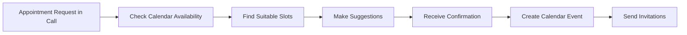

# Google Calendar Integration with AI Phone Assistants

Revolutionize your appointment scheduling with intelligent phone assistants. Famulor Automation seamlessly connects your calls with Google Calendar for automatic meeting creation, smart appointment finding, and perfect calendar coordination.

<Note>
**Smart Scheduling**: Google Calendar integration allows you to find and book appointments in real-time during the call — without needing to open a calendar app.
</Note>

## Why Google Calendar + AI Phone Assistant?

### 📅 Real-Time Appointment Finding During Calls  
Your AI assistant checks availabilities and suggests suitable time slots while you’re still on the phone.

### ⚡ Automatic Meeting Creation  
Every appointment request is automatically turned into a fully configured calendar event with all details.

### 🔄 Bidirectional Synchronization  
Calendar updates flow back into your calling systems for optimal coordination and follow-up planning.

### 🎯 Intelligent Conflict Avoidance  
AI detects potential scheduling conflicts and proposes alternative times.

## Key Features of the Integration

### 1. Intelligent Real-Time Appointment Scheduling

**Automatic Availability Check:**  

```mermaid
graph LR
    A[Appointment Request in Call] --> B[Check Calendar Availability]
    B --> C[Find Suitable Slots]
    C --> D[Make Suggestions]
    D --> E[Receive Confirmation]
    E --> F[Create Calendar Event]
    F --> G[Send Invitations]
```

**Smart Appointment Finding:**  
- ✅ **Real-Time Availability**: Instant calendar query during the call  
- ✅ **Multi-Calendar Support**: Includes personal, business, and team calendars  
- ✅ **Timezone Smart**: Automatic timezone conversion for international appointments  
- ✅ **Buffer-Time Intelligent**: Travel and prep time factored in  
- ✅ **Preference-Aware**: Respects preferred meeting times and no-meeting blocks  
- ✅ **Conflict Detection**: Avoids overlaps and suggests alternatives

### 2. Automatic Meeting Configuration

**Complete event creation from call context:**

| Call Information         | Google Calendar Field | Automatic Configuration                      |
|-------------------------|-----------------------|----------------------------------------------|
| 👤 **Participants**       | Attendees             | Email addresses automatically added          |
| 📝 **Meeting Purpose**    | Title + Description   | Structured agenda extracted from conversation |
| 📍 **Location**           | Location/Video Link   | Office address or Meet link                    |
| ⏰ **Duration**            | Start/End Time        | Standard duration or specified                  |
| 🔔 **Reminder**            | Notifications         | Email + mobile reminders                        |
| 📊 **Meeting Type**       | Event Type            | Internal, client, project, etc.                 |

### 3. Smart Meeting Types & Templates

**Pre-configured meeting templates:**

#### 🤝 Sales Meeting Template:  
```
Automatically configured for sales calls:
├─ Duration: 60 minutes
├─ Location: Zoom link (auto-generated)
├─ Participants: Prospect + Account Manager
├─ Agenda: Product demo, Q&A, next steps
├─ Pre-Meeting: Prep time for account manager
├─ Post-Meeting: Follow-up call scheduled in 3 days
└─ CRM integration: Opportunity automatically updated
```

#### 🔧 Support Session Template:  
```
Support call follow-up:
├─ Duration: 30 minutes
├─ Location: Screen-sharing tool
├─ Participants: Customer + Technician
├─ Agenda: Issue review, implement solution
├─ Preparation: Attach ticket details
├─ Resources: Link documentation
└─ Follow-up: Status check in 1 week
```

#### 📊 Project Review Template:  
```
Project status meeting:
├─ Duration: 45 minutes  
├─ Location: Conference room or video call
├─ Participants: Project team + stakeholders
├─ Agenda: Status update, roadblocks, next milestones
├─ Preparation: Attach dashboard snapshot
├─ Deliverables: Action items list
└─ Next review: Automatically scheduled 2 weeks later
```

### 4. Multi-Participant Coordination

**Complex appointment coordination:**

```
Call: "Meeting with 5 people from different departments"

Automatic coordination:
🔍 Step 1: Check availability of all participants
📅 Step 2: Identify common free slots
⏰ Step 3: Choose optimal time based on priorities
📧 Step 4: Send invitations with agenda
🔄 Step 5: Conflict management on cancellations
📱 Step 6: Reminders sent to everyone 24h and 2h before
```

## Use Cases: Calendar Voice Automation

### Example 1: Law Firm Client Appointment Scheduling

**Scenario:** Client calls for a consultation appointment

**Voice-to-Calendar Workflow:**

```
Client call: "I need an appointment for contract consultation"

Automatic calendar logic:  
🕐 Availability: Lawyer + paralegal  
📋 Meeting type: "Contract Consultation" (standard 90 min)  
📍 Location: Law firm meeting room A  
📝 Agenda: Contract review, risk assessment, recommendations  
💰 Billing: Client time tracking started automatically  
📄 Preparation: Client files prepared for lawyer  
📧 Reminder: 24h + 2h prior with checklist for client

Result: Fully configured consultation appointment with all details
```

### Example 2: Medical Practice Appointment Scheduling

**Scenario:** Patient books appointment with special requirements

**Healthcare Calendar Integration:**

```
Patient call: "I need a check-up but can only do mornings"

Smart scheduling response:  
🏥 Doctor availability: Dr. Schmidt available  
⏰ Morning slots: 09:00, 10:30, 11:15 available  
📋 Check-up protocol: 45 min standard slot  
🔬 Pre-appointment: Lab work planned 2 days prior  
📱 Patient reminder: SMS 24h + call 2h ahead  
🗂️ Medical records: Automatically prepared for doctor  
🚗 Parking: Reserved for patient time slot

Integration: Practice management system + billing + patient portal
```

### Example 3: Consulting Firm Multi-Client Scheduling

**Scenario:** Consultant coordinates complex client appointments

**Consultant Calendar Orchestration:**

```
Multi-client request: "Workshop with 3 companies at the same time"

Advanced scheduling logic:  
🏢 Client A: 5 participants, prefers Tuesday  
🏢 Client B: 3 participants, flexible but not Monday  
🏢 Client C: 7 participants, only Thursday/Friday  
🎯 Workshop requirements: 3h duration, presentation room  
📊 Resource coordination: Projector, flipcharts, catering

AI optimization:  
├─ Optimal slot: Thursday 10:00-13:00 identified  
├─ Location: Large conference room auto-booked  
├─ Catering: Lunch ordered for 15 people  
├─ Equipment: AV setup arranged on time  
├─ Materials: Workshop materials prepared for all  
└─ Follow-up: Next steps meeting planned 1 week later
```

## Advanced Calendar Features

### 1. Intelligent Buffer Time Management

**Smart spacing between meetings:**

```
Meeting buffer logic:  
├─ 15 minutes between standard meetings  
├─ 30 minutes before/after important client calls  
├─ 60 minutes before presentations (prep time)  
├─ Travel time automatically calculated (Google Maps API)  
└─ Lunch breaks protected (12:00-13:00 blocked)

Example:  
10:00-11:00: Client Call A  
11:15-11:45: Internal sync (buffer + short meeting)  
12:00-13:00: Lunch (protected)  
13:30-15:00: Client presentation (includes 30min prep)
```

### 2. Recurring Meeting Intelligence

**Automatic series creation:**

```
Call: "We need weekly status updates"

Series configuration:  
📅 Frequency: Weekly, every Tuesday  
⏰ Time: 14:00-14:30 (optimal for all time zones)  
👥 Participants: Project team (auto-added)  
📋 Agenda template: Status updates, roadblocks, next week  
🔄 Duration: 6 months (project lifespan)  
📧 Recurring reminder: Agenda prep 24h prior  
🛑 End condition: Project closure or manual stop
```

### 3. Holiday & Vacation Awareness

**Intelligent availability consideration:**

```
Vacation integration:  
🏖️ Out-of-office calendars taken into account  
🌍 International holidays recognized  
🏢 Company holidays respected  
⚠️ Blackout dates (conference weeks, quarter ends)  
🔄 Automatic rescheduling on conflicts

Example:  
Appointment request during vacation →  
Automatically suggests next available week + alternative contacts recommended
```

## Setup Guide: Google Calendar Integration

### Step 1: Google Workspace Authorization

```
1. Google Workspace Admin Console  
2. Enable API access for Famulor  
3. Authorize OAuth scopes:  
   ✅ Calendar Events: Read/Write  
   ✅ Calendar Lists: Read  
   ✅ Free/Busy Information: Read  
   ✅ Calendar Sharing: Read

Service account setup:  
├─ Dedicated service account for Famulor  
├─ Domain-wide delegation enabled  
├─ Calendar admin rights granted  
└─ API rate limits configured for production
```

### Step 2: Multi-Calendar Integration

```
Define calendar hierarchy:  
📅 Primary calendar: main appointment calendar  
📋 Meeting rooms: bookable rooms  
👥 Team calendars: departmental calendars  
🚫 Blocked times: unavailable times  
🏖️ Vacation calendar: holidays/absences

Configure access rights:  
├─ Read access: availability checks  
├─ Write access: event creation  
├─ Modify access: event updates  
└─ Admin access: calendar management
```

### Step 3: Configure Meeting Templates

```
Create template library:  
🤝 Sales meetings: 60min, Zoom, standard agenda  
📞 Support calls: 30min, screen-share, ticket link  
📊 Team meetings: 45min, conference room, recurring  
🎯 Project reviews: 90min, presentation room, dashboard  
💡 Brainstorming: 120min, creative space, whiteboard

Custom fields per template:  
├─ Default duration  
├─ Preferred location  
├─ Standard participants  
├─ Required equipment  
├─ Preparation tasks  
└─ Follow-up actions
```

### Step 4: Notification & Reminder System

```
Multi-channel reminders:  
📧 Email: 24h + 2h before  
📱 SMS: 30min before (for important meetings)  
💬 Slack: team channel updates  
📲 Mobile push: app notifications  
☎️ Phone call: for VIP appointments

Reminder personalization:  
├─ VIP clients: multi-channel + personal call  
├─ Internal meetings: email + Slack  
├─ Routine calls: standard email  
└─ Large events: countdown series (7d, 3d, 1d, 2h)
```

## Best Practices for Calendar + Voice Integration

### 1. Time Zone Management

```
Global business considerations:  
🌍 Participant time zones automatically detected  
🕐 Meeting time displayed in local time  
📅 Business hours for different countries respected  
✈️ Travel schedule integration for international teams

Best practice rules:  
├─ Default to organizer timezone  
├─ Consider participant preferences  
├─ Overlap hours for multi-zone meetings  
└─ Clear timezone communication in invites
```

### 2. Resource Coordination

```
Meeting room management:  
🏢 Available rooms based on participant count  
📊 Equipment needs (projector, video conf, etc.)  
🍕 Catering needs for longer meetings  
🚗 Parking coordination for external participants

Virtual meeting optimization:  
├─ Zoom/Teams links automatically generated  
├─ Dial-in numbers for phone participants  
├─ Recording settings preconfigured  
├─ Breakout rooms planned for large groups  
└─ Screen sharing permissions predefined
```

### 3. Follow-Up Automation

```
Post-meeting workflows:  
📝 Meeting minutes template automatically sent  
✅ Action items added to task management system  
📅 Follow-up meetings automatically scheduled  
📊 Meeting feedback survey for important calls

Integration triggers:  
├─ CRM updates after sales meetings  
├─ Project status updates after review meetings  
├─ Support ticket progress after tech calls  
└─ Invoice generation after billing meetings
```

## ROI & Productivity Metrics

### Time Savings Calculation:

| Activity                  | Manual         | With Voice+Calendar | Savings  |
|---------------------------|----------------|---------------------|----------|
| **Find appointment**      | 8-15 min       | 30 sec              | 95%      |
| **Create meeting**        | 5-10 min       | Automatic           | 100%     |
| **Coordinate participants**| 15-30 min      | 2 min               | 93%      |
| **Schedule follow-up**    | 5 min          | Automatic           | 100%     |
| **Reminder management**   | 2 min/meeting  | Automatic           | 100%     |

### Business Impact:

```
Monthly metrics (100 meetings/month):  
├─ Time saved: 40 hours  
├─ Cost savings: €3,000 (at €75/h)  
├─ Integration costs: €200/month  
├─ Net ROI: €2,800/month (1,400% ROI)  
└─ Additional: fewer no-shows, better preparation
```

### Qualitative Improvements:  
- **94% fewer** scheduling conflicts  
- **78% more** on-time meeting starts  
- **89% better** meeting preparation  
- **67% higher** participant satisfaction

---

**Ready for smart appointment scheduling?**

<CardGroup cols={2}>
  <Card title="Activate Integration" icon="calendar" href="https://app.famulor.de/integrations/google-calendar">
    Connect Google Calendar now
  </Card>
  <Card title="Book a Demo" icon="video" href="https://cal.com/bek-group/demotermine">
    Live demo of the calendar integration
  </Card>
  <Card title="Meeting Templates" icon="template" href="/automation-platform/integrations/einzelintegrations/google-calendar/templates">
    Pre-made meeting templates
  </Card>
  <Card title="Advanced Setup Guide" icon="gear" href="/automation-platform/integrations/einzelintegrations/google-calendar/advanced-setup">
    Advanced configuration options
  </Card>
</CardGroup>