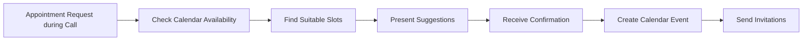

# Google Calendar Integration with AI Phone Assistants

Revolutionize your appointment scheduling with intelligent phone assistants. Famulor Automation seamlessly links your calls with Google Calendar for automatic meeting creation, smart appointment finding, and perfect calendar coordination.

<Note>
**Smart Scheduling**: The Google Calendar integration allows you to find and book appointments in real time during a call — no need to open your calendar app.
</Note>

## Why Google Calendar + AI Phone Assistant?

### 📅 Real-time Appointment Finding During the Call
Your AI assistant checks availabilities and suggests suitable appointment times while you are still on the phone.

### ⚡ Automatic Meeting Creation
Every appointment request is automatically turned into a fully configured calendar event with all the details.

### 🔄 Bidirectional Synchronization
Calendar updates flow back into your call systems for optimal coordination and follow-up planning.

### 🎯 Intelligent Conflict Avoidance
AI detects potential appointment conflicts and proposes alternative times.

## Main Features of the Integration

### 1. Intelligent Real-Time Appointment Scheduling

**Automatic Availability Checking:**

```mermaid
graph LR
    A[Appointment Request during Call] --> B[Check Calendar Availability]
    B --> C[Find Suitable Slots]
    C --> D[Present Suggestions]
    D --> E[Receive Confirmation]
    E --> F[Create Calendar Event]
    F --> G[Send Invitations]
```

**Smart Appointment Finding:**
- ✅ **Real-time availability**: Immediate calendar query during the call  
- ✅ **Multi-calendar support**: Accounts for personal, business, and team calendars  
- ✅ **Timezone smart**: Automatic timezone conversion for international appointments  
- ✅ **Intelligent buffer times**: Includes travel and prep/post time  
- ✅ **Preference-aware**: Respects preferred meeting times and no-meeting blocks  
- ✅ **Conflict detection**: Avoids overlaps and suggests alternatives  

### 2. Automatic Meeting Configuration

**Complete Event Creation from Call Context:**

| Call Information   | Google Calendar Field | Automatic Configuration                  |
|--------------------|-----------------------|----------------------------------------|
| 👤 **Participants** | Attendees             | Email addresses added automatically     |
| 📝 **Meeting Purpose** | Title + Description   | Structured agenda from conversation     |
| 📍 **Location**     | Location/Video Link   | Office address or Meet link             |
| ⏰ **Duration**     | Start/End Time        | Standard duration or specified          |
| 🔔 **Reminder**     | Notifications         | Email + mobile reminders                 |
| 📊 **Meeting Type** | Event Type            | Internal, client, project, etc.          |

### 3. Smart Meeting Types & Templates

**Preconfigured Meeting Templates:**

#### 🤝 Sales Meeting Template:
```
Automatically configured for sales calls:
├─ Duration: 60 minutes
├─ Location: Zoom link (auto-generated)
├─ Participants: Prospect + Account Manager
├─ Agenda: Product demo, Q&A, next steps
├─ Pre-meeting: Prep time for account manager
├─ Post-meeting: Follow-up call scheduled in 3 days
└─ CRM Link: Opportunity automatically updated
```

#### 🔧 Support Session Template:
```
Support call follow-up:
├─ Duration: 30 minutes
├─ Location: Screen sharing tool
├─ Participants: Client + technician
├─ Agenda: Problem review, solution implementation
├─ Preparation: Attach ticket details
├─ Resources: Link documentation
└─ Follow-up: Status check in 1 week
```

#### 📊 Project Review Template:
```
Project status meeting:
├─ Duration: 45 minutes  
├─ Location: Conference room or video call
├─ Participants: Project team + stakeholders
├─ Agenda: Status update, roadblocks, next milestones
├─ Preparation: Attach dashboard snapshot
├─ Deliverables: Action items list
└─ Next review: Automatically scheduled 2 weeks later
```

### 4. Multi-Participant Coordination

**Complex Appointment Coordination:**

```
Call: "Meeting with 5 people from different departments"

Automatic coordination:
🔍 Step 1: Check availability of all participants
📅 Step 2: Identify common free slots
⏰ Step 3: Choose optimal time based on priorities
📧 Step 4: Send invitations with agenda
🔄 Step 5: Manage conflicts in case of cancellations
📱 Step 6: Remind all 24h and 2h before
```

## Practical Examples: Calendar Voice Automation

### Example 1: Law Firm Client Scheduling

**Scenario:** Client calls for a consultation appointment

**Voice-to-Calendar Workflow:**
```
Client call: "I need an appointment for contract consultation"

Automatic calendar logic:
🕐 Availability: Lawyer + paralegal
📋 Meeting type: "Contract consultation" (standard 90 min)
📍 Location: Law firm meeting room A
📝 Agenda: Contract review, risk assessment, recommendations
💰 Billing: Client time tracking automatically started
📄 Preparation: Client files prepared for lawyer
📧 Reminder: 24h + 2h notice with checklist for client

Result: Fully configured consultation appointment with everything included
```

### Example 2: Medical Practice Appointment Scheduling

**Scenario:** Patient books appointment with special requirements

**Healthcare Calendar Integration:**
```
Patient call: "I need a check-up, but can only do mornings"

Smart scheduling response:
🏥 Doctor availability: Dr. Schmidt available
⏰ Morning slots: 09:00, 10:30, 11:15 available
📋 Check-up protocol: 45-minute standard slot
🔬 Pre-appointment: Lab work planned 2 days before
📱 Patient reminder: SMS 24h + call 2h ahead
🗂️ Medical records: Automatically prepared for doctor
🚗 Parking: Reserved parking for patient time slot

Integration: Practice management system + billing + patient portal
```

### Example 3: Consulting Firm Multi-Client Coordination

**Scenario:** Consultant coordinates complex client appointments

**Consultant Calendar Orchestration:**
```
Multi-client request: "Workshop with 3 companies at the same time"

Advanced scheduling logic:
🏢 Client A: 5 participants, prefers Tuesday
🏢 Client B: 3 participants, flexible but not Monday
🏢 Client C: 7 participants, only Thursday/Friday
🎯 Workshop requirements: 3h duration, presentation room
📊 Resource coordination: Projector, flipcharts, catering

AI Optimization:
├─ Optimal slot: Thursday 10:00-13:00 identified
├─ Location: Large conference room auto-booked
├─ Catering: Lunch ordered for 15 people
├─ Equipment: A/V setup arranged on time
├─ Materials: Workshop materials for all participants
└─ Follow-up: Next steps meeting scheduled 1 week later
```

## Advanced Calendar Features

### 1. Intelligent Buffer Time Management

**Smart spacing between meetings:**
```
Meeting buffer logic:
├─ 15 minutes between standard meetings
├─ 30 minutes before/after important client calls
├─ 60 minutes before presentations (prep time)
├─ Travel time automatically calculated (Google Maps API)
└─ Lunch breaks protected (12:00-13:00 blocked)

Example:
10:00-11:00: Client Call A
11:15-11:45: Internal Sync (buffer + short meeting)
12:00-13:00: Lunch (protected)
13:30-15:00: Client Presentation (includes 30 min prep)
```

### 2. Recurring Meeting Intelligence

**Automatic series creation:**
```
Call: "We need weekly status updates"

Series configuration:
📅 Frequency: Weekly, every Tuesday
⏰ Time: 14:00-14:30 (optimal for all time zones)
👥 Participants: Project team (added automatically)
📋 Agenda template: Status updates, roadblocks, next week
🔄 Duration: 6 months (project timespan)
📧 Recurring reminder: Agenda prep 24h before
🛑 End condition: Project completion or manual stop
```

### 3. Holiday & Vacation Awareness

**Intelligent availability consideration:**
```
Vacation integration:
🏖️ Out-of-office calendars taken into account
🌍 International holidays detected
🏢 Company holidays respected
⚠️ Blackout dates (conference weeks, quarter ends)
🔄 Automatic rescheduling upon conflicts

Example:
Appointment request during vacation → 
Automatically suggests next available week +
Alternative contacts recommended
```

## Setup Guide: Google Calendar Integration

### Step 1: Google Workspace Authorization
```
1. Google Workspace Admin Console
2. Enable API access for Famulor
3. Authorize OAuth scopes:
   ✅ Calendar Events: Read/Write
   ✅ Calendar Lists: Read
   ✅ Free/Busy Information: Read
   ✅ Calendar Sharing: Read

Service account setup:
├─ Dedicated service account for Famulor
├─ Domain-wide delegation enabled
├─ Calendar admin rights granted
└─ API rate limits configured for production
```

### Step 2: Multi-Calendar Integration
```
Define calendar hierarchy:
📅 Primary calendar: Main appointment calendar
📋 Meeting rooms: Bookable rooms
👥 Team calendars: Department calendars
🚫 Blocked times: Non-bookable slots
🏖️ Vacation calendar: Holidays/out-of-office

Configure access rights:
├─ Read access: Availability checks
├─ Write access: Event creation
├─ Modify access: Event updates
└─ Admin access: Calendar management
```

### Step 3: Configure Meeting Templates
```
Create template library:
🤝 Sales meetings: 60 min, Zoom, standard agenda
📞 Support calls: 30 min, screen-share, ticket link
📊 Team meetings: 45 min, conference room, recurring
🎯 Project reviews: 90 min, presentation room, dashboard
💡 Brainstorming: 120 min, creative space, whiteboard

Custom fields per template:
├─ Default duration
├─ Preferred location
├─ Standard participants
├─ Required equipment
├─ Preparation tasks
└─ Follow-up actions
```

### Step 4: Notification & Reminder System
```
Multi-channel reminders:
📧 Email: 24h + 2h before
📱 SMS: 30 min before (important meetings)
💬 Slack: Team channel updates
📲 Mobile push: App notifications
☎️ Phone call: For VIP appointments

Reminder personalization:
├─ VIP clients: Multi-channel + personal call
├─ Internal meetings: Email + Slack
├─ Routine calls: Standard email
└─ Large events: Countdown series (7d, 3d, 1d, 2h)
```

## Best Practices for Calendar + Voice Integration

### 1. Time Zone Management
```
Global business considerations:
🌍 Participant time zones auto-detected
🕐 Meeting times displayed in local time
📅 Business hours respected across countries
✈️ Travel schedules integrated for international teams

Best practice rules:
├─ Default to organizer’s time zone
├─ Consider participant preferences  
├─ Overlap hours for multi-zone meetings
└─ Clear time zone communication in invites
```

### 2. Resource Coordination
```
Meeting room management:
🏢 Available rooms based on participant count
📊 Equipment needs (projector, video conf, etc.)
🍕 Catering ordered for long meetings
🚗 Parking coordination for external attendees

Virtual meeting optimization:
├─ Zoom/Teams links auto-generated
├─ Dial-in numbers for phone participants
├─ Recording settings preconfigured
├─ Breakout rooms planned for large groups
└─ Screen sharing permissions predefined
```

### 3. Follow-up Automation
```
Post-meeting workflows:
📝 Meeting minutes template sent automatically
✅ Action items added to task management system
📅 Follow-up meetings scheduled automatically
📊 Meeting feedback surveys for key calls

Integration triggers:
├─ CRM update after sales meetings
├─ Project status update after review meetings
├─ Support ticket progress after tech calls
└─ Invoice generation after billing meetings
```

## ROI & Productivity Metrics

### Time Savings Calculation:

| Activity                 | Manual          | With Voice+Calendar    | Savings      |
|--------------------------|-----------------|-----------------------|--------------|
| **Find appointment time** | 8-15 minutes    | 30 seconds            | 95%          |
| **Create meeting**        | 5-10 minutes    | Automatic             | 100%         |
| **Coordinate participants** | 15-30 minutes | 2 minutes             | 93%          |
| **Plan follow-up**        | 5 minutes      | Automatic             | 100%         |
| **Manage reminders**      | 2 minutes/meeting | Automatic            | 100%         |

### Business Impact:
```
Monthly metrics (100 meetings/month):
├─ Time saved: 40 hours
├─ Cost savings: €3,000 (at €75/hr)
├─ Integration cost: €200/month
├─ Net ROI: €2,800/month (1,400% ROI)
└─ Additional: Fewer no-shows, better preparation
```

### Qualitative Improvements:
- **94% fewer** scheduling conflicts  
- **78% more** on-time meeting starts  
- **89% better** meeting preparation  
- **67% higher** participant satisfaction  

---

**Ready for intelligent appointment scheduling?**

<CardGroup cols={2}>
  <Card title="Activate Integration" icon="calendar" href="https://app.famulor.de/integrations/google-calendar">
    Connect Google Calendar now
  </Card>
  <Card title="Book a Demo" icon="video" href="https://cal.com/bek-group/demotermine">
    Live demo of the calendar integration
  </Card>
  <Card title="Meeting Templates" icon="template" href="/automation-platform/integrations/einzelintegrations/google-calendar/templates">
    Pre-made meeting templates
  </Card>
  <Card title="Advanced Setup Guide" icon="gear" href="/automation-platform/integrations/einzelintegrations/google-calendar/advanced-setup">
    Advanced configuration options
  </Card>
</CardGroup>