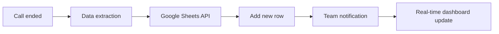
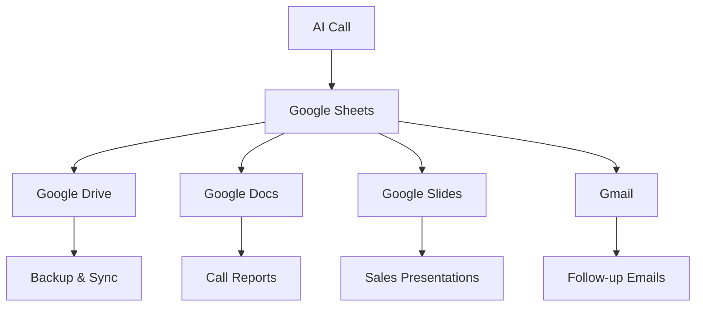

# Google Sheets Integration for AI Phone Assistants

Transform every phone interaction into structured, analyzable data. Famulor Automation seamlessly connects your AI phone assistants with Google Sheets for automatic call logging, intelligent lead tracking, and insightful performance analytics.

<Note>
**New**: Real-time Collaboration – Your team sees call data instantly in shared Google Sheets with automatic notifications.
</Note>

## Why Google Sheets + AI Phone Assistant?

### 📊 Automated Data Management
Every call is automatically recorded as a structured row in your spreadsheets – no more manual logging.

### 🔄 Real-time Collaboration
Your team works with live data – updates appear instantly in all shared sheets.

### 📈 Immediate Analysis Capabilities  
Harness the power of Google Sheets for pivot tables, charts, and advanced data analysis.

### 💡 No-Code Flexibility
No technical skills required – work with familiar spreadsheet features.

## Key Features of the Integration

### 1. Intelligent Call Logging

**Automatic data capture after each call:**


**Standard Call Log Structure:**
| Column          | Content                    | Automatically Captured |
|-----------------|----------------------------|-----------------------|
| **Date/Time**   | 2024-01-15 14:30:25        | ✅                     |
| **Caller Name** | Max Mustermann              | ✅                     |
| **Phone Number**| +49 30 12345678             | ✅                     |
| **Company**     | TechCorp GmbH               | ✅                     |
| **Call Duration**| 00:12:34                  | ✅                     |
| **Call Topic**  | Product demo interest       | ✅                     |
| **Lead Score**  | 87/100                     | ✅                     |
| **Sentiment**   | Very positive              | ✅                     |
| **Next Steps**  | Demo scheduled for 18.01.   | ✅                     |
| **Budget Mentioned** | €25,000+               | ✅                     |
| **Responsible Rep** | Sarah Weber             | ✅                     |

### 2. Lead Tracking Dashboard

**Automatic lead management within Sheets:**

#### Master Lead Sheet:
```
Sheet: "Lead Dashboard 2024"
═══════════════════════════════════════════════════════════════
| Status    | Lead Name      | Score | Last Call | Next Action  |
|-----------|----------------|-------|-----------|--------------|
| 🔥 Hot     | TechCorp AG    | 92    | Today     | Book demo    |
| 🌡️ Warm    | StartupXY      | 67    | Yesterday | Follow-up    |
| ❄️ Cold     | BigCorp Inc    | 34    | 3 days ago| Nurturing    |
| ✅ Won      | InnovateLtd    | 95    | 1 week ago| Onboarding   |
| ❌ Lost     | OldTech GmbH   | 23    | 2 weeks ago| Archived    |
```

#### Automatic Formulas:
```excel
// Lead Score Calculation
=IF(G2>80,"🔥 Hot",IF(G2>50,"🌡️ Warm","❄️ Cold"))

// Days since last call
=TODAY()-C2

// Follow-up Reminder
=IF(H2>3,"⚠️ Follow-up overdue","✅ OK")

// Pipeline Value
=SUMIF(A:A,"🔥 Hot",I:I)
```

### 3. Performance Analytics

**Automatic KPI calculation:**

#### Sales Performance Sheet:
```
Daily Call Performance - Week 3/2024
═══════════════════════════════════════════════════════════
Metric              | Today  | This Week | Target  | Status
Total Calls         | 23     | 127       | 150     | 85% 📈
Hot Leads           | 7      | 34        | 40      | 85% 📈
Conversion Rate     | 30.4%  | 26.8%     | 25%     | ✅ 107%
Avg Call Duration   | 8:45   | 9:12      | 8:00    | ⚠️ 115%
Pipeline Generated  | €67k   | €340k     | €300k   | ✅ 113%
```

#### Team Leaderboard:
```
Sales Rep Performance - January 2024
═══════════════════════════════════════════════════════════
Rep Name        | Calls | Hot Leads | Conversion | Pipeline
Sarah Weber     | 89    | 23        | 34.5%      | €156k
Klaus Mueller   | 76    | 18        | 28.9%      | €134k
Anna Schmidt    | 67    | 15        | 31.2%      | €98k
Max Weber       | 54    | 12        | 25.0%      | €89k
```

### 4. Advanced Data Analysis

**Pivot tables for call intelligence:**

#### Industry Performance:
```
Industry Analysis Q1 2024
═══════════════════════════════════════════════════════════
Industry          | Calls | Avg Score | Win Rate | Avg Deal
Software/SaaS     | 167   | 73        | 34%      | €78k
Manufacturing     | 89    | 67        | 28%      | €156k
Healthcare        | 76    | 71        | 31%      | €234k
Financial Serv.   | 54    | 69        | 29%      | €198k
E-Commerce        | 134   | 65        | 26%      | €45k
```

#### Time-Based Analysis:
```excel
// Best call times
=COUNTIFS(Time,">=9:00",Time,"<10:00",Lead_Score,">70") // 9-10am: 23 Hot Leads
=COUNTIFS(Time,">=10:00",Time,"<11:00",Lead_Score,">70") // 10-11am: 34 Hot Leads ⭐
=COUNTIFS(Time,">=14:00",Time,"<15:00",Lead_Score,">70") // 2-3pm: 28 Hot Leads
=COUNTIFS(Time,">=15:00",Time,"<16:00",Lead_Score,">70") // 3-4pm: 19 Hot Leads
```

## Practical Applications

### Sales Team Management

**Daily Sales Standup Dashboard:**
```
Sales Dashboard - Live Updates
═══════════════════════════════════════════════════════════
🎯 TODAY (15.01.2024)
   Calls: 23/30 (77%)
   Hot Leads: 7 (🔥 Sarah: 3, Klaus: 2, Anna: 2)
   Pipeline: €67.5k (+€12k since yesterday)

📈 THIS WEEK
   Trend: +15% vs. last week
   Top Performer: Sarah Weber (€34k pipeline)
   Needs Coaching: Max Weber (18% conversion)

⚠️ FOLLOW-UPS TODAY
   TechCorp AG - Demo at 14:00 (Sarah)
   StartupXY - Send price quote (Klaus)
   InnovateLtd - Contract review (Anna)
```

### Marketing Attribution

**Campaign Performance Tracking:**
```
Marketing Campaign ROI - Google Ads
═══════════════════════════════════════════════════════════
Campaign         | Calls | Cost   | Hot Leads | Revenue  | ROI
"AI Automation"  | 67    | €2.3k  | 23        | €156k    | 6,678%
"CRM Integration"| 45    | €1.8k  | 15        | €89k     | 4,944%
"Sales Tools"    | 34    | €1.2k  | 12        | €67k     | 5,583%
"Enterprise"     | 23    | €3.1k  | 8         | €234k    | 7,548%

Automatic Formula: =(Revenue - Cost)/Cost*100
```

### Customer Success Tracking

**Support Performance Analytics:**
```
Customer Success Metrics
═══════════════════════════════════════════════════════════
Metric                    | Value   | Target | Status
Avg Resolution Time       | 4.2h    | 4h     | ⚠️ 105%
First Call Resolution     | 89%     | 85%    | ✅ 105%
Customer Satisfaction     | 4.7/5   | 4.5/5  | ✅ 104%
Escalation Rate           | 6%      | 8%     | ✅ 75%
Churn Prevention Calls    | 12      | 15     | 80%

Top Issues (automatically categorized):
1. Login Problems: 34%
2. Billing Questions: 23%
3. Feature Requests: 18%
4. Integration Help: 15%
5. Bug Reports: 10%
```

## Advanced Google Sheets Features

### Automatic Charts & Visualization

**Live charts from call data:**
```javascript
// Automatic chart update via Google Apps Script
function updateCallCharts() {
  const sheet = SpreadsheetApp.getActiveSheet();
  const data = sheet.getRange("A:K").getValues();
  
  // Daily Calls Trend Chart
  const chart1 = sheet.newChart()
    .setChartType(Charts.ChartType.LINE)
    .addRange(sheet.getRange("A:B"))
    .setPosition(1, 13, 0, 0)
    .setOption('title', 'Daily Call Volume Trend')
    .build();
  
  // Lead Score Distribution
  const chart2 = sheet.newChart()
    .setChartType(Charts.ChartType.HISTOGRAM)
    .addRange(sheet.getRange("G:G"))
    .setPosition(15, 13, 0, 0)
    .setOption('title', 'Lead Score Distribution')
    .build();
    
  sheet.insertChart(chart1);
  sheet.insertChart(chart2);
}
```

### Conditional Formatting

**Visual data highlighting:**
```
Automatic color-coding based on values:

Lead Score column:
• 90-100: Dark green (🔥 Hot)
• 70-89:  Light green (🌡️ Warm)  
• 50-69:  Yellow (❄️ Cold)
• 0-49:   Red (❌ Unqualified)

Follow-up Status:
• Overdue (>3 days): Red + Bold
• Due today: Orange
• Planned: Green

Budget Column:
• >€100k: Gold background
• €50k-100k: Light blue
• €10k-50k: Standard
• <€10k: Gray
```

### Google Apps Script Automation

**Advanced automation:**
```javascript
// Automatic email alerts for hot leads
function checkHotLeads() {
  const sheet = SpreadsheetApp.getActiveSheet();
  const data = sheet.getDataRange().getValues();
  
  for (let i = 1; i < data.length; i++) {
    const leadScore = data[i][6]; // Lead Score column
    const lastNotified = data[i][11]; // Last Notified column
    
    if (leadScore > 85 && !lastNotified) {
      // Send email to sales manager
      MailApp.sendEmail({
        to: 'sales-manager@company.com',
        subject: `🔥 Hot Lead Alert: ${data[i][1]}`,
        body: `New hot lead with score ${leadScore}!\n\n` +
              `Company: ${data[i][3]}\n` +
              `Contact: ${data[i][1]}\n` +
              `Phone: ${data[i][2]}\n` +
              `Budget: ${data[i][9]}\n\n` +
              `Immediate action required!`
      });
      
      // Mark as notified
      sheet.getRange(i + 1, 12).setValue(new Date());
    }
  }
}

// Runs every 15 minutes
ScriptApp.newTrigger('checkHotLeads')
  .timeBased()
  .everyMinutes(15)
  .create();
```

### Integration with Other Google Tools

**Google Drive Ecosystem:**


## ROI & Productivity Measurement

### Time and Cost Savings

| Activity             | Without Integration | With Google Sheets | Time Saved       |
|----------------------|---------------------|--------------------|------------------|
| **Call Logging**      | 5 min/call          | Automatic          | **100% (5h/day)**|
| **Lead Tracking**     | 15 min/lead         | Automatic          | **100% (2h/day)**|
| **Report Creation**   | 3h/week             | 15 min/week        | **92% (2.75h/week)**|
| **Performance Analysis**| 2h/month          | 30 min/month       | **75% (1.5h/month)**|
| **Team Coordination** | 1h/day              | 15 min/day         | **75% (45 min/day)**|

### Data Quality Improvement

**Measurable improvements:**
```
Data Quality Before/After Integration:
════════════════════════════════════════════
Metric                | Before | After  | Δ
Complete Records      | 67%    | 98%    | +46%
Data Accuracy         | 73%    | 95%    | +30%
Update Frequency      | Daily  | Real-time | +2400%
Team Accessibility    | 23%    | 97%    | +322%
Backup & Recovery     | Manual | Auto   | ∞
```

### Business Intelligence Impact

**Accelerated decision-making:**
```
Management Insights - Availability:
════════════════════════════════════════════
Report Type          | Before   | After    | Speedup
Daily Performance    | Not available | Real-time | ∞
Weekly Trends        | 2 days   | Immediately | 48x
Monthly Analysis     | 1 week   | 1 hour    | 168x
Quarterly Review     | 2 weeks  | 1 day     | 14x
ROI Calculation      | 1 month  | Real-time | 720x
```

## Setup & Configuration

### Step-by-Step Setup

<Steps>
  <Step title="Prepare Google Sheets">
    Create a new Google Sheet or select an existing one
  </Step>
  <Step title="Enable Famulor Integration">
    Go to Famulor Dashboard → Integrations → Google Sheets
  </Step>
  <Step title="Google Authentication">
    Grant Famulor access to your Google Drive (Sheets permission only)
  </Step>
  <Step title="Configure Sheet Mapping">
    Define which call data goes into which columns
  </Step>
  <Step title="Test & Validate">
    Perform a test call and verify data transfer
  </Step>
</Steps>

### Recommended Sheet Structure

**Template for optimal performance:**
```
Sheet 1: "Call Log" (All calls)
Sheet 2: "Hot Leads" (Score > 70)
Sheet 3: "Daily Summary" (Aggregated data)
Sheet 4: "Team Performance" (Rep-based metrics)
Sheet 5: "Analytics" (Charts & pivot tables)

Named Ranges for formulas:
- CallData: 'Call Log'!A:K
- HotLeads: 'Hot Leads'!A:F  
- TeamData: 'Team Performance'!A:H
```

### Permissions & Security

**Granular access control:**
- **View Only**: Team members can view data
- **Comment**: Add notes to calls
- **Edit**: Manual data editing for corrections
- **Full Access**: Complete management for administrators

## Success Stories

### Case Study: Startup Accelerator

**Initial Situation:**
- 15 portfolio companies
- 400+ weekly investor calls
- Manual Excel sheets (local)
- No real-time visibility for investors

**Google Sheets Integration Results (3 months):**
- ✅ **100% transparency** for all stakeholders
- ✅ **67% time savings** in reporting
- ✅ **€2.3M additional investment** through improved data quality
- ✅ **89% investor satisfaction** (previously 56%)

*"The Google Sheets integration revolutionized our portfolio overview. Investors can now see their investments develop in real time."* – Dr. Marcus Klein, Managing Partner

### Case Study: Regional Sales Team

**Challenge:** Distributed team without centralized data capture

**Solution:** Google Sheets as central command center

**Results (6 months):**
- ✅ **156% improvement** in team coordination
- ✅ **€890k additional pipeline** through better lead tracking  
- ✅ **45% reduction** in missed follow-ups

## Advanced Applications

### Multi-Team Dashboards

**Cross-departmental insights:**
```
Executive Dashboard - Real-time
════════════════════════════════════════════════════════════
Sales Performance    | Support Metrics     | Marketing ROI
Calls: 234 (+12%)   | Tickets: 67 (-8%)   | Leads: 89 (+23%)
Pipeline: €2.3M     | Sat: 4.7/5 (+0.2)   | Cost/Lead: €34 (-15%)
Win Rate: 28% (+4%) | Resolution: 3.1h    | Attribution: 67%
```

### Predictive Analytics

**Forecast models in Sheets:**
```excel
// Simple linear regression for pipeline forecast
=FORECAST(MONTH(TODAY())+1, Pipeline_Data, Month_Data)

// Seasonal adjustment
=Pipeline_Base * SEASONAL_FACTOR(MONTH(TODAY()))

// Team capacity planning  
=REQUIRED_CALLS / (TEAM_SIZE * CALLS_PER_DAY * WORKING_DAYS)
```

### Integration APIs

**Custom webhooks for extended automation:**
```javascript
// Webhook for Slack integration
function onCallCompleted(callData) {
  // Update Google Sheets
  updateSheet(callData);
  
  // Send Slack notification if hot lead
  if (callData.leadScore > 80) {
    sendSlackAlert(callData);
  }
  
  // Trigger other integrations
  updateCRM(callData);
  sendFollowUpEmail(callData);
}
```

## Frequently Asked Questions (FAQ)

<AccordionGroup>
  <Accordion title="Are my Google Sheets data handled securely?">
    Yes, top-level security through OAuth 2.0, granular permissions, and GDPR compliance. No data is stored outside Google.
  </Accordion>

  <Accordion title="Can I use existing sheets?">
    Yes, you can use both new and existing sheets. Famulor only adds new data and does not overwrite existing content.
  </Accordion>

  <Accordion title="Does it work with Excel/Office 365?">
    Primarily optimized for Google Sheets. A separate Microsoft 365 integration is available for Excel.
  </Accordion>

  <Accordion title="How many calls can a sheet handle?">
    Google Sheets supports up to 10 million cells. With 20 columns, that is 500,000 calls per sheet. Automatic archiving available.
  </Accordion>

  <Accordion title="What happens during Google outages?">
    Offline buffering saves data locally and syncs automatically upon recovery. No data loss.
  </Accordion>
</AccordionGroup>

## Get Started Now

<CardGroup cols={2}>
  <Card title="Google Sheets Integration" icon="table" href="https://app.famulor.de/integrations/google-sheets">
    Set up connection in 2 minutes
  </Card>
  <Card title="Sheet Templates" icon="table" href="/en/automation-platform/integrations/productivity#google-sheets-templates">
    Download ready-to-use call log templates
  </Card>
  <Card title="Apps Script Library" icon="code" href="https://github.com/famulor/sheets-automation">
    Advanced automation with Google Apps Script
  </Card>
  <Card title="Watch Live Demo" icon="play" href="https://calendly.com/famulor/sheets-demo">
    See Google Sheets automation in action
  </Card>
</CardGroup>

## Related Data Management Tools

<CardGroup cols={3}>
  <Card title="Airtable" icon="database" href="/en/automation-platform/integrations/einzelintegrations/airtable">
    Advanced database features
  </Card>
  <Card title="Notion" icon="sticky-note" href="/en/automation-platform/integrations/einzelintegrations/notion">
    All-in-one workspace alternative
  </Card>
  <Card title="Microsoft Excel" icon="file-excel" href="/en/automation-platform/integrations/einzelintegrations/excel">
    Office 365 integration
  </Card>
</CardGroup>

---

**Data Management Support**: For advanced Google Sheets setups and custom Apps Script development, contact our data experts at [data@famulor.de](mailto:data@famulor.de).

**Last updated**: January 2024 | **Google Sheets API Version**: v4 | **Apps Script**: Runtime V8 | **Max Cells**: 10M per sheet