# Microsoft Teams Integration with AI Phone Assistants

Revolutionize your enterprise communication with intelligent phone assistants. Famulor Automation seamlessly connects your calls with Microsoft Teams for automatic team updates, meeting integration, and optimized workflow coordination.

<Note>
**Enterprise-Ready**: Teams integration offers enterprise-grade security and seamless integration into your existing Microsoft 365 environment.
</Note>

## Why Microsoft Teams + AI Phone Assistant?

### 🏢 Enterprise-Grade Integration
Fully integrated into your Microsoft 365 environment with single sign-on and enterprise security policies.

### 🔄 Seamless Workflow Automation
Call-based updates automatically trigger Teams workflows and keep all stakeholders informed.

### 📞 Meeting Intelligence Integration
Connect phone insights with Teams meetings for comprehensive communication intelligence.

### 👥 Advanced Collaboration Features
Use Adaptive Cards, bots, and Power Platform integration for sophisticated team workflows.

## Key Features of the Integration

### 1. Intelligent Channel Notifications

**Enterprise Channel Routing:**

```mermaid
graph TB
    A[Call ended] --> B[Context Analysis]
    B --> C{Enterprise Routing}
    C -->|Sales| D[Sales Team Channel]
    C -->|Support| E[IT Support Channel]
    C -->|Executive| F[Management Channel]
    C -->|Project| G[Project-Specific Channel]
    D --> H[Adaptive Card Posted]
    E --> H
    F --> H
    G --> H
    H --> I[Team Members Notified]
```


**Structured Teams Notifications:**
- ✅ **Adaptive Cards**: Rich-formatted updates with action buttons
- ✅ **@mentions**: Intelligent person assignments
- ✅ **Thread Management**: Organized conversation flows
- ✅ **File Attachments**: Call recordings and transcripts
- ✅ **Priority Routing**: Urgent vs. standard notifications
- ✅ **Cross-Channel Updates**: Cross-department coordination

### 2. Adaptive Cards for Rich Interactions

**Enterprise Sales Update Card:**
```json
{
  "type": "AdaptiveCard",
  "version": "1.4",
  "body": [
    {
      "type": "TextBlock",
      "text": "🔥 Qualified Enterprise Lead",
      "weight": "Bolder",
      "size": "Medium"
    },
    {
      "type": "FactSet",
      "facts": [
        {"title": "Company:", "value": "Fortune 500 Corp"},
        {"title": "Deal Value:", "value": "€250,000"},
        {"title": "Timeline:", "value": "Q2 Implementation"},
        {"title": "Decision Maker:", "value": "CTO + Procurement"}
      ]
    },
    {
      "type": "TextBlock",
      "text": "Key Requirements: Enterprise Security, SSO Integration, 1000+ Users",
      "wrap": true
    }
  ],
  "actions": [
    {
      "type": "Action.Submit",
      "title": "Schedule Demo",
      "data": {"action": "schedule_demo"}
    },
    {
      "type": "Action.Submit", 
      "title": "Assign Account Executive",
      "data": {"action": "assign_ae"}
    },
    {
      "type": "Action.OpenUrl",
      "title": "View in CRM",
      "url": "https://crm.company.com/lead/12345"
    }
  ]
}
```

### 3. Power Platform Integration

**Automated Workflow Orchestration:**

| Call Trigger           | Power Automate Flow          | Teams Integration                      |
|-----------------------|-----------------------------|--------------------------------------|
| 🔥 **Hot Lead**        | Lead Qualification Flow     | Sales Team Alert + CRM Update         |
| 🎯 **Demo Request**    | Demo Scheduling Flow        | Calendar Integration + Room Booking   |
| ⚠️ **Support Escalation** | Incident Management Flow  | IT Team Alert + Ticket Creation       |
| 💼 **Partnership Inquiry** | BD Evaluation Flow       | Business Dev Team + Legal Review      |
| 📊 **Executive Briefing** | C-Level Summary Flow      | Executive Dashboard + Board Report    |

### 4. Meeting Intelligence Enhancement

**Teams Meeting Integration:**
```
Pre-Call Intelligence:
├─ Participant Profile Loading from Active Directory
├─ Previous Interaction History from CRM
├─ Meeting Context Preparation with relevant documents
└─ Agenda Intelligence based on call objectives

During Meeting:
├─ Real-time Transcription + Sentiment Analysis
├─ Action Item Detection and Assignment
├─ Decision Point Tracking
└─ Key Quote Highlighting for later review

Post Meeting:
├─ Meeting Summary sent to all participants
├─ Action Items in Planner/Project
├─ Follow-up Meetings automatically scheduled
└─ Stakeholder updates via Teams channels
```

## Use Cases: Teams Enterprise Automation

### Example 1: Global Enterprise Sales Coordination

**Scenario:** International company with distributed sales teams

**Multi-Region Teams Orchestration:**
```
Enterprise lead from EMEA region:

Automatic Teams cascade:
├─ EMEA Sales Channel: Lead details with regional context
├─ Global Sales Channel: Cross-region opportunity alert
├─ Product Specialists: Technical requirements review
├─ Legal Compliance: Enterprise contract preparation
└─ Executive Leadership: Strategic account notification

Region-specific workflow:
🌍 EMEA Team: Local compliance requirements check
🇺🇸 US HQ: Product roadmap alignment for enterprise features
🇦🇵 APAC Team: Implementation partner coordination in region
💼 Global Account Management: Enterprise-wide stakeholder mapping

Integration benefits:
├─ 24/7 coverage through timezone handoff
├─ Consistent messaging across all regions
├─ Shared intelligence for better deal execution
└─ Unified reporting for global sales leadership
```

### Example 2: IT Service Management with Teams

**Scenario:** Enterprise IT department with complex service requests

**IT Incident Management Automation:**
```
Critical system outage call from CEO:

Automated IT response chain:
├─ IT Operations Channel: P1 incident declaration
├─ Network Team: Infrastructure analysis required
├─ Security Team: Incident security assessment
├─ Communications Team: Stakeholder update preparation
└─ Executive Channel: C-level status updates

Teams workflow orchestration:
🚨 War room creation: Dedicated Teams channel for incident
👥 Expert assembly: Auto-invite relevant specialists
📊 Real-time dashboard: Live status updates for management
📞 Bridge line integration: Conference call coordination
⏱️ SLA tracking: Countdown timer for resolution time

Post incident:
├─ Root cause analysis meeting automatically scheduled
├─ Incident report template created in SharePoint
├─ Lessons learned session for team improvement
└─ Process enhancement tasks created in Planner
```

### Example 3: Professional Services Project Coordination

**Scenario:** Consulting firm with complex client projects

**Multi-Stakeholder Project Management:**
```
Client scope change request call:

Project teams coordination:
├─ Project Team Channel: Scope change analysis
├─ Account Management: Client relationship impact
├─ Resource Planning: Capacity re-evaluation
├─ Finance Team: Budget impact assessment
└─ Legal Team: Contract amendment requirements

Workflow automation:
📋 Change request document: Auto-created in SharePoint
👥 Stakeholder review: Approval workflow in Power Platform
📊 Impact analysis: Financial + timeline models
📅 Client communication: Formal response preparation
⚖️ Risk assessment: Project delivery risk evaluation

Decision support:
├─ Executive summary for project steering committee
├─ Financial model for budget impact
├─ Resource reallocation options for delivery team
└─ Client communication strategy for account team
```

## Advanced Teams Features

### 1. Custom Teams App for Famulor

**Dedicated App Features:**
```
Famulor Teams App Capabilities:
├─ Personal dashboard: Individual call performance
├─ Team dashboard: Group metrics and insights
├─ Real-time call status: Who's on call, available status
├─ Quick actions: Call back, schedule meeting, create task
├─ Analytics hub: Performance trends and coaching insights
└─ Admin panel: Integration management for IT admins

App Manifest Features:
📱 Personal tab: Individual productivity metrics
👥 Team tab: Collaborative call intelligence
🔔 Bot notifications: Proactive alerts and updates
⚙️ Configuration tab: User preferences and settings
📊 Connector: Power BI integration for advanced analytics
```

### 2. Power Virtual Agents Integration

**Intelligent Bot Conversations:**
```
Teams Bot Scenarios:
🤖 "What were my most important calls today?"
├─ Bot response: Top 3 calls with lead scores and outcomes
├─ Quick actions: Follow-up actions directly from chat
└─ Context links: To CRM records and meeting notes

🤖 "Schedule follow-up for hot lead ABC Corp"
├─ Calendar integration: Available slots check
├─ Meeting setup: Teams meeting creation
├─ Preparation: Relevant documents from SharePoint
└─ Team notification: Account executive alert

🤖 "Show me today's team performance"
├─ Real-time metrics: Calls, leads, conversions
├─ Team comparison: Individual vs. team average
├─ Trending insights: Improvement opportunities
└─ Coaching recommendations: AI-suggested actions
```

### 3. Advanced Security Integration

**Enterprise Security Features:**
```
Microsoft 365 Security Integration:
🔐 Azure AD Authentication: Single sign-on with MFA
🛡️ Conditional Access: Device and location-based security
📋 Compliance Center: Data loss prevention for call data
🔍 Advanced Threat Protection: AI-based security monitoring
📊 Microsoft Defender: Integrated threat intelligence

Data Governance:
├─ Retention policies: Automatic data lifecycle management
├─ eDiscovery: Legal hold and compliance reporting
├─ Information protection: Sensitivity labels for call data
├─ Audit logs: Complete activity tracking for compliance
└─ Data residency: Geographic data storage control
```

## Setup Guide: Microsoft Teams Integration

### Step 1: Teams App Registration
```
Azure Portal Setup:
1. Azure AD → App Registrations → New Registration
2. Application Name: "Famulor-Automation"
3. Supported Account Types: "Accounts in this organizational directory only"
4. Redirect URI: Teams Application Type

Required API Permissions:
✅ Microsoft Graph:
   • User.Read → Basic profile access
   • Team.ReadBasic.All → Team information
   • Channel.ReadWrite.All → Channel operations
   • Chat.ReadWrite → Chat integration
   • Files.ReadWrite.All → File attachments
   • Calendars.ReadWrite → Meeting integration

✅ Teams-specific Permissions:
   • TeamsActivity.Send → Notifications
   • TeamsTab.ReadWrite.All → Tab integration
   • TeamsApp.Read.All → App information
```

### Step 2: Teams App Manifest Configuration
```json
{
  "manifestVersion": "1.12",
  "version": "1.0.0",
  "id": "famulor-automation-teams-app",
  "packageName": "com.famulor.teamsapp",
  "developer": {
    "name": "Famulor Automation",
    "websiteUrl": "https://famulor.de",
    "privacyUrl": "https://famulor.de/privacy",
    "termsOfUseUrl": "https://famulor.de/terms"
  },
  "name": {
    "short": "Famulor Automation",
    "full": "Famulor AI Phone Assistant Integration"
  },
  "description": {
    "short": "AI Phone Assistant Integration for Microsoft Teams",
    "full": "Intelligent phone integration with automatic updates, meeting intelligence, and team coordination"
  },
  "bots": [
    {
      "botId": "famulor-bot-id",
      "scopes": ["personal", "team", "groupchat"],
      "commandLists": [
        {
          "scopes": ["personal", "team"],
          "commands": [
            {
              "title": "My calls today",
              "description": "Show today's call performance"
            },
            {
              "title": "Team performance",
              "description": "Show team metrics"
            },
            {
              "title": "Schedule follow-up",
              "description": "Plan a follow-up meeting"
            }
          ]
        }
      ]
    }
  ]
}
```

### Step 3: Channel Integration Setup
```
Teams Channel Configuration:
🏢 Sales Teams:
├─ General Sales → All sales updates
├─ Enterprise Sales → High-value deals (>€50k)
├─ SMB Sales → Small business opportunities
└─ Sales Management → Pipeline reviews, forecasting

🔧 Support Teams:
├─ L1 Support → Standard customer issues
├─ L2 Support → Technical escalations
├─ L3 Support → Complex problem resolution
└─ Support Management → SLA monitoring, quality

💼 Executive Teams:
├─ C-Level → Strategic opportunities, crisis management
├─ Board Reports → Monthly performance summaries
├─ Investor Relations → Financial performance updates
└─ Strategic Planning → Market intelligence, competitive insights
```

### Step 4: Power Platform Workflow Integration
```
Power Automate Flows:
🔄 Lead Qualification Flow:
   Trigger: "Hot Lead Detected" from Famulor
   Actions: 
   ├─ Create CRM record
   ├─ Teams notification to sales team
   ├─ Schedule demo meeting
   └─ Start nurturing email sequence

⚠️ Escalation Management Flow:
   Trigger: "P1 Issue Reported"
   Actions:
   ├─ Create service ticket
   ├─ Teams war room channel
   ├─ Manager notification
   └─ Customer update automation

📊 Performance Reporting Flow:
   Trigger: "End of day"
   Actions:
   ├─ Aggregate daily metrics
   ├─ Generate performance dashboard
   ├─ Teams summary to management
   └─ Individual performance coaching alerts
```

## Best Practices for Teams+Voice Integration

### 1. Channel Organization Strategy
```
Enterprise Channel Hierarchy:
📊 Department Level:
   • #sales-department
   • #support-department  
   • #product-department

🎯 Function Level:
   • #sales-enterprise
   • #sales-smb
   • #support-technical
   • #support-billing

🚨 Priority Level:
   • #urgent-alerts (P1 issues)
   • #management-alerts (Executive level)
   • #escalations (Cross-department)

📋 Project Level:
   • #project-alpha (Temporary project channels)
   • #client-megacorp (Client-specific channels)
```

### 2. Adaptive Card Design Standards
```
Card Design Guidelines:
✅ Consistent Branding: Famulor colors and logos
✅ Action-Oriented: Clear call-to-action buttons
✅ Information Hierarchy: Most important info first
✅ Mobile-Friendly: Responsive design for mobile Teams app
✅ Accessibility: Screen reader compatible content

Card Templates:
├─ Lead Notification Card
├─ Support Incident Card
├─ Meeting Summary Card
├─ Performance Alert Card
└─ Executive Briefing Card
```

### 3. Notification Management
```
Smart Notification Strategy:
🔥 Immediate Notifications:
   • P1 Critical Issues
   • Hot Leads (>90 score)
   • Executive Escalations

⏰ Batched Notifications:
   • Standard leads (daily digest)
   • Performance updates (weekly summary)
   • Non-critical updates (twice daily)

👤 Personalized Notifications:
   • Individual performance alerts
   • Personal follow-up reminders
   • Coaching opportunities

🎯 Role-Based Notifications:
   • Manager Level: Team performance + escalations
   • Individual Contributor: Personal metrics + actions
   • Executive Level: Strategic insights + critical issues
```

## ROI & Enterprise Impact

### Teams Integration Enterprise Metrics:

| KPI                      | Without Teams Integration | With Teams+Voice     | Improvement        |
|--------------------------|---------------------------|---------------------|--------------------|
| **Information Sharing Speed** | 4-6 hours              | 2 minutes           | 95% faster         |
| **Cross-Team Collaboration**  | 34% of projects       | 89% of projects      | +162%              |
| **Decision-Making Speed**      | 3.2 days              | 1.1 days            | 66% faster         |
| **Meeting Effectiveness**      | 6.4/10                | 8.9/10              | +39%               |
| **Employee Satisfaction**      | 7.1/10                | 9.3/10              | +31%               |

### Enterprise ROI Calculation:
```
Enterprise Scale Impact (500-Employee Organization):
├─ Communication Efficiency: €125,000/month time savings
├─ Faster Decision-Making: €67,000/month opportunity cost reduction
├─ Improved Collaboration: €45,000/month productivity increase
├─ Reduced Meeting Overhead: €23,000/month meeting cost optimization
└─ Enhanced Customer Experience: €89,000/month revenue impact

Total Monthly Benefit: €349,000
Integration Cost: €5,000/month
Net ROI: €344,000/month (6,880% ROI)
```

---

**Ready for Enterprise-Grade Voice Integration?**

<CardGroup cols={2}>
  <Card title="Activate Teams Integration" icon="microsoft" href="https://app.famulor.de/integrations/microsoft-teams">
    Connect Microsoft Teams now
  </Card>
  <Card title="Book Enterprise Demo" icon="building" href="https://cal.com/bek-group/demotermine">
    Live demo for enterprise teams
  </Card>
  <Card title="Teams App Templates" icon="table-cells-large" href="/en/automation-platform/integrations/einzelintegrations/microsoft-teams/templates">
    Pre-built Teams app configurations
  </Card>
  <Card title="Enterprise Setup Guide" icon="gear" href="/en/automation-platform/integrations/einzelintegrations/microsoft-teams/enterprise-setup">
    Comprehensive enterprise configuration
  </Card>
</CardGroup>

<Tip>
Related pages: [Introduction](/en/automation-platform/introduction) and [Building Flows](/en/automation-platform/building-flows), and [Debugging Runs](/en/automation-platform/debugging-runs).
</Tip>
