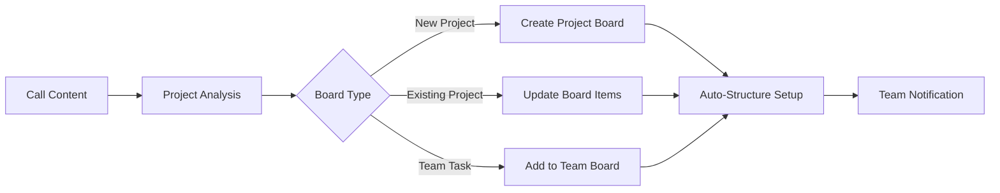

# Monday.com Integration with AI Phone Assistants

Revolutionize your project management with the visual power of Monday.com. Famulor Automation connects your AI phone assistants with Monday.com for automatic item creation, intelligent board updates, and seamless team coordination within color-coded workflows.

<Note>
**Visual Work OS:** Monday.com offers an intuitive, color-coded interface that makes complex projects clear and understandable for all team members.
</Note>

## Why Monday.com + AI Phone Assistant?

### 🎨 Visual Project Clarity
Every call is automatically converted into clear Monday.com items with color-coded statuses and defined responsibilities.

### 📊 Real-time Team Synchronization
Your Monday.com boards update during conversations — all team members see changes instantly on the visual dashboard.

### 🔄 Flexible Workflow Customization
Customizable board structures, custom columns, and automations tailored for every team dynamic and way of working.

### ⚡ Intelligent Resource Planning
Automatic team capacity analysis and smart task distribution based on availability and skills.

## Main Features of the Integration

### 1. Intelligent Item & Board Creation

**Smart Board Management:**


**Available Monday.com Actions:**
- ✅ **Create Board:** New project boards from complex calls
- ✅ **Create Item:** Automatic item creation with rich properties
- ✅ **Update Item:** Status updates based on call outcomes
- ✅ **Create Group:** Organize project phases and team areas
- ✅ **Add Update:** Call notes as item updates
- ✅ **Set Status:** Intelligent status progression
- ✅ **Assign Person:** Smart team member assignments

### 2. Visual Workflow Orchestration

**Color-coded Project Flows:**
```
Call Input: "New Marketing Project - Product Launch Q2"

Automatic Monday.com Setup:
🎨 Board: "Q2 Product Launch - Marketing Campaign"

📊 Board Structure:
├─ 🎯 Group: "Strategy & Planning"
│   ├─ 📝 Item: "Market Research" [Status: Working on it 🟡]
│   ├─ 📝 Item: "Competitor Analysis" [Status: Stuck 🔴]
│   └─ 📝 Item: "Target Audience Definition" [Status: Done ✅]
├─ 🎨 Group: "Creative Development"
│   ├─ 📝 Item: "Brand Guidelines" [Status: Not started ⚪]
│   ├─ 📝 Item: "Visual Assets Creation" [Status: Working on it 🟡]
│   └─ 📝 Item: "Video Production" [Status: Not started ⚪]
└─ 🚀 Group: "Launch Execution"
    ├─ 📝 Item: "Campaign Setup" [Status: Not started ⚪]
    ├─ 📝 Item: "Performance Monitoring" [Status: Not started ⚪]
    └─ 📝 Item: "Results Analysis" [Status: Not started ⚪]

Custom Columns Automatically Created:
├─ 👤 Person: [Team assignment based on skills]
├─ 📅 Timeline: [Deadline calculated from launch date]
├─ 💰 Budget: [Budget allocation per phase]
├─ 🎯 Priority: [AI-assessed priority level]
├─ 🏷️ Tags: [Auto-tags: Marketing, Q2, Product Launch]
└─ 📊 Progress: [Percentage tracker]
```

### 3. Advanced Team Coordination

**Smart Resource Management:**
```
Team Capacity Intelligence:
👥 Available Team Members:
├─ Sarah (Marketing): 70% Capacity, Skill: Strategy ⭐⭐⭐
├─ Mike (Design): 40% Capacity, Skill: Creative ⭐⭐⭐⭐
├─ Lisa (Development): 90% Capacity, Skill: Technical ⭐⭐⭐
└─ Tom (Project Manager): 60% Capacity, Skill: Coordination ⭐⭐⭐⭐

Automatic Assignment Logic:
🎯 "Strategy Tasks" → Sarah (Marketing Lead)
🎨 "Creative Tasks" → Mike (Design Expert)
⚙️ "Technical Tasks" → Lisa (Development)
📋 "Coordination Tasks" → Tom (PM)

Workload Balancing:
⚖️ Overloaded Members → Task Redistribution Suggestions
📊 Capacity Reports → Weekly Team Utilization Analysis
🔄 Skill Gap Identification → Training Recommendations
```

### 4. Timeline & Milestone Management

**Intelligent Project Scheduling:**
```
Call: "Project must be completed by the end of March"

Monday.com Timeline Creation:
📅 Project Timeline: 12 weeks (Jan 1 - Mar 31)

Automatic Milestone Calculation:
🎯 Week 2: Strategy Phase Complete
🎯 Week 4: Creative Concepts Approved  
🎯 Week 8: Development Phase Done
🎯 Week 10: Testing & QA Complete
🎯 Week 12: Launch & Go-Live

Dependencies Automatically Set:
├─ Creative Phase → Strategy Approval Required
├─ Development → Creative Assets Ready
├─ Testing → Development Complete
└─ Launch → All Previous Phases Done

Buffer Time Management:
⏰ 20% Buffer for unforeseen delays
🚨 Risk Factors: Holidays, Team Availability
📊 Timeline Optimization Suggestions
```

## Practical Examples: Monday.com Voice Automation

### Example 1: Event Management Agency

**Scenario:** Event agency organizing corporate events

**Voice-to-Monday.com Event Orchestration:**
```
Client Call: "Corporate event for 200 people, budget €50k, date in 8 weeks"

Monday.com Event Board:
📋 Board: "Corporate Event ABC Corp - 200 Pax"

🎪 Event Overview Group:
├─ 📝 Client Info: ABC Corp [Status: Confirmed ✅]
├─ 📝 Event Details: 200 Guests, €50k Budget [Status: Working on it 🟡]
├─ 📝 Venue Search: [Status: Working on it 🟡]
└─ 📝 Date Confirmation: [Status: Done ✅]

🍽️ Catering Group:
├─ 📝 Menu Planning: [Assigned: Chef Sarah]
├─ 📝 Dietary Requirements: [Status: Gathering info 🟡]
├─ 📝 Service Staff: [Status: Not started ⚪]
└─ 📝 Equipment Rental: [Status: Not started ⚪]

🎵 Entertainment Group:
├─ 📝 Band/DJ Booking: [Assigned: Entertainment Manager]
├─ 📝 Sound System: [Status: Working on it 🟡]
├─ 📝 Lighting Setup: [Status: Not started ⚪]
└─ 📝 Stage Design: [Status: Not started ⚪]

📊 Custom Columns:
├─ 💰 Cost: [Budget tracking per item]
├─ 🔗 Vendor: [Supplier information]
├─ 📞 Contact: [Responsible person]
├─ ⚠️ Risk Level: [Low/Medium/High]
└─ ✅ Client Approval: [Approval status]
```

### Example 2: Software Development with Agile Workflows

**Scenario:** Development team with sprint management

**Agile Sprint Board:**
```
Product Owner Call: "User story: Dashboard with real-time analytics"

Monday.com Sprint Board:
🏃‍♂️ Board: "Sprint 15 - Analytics Dashboard"

📋 Sprint Backlog Group:
├─ 📝 Epic: Analytics Dashboard [Story Points: 21]
├─ 📝 User Story: Dashboard Layout [Points: 8, Assigned: Frontend Dev]
├─ 📝 User Story: API Integration [Points: 5, Assigned: Backend Dev]
├─ 📝 User Story: Real-time Updates [Points: 8, Assigned: Full-Stack Dev]
└─ 📝 Task: Testing & QA [Points: 3, Assigned: QA Engineer]

🔄 Sprint Status Groups:
├─ 📋 To Do: [Backlog items]
├─ 🟡 In Progress: [Active development]
├─ 🔍 In Review: [Code review phase]
├─ 🧪 Testing: [QA phase]
└─ ✅ Done: [Completed items]

📊 Sprint Metrics Columns:
├─ 📈 Story Points: [Estimation]
├─ ⏱️ Time Spent: [Actual hours]
├─ 🔥 Priority: [High/Medium/Low]
├─ 🏷️ Component: [Frontend/Backend/API]
└─ 🐛 Bug Count: [Quality metrics]

Automation Rules Enabled:
🔄 Status "Done" → Move to next group
📧 Blocker Status → Notify Scrum Master
⏰ Sprint End → Generate retrospective board
📊 Daily Standup → Progress update summary
```

### Example 3: Marketing Agency Campaign Management

**Scenario:** Multi-client campaign coordination

**Campaign Portfolio Management:**
```
Strategy Call: "Q2 campaigns for 5 clients running in parallel"

Monday.com Campaign Overview:
📊 Master Board: "Q2 Campaign Portfolio"

👥 Client Groups (color-coded):
├─ 🔵 Client A: Tech Startup (Budget: €20k)
├─ 🟢 Client B: E-Commerce (Budget: €35k)  
├─ 🟡 Client C: Healthcare (Budget: €15k)
├─ 🟠 Client D: Finance (Budget: €50k)
└─ 🔴 Client E: Education (Budget: €10k)

📈 Campaign Phase Tracking:
├─ 🎯 Strategy: [Research, Planning, Approval]
├─ 🎨 Creative: [Concept, Design, Production]
├─ 📊 Media: [Planning, Buying, Optimization]
├─ 🚀 Launch: [Setup, Go-Live, Monitoring]
└─ 📈 Analysis: [Reporting, Optimization, Insights]

Cross-Client Resource Management:
👥 Team Utilization Dashboard:
├─ Strategist: 85% (slightly overloaded)
├─ Creative Director: 70% (optimal)
├─ Media Buyer: 60% (available)
├─ Account Manager: 90% (overloaded)
└─ Analyst: 50% (underutilized)

Workload Balancing Automation:
⚖️ Automatic task redistribution
📊 Weekly capacity reports
🔄 Client priority balancing
🎯 Skill-based assignment optimization
```

## Setup Guide: Monday.com Integration

### Step 1: Prepare Monday.com Workspace
```
Monday.com Account Setup:
1. Create workspace for voice integration
2. Define board templates:
   ├─ 📋 Project Management Template
   ├─ 🎯 Sales Pipeline Template
   ├─ 🚀 Product Development Template
   ├─ 📊 Marketing Campaign Template
   └─ 🛠️ Support Ticketing Template

3. Configure custom column types:
   ├─ 📞 Call Reference (Text)
   ├─ ⭐ Call Priority (Status)
   ├─ 💰 Revenue Impact (Numbers)
   ├─ 📅 Follow-up Date (Date)
   └─ 🏷️ Call Tags (Tags)
```

### Step 2: Enable API Integration
```
Monday.com API Setup:
1. Admin → Developer → API
2. Generate API Token:
   ✅ Full board access
   ✅ Create/update items
   ✅ Manage columns
   ✅ Team management
   ✅ Automation access

3. Collect board IDs:
   - Main Project Board: 12345678
   - CRM Pipeline Board: 87654321
   - Support Board: 11223344

4. Perform permission testing
```

### Step 3: Famulor Monday.com Mapping
```
In Famulor Dashboard:
1. Integrations → Monday.com
2. Insert API token
3. Configure default board
4. Set up item mapping:

Voice Intent Mapping:
├─ "New Project" → Create project board + structure
├─ "Client Update" → Update existing client item
├─ "Bug Report" → Create item in support board
├─ "Team Meeting" → Create meeting item with updates
└─ "Sales Call" → Update CRM pipeline item

Status Mapping:
├─ "Call completed" → Status: "Working on it"
├─ "Issue resolved" → Status: "Done"
├─ "Problem identified" → Status: "Stuck"
├─ "Waiting for feedback" → Status: "Waiting for someone"
└─ "Project started" → Status: "Working on it"
```

### Step 4: Automation & Workflow Setup
```
Enable Monday.com automations:
📥 When item status changes:
├─ "Done" → Notify team + move to archive
├─ "Stuck" → Alert project manager
├─ "Waiting" → Set reminder for follow-up
└─ "Working" → Start time tracking

📧 Notification Rules:
├─ High-priority items → Immediate Slack alert
├─ Deadline approaching → Daily email reminder
├─ Budget threshold → Finance team notification
└─ Client items → Account manager update

🔄 Cross-Board Automation:
├─ Project complete → Update client board
├─ Support ticket closed → Update client satisfaction
├─ Sales won → Create project board
└─ Team member overloaded → Workload redistribution
```

## Performance & Visual ROI

### Monday.com Integration Benefits:

| Visualization Metric    | Without Integration | With Monday.com + Voice | Improvement |
|------------------------|---------------------|------------------------|-------------|
| **Project Visibility** | 35% team overview   | 95% full transparency  | +171%       |
| **Task Creation Time** | 10-15 min          | 1-2 min                | 90% reduction |
| **Status Update Frequency** | Weekly          | Real-time              | Continuous  |
| **Team Alignment**     | 60% on the same page| 92% synchronized       | +53%        |
| **Deadline Adherence** | 68%                | 87%                    | +28%        |

### Visual Productivity ROI:
```
Visual Management Gains (15-person team):
├─ Project setup time: 8h/week saved
├─ Status update meetings: 12h/week reduced
├─ Task coordination efficiency: 15h/week
├─ Deadline miss prevention: 6h/week (less firefighting)

Financial Impact:
├─ Time savings: €2,850/week (41h × €70/h)
├─ Improved delivery: €1,200/week (fewer delays)
├─ Better client satisfaction: €800/week
├─ Monday.com + integration costs: €400/week
├─ Net benefit: €4,450/week
└─ Annual ROI: €231,400 (1,213% ROI)
```

## Visual Excellence & Team Adoption

### 1. Color Coding & Visual Hierarchy

**Smart Visual Organization:**
```
Color Psychology in Monday.com:
🔴 High Priority: Urgent, blockers, critical issues
🟠 Medium Priority: Important, approaching deadlines
🟡 In Progress: Active work, under review
🟢 Completed: Done, approved, delivered
🔵 Planning: Future work, ideas, backlog
🟣 Waiting: Dependencies, external factors

Visual Cues for Voice Integration:
📞 Call Generated Items: Special phone icon
🤖 AI Created: Robot icon for auto-generated
⚡ High Impact: Lightning icon for revenue-critical
👥 Team Decision: Group icon for collaborative items
```

### 2. Dashboard & Reporting Excellence

**Executive Dashboards:**
```
C-Level Dashboard Views:
📊 Portfolio Overview:
├─ Active projects heat map
├─ Team utilization metrics
├─ Revenue pipeline visualization
├─ Client satisfaction scores
└─ Deadline risk assessment

📈 Performance Widgets:
├─ Project completion rates
├─ Budget vs. actual tracking
├─ Team productivity trends
├─ Client retention metrics
└─ Innovation pipeline status
```

---

**Ready for visual project management?**

<CardGroup cols={2}>
  <Card title="Start Monday.com Integration" icon="table-columns" href="https://app.famulor.de/integrations/monday">
    Connect Monday.com now with AI assistants
  </Card>
  <Card title="Visual Workflow Demo" icon="display" href="https://cal.com/bek-group/demotermine">
    Live demo of visual project management power
  </Card>
  <Card title="Board Templates" icon="table-cells" href="/en/automation-platform/integrations/einzelintegrations/monday/templates">
    Pre-built Monday.com board structures
  </Card>
  <Card title="Visual ROI Calculator" icon="chart-line" href="/en/automation-platform/integrations/einzelintegrations/monday/visual-roi">
    Calculate your visual management ROI
  </Card>
</CardGroup>