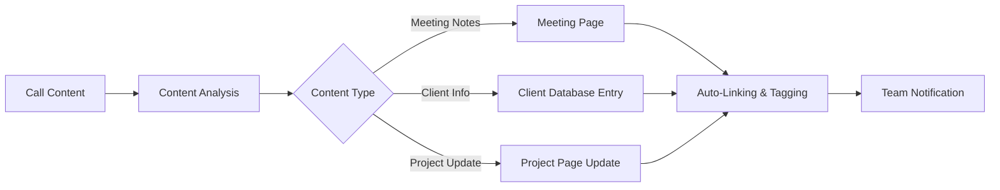

# Notion Integration with AI Phone Assistants

Revolutionize your workspace management with the all-in-one power of Notion. Famulor Automation connects your AI phone assistants with Notion for automatic page creation, intelligent database updates, and seamless knowledge organization.

<Note>
**All-in-One Workspace**: Notion combines notes, documents, databases, wikis, and project management into one flexible platform.
</Note>

## Why Notion + AI Phone Assistant?

### 📚 Intelligent Knowledge Base
Every call is automatically saved as a structured Notion page with accurate tags, categories, and links.

### 🔗 Connected Information Architecture
Automatic linking of call content with existing client pages, projects, and team documentation.

### ⚡ Flexible Content Structuring
Customizable page templates, database properties, and relations for every business need.

### 👥 Collaborative Knowledge Building
Teams can instantly comment on, expand, and embed call insights into larger knowledge structures.

## Key Features of the Integration

### 1. Automatic Page & Database Creation

**Intelligent Content Generation:**


**Available Notion Actions:**
- ✅ **Create Page**: Automatic page creation with rich content
- ✅ **Update Page**: Extend existing pages with call insights
- ✅ **Create Database Item**: New records with structured properties
- ✅ **Update Database Item**: Database entries with call updates
- ✅ **Query Database**: Intelligent database search for context
- ✅ **Add Comment**: Call notes as comments on pages

### 2. Smart Template System

**Call-Based Template Selection:**
```
Conversation Type: "Client Meeting with ABC Corp"

Automatically Activated Template:
📄 Template: "Client Meeting Notes"
├─ 🏢 Client: ABC Corp (Auto-linked)
├─ 📅 Date: [Today's Date]
├─ 👥 Attendees: [From Call Context]
├─ 🎯 Meeting Type: Sales/Support/Onboarding
├─ 📋 Agenda: [Extracted from Call]
├─ ✅ Action Items: [AI-generated Checklist]
├─ 🔄 Follow-up: [Next Steps identified]
└─ 📎 Call Recording: [Auto-attached]

Properties Automatically Set:
├─ Status: "Active"
├─ Priority: [Based on Content]
├─ Tags: ["Client", "Sales", "Q4-2024"]
├─ Relations: [Project], [Team Member], [Deal]
└─ Created by: [Voice Assistant]
```

### 3. Advanced Database Orchestration

**Multi-Database Workflow:**

| Call Type       | Primary Database         | Secondary Updates             | Auto-Relations      |
|-----------------|--------------------------|------------------------------|---------------------|
| **New Lead**    | "Leads Database"          | CRM Properties, Contact Info  | → Sales Pipeline    |
| **Client Update**| "Client Database"         | Project Status, Health Score  | → Active Projects   |
| **Support Call**| "Support Tickets"         | Issue Tracking, Resolution    | → Knowledge Base    |
| **Team Meeting**| "Meetings Database"       | Action Items, Decisions       | → Project Tasks     |

### 4. Knowledge Graph Building

**Automatic Content Linking:**
```
Call Content: "Integration problem at client XY, similar to project Z"

Notion Knowledge Graph:
🔗 Automatic Links:
├─ [[Client XY]] → Client Database Entry
├─ [[Project Z]] → Project Page with similar issues
├─ [[Integration Problems]] → Knowledge Base Category
├─ [[Technical Team]] → Team Page for assignment
└─ [[Q4 Roadmap]] → Strategic Planning Page

Smart Relations Created:
🏷️ Tags: #Integration, #TechnicalIssue, #ClientSupport
📊 Properties: 
├─ Severity: Medium (content analyzed)
├─ Client Tier: Enterprise
├─ Technical Area: API Integration
└─ Estimated Effort: 4-6 hours
```

## Use Cases: Notion Voice Automation

### Example 1: Knowledge Company with Client Workspaces

**Scenario:** Consulting firm manages client-specific workspaces

**Voice-to-Notion Client Management:**
```
Client call from "TechCorp": "Strategic consulting for digital transformation"

Automatic Notion Workflow:
📁 Workspace: "TechCorp - Digital Transformation"

🏢 Client Hub Page:
├─ 📊 Client Dashboard (KPIs, Health Score)
├─ 📋 All Meetings (Database with timeline)
├─ 🎯 Current Projects (Status overview)
├─ 👥 Key Contacts (Stakeholder mapping)
├─ 💰 Financial Overview (Contracts, billing)
└─ 📚 Knowledge Base (Industry-specific insights)

📝 Meeting-Specific Page:
Title: "Strategy Session - Digital Transformation Roadmap"
├─ 🎯 Objectives: [Extracted from call]
├─ 🔍 Current State Analysis
├─ 💡 Recommendations: [AI-assisted bullet points]
├─ 🛣️ Transformation Roadmap (Timeline database)
├─ 📊 Success Metrics (Measurable outcomes)
└─ 🔄 Next Steps (Action items with deadlines)

Database Updates:
✅ Project Status: "Strategy Phase"
✅ Health Score: 8/10 (High engagement)
✅ Next Milestone: "Roadmap Approval"
✅ Revenue Potential: €250k (Multi-phase project)
```

### Example 2: Product Team with Feature Request Management

**Scenario:** Software company collects feature requests from customer calls

**Feature Request Workflow:**
```
Customer call: "We need an API for mobile integration"

Notion Product Management:
📋 Feature Requests Database:
├─ 📱 Feature: "Mobile API Integration"
├─ 🏢 Requested by: [Customer Link]
├─ 💼 Business Value: High (Enterprise client)
├─ 🔥 Urgency: Medium
├─ 👥 Stakeholders: [Customer Contact], [Account Manager]
├─ 📊 Impact Score: 85/100 (AI-calculated)
└─ 🛣️ Product Roadmap Position: Q2 2024

Automatic Cross-References:
🔗 Related Features: [[API Gateway]], [[Mobile SDK]]
📚 Technical Docs: [[API Architecture]], [[Mobile Guidelines]]
🎯 OKRs: [[Customer Satisfaction]], [[API Adoption]]
💡 Ideas Database: Similar requests from other clients

Development Workflow Triggered:
✅ Epic created in [[Product Roadmap]]
✅ Technical Research Task assigned
✅ Customer Interview scheduled for requirements
✅ Competitive Analysis initiated
```

### Example 3: Remote Team with Meeting Intelligence

**Scenario:** Distributed team uses Notion for meeting documentation

**Intelligent Meeting Management:**
```
Team call: "Sprint Planning - Q4 Features"

Notion Meeting Hub:
📅 Meeting Calendar Database:
├─ 🏷️ Type: "Sprint Planning"
├─ 👥 Attendees: [Auto-populated from call]
├─ ⏰ Duration: 90 minutes
├─ 🎯 Agenda Items: [AI-extracted]
├─ ✅ Decisions Made: [Key decisions highlighted]
├─ 📋 Action Items: [Assignee + Deadline]
└─ 🔄 Follow-up Required: [Next meeting needed?]

Sprint Backlog Updates:
🎯 Stories Database updated:
├─ New User Stories: [From discussion]
├─ Revised Estimates: [Updated story points]
├─ Sprint Commitment: [Final scope]
├─ Risk Factors: [Identified blockers]
└─ Success Criteria: [Definition of Done]

Team Knowledge Capture:
💡 Ideas for Future Sprints
🧠 Lessons Learned from previous sprint
🛠️ Technical Decisions and Architecture Notes
📊 Team Velocity and Capacity Planning
```

## Setup Guide: Notion Integration

### Step 1: Prepare Notion Workspace
```
Notion Workspace Setup:
1. Create workspace for voice integration
2. Define database templates:
   ├─ 📞 Call Notes (Meeting documentation)
   ├─ 👥 Contacts (CRM-style contact management)
   ├─ 📋 Projects (Project tracking)
   ├─ 💡 Ideas (Innovation capture)
   └─ 📚 Knowledge Base (Information repository)

3. Create page templates:
   ├─ Client Meeting Template
   ├─ Support Call Template
   ├─ Internal Meeting Template
   └─ Project Update Template
```

### Step 2: Configure Integration Token
```
Notion API Setup:
1. Notion Settings → Integrations
2. Create New Integration:
   ✅ Integration Name: "Famulor Voice Assistant"
   ✅ Associated Workspace: [Your Workspace]
   ✅ Capabilities:
     - Read content
     - Update content
     - Insert content
     - Create comments

3. Copy integration token
4. Share pages/databases with integration
```

### Step 3: Famulor-Notion Mapping
```
In Famulor Dashboard:
1. Integrations → Notion
2. Paste integration token
3. Configure database mapping:

Voice Intent Mapping:
├─ "Client Call" → Client Database + Meeting Page
├─ "Support Request" → Support Database + Ticket Page
├─ "Team Meeting" → Meeting Database + Notes Page
├─ "Project Update" → Project Database + Update Page
└─ "Idea Discussion" → Ideas Database + Concept Page
```

### Step 4: Advanced Template Configuration
```
Template Automation:
📄 Dynamic Template Selection:
├─ Call Duration > 30min → Detailed Meeting Template
├─ Multiple Participants → Collaborative Meeting Template
├─ Client Mention → Client-Focused Template
├─ Problem Keywords → Support Issue Template
└─ Innovation Keywords → Innovation Capture Template

Content Enrichment:
├─ Auto-tags based on content analysis
├─ Property values from voice recognition
├─ Related page suggestions
└─ Follow-up task generation
```

## Advanced Notion Features

### 1. AI-Enhanced Content Organization

**Smart Content Classification:**
```javascript
// Example: Content intelligence for auto-organization
const contentAnalysis = {
  keywords: extractKeywords(callTranscript),
  sentiment: analyzeSentiment(callContent),
  actionItems: identifyActionItems(transcript),
  stakeholders: extractPersons(callParticipants),
  topics: categorizeTopics(content)
};

// Auto-organization rules
if (contentAnalysis.keywords.includes('urgent', 'critical')) {
  pageProperties.priority = 'High';
  pageProperties.tags.push('Urgent');
}

if (contentAnalysis.stakeholders.length > 3) {
  templateType = 'stakeholder-heavy-meeting';
  pageProperties.complexity = 'High';
}
```

### 2. Cross-Database Relations Management

**Intelligent Relationship Building:**
```
Relation Automation Examples:
🔗 Client Call → 
   ├─ Links to: Client Database Entry
   ├─ Updates: Project Status in Projects DB
   ├─ Creates: Follow-up Tasks in Tasks DB
   └─ Triggers: Next Meeting in Calendar DB

📊 Database Sync Rules:
├─ Contact info updates propagate to CRM Database
├─ Project status changes trigger timeline updates
├─ Meeting decisions become action items
└─ Client feedback updates satisfaction scores
```

### 3. Workflow Automation & Triggers

**Notion Native Automation:**
```
Automated Workflows:
📥 When New Call Page Created:
├─ Auto-assign to responsible team member
├─ Add to weekly team review database
├─ Generate follow-up reminder
└─ Update client interaction counter

📊 When Database Property Updated:
├─ Client health score changes → Alert account manager
├─ Project status changes → Update stakeholders
├─ Support ticket closed → Send satisfaction survey
└─ Action item completed → Update project progress
```

## Performance & Knowledge ROI

### Notion Integration Benefits:

| Knowledge Metric          | Without Integration | With Notion+Voice | Improvement |
|--------------------------|---------------------|-------------------|-------------|
| **Documentation Time**    | 20-30 min/call      | 2-3 min/call      | 90% reduction |
| **Knowledge Retrieval**   | 5-15 min            | 30 sec            | 95% faster   |
| **Team Knowledge Sharing**| 23% of insights     | 89% of insights   | +287%       |
| **Meeting Follow-up Rate**| 45%                 | 78%               | +73%        |
| **Knowledge Base Growth** | 2 pages/week        | 15 pages/week     | +650%       |

### Knowledge Management ROI:
```
Knowledge Efficiency Gains (20-person team):
├─ Documentation time savings: 18h/week saved
├─ Information retrieval efficiency: 12h/week
├─ Reduced knowledge loss: 8h/week (less rework)
├─ Improved decision making: 15h/week (better info basis)

Financial Impact:
├─ Time savings: €2,650/week (53h × €50/h)
├─ Knowledge productivity: €1,200/week
├─ Reduced errors: €800/week (better documentation)
├─ Notion + integration costs: €200/week
├─ Net benefit: €4,450/week
└─ Annual ROI: €231,400 (2,127% ROI)
```

## Team Adoption & Knowledge Culture

### 1. Knowledge Sharing Excellence

**Culture Transformation:**
```
Phase 1: Foundation (Week 1-2)
├─ Notion workspace setup
├─ Template library creation
├─ Basic training for all team members
└─ Quick-win demonstrations

Phase 2: Adoption (Week 3-6)
├─ Daily use integration
├─ Voice assistant training
├─ Feedback collection & iteration
└─ Success stories sharing

Phase 3: Optimization (Week 7-12)
├─ Advanced features training
├─ Custom workflow development
├─ Knowledge analytics implementation
└─ Continuous improvement process
```

### 2. Knowledge Quality Assurance

**Content Excellence Framework:**
```
Quality Metrics:
📊 Page completion rate: >85%
🔗 Cross-reference density: >3 links/page
💬 Comment engagement: >60% pages
📈 Knowledge utilization: >70% pages accessed

Automation Quality Checks:
✅ Mandatory fields populated
✅ Consistent tagging applied
✅ Relevant relations established
✅ Action items clearly defined
```

## Industry-Specific Knowledge Setups

### 🏥 Healthcare Knowledge Management
```
Medical Practice Notion Setup:
├─ Patient Interaction Logs (HIPAA-compliant)
├─ Medical Knowledge Base (Treatment Protocols)
├─ Research Documentation (Clinical Studies)
├─ Team Training Materials (Certification Tracking)
└─ Compliance Documentation (Audit Trails)
```

### 🎓 Educational Institution Knowledge
```
Academic Notion Workspace:
├─ Student Support Documentation
├─ Faculty Meeting Minutes
├─ Research Project Coordination
├─ Curriculum Development Notes
└─ Administrative Process Documentation
```

### 💼 Professional Services Knowledge
```
Consulting Knowledge Hub:
├─ Client Engagement Documentation
├─ Methodology Knowledge Base
├─ Industry Insights Repository
├─ Team Expertise Mapping
└─ Proposal Template Library
```

---

**Ready for intelligent knowledge management?**

<CardGroup cols={2}>
  <Card title="Start Notion Integration" icon="notion" href="https://app.famulor.de/integrations/notion">
    Connect Notion now with AI assistants
  </Card>
  <Card title="Workspace Demo" icon="presentation-screen" href="https://cal.com/bek-group/demotermine">
    Live demo of an intelligent Notion workspace
  </Card>
  <Card title="Template Library" icon="folder-plus" href="/automation-platform/integrations/einzelintegrations/notion/templates">
    Pre-built Notion templates for voice integration
  </Card>
  <Card title="Knowledge ROI Calculator" icon="calculator" href="/automation-platform/integrations/einzelintegrations/notion/knowledge-roi">
    Calculate your knowledge management ROI
  </Card>
</CardGroup>