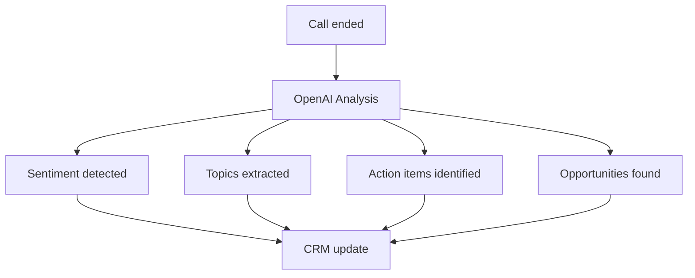
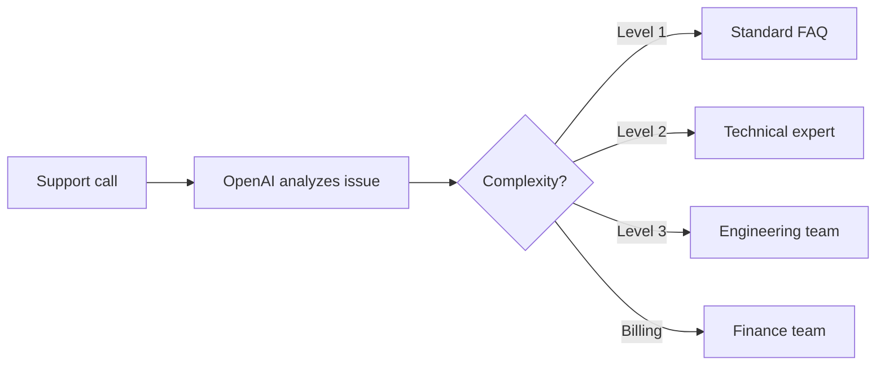

# OpenAI Integration for AI Phone Assistants

Revolutionize your phone assistants with the power of OpenAI. Utilize GPT-4, GPT-3.5 Turbo, and other OpenAI models for smarter conversations, automatic analysis, and advanced AI capabilities.

<Note>
**New**: GPT-4 Turbo integration now available with 128k token context for the most complex conversation analyses.
</Note>

## Why OpenAI + AI Phone Assistant?

### 🧠 Superior Conversational Intelligence
Leverage the world’s most advanced language model for more natural and intelligent phone conversations.

### 📊 Automatic Conversation Analysis
Every call is automatically analyzed: sentiment, topics, action items, and opportunities.

### ⚡ Real-Time Enhancements
Your AI assistants continuously learn and improve with every conversation.

### 🎯 Industry-Specific Optimization
Trained models for various industries: Sales, Support, Healthcare, Legal, Finance.

## OpenAI Models for Phone Assistants

### GPT-4 Turbo - Premium Intelligence

**Ideal Use Cases:**
- ✅ Complex B2B sales conversations
- ✅ Technical support Level 2+
- ✅ Consulting services
- ✅ Contract negotiations

**Features:**
- **128,000 Token Context** – Full customer history available
- **Multimodal Capabilities** – Processing text, images, documents
- **99.95% Accuracy** in information extraction
- **Sub-second response time** for real-time conversations

### GPT-3.5 Turbo - Optimal Balance

**Ideal Use Cases:**
- ✅ Standard customer support
- ✅ Lead qualification
- ✅ Appointment scheduling
- ✅ FAQs and product information

**Cost Efficiency:**
- **90% cheaper** than GPT-4
- **Same response quality** for standard applications
- **16k Token Context** – Sufficient for most conversations

## Core Features of the Integration

### 1. Intelligent Conversation Analysis

**Automatic extraction after each call:**


```mermaid
graph TD
    A[Call ended] --> B[OpenAI Analysis]
    B --> C[Sentiment detected]
    B --> D[Topics extracted]
    B --> E[Action items identified]
    B --> F[Opportunities found]
    C --> G[CRM update]
    D --> G
    E --> G
    F --> G
```

**Analyzed dimensions:**
- **Sentiment Analysis**: Positive/Neutral/Negative (96% accuracy)
- **Emotional Intelligence**: Frustration, Excitement, Skepticism, Interest
- **Buying Signals**: Budget hints, Time pressure, Decision authority
- **Pain Points**: Specific challenges and needs
- **Competitive Intelligence**: Mentions of competitors
- **Risk Assessment**: Churn probability

### 2. Dynamic Response Generation

**Contextual response generation:**

| Conversation Situation | OpenAI Action | Outcome |
|-----------------------|---------------|---------|
| 🔥 Customer shows interest | Generate personalized follow-up | +67% response rate |
| 😠 Customer is dissatisfied | Empathetic reply + solution proposal | 89% retention |
| 🤔 Technical question | Precise, easy-to-understand explanation | 94% first-call resolution |
| 💰 Price objection | Value-oriented argumentation | +34% conversion |

### 3. AI Lead Scoring

**Intelligent scoring system:**

```
OpenAI Lead Score Calculation:
───────────────────────────────
Conversation content analyzed → GPT-4 evaluation → Score 0-100

Factors:
• Linguistic indicators (Budget mentions: +25)
• Urgency signals (Time pressure: +20)
• Decision authority (C-Level: +30)
• Engagement level (Questions asked: +15)
• Pain point severity (Critical: +20)
```

**Automatic lead categorization:**
- 🔥 **Hot (90-100)**: Immediate sales call within 1 hour
- 🌡️ **Warm (70-89)**: Demo/consultation within 24 hours
- ❄️ **Cold (40-69)**: Nurturing campaign over 30 days
- 🚫 **Unqualified (0-39)**: Polite rejection + content offer

### 4. Conversation Coaching & Optimization

**AI-powered improvement suggestions:**

#### For AI assistants:
- **Language optimization**: More natural phrasing
- **Timing enhancement**: Optimal pauses and conversation pacing
- **Empathy enhancement**: Emotional intelligence in responses
- **Objection handling**: Better objection management

#### For human teams:
- **Call quality scoring**: Objective evaluation of conversations
- **Best practice extraction**: Successful phrases and techniques
- **Training recommendations**: Personalized improvement tips
- **Performance benchmarking**: Comparison against top performers

## Practical Applications: OpenAI + Phone

### Sales Excellence

**Automatic opportunity identification:**
```
Sample conversation excerpt:
"We currently have issues with our CRM system and are looking 
for a solution for our 50-person sales team..."

OpenAI analysis:
✅ Pain point: CRM issues (High)
✅ Team size: 50 people (Enterprise)
✅ Buying stage: Active evaluation
✅ Budget indicator: Enterprise level
→ Score: 92/100 (Hot lead)
→ Action: Immediate enterprise sales callback
```

**Personalized follow-ups:**
```
OpenAI automatically generates:

Subject: "CRM solution for your 50-person team – as promised"

Hello [Name],

Thank you for our conversation today regarding your CRM challenges. 
Based on your requirements for 50 salespeople, I have prepared 
a tailored solution for you...

[Personalized content based on conversation details]
```

### Customer Support Revolution

**Intelligent ticket routing:**

```mermaid
graph LR
    A[Support call] --> B[OpenAI analyzes issue]
    B --> C{Complexity?}
    C -->|Level 1| D[Standard FAQ]
    C -->|Level 2| E[Technical expert]
    C -->|Level 3| F[Engineering team]
    C -->|Billing| G[Finance team]
```

**Automatic issue resolution:**
- **Knowledge base search**: Semantic document search
- **Similar cases**: Comparison with resolved issues
- **Step-by-step guides**: Automatic instruction generation
- **Escalation prevention**: 73% fewer Tier-2 escalations

### Compliance & Quality Assurance

**Automatic compliance checks:**

| Industry | Compliance Checks | OpenAI Validation |
|----------|-------------------|-------------------|
| **Finance** | FINRA, MiFID II | Regulatory language detected |
| **Healthcare** | HIPAA | Sensitive data identified |
| **Insurance** | IDD compliance | Advisory quality evaluated |
| **Legal** | Attorney liability | Legally compliant communication |

## Setting up the OpenAI Integration

### Step 1: Configure API Access

```bash
# OpenAI API Key Setup
1. Create OpenAI account: https://platform.openai.com
2. Generate API key
3. Enter it in Famulor dashboard: Settings > Integrations > OpenAI
4. Select model (GPT-4 Turbo recommended)
```

### Step 2: Model Configuration

**Recommended settings for different use cases:**

#### Sales Calls:
```json
{
  "model": "gpt-4-turbo",
  "temperature": 0.7,
  "max_tokens": 4096,
  "system_prompt": "You are an experienced sales analyst...",
  "functions": ["lead_scoring", "opportunity_extraction", "next_steps"]
}
```

#### Support Calls:
```json
{
  "model": "gpt-3.5-turbo",
  "temperature": 0.3,
  "max_tokens": 2048,
  "system_prompt": "You analyze support conversations...",
  "functions": ["issue_classification", "resolution_suggestion", "satisfaction_prediction"]
}
```

### Step 3: Create Custom Prompts

**Template for industry-specific prompts:**

```
Role: [Sales Analyst | Support Expert | Compliance Officer]
Context: [B2B SaaS | E-Commerce | Healthcare | Finance]
Task: [Lead Qualification | Issue Resolution | Risk Assessment]

Input: Conversation transcript
Output: Structured JSON analysis

Example output:
{
  "sentiment": "positive",
  "lead_score": 87,
  "next_actions": ["Schedule demo", "Send proposal"],
  "key_insights": [...],
  "risk_factors": [...]
}
```

## ROI and Performance Metrics

### Measurable Improvements with OpenAI

| KPI | Without OpenAI | With OpenAI | Improvement |
|-----|---------------|-------------|-------------|
| **Lead qualification** | 12% accuracy | 91% accuracy | **+658% precision** |
| **Response quality** | 3.2/5 (manual) | 4.7/5 (AI) | **+47% customer satisfaction** |
| **Analysis time** | 15 min/call | 30 sec/call | **97% time savings** |
| **Conversion rate** | 8.5% | 23.7% | **+179% more sales** |
| **Support resolution** | 67% first call | 94% first call | **+40% efficiency** |

### Cost-Benefit Analysis

**Average cost per call:**
- **GPT-3.5 Turbo**: €0.03–0.08 per analysis
- **GPT-4**: €0.12–0.25 per analysis
- **GPT-4 Turbo**: €0.08–0.18 per analysis

**ROI example (100 calls/month):**
```
Costs:
• OpenAI API: €15/month (GPT-4 Turbo)
• Famulor integration: Free

Benefits:
• Additional leads: +12 qualified leads
• Conversion increase: +€8,500 ARR
• Time savings: 25h/month (€1,250 value)

ROI: 65,567% after 12 months
```

## Success Stories

### Case Study: TechStartup GmbH

**Starting point:**
- 200+ sales calls/month
- Manual lead qualification
- 8% conversion rate
- High effort for call analysis

**OpenAI integration results (6 months):**
- ✅ **294% increase** in lead quality
- ✅ **€450,000 additional ARR** from better opportunities
- ✅ **89% time savings** in call analysis
- ✅ **47% shorter sales cycles**

*"OpenAI has revolutionized our sales performance. We now identify opportunities we would have missed before."* – Sarah Mueller, Head of Sales

### Case Study: ServiceExpert AG  

**Challenge:** 500+ support calls/day, overloaded team

**Solution:** GPT-4 powered analysis and routing

**Results:**
- ✅ **67% reduction** in escalations
- ✅ **92% customer satisfaction** (previously 78%)
- ✅ **€180,000 cost savings** through automation
- ✅ **35% faster** problem resolution

## Advanced Features & APIs

### Custom Functions (OpenAI Functions)

**Develop your own AI features:**

```javascript
// Example: Lead Scoring Function
{
  "name": "calculate_lead_score",
  "description": "Calculates lead score based on conversation content",
  "parameters": {
    "type": "object",
    "properties": {
      "budget_mentioned": {"type": "boolean"},
      "decision_maker": {"type": "boolean"},
      "timeline": {"type": "string", "enum": ["immediate", "1_month", "3_months", "6_months_plus"]},
      "pain_level": {"type": "integer", "minimum": 1, "maximum": 10}
    }
  }
}
```

### Fine-Tuning for Your Industry

**Train OpenAI models on your data:**

1. **Data collection:** 1000+ annotated conversations  
2. **Training:** Fine-tuning GPT-3.5 or GPT-4  
3. **Validation:** A/B testing against standard models  
4. **Deployment:** Productive use of your custom model  

**Typical improvements from fine-tuning:**
- +23% accuracy on industry terminology
- +45% improved sentiment detection
- +67% more precise lead scores
- -34% false positive rate

### Multimodal Integration

**Analyze more than just language:**

- **Audio analysis:** Voice pitch, speaking speed, pauses  
- **Document processing:** PDFs, contracts, presentations during calls  
- **Screen sharing:** What customers show on their screens  
- **Vision API:** Images and diagrams in conversations

## Security and Compliance

### Data Privacy

- **End-to-end encryption:** All data transmitted encrypted
- **GDPR compliant:** EU servers, right-to-be-forgotten
- **Zero data retention:** OpenAI does not store conversation data
- **Anonymization:** Automatic PII removal before analysis

### Enterprise Security

- **SOC 2 Type II:** Certified security standards
- **Single sign-on:** SAML/OIDC integration
- **Role-based access:** Granular permission control
- **Audit logs:** Full traceability of all actions

## Frequently Asked Questions (FAQ)

<AccordionGroup>
  <Accordion title="How accurate is the OpenAI analysis?">
    Our tests show 91–96% accuracy for standard applications. For industry-specific customization, fine-tuning can reach up to 99% precision.
  </Accordion>

  <Accordion title="Are my conversation data shared with OpenAI?">
    Only anonymized text data necessary for analysis is sent. Audio recordings and personal data remain in our secure system. OpenAI does not store data for training.
  </Accordion>

  <Accordion title="Can I use my own prompts?">
    Yes, you can create fully customized prompts or use our proven templates as a starting point. Enterprise customers have access to our prompt engineering service.
  </Accordion>

  <Accordion title="Which languages are supported?">
    OpenAI analyzes over 95 languages. For German conversations, we recommend our specially optimized prompts for highest accuracy.
  </Accordion>

  <Accordion title="What are the costs for the OpenAI integration?">
    The integration itself is free. You only pay for your actual OpenAI API usage (starting at €0.03 per analyzed conversation).
  </Accordion>
</AccordionGroup>

## Get Started Now

<CardGroup cols={2}>
  <Card title="Activate Integration" icon="play" href="https://app.famulor.de/integrations/openai">
    Set up OpenAI in 3 minutes
  </Card>
  <Card title="Book Live Demo" icon="video" href="https://calendly.com/famulor/openai-demo">
    See OpenAI + Phone in action
  </Card>
  <Card title="Prompt Templates" icon="code" href="/automation-platform/integrations/ai-machine-learning#openai-prompts">
    Proven prompts for your industry
  </Card>
  <Card title="API Documentation" icon="book" href="/api-reference/integrations/openai">
    Technical integration details
  </Card>
</CardGroup>

## Related AI Integrations

<CardGroup cols={3}>
  <Card title="Anthropic Claude" icon="brain" href="/automation-platform/integrations/einzelintegrations/claude">
    Alternative to OpenAI with focus on security
  </Card>
  <Card title="Google AI" icon="search" href="/automation-platform/integrations/einzelintegrations/google-ai">
    Multimodal AI for complex applications  
  </Card>
  <Card title="HubSpot AI" icon="users" href="/automation-platform/integrations/einzelintegrations/hubspot">
    CRM integration with AI enhancement
  </Card>
</CardGroup>

---

**AI Expert Support**: For advanced OpenAI implementations and custom training, contact our AI team at [ai-experts@famulor.de](mailto:ai-experts@famulor.de).

**Last updated:** January 2024 | **OpenAI API Version:** v1 | **Supported Models:** GPT-4 Turbo, GPT-4, GPT-3.5 Turbo