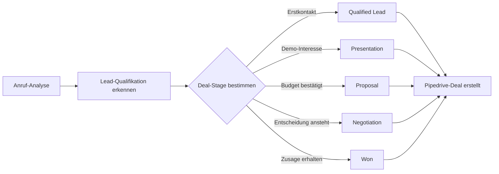

# Pipedrive Integration mit KI-Telefonassistenten

Optimieren Sie Ihre Sales-Pipeline mit intelligenten Telefonassistenten. Famulor Automation verbindet Ihre Anrufe nahtlos mit Pipedrive für automatische Deal-Erstellung, intelligentes Lead-Tracking und datengetriebene Vertriebsoptimierung.

<Note>
**Sales-Effizienz-Boost**: Pipedrive-Integration automatisiert Ihr komplettes Sales-Reporting und sorgt dafür, dass kein Lead und kein Deal-Update verloren geht.
</Note>

## Warum Pipedrive + KI-Telefonassistent?

### 📊 Automatische Pipeline-Updates
Jeder Anruf wird automatisch in Pipedrive-Deals und -Aktivitäten umgewandelt mit korrekten Pipeline-Stufen und Wahrscheinlichkeiten.

### 🎯 Intelligente Deal-Klassifizierung
KI analysiert Gespräche und ordnet Deals automatisch den richtigen Pipeline-Stufen zu basierend auf Gesprächsinhalten.

### ⚡ Echtzeit-Sales-Intelligence
Ihre Pipedrive-Daten werden während des Gesprächs abgerufen und aktualisiert - für kontextuelle, datengetriebene Verkaufsgespräche.

### 📈 Performance-Tracking-Automation
Automatische Erfassung aller Sales-Aktivitäten für präzise Forecasting und Team-Performance-Analyse.

## Hauptfunktionen der Integration

### 1. Intelligente Deal-Erstellung und -Management

**Automatische Deal-Pipeline-Zuordnung:**


**Automatisch erkannte Deal-Eigenschaften:**
- ✅ **Deal-Value**: Budget-Erwähnungen automatisch extrahiert
- ✅ **Pipeline-Stage**: Gesprächsinhalt bestimmt Stage-Zuordnung
- ✅ **Closing-Date**: Timeline-Hinweise aus Gespräch
- ✅ **Win-Probability**: KI-basierte Wahrscheinlichkeits-Berechnung
- ✅ **Product-Interest**: Spezifische Produkt-/Service-Zuordnung
- ✅ **Competition**: Mitbewerber-Erwähnungen dokumentiert
- ✅ **Next-Action**: Automatische Follow-up-Planung

### 2. Lead-zu-Deal-Conversion-Optimierung

**Intelligente Lead-Qualifikation:**

| Anruf-Indikator | Pipedrive-Aktion | Pipeline-Movement |
|-----------------|------------------|------------------|
| 💰 **Budget erwähnt** | Deal-Value eingetragen | → Qualified Lead |
| ⏰ **Timeline genannt** | Expected-Close-Date gesetzt | → Presentation |
| 🎯 **Demo-Anfrage** | Demo-Aktivität geplant | → Presentation |
| ✅ **Entscheidungsbefugnis** | Decision-Maker-Flag gesetzt | Erhöhte Win-Probability |
| 🔥 **Buying-Signals** | Hot-Lead-Tag hinzugefügt | Fast-Track-Pipeline |
| ⚠️ **Objections** | Objection-Notes dokumentiert | Coaching-Alert |

### 3. Contact-Enrichment und Account-Management

**Automatische Kontakt-Anreicherung:**
```
Anruf-Daten → Pipedrive-Contact-Update:

Basis-Informationen:
├─ Name, Telefon, E-Mail (verifiziert)
├─ Firma, Position, Abteilung
├─ Standort, Zeitzone
└─ Bevorzugte Kommunikationszeiten

Erweiterte Sales-Intelligence:
├─ Unternehmensgröße (Mitarbeiter-Anzahl)
├─ Technologie-Stack (bei Tech-Sales)
├─ Budget-Range (Kategorie)
├─ Decision-Process (Stakeholder-Mapping)
├─ Pain-Points (spezifische Herausforderungen)
└─ Competitive-Landscape (andere Anbieter)

Verhalten-Daten:
├─ Anruf-Häufigkeit und -Dauer
├─ Engagement-Level (Interesse-Score)
├─ Response-Time zu Follow-ups
└─ Preferred-Communication-Channel
```

### 4. Sales-Activity-Automation

**Automatische Aktivitäts-Protokollierung:**

#### Anruf-Aktivität automatisch erstellt:
```
Pipedrive-Activity-Entry:
┌─────────────────────────────────────┐
│ 📞 Outbound Sales Call - Max Mustermann │
│                                     │
│ 📅 Datum: 15. März 2024, 14:30     │
│ ⏱️ Dauer: 23 Minuten                │
│ 🎯 Ergebnis: Demo vereinbart         │
│                                     │
│ 📝 Zusammenfassung:                 │
│ • Interesse an Enterprise-Lösung     │
│ • Budget: €50-100k bestätigt        │
│ • Timeline: Q2 Implementation       │
│ • Next: Demo am 20.03, 15:00       │
│                                     │
│ 🏷️ Tags: Enterprise, Hot-Lead, Q2-Close │
│ 📊 Lead-Score: 87/100               │
└─────────────────────────────────────┘
```

#### Follow-up-Aktivitäten automatisch geplant:
```
Nach Demo-Vereinbarung:
├─ Demo-Aktivität: 20.03, 15:00 (geplant)
├─ Demo-Prep: 20.03, 14:00 (Reminder für AE)
├─ Follow-up-Call: 21.03, 10:00 (für Feedback)
└─ Proposal-Deadline: 25.03 (falls Demo erfolgreich)

Nach Objection-Handling:
├─ Research-Task: Competitive-Analysis
├─ Internal-Meeting: Pricing-Strategy-Discussion
├─ Follow-up-Call: Objection-Resolution
└─ Case-Study-Send: Success-Story-relevant-für-Objection
```

## Praxisbeispiele: Pipedrive Sales Automation

### Beispiel 1: B2B-Software-Vertrieb

**Szenario:** Software-Unternehmen mit mehreren Produktlinien

**Pipeline-Automation-Workflow:**
```
Inbound-Lead-Call: "Interesse an Marketing-Automation-Tool"

Automatische Pipedrive-Updates:
🎯 Contact: Lead-Details erfasst und angereichert
📊 Deal: "Marketing-Automation - ABC Corp" erstellt
💰 Value: €25,000 (basierend auf Unternehmensgröße)
📅 Expected-Close: Ende Q2 (Timeline aus Gespräch)
🏷️ Tags: Marketing-Automation, Mid-Market, Inbound
📋 Pipeline: "Marketing-Products" (produktspezifisch)
⭐ Probability: 40% (Erstkontakt, qualifiziertes Interesse)

Next-Actions automatisch geplant:
├─ Product-Demo: Diese Woche
├─ Technical-Deep-Dive: Nach Demo
├─ Proposal: Nach Technical-Validation
└─ Decision-Call: 2 Wochen nach Proposal

Result: Vollständig konfigurierte Sales-Pipeline für nahtloses Follow-up
```

### Beispiel 2: Beratungsdienstleistungen-Vertrieb

**Szenario:** Management-Beratung mit projekt-basiertem Geschäft

**Consulting-Sales-Pipeline:**
```
Client-Inquiry-Call: "Brauchen Hilfe bei Digital-Transformation"

Pipedrive-Intelligence-Update:
🏢 Organization: Mittelstand, 200 Mitarbeiter, Manufacturing
💡 Opportunity: Digital-Transformation-Beratung
💰 Estimated-Value: €150,000 (6-monatiges Projekt)
📊 Pipeline-Stage: Needs-Assessment (speziell für Consulting)
🎯 Service-Line: Digital-Transformation (Custom-Field)

Consulting-spezifische Automation:
├─ Stakeholder-Mapping: CTO, CEO, Operations-Lead
├─ Assessment-Call: Ausführliches Discovery-Meeting
├─ Proposal-Phase: Custom-Proposal mit SOW
├─ Contract-Negotiation: Legal-Review-Phase
└─ Project-Kickoff: Implementation-Start

Multi-Touch-Follow-up:
📞 Weekly-Check-ins während Decision-Phase
📧 Educational-Content zu Digital-Transformation
📊 ROI-Calculator für Kunde vorbereitet
📅 Executive-Presentation bei Stakeholder-Meeting
```

### Beispiel 3: High-Volume-Transactional-Sales

**Szenario:** E-Commerce-Services für Online-Shops

**Volume-Sales-Optimization:**
```
E-Commerce-Lead-Call: "Brauchen Payment-Processing für Online-Shop"

High-Volume-Pipeline-Automation:
⚡ Quick-Qualification: Transaktions-Volumen ermittelt
📈 Value-Calculation: Revenue-Share-Model automatisch berechnet
🎯 Product-Fit: Payment-Processing + Optional-Add-ons
⏰ Fast-Track: 48h-Decision-Timeline erkannt

Automated-Pipeline-Progression:
├─ Same-Day: Technical-Integration-Info gesendet
├─ Day 1: Pricing-Proposal mit Calculator
├─ Day 2: Decision-Call + Contract-Ready
└─ Day 3: Implementation-Start bei Zusage

Volume-Sales-Metrics:
📊 Lead-Velocity: 48h Average-Cycle
💰 Average-Deal-Size: €2,500 Setup + €500/Monat
📈 Conversion-Rate: 67% (optimiert durch KI-Qualification)
⚡ Time-to-Revenue: 3 Tage durchschnittlich
```

## Advanced Pipedrive Features

### 1. Custom Pipeline-Management

**Branchen-spezifische Pipelines:**
```
Technology-Sales-Pipeline:
├─ Lead-Generation → Qualification → Demo
├─ Technical-Validation → Proposal → Negotiation  
├─ Contract → Implementation → Go-Live
└─ Success-Review → Upselling → Renewal

Consulting-Pipeline:
├─ Inquiry → Needs-Assessment → Scope-Definition
├─ Proposal → SOW-Agreement → Project-Start
├─ Delivery-Phase → Client-Acceptance → Invoice
└─ Relationship-Maintenance → Referral-Generation

Service-Business-Pipeline:
├─ Service-Inquiry → Needs-Analysis → Quote
├─ Service-Agreement → Scheduling → Delivery
├─ Quality-Control → Payment → Follow-up
└─ Maintenance-Contract → Renewal-Discussion
```

### 2. Win/Loss-Analysis-Automation

**Automatische Deal-Outcome-Analyse:**
```
Won-Deal-Analysis:
📈 Won-Faktoren automatisch erkannt:
├─ Decision-Speed: Schnelle vs. lange Cycles
├─ Budget-Fit: Over/Under-Budget-Analysis
├─ Competition: Gewonnen gegen welche Competitors
├─ Sales-Process: Welche Activities führten zum Close
└─ Account-Characteristics: Winning-Customer-Profile

Lost-Deal-Intelligence:
📉 Loss-Gründe automatisch kategorisiert:
├─ Price-Objections: Budget-mismatch-Pattern
├─ Feature-Gaps: Product-Fit-Issues
├─ Timing-Mismatch: Decision-Timeline-Problems
├─ Competition-Lost: Competitive-Disadvantages
└─ Process-Issues: Sales-Process-Optimization-Opportunities

Coaching-Insights automatisch generiert:
🎯 Rep-Performance-Pattern erkannt
📊 Pipeline-Health-Trends identifiziert
🔄 Process-Improvement-Recommendations
📈 Forecasting-Accuracy-Optimization
```

### 3. Team-Performance-Tracking

**Sales-Rep-Performance-Automation:**
```
Individual-Performance-Metrics:
├─ Call-to-Lead-Conversion-Rate
├─ Lead-to-Demo-Conversion-Rate  
├─ Demo-to-Proposal-Conversion-Rate
├─ Proposal-to-Close-Rate
├─ Average-Deal-Size-Trends
├─ Sales-Cycle-Length-Optimization
└─ Pipeline-Velocity-Improvements

Team-Benchmarking:
📊 Top-Performer-Pattern-Analysis
🎯 Coaching-Opportunities-Identification
📈 Best-Practice-Sharing-Automation
⚡ Performance-Improvement-Tracking
```

## Setup-Guide: Pipedrive-Integration

### Schritt 1: Pipedrive-API-Zugang
```
1. Pipedrive → Settings → API
2. Personal-API-Token generieren
3. Famulor → Integrations → Pipedrive
4. API-Token eingeben und Verbindung testen

Required-Permissions:
✅ Deals: Create, Read, Update
✅ Persons: Create, Read, Update
✅ Organizations: Create, Read, Update
✅ Activities: Create, Read, Update
✅ Pipelines: Read
✅ Stages: Read
✅ Users: Read
```

### Schritt 2: Pipeline-Mapping-Konfiguration
```
Standard-Pipeline-Mapping:
📊 "Sales Pipeline" → Haupt-Vertriebsprozess
📋 Stages-Mapping:
├─ Lead In → Qualified
├─ Contact Made → Presentation  
├─ Demo Scheduled → Presentation
├─ Proposal Made → Proposal
├─ Negotiation → Negotiation
└─ Contract Sent → Won/Lost

Custom-Pipeline-Setup:
🎯 Produkt-spezifische Pipelines
📊 Service-basierte Pipelines
🏢 Account-Tier-spezifische Pipelines
⚡ Velocity-optimierte Pipelines
```

### Schritt 3: Custom-Fields-Integration
```
Anruf-spezifische Custom-Fields:
📞 Call-Quality-Score (1-10)
⭐ Interest-Level (Cold/Warm/Hot)
💰 Budget-Range (Kategorie)
⏰ Decision-Timeline (Dropdown)
🎯 Use-Case-Primary (Multi-select)
🏷️ Lead-Source-Detail (Text)
📊 Competitor-Mentions (Multi-select)
🔄 Follow-up-Type (Dropdown)

Standard-Field-Mapping:
├─ Person → Contact-Name, Phone, Email
├─ Organization → Company-Name, Size, Industry
├─ Deal → Value, Expected-Close, Probability
└─ Activity → Type, Date, Duration, Outcome
```

### Schritt 4: Automation-Rules-Setup
```
Trigger-Based-Automations:
🔥 Hot-Lead (Score >80) → Immediate-Sales-Alert
📞 Demo-Scheduled → Demo-Prep-Checklist
💰 Budget-Qualified → Manager-Notification  
⚠️ Objection-Raised → Coaching-Flag
✅ Deal-Won → Success-Celebration + Referral-Request

Workflow-Automations:
├─ Stage-Progression-Rules basierend auf Call-Content
├─ Activity-Creation für Follow-ups
├─ Probability-Updates basierend auf Conversation-Analysis
└─ Custom-Field-Updates für Sales-Intelligence
```

## Best Practices für Pipedrive+Voice Integration

### 1. Pipeline-Design für Voice-Integration
```
Voice-optimierte Pipeline-Stages:
✅ Conversational-friendly Stage-Namen
✅ Clear-Progression-Criteria-basierend auf Call-Content
✅ Automated-Probability-Updates
✅ Action-oriented Next-Steps

Example-Pipeline:
├─ "First-Contact" (Probability: 20%)
├─ "Interest-Confirmed" (Probability: 40%)  
├─ "Demo-Completed" (Probability: 60%)
├─ "Proposal-Sent" (Probability: 80%)
└─ "Contract-Negotiation" (Probability: 90%)
```

### 2. Deal-Naming-Conventions
```
Consistent-Deal-Naming für Voice-Recognition:
✅ [Product/Service] - [Company] - [Month/Year]
✅ "Marketing-Automation - TechCorp - März 2024"
✅ "Consulting - Manufacturing Inc - Q2 2024"

Voice-friendly-Formats:
├─ Kurze, prägnante Namen
├─ Produkt-Kategorien statt komplexe Produktnamen
├─ Zeitrahmen-Indikationen für besseres Forecasting
└─ Keine Sonderzeichen oder Codes
```

### 3. Activity-Management-Optimierung
```
Voice-to-Activity-Best-Practices:
📞 Ein Activity pro Anruf-Session
📝 Structured-Call-Notes mit Key-Information
🎯 Clear-Outcome-Definition (Meeting-Scheduled, Information-Gathered, etc.)
📅 Automatic-Follow-up-Scheduling basierend auf Outcome
⭐ Sentiment-Tracking für Relationship-Health

Activity-Types für Voice-Integration:
├─ "Outbound-Sales-Call"
├─ "Inbound-Lead-Call"  
├─ "Demo-Presentation"
├─ "Follow-up-Call"
├─ "Objection-Handling-Call"
└─ "Contract-Discussion-Call"
```

## ROI & Performance Tracking

### Pipedrive+Voice-Integration-Metrics:

| KPI | Ohne Integration | Mit Pipedrive+Voice | Verbesserung |
|-----|------------------|-------------------|--------------|
| **Deal-Input-Zeit** | 15-20 min | 2 min | 90% Reduktion |
| **Pipeline-Accuracy** | 67% | 94% | +40% |
| **Forecasting-Precision** | 71% | 89% | +25% |
| **Sales-Rep-Productivity** | 23 Calls/Tag | 35 Calls/Tag | +52% |
| **Lead-to-Close-Time** | 45 Tage | 32 Tage | -29% |

### Revenue-Impact:
```
Monatliche-Performance-Steigerung (10-Person-Sales-Team):
├─ Zusätzliche-Calls: +120 Calls/Monat
├─ Verbesserte-Conversion: +15% durch besseres Data-Tracking
├─ Kürzere-Sales-Cycles: 13 Tage Average-Improvement
├─ Höhere-Deal-Values: +12% durch bessere Qualification

ROI-Berechnung:
├─ Produktivitäts-Steigerung: €45,000/Monat
├─ Bessere-Forecasting: €12,000/Monat (weniger Misses)
├─ Integration-Cost: €1,500/Monat
├─ Net-ROI: €55,500/Monat (3,700% ROI)
└─ Break-Even: Tag 1
```

---

**Bereit für intelligente Sales-Pipeline-Automation?**

<CardGroup cols={2}>
  <Card title="Pipedrive Integration starten" icon="chart-line" href="https://app.famulor.de/integrations/pipedrive">
    Pipedrive jetzt mit KI-Assistenten verbinden
  </Card>
  <Card title="Sales-Demo buchen" icon="calendar" href="https://cal.com/bek-group/demotermine">
    Live-Demo der Sales-Pipeline-Automation
  </Card>
  <Card title="Pipeline-Templates" icon="template" href="/automation-platform/integrations/einzelintegrations/pipedrive/templates">
    Vorgefertigte Pipeline-Konfigurationen
  </Card>
  <Card title="Sales-Performance-Guide" icon="chart-bar" href="/automation-platform/integrations/einzelintegrations/pipedrive/performance">
    Optimierung von Sales-Metrics mit Voice+Pipedrive
  </Card>
</CardGroup>