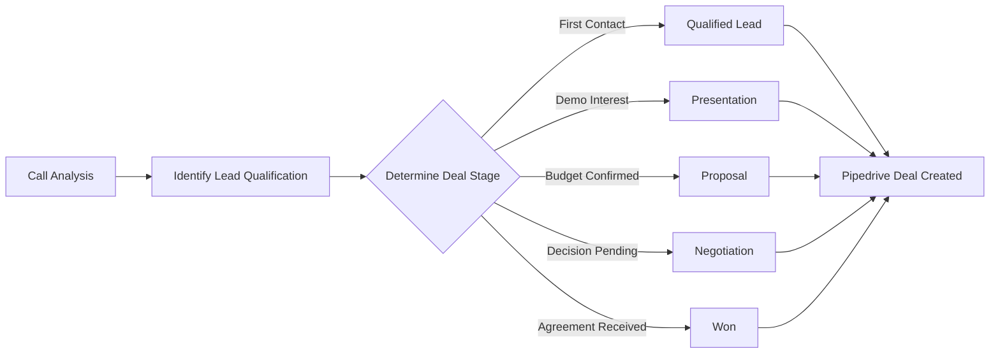

# Pipedrive Integration with AI Phone Assistants

Optimize your sales pipeline with intelligent phone assistants. Famulor Automation seamlessly connects your calls with Pipedrive for automatic deal creation, smart lead tracking, and data-driven sales optimization.

<Note>
**Sales Efficiency Boost**: Pipedrive integration automates your entire sales reporting and ensures no lead or deal update is missed.
</Note>

## Why Pipedrive + AI Phone Assistant?

### 📊 Automatic Pipeline Updates
Every call is automatically converted into Pipedrive deals and activities with accurate pipeline stages and probabilities.

### 🎯 Intelligent Deal Classification
AI analyzes conversations and automatically assigns deals to the correct pipeline stages based on call content.

### ⚡ Real-Time Sales Intelligence
Your Pipedrive data is retrieved and updated during the call—for contextual, data-driven sales conversations.

### 📈 Performance Tracking Automation
Automatically capture all sales activities for precise forecasting and team performance analysis.

## Key Features of the Integration

### 1. Intelligent Deal Creation and Management

**Automatic Deal Pipeline Assignment:**

```mermaid
graph LR
    A[Call Analysis] --> B[Identify Lead Qualification]
    B --> C{Determine Deal Stage}
    C -->|First Contact| D[Qualified Lead]
    C -->|Demo Interest| E[Presentation]
    C -->|Budget Confirmed| F[Proposal]
    C -->|Decision Pending| G[Negotiation]
    C -->|Agreement Received| H[Won]
    D --> I[Pipedrive Deal Created]
    E --> I
    F --> I
    G --> I
    H --> I
```

**Automatically Detected Deal Attributes:**
- ✅ **Deal Value**: Budget mentions automatically extracted
- ✅ **Pipeline Stage**: Call content determines stage assignment
- ✅ **Closing Date**: Timeline hints from conversation
- ✅ **Win Probability**: AI-based probability calculation
- ✅ **Product Interest**: Specific product/service allocation
- ✅ **Competition**: Competitor mentions documented
- ✅ **Next Action**: Automated follow-up planning

### 2. Lead-to-Deal Conversion Optimization

**Intelligent Lead Qualification:**

| Call Indicator | Pipedrive Action | Pipeline Movement |
|----------------|------------------|-------------------|
| 💰 **Budget Mentioned** | Deal value entered | → Qualified Lead |
| ⏰ **Timeline Stated** | Expected close date set | → Presentation |
| 🎯 **Demo Request** | Demo activity scheduled | → Presentation |
| ✅ **Decision Authority** | Decision-maker flag set | Increased win probability |
| 🔥 **Buying Signals** | Hot lead tag added | Fast-track pipeline |
| ⚠️ **Objections** | Objection notes documented | Coaching alert |

### 3. Contact Enrichment and Account Management

**Automatic Contact Enrichment:**
```
Call Data → Pipedrive Contact Update:

Basic Information:
├─ Name, Phone, Email (verified)
├─ Company, Position, Department
├─ Location, Time Zone
└─ Preferred Communication Times

Advanced Sales Intelligence:
├─ Company Size (number of employees)
├─ Technology Stack (for tech sales)
├─ Budget Range (category)
├─ Decision Process (stakeholder mapping)
├─ Pain Points (specific challenges)
└─ Competitive Landscape (other providers)

Behavioral Data:
├─ Call frequency and duration
├─ Engagement level (interest score)
├─ Follow-up response time
└─ Preferred communication channel
```

### 4. Sales Activity Automation

**Automatic Activity Logging:**

#### Call activity automatically created:
```
Pipedrive Activity Entry:
┌─────────────────────────────────────┐
│ 📞 Outbound Sales Call - Max Mustermann │
│                                     │
│ 📅 Date: March 15, 2024, 14:30     │
│ ⏱️ Duration: 23 minutes             │
│ 🎯 Outcome: Demo scheduled           │
│                                     │
│ 📝 Summary:                        │
│ • Interest in enterprise solution   │
│ • Budget: €50-100k confirmed         │
│ • Timeline: Q2 implementation        │
│ • Next: Demo on 03/20, 15:00         │
│                                     │
│ 🏷️ Tags: Enterprise, Hot Lead, Q2 Close │
│ 📊 Lead Score: 87/100               │
└─────────────────────────────────────┘
```

#### Follow-up activities automatically scheduled:
```
After Demo Scheduled:
├─ Demo activity: 03/20, 15:00 (planned)
├─ Demo prep: 03/20, 14:00 (reminder for AE)
├─ Follow-up call: 03/21, 10:00 (feedback)
└─ Proposal deadline: 03/25 (if demo successful)

After Objection Handling:
├─ Research task: Competitive analysis
├─ Internal meeting: Pricing strategy discussion
├─ Follow-up call: Objection resolution
└─ Case study send: Success story relevant to objection
```

## Use Cases: Pipedrive Sales Automation

### Example 1: B2B Software Sales

**Scenario:** Software company with multiple product lines

**Pipeline Automation Workflow:**
```
Inbound lead call: "Interest in marketing automation tool"

Automatic Pipedrive updates:
🎯 Contact: Lead details captured and enriched
📊 Deal: "Marketing Automation - ABC Corp" created
💰 Value: €25,000 (based on company size)
📅 Expected close: End of Q2 (timeline from call)
🏷️ Tags: Marketing Automation, Mid-Market, Inbound
📋 Pipeline: "Marketing Products" (product-specific)
⭐ Probability: 40% (first contact, qualified interest)

Next actions automatically planned:
├─ Product demo: This week
├─ Technical deep dive: After demo
├─ Proposal: After technical validation
└─ Decision call: 2 weeks after proposal

Result: Fully configured sales pipeline for seamless follow-up
```

### Example 2: Consulting Services Sales

**Scenario:** Management consulting with project-based business

**Consulting Sales Pipeline:**
```
Client inquiry call: "Need help with digital transformation"

Pipedrive intelligence update:
🏢 Organization: Mid-sized, 200 employees, manufacturing
💡 Opportunity: Digital transformation consulting
💰 Estimated value: €150,000 (6-month project)
📊 Pipeline stage: Needs assessment (consulting specific)
🎯 Service line: Digital transformation (custom field)

Consulting-specific automation:
├─ Stakeholder mapping: CTO, CEO, Operations lead
├─ Assessment call: Detailed discovery meeting
├─ Proposal phase: Custom proposal with SOW
├─ Contract negotiation: Legal review phase
└─ Project kickoff: Implementation start

Multi-touch follow-up:
📞 Weekly check-ins during decision phase
📧 Educational content on digital transformation
📊 ROI calculator prepared for client
📅 Executive presentation at stakeholder meeting
```

### Example 3: High-Volume Transactional Sales

**Scenario:** E-commerce services for online stores

**Volume Sales Optimization:**
```
E-commerce lead call: "Need payment processing for online shop"

High-volume pipeline automation:
⚡ Quick qualification: Transaction volume determined
📈 Value calculation: Revenue share model auto-calculated
🎯 Product fit: Payment processing + optional add-ons
⏰ Fast-track: 48h decision timeline detected

Automated pipeline progression:
├─ Same day: Technical integration info sent
├─ Day 1: Pricing proposal with calculator
├─ Day 2: Decision call + contract ready
└─ Day 3: Implementation start upon agreement

Volume sales metrics:
📊 Lead velocity: 48h average cycle
💰 Average deal size: €2,500 setup + €500/month
📈 Conversion rate: 67% (optimized by AI qualification)
⚡ Time to revenue: Average 3 days
```

## Advanced Pipedrive Features

### 1. Custom Pipeline Management

**Industry-Specific Pipelines:**
```
Technology Sales Pipeline:
├─ Lead Generation → Qualification → Demo
├─ Technical Validation → Proposal → Negotiation  
├─ Contract → Implementation → Go-Live
└─ Success Review → Upselling → Renewal

Consulting Pipeline:
├─ Inquiry → Needs Assessment → Scope Definition
├─ Proposal → SOW Agreement → Project Start
├─ Delivery Phase → Client Acceptance → Invoice
└─ Relationship Maintenance → Referral Generation

Service Business Pipeline:
├─ Service Inquiry → Needs Analysis → Quote
├─ Service Agreement → Scheduling → Delivery
├─ Quality Control → Payment → Follow-up
└─ Maintenance Contract → Renewal Discussion
```

### 2. Win/Loss Analysis Automation

**Automatic Deal Outcome Analysis:**
```
Won Deal Analysis:
📈 Automatically detected win factors:
├─ Decision speed: Fast vs. long cycles
├─ Budget fit: Over/under budget analysis
├─ Competition: Won against which competitors
├─ Sales process: Which activities led to close
└─ Account characteristics: Winning customer profile

Lost Deal Intelligence:
📉 Loss reasons automatically categorized:
├─ Price objections: Budget mismatch patterns
├─ Feature gaps: Product fit issues
├─ Timing mismatch: Decision timeline problems
├─ Competition lost: Competitive disadvantages
└─ Process issues: Sales process optimization opportunities

Automatically generated coaching insights:
🎯 Rep performance patterns identified
📊 Pipeline health trends spotted
🔄 Process improvement recommendations
📈 Forecasting accuracy optimization
```

### 3. Team Performance Tracking

**Sales Rep Performance Automation:**
```
Individual Performance Metrics:
├─ Call-to-lead conversion rate
├─ Lead-to-demo conversion rate  
├─ Demo-to-proposal conversion rate
├─ Proposal-to-close rate
├─ Average deal size trends
├─ Sales cycle length optimization
└─ Pipeline velocity improvements

Team Benchmarking:
📊 Top performer pattern analysis
🎯 Coaching opportunities identification
📈 Best practice sharing automation
⚡ Performance improvement tracking
```

## Setup Guide: Pipedrive Integration

### Step 1: Pipedrive API Access
```
1. Pipedrive → Settings → API
2. Generate personal API token
3. Famulor → Integrations → Pipedrive
4. Enter API token and test connection

Required Permissions:
✅ Deals: Create, Read, Update
✅ Persons: Create, Read, Update
✅ Organizations: Create, Read, Update
✅ Activities: Create, Read, Update
✅ Pipelines: Read
✅ Stages: Read
✅ Users: Read
```

### Step 2: Pipeline Mapping Configuration
```
Standard Pipeline Mapping:
📊 "Sales Pipeline" → Main sales process
📋 Stages mapping:
├─ Lead In → Qualified
├─ Contact Made → Presentation  
├─ Demo Scheduled → Presentation
├─ Proposal Made → Proposal
├─ Negotiation → Negotiation
└─ Contract Sent → Won/Lost

Custom Pipeline Setup:
🎯 Product-specific pipelines
📊 Service-based pipelines
🏢 Account tier-specific pipelines
⚡ Velocity-optimized pipelines
```

### Step 3: Custom Fields Integration
```
Call-specific Custom Fields:
📞 Call quality score (1-10)
⭐ Interest level (Cold/Warm/Hot)
💰 Budget range (category)
⏰ Decision timeline (dropdown)
🎯 Use case primary (multi-select)
🏷️ Lead source detail (text)
📊 Competitor mentions (multi-select)
🔄 Follow-up type (dropdown)

Standard Field Mapping:
├─ Person → Contact name, phone, email
├─ Organization → Company name, size, industry
├─ Deal → Value, expected close, probability
└─ Activity → Type, date, duration, outcome
```

### Step 4: Automation Rules Setup
```
Trigger-Based Automations:
🔥 Hot lead (score >80) → Immediate sales alert
📞 Demo scheduled → Demo prep checklist
💰 Budget qualified → Manager notification  
⚠️ Objection raised → Coaching flag
✅ Deal won → Success celebration + referral request

Workflow Automations:
├─ Stage progression rules based on call content
├─ Activity creation for follow-ups
├─ Probability updates based on conversation analysis
└─ Custom field updates for sales intelligence
```

## Best Practices for Pipedrive + Voice Integration

### 1. Pipeline Design for Voice Integration
```
Voice-optimized pipeline stages:
✅ Conversational-friendly stage names
✅ Clear progression criteria based on call content
✅ Automated probability updates
✅ Action-oriented next steps

Example Pipeline:
├─ "First Contact" (Probability: 20%)
├─ "Interest Confirmed" (Probability: 40%)  
├─ "Demo Completed" (Probability: 60%)
├─ "Proposal Sent" (Probability: 80%)
└─ "Contract Negotiation" (Probability: 90%)
```

### 2. Deal Naming Conventions
```
Consistent Deal Naming for Voice Recognition:
✅ [Product/Service] - [Company] - [Month/Year]
✅ "Marketing Automation - TechCorp - March 2024"
✅ "Consulting - Manufacturing Inc - Q2 2024"

Voice-friendly Formats:
├─ Short, concise names
├─ Product categories instead of complex product names
├─ Timeframe indications for better forecasting
└─ No special characters or codes
```

### 3. Activity Management Optimization
```
Voice-to-Activity Best Practices:
📞 One activity per call session
📝 Structured call notes with key information
🎯 Clear outcome definition (meeting scheduled, info gathered, etc.)
📅 Automatic follow-up scheduling based on outcome
⭐ Sentiment tracking for relationship health

Activity Types for Voice Integration:
├─ "Outbound Sales Call"
├─ "Inbound Lead Call"  
├─ "Demo Presentation"
├─ "Follow-up Call"
├─ "Objection Handling Call"
└─ "Contract Discussion Call"
```

## ROI & Performance Tracking

### Pipedrive + Voice Integration Metrics:

| KPI                   | Without Integration | With Pipedrive + Voice | Improvement    |
|-----------------------|---------------------|-----------------------|----------------|
| **Deal Input Time**    | 15-20 min           | 2 min                 | 90% reduction  |
| **Pipeline Accuracy**  | 67%                 | 94%                   | +40%           |
| **Forecasting Precision** | 71%                 | 89%                   | +25%           |
| **Sales Rep Productivity** | 23 calls/day         | 35 calls/day          | +52%           |
| **Lead-to-Close Time** | 45 days             | 32 days               | -29%           |

### Revenue Impact:
```
Monthly performance increase (10-person sales team):
├─ Additional calls: +120 calls/month
├─ Improved conversion: +15% through better data tracking
├─ Shorter sales cycles: 13 days average improvement
├─ Higher deal values: +12% through better qualification

ROI Calculation:
├─ Productivity increase: €45,000/month
├─ Better forecasting: €12,000/month (fewer misses)
├─ Integration cost: €1,500/month
├─ Net ROI: €55,500/month (3,700% ROI)
└─ Break-even: Day 1
```

---

**Ready for intelligent sales pipeline automation?**

<CardGroup cols={2}>
  <Card title="Start Pipedrive Integration" icon="chart-line" href="https://app.famulor.de/integrations/pipedrive">
    Connect Pipedrive now with AI assistants
  </Card>
  <Card title="Book Sales Demo" icon="calendar" href="https://cal.com/bek-group/demotermine">
    Live demo of sales pipeline automation
  </Card>
  <Card title="Pipeline Templates" icon="template" href="/automation-platform/integrations/einzelintegrations/pipedrive/templates">
    Preconfigured pipeline setups
  </Card>
  <Card title="Sales Performance Guide" icon="chart-bar" href="/automation-platform/integrations/einzelintegrations/pipedrive/performance">
    Optimize sales metrics with Voice + Pipedrive
  </Card>
</CardGroup>