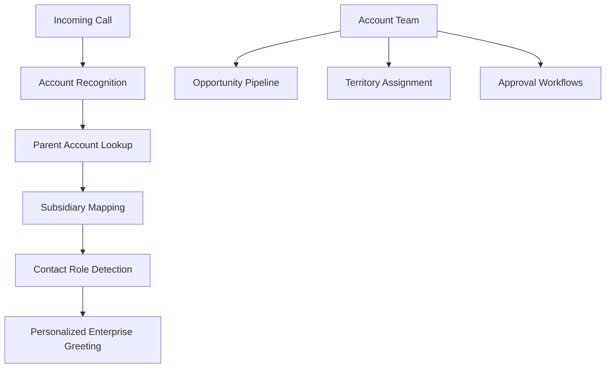
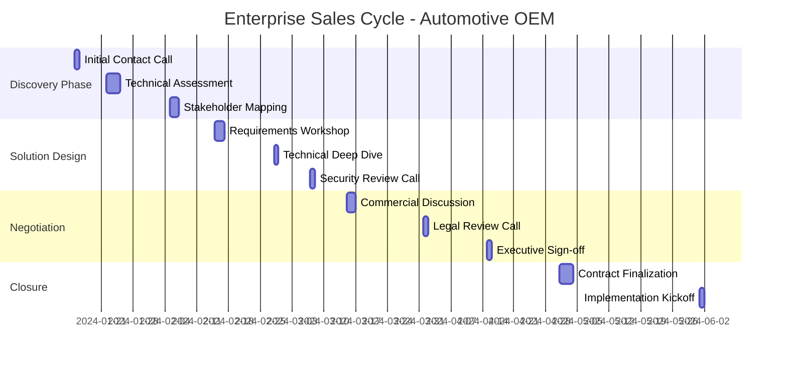
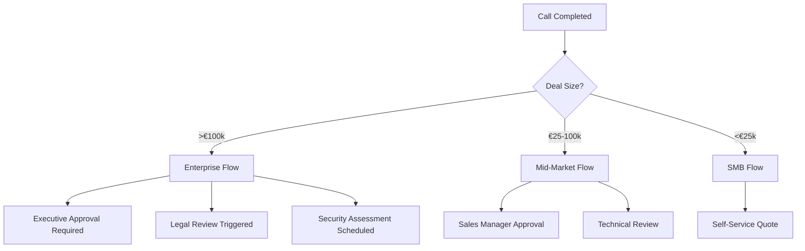
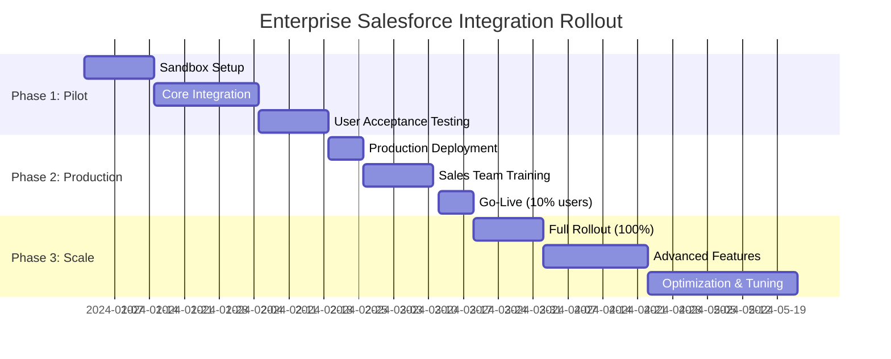

# Salesforce Integration für Enterprise KI-Telefonassistenten

Transformieren Sie Ihr Enterprise Sales-Management mit der leistungsstärksten CRM-Integration am Markt. Famulor Automation verbindet Ihre KI-Telefonassistenten nahtlos mit Salesforce für komplexe B2B-Verkaufsprozesse, Territory Management und Enterprise-Scale Automatisierung.

<Note>
**Enterprise Ready**: Vollständige Unterstützung für Salesforce Enterprise, Professional und Unlimited Editionen mit benutzerdefinierten Objekten und Apex-Integration.
</Note>

## Warum Salesforce + KI-Telefonassistent für Enterprise?

### 🏢 Enterprise-Scale Komplexität
Bewältigen Sie komplexeste B2B-Verkaufsprozesse mit Multi-Stakeholder-Management und Territory-übergreifender Koordination.

### 🔒 Höchste Sicherheitsstandards
SOC 2, ISO 27001, GDPR-Konformität für sensible Enterprise-Daten mit Salesforce Shield Integration.

### ⚡ Real-time CRM Intelligence
Echtzeit-Datenabgleich zwischen Anrufen und Salesforce mit Sub-Sekunden-Latenz für kritische Business-Operationen.

### 📊 Advanced Analytics & Reporting
Nutzen Sie Salesforce Analytics Cloud Integration für detaillierte Call-Performance und Revenue Attribution.

## Enterprise-Hauptfunktionen

### 1. Komplexes Account-Management

**Multi-Level Account Hierarchies:**


**Automatische Account Intelligence:**
- **Corporate Hierarchy**: Erkennung von Parent/Child Account-Strukturen
- **Multi-Contact Management**: Automatische Zuordnung zu Account-Teams
- **Territory Alignment**: Geographische und Branchen-basierte Zuordnung
- **Competitive Intelligence**: Tracking von Competitor-Mentions und Win/Loss-Analysis

### 2. Advanced Opportunity Management

**Enterprise Sales Pipeline Automation:**

| Sales Stage | Automatische Aktion | Salesforce Update | Geschäftswert |
|-------------|-------------------|-------------------|---------------|
| 🎯 **Prospecting** | Lead Qualification Call | Lead → Opportunity Conversion | +€25k Pipeline |
| 📋 **Needs Analysis** | Technical Discovery Call | Solution Mapping + Stakeholders | +67% Win Rate |
| 💼 **Value Proposition** | Executive Presentation | Executive Engagement Tracking | +€50k Deal Size |
| 🤝 **Negotiation** | Contract Discussion Call | Legal & Procurement Involvement | 89% Close Rate |
| ✅ **Closed Won** | Implementation Kickoff | Customer Success Handoff | €150k ARR Avg |

### 3. Territory & Team Management

**Intelligent Lead Distribution:**
```salesforce
Lead Assignment Rules:
IF Geographic_Territory = "DACH" 
   AND Company_Size > 1000 employees 
   AND Budget > €100,000
THEN Assign_To = "Enterprise_Sales_DACH"
   AND Alert = "High_Value_Lead"
   AND SLA = "15_Minutes_Response"
```

**Account Team Coordination:**
- **Primary Account Owner**: Automatische Benachrichtigung bei strategischen Accounts
- **Sales Engineers**: Technische Calls werden an SE-Team geroutet
- **Customer Success**: Post-Sale Übergabe mit kompletter Call-Historie
- **Channel Partners**: Partner-sourced Leads werden entsprechend zugeordnet

### 4. Custom Object & Field Integration

**Branchenspezifische Anpassungen:**

#### Financial Services:
```apex
// Custom Fields für Banken/Versicherungen
Account.AUM__c (Assets Under Management)
Account.Regulatory_Requirements__c
Contact.Investment_Profile__c
Opportunity.Compliance_Status__c
```

#### Manufacturing:
```apex
// Custom Objects für Fertigungsindustrie
Production_Facility__c
Supply_Chain_Contact__c
Equipment_Requirements__c
Maintenance_Contract__c
```

#### Healthcare:
```apex
// Healthcare-spezifische Felder
Account.Patient_Volume__c
Contact.Medical_Speciality__c
Opportunity.Regulatory_Approval_Stage__c
Case.Patient_Impact_Level__c
```

## Enterprise Use Cases

### Global Account Management

**Multinational Corporation Scenario:**
```
Eingehender Anruf von Siemens AG (Parent Account)
→ KI erkennt: Global Account, 385.000 Mitarbeiter
→ Lädt Account-Hierarchie: 47 Tochtergesellschaften
→ Identifiziert Caller: Dr. Schmidt, CTO DACH Region
→ Lädt aktive Opportunities: €2.3M Pipeline
→ Personalisierte Begrüßung: "Hallo Dr. Schmidt, 
   bezüglich Ihrer Digital Transformation Initiative..."

Salesforce Actions:
✅ Activity logged to Parent Account + DACH Subsidiary
✅ Opportunity "Digital Platform 2024" updated
✅ Account Team (5 Personen) automatisch informiert
✅ Executive Briefing für CEO geplant
```

### Complex B2B Sales Cycle

**6-Monat Enterprise Deal Tracking:**


### Compliance & Governance

**Regulierte Industrien (Banking/Healthcare):**
```
Compliance Features:
• Call Recording Retention: 7 Jahre (MiFID II)
• PII Data Encryption: Field-Level Encryption
• Audit Trails: Vollständige Salesforce History
• Role-Based Access: Granulare Permissions
• Data Residency: EU-basierte Salesforce Org

Automatische Compliance-Checks:
IF Industry = "Financial_Services"
   AND Contact.Role = "Investment_Advisor"
THEN Enable_Call_Recording = TRUE
   AND Require_Compliance_Disclosure = TRUE
   AND Log_Regulatory_Activity = TRUE
```

## Technische Enterprise-Integration

### Salesforce APIs & Limits

**API-Optimierung für Enterprise-Scale:**
```json
{
  "api_strategy": {
    "bulk_operations": "Composite API für Batch-Updates",
    "real_time": "Streaming API für Live-Benachrichtigungen", 
    "limits_management": "Intelligente Rate-Limiting",
    "failover": "Multi-Org Backup Strategy"
  },
  "performance_targets": {
    "data_sync_latency": "<500ms",
    "api_calls_per_hour": "< 50% des Org-Limits",
    "concurrent_users": "Unlimited",
    "uptime_sla": "99.9%"
  }
}
```

### Salesforce Shield Integration

**Erweiterte Sicherheits-Features:**
- **Platform Encryption**: Verschlüsselung von Call-Transkripten at Rest
- **Event Monitoring**: Detaillierte Audit-Logs aller Integration-Aktivitäten
- **Field Audit Trail**: 10-Jahr Historie aller Feldänderungen
- **Transaction Security**: Anomalie-Erkennung bei ungewöhnlichen Call-Patterns

### Multi-Org & Sandbox Strategy

**Enterprise Deployment-Architektur:**
```
Production Org (EU)
├── Call Center Managed Package
├── Custom Apex Triggers für Call-Events
└── Einstein Analytics Dashboards

Sandbox Orgs:
├── Full Copy: Performance Testing
├── Partial Copy: Feature Development  
├── Developer: API Testing
└── Integration Testing: End-to-End Validation
```

## Advanced Automation Workflows

### Apex Integration

**Custom Apex Trigger für komplexe Logik:**
```apex
trigger CallCompletedTrigger on Call_Event__c (after insert) {
    for (Call_Event__c call : Trigger.new) {
        if (call.Account__c != null && call.Lead_Score__c > 75) {
            // Enterprise Lead Routing
            EnterpriseLeadRouter.assignToTerritory(call);
            
            // Executive Notification für High-Value
            if (call.Estimated_Revenue__c > 100000) {
                ExecutiveAlerts.notifyVPSales(call);
            }
            
            // Competitive Intelligence
            CompetitorTracker.analyzeCallContent(call);
        }
    }
}
```

### Process Builder Integration

**No-Code Automation für Business Users:**
```
Process: "High Value Enterprise Lead"
Trigger: Call Event Created
Criteria: 
  - Account.Type = "Enterprise"
  - Call.Lead_Score > 80
  - Call.Budget_Mentioned > €50,000

Actions:
1. Create Task → Assigned to Account Owner
2. Update Opportunity → Stage = "Qualified"
3. Send Email → VP Sales Notification
4. Chatter Post → Account Team Update
5. Create Event → Executive Briefing in 48h
```

### Lightning Flow Integration

**Guided Call Outcomes:**


## ROI & Enterprise Metrics

### Salesforce ROI Dashboard

**Executive KPIs in Salesforce Analytics:**

| Metrik | Baseline | Mit KI-Integration | ROI Impact |
|--------|----------|-------------------|------------|
| **Sales Velocity** | 127 Tage | 89 Tage | **-30% kürzere Cycles** |
| **Pipeline Accuracy** | 67% | 91% | **+€2.3M präzisere Prognose** |
| **Account Penetration** | 2.3 Kontakte | 4.7 Kontakte | **+104% Stakeholder-Mapping** |
| **Win Rate** | 23% | 34% | **+48% mehr Deals gewonnen** |
| **Deal Size** | €89k | €127k | **+43% höhere Deal Values** |

### Territory Performance Analysis

```salesforce
Territory Analysis Dashboard:
┌─────────────────────────────────────┐
│ DACH Region Performance Q1 2024     │
├─────────────────────────────────────┤
│ Calls Generated Pipeline: €4.2M     │
│ Conversion Rate: 28% (+12% YoY)     │
│ Avg Deal Size: €156k (+34%)        │
│ Sales Velocity: 78 days (-31%)     │
│ Top Rep: Klaus Mueller (€890k)     │
└─────────────────────────────────────┘
```

### Enterprise Cost-Benefit Analysis

**5-Jahr Enterprise ROI Projection:**
```
Year 1: Implementation & Training
Costs: €125k (Setup + Training + License)
Benefits: €380k (Productivity + Pipeline)
Net ROI: +204%

Year 2-5: Scale & Optimization  
Annual Costs: €45k (Maintenance + Support)
Annual Benefits: €1.2M (Sales Excellence + Automation)
Cumulative ROI: +2,847%

Total 5-Year Impact:
Investment: €305k
Returns: €5.1M
Net ROI: +1,672%
```

## Enterprise Erfolgsgeschichten

### Case Study: Global Manufacturing Leader

**Ausgangssituation:**
- €12B Jahresumsatz, 45.000 Mitarbeiter
- 47 Länder, 12 Salesforce Orgs
- 340+ Sales Reps weltweit
- Komplexe Account-Hierarchien mit 6-Level Entscheidungsprozessen

**Salesforce + KI-Integration Ergebnisse (12 Monate):**
- ✅ **€47M zusätzliche Pipeline** durch bessere Lead-Qualifizierung
- ✅ **38% Verbesserung** der Forecast-Genauigkeit
- ✅ **56% Reduktion** der administrativen Tätigkeiten
- ✅ **€2.1M Kosteneinsparung** durch Prozessautomatisierung
- ✅ **23% kürzere** Sales Cycles bei Enterprise Deals

*"Die Integration hat unsere globale Sales-Performance revolutioniert. Wir haben jetzt eine einheitliche Sicht auf alle Kundeninteraktionen und können komplexe Enterprise-Deals deutlich effizienter managen."* - Dr. Andreas Schulz, SVP Global Sales

### Case Study: Financial Services Enterprise

**Challenge:** Regulatorische Compliance + Complex Approval Workflows

**Solution:** Salesforce Financial Services Cloud + KI-Integration

**Results (18 Monate):**
- ✅ **100% Compliance** Rate bei regulatorischen Anforderungen
- ✅ **€89M zusätzliche AUM** durch bessere Client-Beratung
- ✅ **67% schnellere** Know-Your-Customer Prozesse
- ✅ **45% höhere** Client Satisfaction Scores

## Enterprise Setup & Deployment

### Pre-Implementation Assessment

**Enterprise Readiness Check:**
```
Salesforce Org Assessment:
□ Edition: Enterprise/Unlimited ✓
□ Custom Objects: <800 (Performance) ✓
□ API Limits: >50% verfügbar ✓
□ User Licenses: Ausreichend für Call-Teams ✓
□ Data Model: Account Hierarchies definiert ✓
□ Security: Shield aktiviert (empfohlen) ⚠️

Integration Requirements:
□ SSO/SAML: Konfiguriert ✓
□ IP Whitelisting: Famulor IPs freigegeben ✓
□ Custom Permissions: Call-Integration Profile ✓
□ Apex Limits: <75% Nutzung ✓
```

### Deployment Strategie

**Phased Rollout für Enterprise:**


### Change Management

**Enterprise User Adoption:**
- **Executive Sponsorship**: C-Level Champion identifizieren
- **Power User Program**: Sales-Leader als Change Agents
- **Training Curriculum**: Role-based Training (Sales/SE/CSM)
- **Success Metrics**: Adoption KPIs und Feedback-Loops

## Enterprise Support & SLA

### Dedicated Support Tiers

| Support Level | Response Time | Availability | Features |
|---------------|---------------|--------------|----------|
| **Enterprise** | &lt;15 Min | 24/7/365 | Dedicated CSM + Phone |
| **Premier** | &lt;1 Hour | Business Hours | Email + Chat |
| **Standard** | &lt;4 Hours | Business Hours | Email Only |

### Professional Services

**Enterprise Implementation Services:**
- **Salesforce Architects**: Certified SF Architects für Custom Development
- **Integration Specialists**: API und Middleware-Experten  
- **Change Management**: Organisatorische Transformation
- **Training & Certification**: Umfassendes Schulungsprogramm

## Häufige Enterprise-Fragen

<AccordionGroup>
  <Accordion title="Unterstützt die Integration Salesforce Shield?">
    Ja, vollständige Unterstützung für Platform Encryption, Event Monitoring und Field Audit Trail. Alle Call-Daten können verschlüsselt gespeichert werden.
  </Accordion>

  <Accordion title="Wie funktioniert Multi-Org Support?">
    Die Integration unterstützt mehrere Salesforce Orgs mit zentralisiertem Management. Cross-Org Reporting und Unified Dashboards verfügbar.
  </Accordion>

  <Accordion title="Welche API Limits werden benötigt?">
    Typischerweise 15-25% der täglichen API-Limits pro 1000 Calls. Intelligentes Rate-Limiting verhindert Limit-Überschreitungen.
  </Accordion>

  <Accordion title="Ist die Integration SOC 2 konform?">
    Ja, SOC 2 Type II zertifiziert. Zusätzlich ISO 27001, GDPR und branchenspezifische Compliance (FINRA, HIPAA, etc.).
  </Accordion>
</AccordionGroup>

## Enterprise Aktivierung

<CardGroup cols={2}>
  <Card title="Enterprise Beratung" icon="users" href="https://calendly.com/famulor/enterprise-consultation">
    Kostenlose Salesforce-Architektur Beratung
  </Card>
  <Card title="ROI Assessment" icon="chart-line" href="https://roi.famulor.de/salesforce">
    Enterprise ROI Calculator für Salesforce
  </Card>
  <Card title="Proof of Concept" icon="flask" href="https://app.famulor.de/poc/salesforce">
    30-Tage Pilot in Ihrer Salesforce Org
  </Card>
  <Card title="Professional Services" icon="wrench" href="https://www.famulor.de/services/salesforce">
    Implementierungs- und Trainings-Services
  </Card>
</CardGroup>

## Enterprise CRM Alternativen

<CardGroup cols={3}>
  <Card title="HubSpot Enterprise" icon="database" href="/automation-platform/integrations/einzelintegrations/hubspot">
    Mid-Market CRM Alternative
  </Card>
  <Card title="Microsoft Dynamics" icon="microsoft" href="/automation-platform/integrations/einzelintegrations/dynamics">
    Microsoft Ecosystem Integration
  </Card>
  <Card title="SAP Sales Cloud" icon="building" href="/automation-platform/integrations/einzelintegrations/sap">
    Enterprise ERP Integration
  </Card>
</CardGroup>

---

**Enterprise Support**: Für Salesforce Enterprise-Implementierungen kontaktieren Sie unsere Salesforce-Architekten über [enterprise@famulor.de](mailto:enterprise@famulor.de) oder +49 30 12345678.

**Letzte Aktualisierung**: Januar 2024 | **Salesforce API Version**: v59.0 | **Unterstützte Editionen**: Professional, Enterprise, Unlimited, Developer