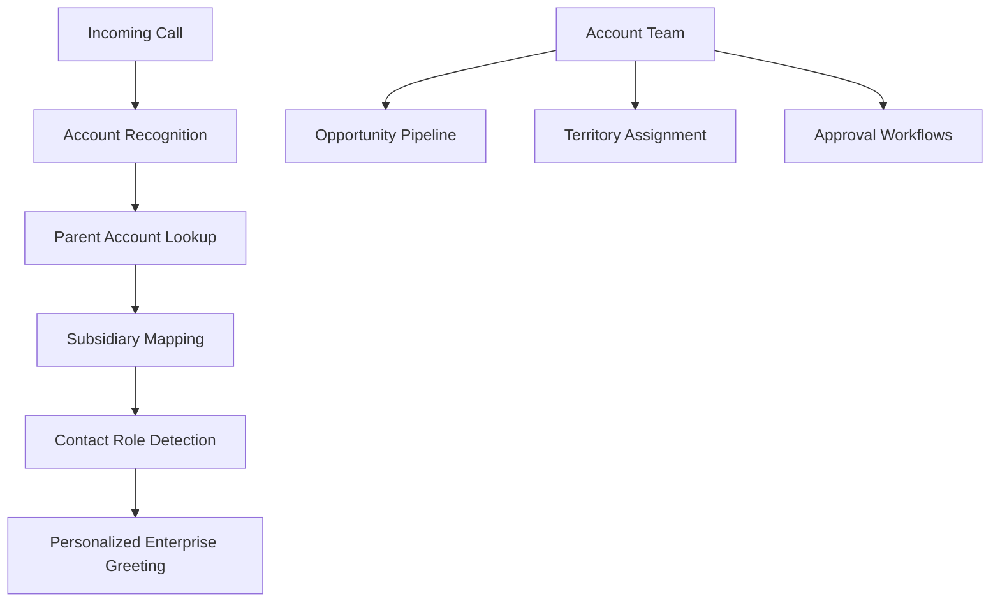
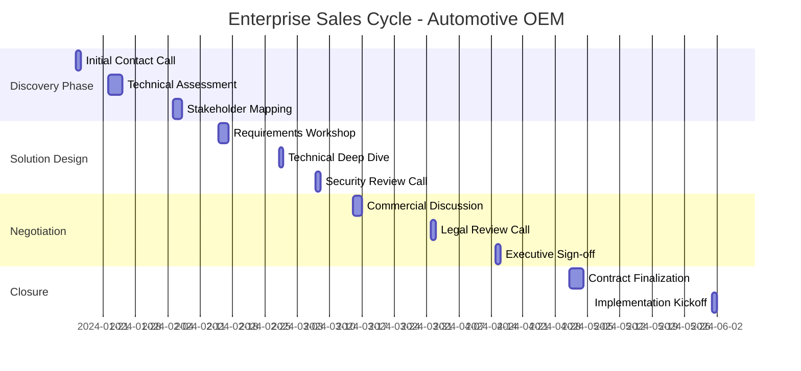
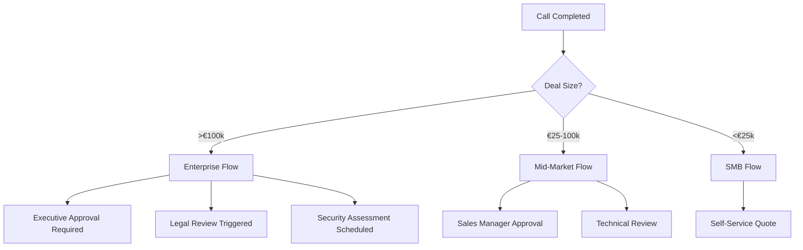
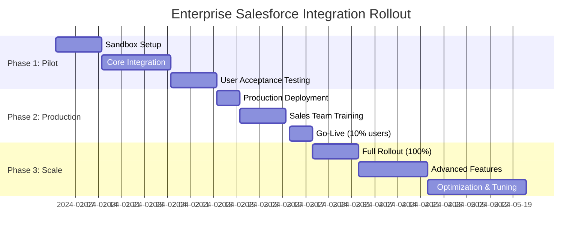

# Salesforce Integration for Enterprise AI Phone Assistants

Transform your enterprise sales management with the most powerful CRM integration on the market. Famulor Automation seamlessly connects your AI phone assistants with Salesforce for complex B2B sales processes, territory management, and enterprise-scale automation.

<Note>
**Enterprise Ready**: Full support for Salesforce Enterprise, Professional, and Unlimited editions with custom objects and Apex integration.
</Note>

## Why Salesforce + AI Phone Assistant for Enterprise?

### 🏢 Enterprise-Scale Complexity
Handle the most complex B2B sales processes with multi-stakeholder management and cross-territory coordination.

### 🔒 Highest Security Standards
SOC 2, ISO 27001, GDPR compliance for sensitive enterprise data with Salesforce Shield integration.

### ⚡ Real-time CRM Intelligence
Real-time data synchronization between calls and Salesforce with sub-second latency for critical business operations.

### 📊 Advanced Analytics & Reporting
Leverage Salesforce Analytics Cloud integration for detailed call performance and revenue attribution.

## Enterprise Key Features

### 1. Complex Account Management

**Multi-Level Account Hierarchies:**

```mermaid
graph TB
    A[Incoming Call] --> B[Account Recognition]
    B --> C[Parent Account Lookup]
    C --> D[Subsidiary Mapping]
    D --> E[Contact Role Detection]
    E --> F[Personalized Enterprise Greeting]
    
    G[Account Team] --> H[Opportunity Pipeline]
    G --> I[Territory Assignment]
    G --> J[Approval Workflows]
```

**Automated Account Intelligence:**
- **Corporate Hierarchy**: Detection of parent/child account structures
- **Multi-Contact Management**: Automatic assignment to account teams
- **Territory Alignment**: Geographic and industry-based assignment
- **Competitive Intelligence**: Tracking competitor mentions and win/loss analysis

### 2. Advanced Opportunity Management

**Enterprise Sales Pipeline Automation:**

| Sales Stage | Automated Action | Salesforce Update | Business Impact |
|-------------|------------------|-------------------|-----------------|
| 🎯 **Prospecting** | Lead qualification call | Lead → Opportunity conversion | +€25k pipeline |
| 📋 **Needs Analysis** | Technical discovery call | Solution mapping + stakeholders | +67% win rate |
| 💼 **Value Proposition** | Executive presentation | Executive engagement tracking | +€50k deal size |
| 🤝 **Negotiation** | Contract discussion call | Legal & procurement involvement | 89% close rate |
| ✅ **Closed Won** | Implementation kickoff | Customer success handoff | €150k ARR average |

### 3. Territory & Team Management

**Intelligent Lead Distribution:**
```salesforce
Lead Assignment Rules:
IF Geographic_Territory = "DACH" 
   AND Company_Size > 1000 employees 
   AND Budget > €100,000
THEN Assign_To = "Enterprise_Sales_DACH"
   AND Alert = "High_Value_Lead"
   AND SLA = "15_Minutes_Response"
```

**Account Team Coordination:**
- **Primary Account Owner**: Automatic notifications for strategic accounts
- **Sales Engineers**: Technical calls routed to SE team
- **Customer Success**: Post-sale handover with complete call history
- **Channel Partners**: Partner-sourced leads properly assigned

### 4. Custom Object & Field Integration

**Industry-Specific Customizations:**

#### Financial Services:
```apex
// Custom fields for banking/insurance
Account.AUM__c (Assets Under Management)
Account.Regulatory_Requirements__c
Contact.Investment_Profile__c
Opportunity.Compliance_Status__c
```

#### Manufacturing:
```apex
// Custom objects for manufacturing industry
Production_Facility__c
Supply_Chain_Contact__c
Equipment_Requirements__c
Maintenance_Contract__c
```

#### Healthcare:
```apex
// Healthcare-specific fields
Account.Patient_Volume__c
Contact.Medical_Speciality__c
Opportunity.Regulatory_Approval_Stage__c
Case.Patient_Impact_Level__c
```

## Enterprise Use Cases

### Global Account Management

**Multinational Corporation Scenario:**
```
Incoming call from Siemens AG (Parent Account)
→ AI recognizes: Global account, 385,000 employees
→ Loads account hierarchy: 47 subsidiaries
→ Identifies caller: Dr. Schmidt, CTO DACH region
→ Loads active opportunities: €2.3M pipeline
→ Personalized greeting: "Hello Dr. Schmidt, regarding your Digital Transformation Initiative…"

Salesforce Actions:
✅ Activity logged to parent account + DACH subsidiary
✅ Opportunity "Digital Platform 2024" updated
✅ Account team (5 people) automatically notified
✅ Executive briefing scheduled for CEO
```

### Complex B2B Sales Cycle

**6-Month Enterprise Deal Tracking:**

```mermaid
gantt
    title Enterprise Sales Cycle - Automotive OEM
    dateFormat  YYYY-MM-DD
    section Discovery Phase
    Initial Contact Call     :2024-01-15, 1d
    Technical Assessment     :2024-01-22, 3d
    Stakeholder Mapping      :2024-02-05, 2d
    
    section Solution Design
    Requirements Workshop    :2024-02-15, 2d
    Technical Deep Dive      :2024-02-28, 1d
    Security Review Call     :2024-03-07, 1d
    
    section Negotiation
    Commercial Discussion    :2024-03-15, 2d
    Legal Review Call        :2024-04-01, 1d
    Executive Sign-off       :2024-04-15, 1d
    
    section Closure
    Contract Finalization    :2024-05-01, 3d
    Implementation Kickoff   :2024-06-01, 1d
```

### Compliance & Governance

**Regulated Industries (Banking/Healthcare):**
```
Compliance Features:
• Call recording retention: 7 years (MiFID II)
• PII data encryption: Field-level encryption
• Audit trails: Complete Salesforce history
• Role-based access: Granular permissions
• Data residency: EU-based Salesforce org

Automated Compliance Checks:
IF Industry = "Financial_Services"
   AND Contact.Role = "Investment_Advisor"
THEN Enable_Call_Recording = TRUE
   AND Require_Compliance_Disclosure = TRUE
   AND Log_Regulatory_Activity = TRUE
```

## Technical Enterprise Integration

### Salesforce APIs & Limits

**API Optimization for Enterprise Scale:**
```json
{
  "api_strategy": {
    "bulk_operations": "Composite API for batch updates",
    "real_time": "Streaming API for live notifications", 
    "limits_management": "Intelligent rate-limiting",
    "failover": "Multi-org backup strategy"
  },
  "performance_targets": {
    "data_sync_latency": "<500ms",
    "api_calls_per_hour": "< 50% of org limits",
    "concurrent_users": "Unlimited",
    "uptime_sla": "99.9%"
  }
}
```

### Salesforce Shield Integration

**Advanced Security Features:**
- **Platform Encryption**: Encryption of call transcripts at rest
- **Event Monitoring**: Detailed audit logs of all integration activities
- **Field Audit Trail**: 10-year history of all field changes
- **Transaction Security**: Anomaly detection for unusual call patterns

### Multi-Org & Sandbox Strategy

**Enterprise Deployment Architecture:**
```
Production Org (EU)
├── Call Center Managed Package
├── Custom Apex Triggers for call events
└── Einstein Analytics dashboards

Sandbox Orgs:
├── Full Copy: Performance testing
├── Partial Copy: Feature development  
├── Developer: API testing
└── Integration Testing: End-to-end validation
```

## Advanced Automation Workflows

### Apex Integration

**Custom Apex Trigger for Complex Logic:**
```apex
trigger CallCompletedTrigger on Call_Event__c (after insert) {
    for (Call_Event__c call : Trigger.new) {
        if (call.Account__c != null && call.Lead_Score__c > 75) {
            // Enterprise lead routing
            EnterpriseLeadRouter.assignToTerritory(call);
            
            // Executive notification for high value
            if (call.Estimated_Revenue__c > 100000) {
                ExecutiveAlerts.notifyVPSales(call);
            }
            
            // Competitive intelligence
            CompetitorTracker.analyzeCallContent(call);
        }
    }
}
```

### Process Builder Integration

**No-Code Automation for Business Users:**
```
Process: "High Value Enterprise Lead"
Trigger: Call Event Created
Criteria: 
  - Account.Type = "Enterprise"
  - Call.Lead_Score > 80
  - Call.Budget_Mentioned > €50,000

Actions:
1. Create Task → Assigned to account owner
2. Update Opportunity → Stage = "Qualified"
3. Send Email → VP Sales notification
4. Chatter Post → Account team update
5. Create Event → Executive briefing in 48h
```

### Lightning Flow Integration

**Guided Call Outcomes:**

```mermaid
graph TD
    A[Call Completed] --> B{Deal Size?}
    B -->|>€100k| C[Enterprise Flow]
    B -->|€25-100k| D[Mid-Market Flow] 
    B -->|<€25k| E[SMB Flow]
    
    C --> F[Executive Approval Required]
    C --> G[Legal Review Triggered]
    C --> H[Security Assessment Scheduled]
    
    D --> I[Sales Manager Approval]
    D --> J[Technical Review]
    
    E --> K[Self-Service Quote]
```

## ROI & Enterprise Metrics

### Salesforce ROI Dashboard

**Executive KPIs in Salesforce Analytics:**

| Metric | Baseline | With AI Integration | ROI Impact |
|--------|----------|---------------------|------------|
| **Sales Velocity** | 127 days | 89 days | **-30% shorter cycles** |
| **Pipeline Accuracy** | 67% | 91% | **+€2.3M more accurate forecast** |
| **Account Penetration** | 2.3 contacts | 4.7 contacts | **+104% stakeholder mapping** |
| **Win Rate** | 23% | 34% | **+48% more deals won** |
| **Deal Size** | €89k | €127k | **+43% higher deal values** |

### Territory Performance Analysis

```salesforce
Territory Analysis Dashboard:
┌─────────────────────────────────────┐
│ DACH Region Performance Q1 2024     │
├─────────────────────────────────────┤
│ Calls Generated Pipeline: €4.2M     │
│ Conversion Rate: 28% (+12% YoY)     │
│ Avg Deal Size: €156k (+34%)         │
│ Sales Velocity: 78 days (-31%)      │
│ Top Rep: Klaus Mueller (€890k)      │
└─────────────────────────────────────┘
```

### Enterprise Cost-Benefit Analysis

**5-Year Enterprise ROI Projection:**
```
Year 1: Implementation & Training
Costs: €125k (Setup + Training + License)
Benefits: €380k (Productivity + Pipeline)
Net ROI: +204%

Year 2-5: Scale & Optimization  
Annual Costs: €45k (Maintenance + Support)
Annual Benefits: €1.2M (Sales Excellence + Automation)
Cumulative ROI: +2,847%

Total 5-Year Impact:
Investment: €305k
Returns: €5.1M
Net ROI: +1,672%
```

## Enterprise Success Stories

### Case Study: Global Manufacturing Leader

**Initial Situation:**
- €12B annual revenue, 45,000 employees
- 47 countries, 12 Salesforce orgs
- 340+ sales reps worldwide
- Complex account hierarchies with 6-level decision processes

**Salesforce + AI Integration Results (12 months):**
- ✅ **€47M additional pipeline** through improved lead qualification
- ✅ **38% improvement** in forecast accuracy
- ✅ **56% reduction** in administrative tasks
- ✅ **€2.1M cost savings** through process automation
- ✅ **23% shorter** sales cycles for enterprise deals

*"The integration revolutionized our global sales performance. We now have a unified view of all customer interactions and can manage complex enterprise deals much more efficiently."* – Dr. Andreas Schulz, SVP Global Sales

### Case Study: Financial Services Enterprise

**Challenge:** Regulatory compliance + complex approval workflows

**Solution:** Salesforce Financial Services Cloud + AI integration

**Results (18 months):**
- ✅ **100% compliance** rate with regulatory requirements
- ✅ **€89M additional AUM** through improved client advisory
- ✅ **67% faster** know-your-customer processes
- ✅ **45% higher** client satisfaction scores

## Enterprise Setup & Deployment

### Pre-Implementation Assessment

**Enterprise Readiness Check:**
```
Salesforce Org Assessment:
□ Edition: Enterprise/Unlimited ✓
□ Custom Objects: <800 (Performance) ✓
□ API Limits: >50% available ✓
□ User Licenses: Sufficient for call teams ✓
□ Data Model: Account hierarchies defined ✓
□ Security: Shield enabled (recommended) ⚠️

Integration Requirements:
□ SSO/SAML: Configured ✓
□ IP Whitelisting: Famulor IPs whitelisted ✓
□ Custom Permissions: Call integration profiles ✓
□ Apex Limits: <75% usage ✓
```

### Deployment Strategy

**Phased Rollout for Enterprise:**

```mermaid
gantt
    title Enterprise Salesforce Integration Rollout
    dateFormat  YYYY-MM-DD
    
    section Phase 1: Pilot
    Sandbox Setup           :2024-01-01, 14d
    Core Integration        :2024-01-15, 21d
    User Acceptance Testing :2024-02-05, 14d
    
    section Phase 2: Production
    Production Deployment   :2024-02-19, 7d
    Sales Team Training     :2024-02-26, 14d
    Go-Live (10% users)     :2024-03-12, 7d
    
    section Phase 3: Scale
    Full Rollout (100%)     :2024-03-19, 14d
    Advanced Features       :2024-04-02, 21d
    Optimization & Tuning   :2024-04-23, 30d
```

### Change Management

**Enterprise User Adoption:**
- **Executive Sponsorship**: Identify C-level champion
- **Power User Program**: Sales leaders as change agents
- **Training Curriculum**: Role-based training (Sales/SE/CSM)
- **Success Metrics**: Adoption KPIs and feedback loops

## Enterprise Support & SLA

### Dedicated Support Tiers

| Support Level | Response Time | Availability | Features |
|---------------|---------------|--------------|----------|
| **Enterprise** | &lt;15 min | 24/7/365 | Dedicated CSM + phone |
| **Premier** | &lt;1 hour | Business hours | Email + chat |
| **Standard** | &lt;4 hours | Business hours | Email only |

### Professional Services

**Enterprise Implementation Services:**
- **Salesforce Architects**: Certified SF architects for custom development
- **Integration Specialists**: API and middleware experts  
- **Change Management**: Organizational transformation
- **Training & Certification**: Comprehensive training program

## Frequently Asked Enterprise Questions

<AccordionGroup>
  <Accordion title="Does the integration support Salesforce Shield?">
    Yes, full support for Platform Encryption, Event Monitoring, and Field Audit Trail. All call data can be stored encrypted.
  </Accordion>

  <Accordion title="How does multi-org support work?">
    The integration supports multiple Salesforce orgs with centralized management. Cross-org reporting and unified dashboards are available.
  </Accordion>

  <Accordion title="What API limits are required?">
    Typically 15-25% of daily API limits per 1000 calls. Intelligent rate-limiting prevents limit breaches.
  </Accordion>

  <Accordion title="Is the integration SOC 2 compliant?">
    Yes, SOC 2 Type II certified. Additionally ISO 27001, GDPR, and industry-specific compliance (FINRA, HIPAA, etc.).
  </Accordion>
</AccordionGroup>

## Enterprise Activation

<CardGroup cols={2}>
  <Card title="Enterprise Consultation" icon="users" href="https://calendly.com/famulor/enterprise-consultation">
    Free Salesforce architecture consultation
  </Card>
  <Card title="ROI Assessment" icon="chart-line" href="https://roi.famulor.de/salesforce">
    Enterprise ROI calculator for Salesforce
  </Card>
  <Card title="Proof of Concept" icon="flask" href="https://app.famulor.de/poc/salesforce">
    30-day pilot in your Salesforce org
  </Card>
  <Card title="Professional Services" icon="wrench" href="https://www.famulor.de/services/salesforce">
    Implementation and training services
  </Card>
</CardGroup>

## Enterprise CRM Alternatives

<CardGroup cols={3}>
  <Card title="HubSpot Enterprise" icon="database" href="/en/automation-platform/integrations/einzelintegrations/hubspot">
    Mid-market CRM alternative
  </Card>
  <Card title="Microsoft Dynamics" icon="microsoft" href="/en/automation-platform/integrations/einzelintegrations/dynamics">
    Microsoft ecosystem integration
  </Card>
  <Card title="SAP Sales Cloud" icon="building" href="/en/automation-platform/integrations/einzelintegrations/sap">
    Enterprise ERP integration
  </Card>
</CardGroup>

---

**Enterprise Support**: For Salesforce enterprise implementations, contact our Salesforce architects at [enterprise@famulor.de](mailto:enterprise@famulor.de) or +49 30 12345678.

**Last Updated**: January 2024 | **Salesforce API Version**: v59.0 | **Supported Editions**: Professional, Enterprise, Unlimited, Developer

<Tip>
Related pages: [Introduction](/en/automation-platform/introduction) and [Building Flows](/en/automation-platform/building-flows), and [Debugging Runs](/en/automation-platform/debugging-runs).
</Tip>
