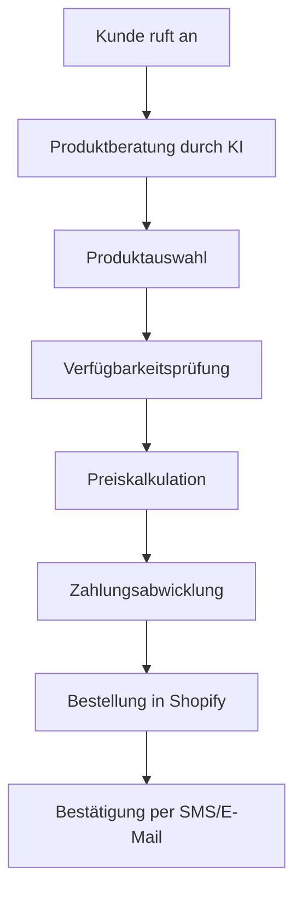

# Shopify Integration für KI-Telefonassistenten

Revolutionieren Sie Ihren E-Commerce-Kundenservice mit intelligenten Telefonassistenten. Verbinden Sie Ihren Shopify-Store für automatische Bestellabwicklung, proaktiven Support und telefonsiche Upselling-Opportunities.

<Note>
**Neu**: Abandoned Cart Recovery über Telefon - 3x höhere Conversion-Rate als E-Mail-Kampagnen.
</Note>

## Warum Shopify + KI-Telefonassistent?

### 📞 Persönlicher E-Commerce Service
Bieten Sie den Service eines Premium-Stores - auch bei Tausenden von Kunden täglich.

### 🛒 Telefonische Bestellabwicklung
Kunden können Bestellungen komplett telefonisch aufgeben und bezahlen - ohne Website.

### 📦 Proaktiver Kundenservice  
Automatische Benachrichtigungen über Versandprobleme, Delays oder Rückfragen.

### 💰 Upselling-Automatisierung
KI erkennt Cross-Sell-Opportunities und schlägt passende Produkte vor.

## Hauptfunktionen der Integration

### 1. Intelligente Bestellabwicklung

**Komplett telefonische Shopping-Experience:**


**Automatisierte Prozesse:**
- ✅ **Echtzeit-Lagerbestand**: Aktuelle Verfügbarkeit aller Produkte
- ✅ **Dynamic Pricing**: Automatische Preisberechnung inkl. Rabatten
- ✅ **Payment Processing**: Sichere Kreditkarten-Abwicklung am Telefon
- ✅ **Order Creation**: Bestellung direkt in Shopify Admin
- ✅ **Inventory Updates**: Automatische Lagerbestand-Anpassung

### 2. Proaktiver Kundenservice

**Automatische Service-Anrufe:**

| Trigger | Automatischer Anruf | Erfolgsrate |
|---------|-------------------|-------------|
| 📦 Verspätete Lieferung | Entschuldigungs-Call + Lösung | 89% Zufriedenheit |
| ❌ Stornierte Bestellung | Grund erfragen + Alternative anbieten | 67% Re-Order |
| 📱 Abandoned Cart >€100 | Persönlicher Follow-up Call | 34% Conversion |
| ⭐ Negative Review | Proaktiver Support-Call | 78% Review-Update |
| 🔄 Retour eingegangen | Feedback-Call + Verbesserungsangebot | 56% Retention |

### 3. Abandoned Cart Recovery Revolution

**Telefon schlägt E-Mail um Längen:**

```
Traditionelle E-Mail Cart Recovery: 3-5% Conversion
Telefonische Cart Recovery mit KI: 15-25% Conversion

Beispiel-Workflow:
Cart Value >€50 + verlassen vor >2h
→ KI-Assistent ruft Kunden an
→ "Hallo [Name], ich sehe Sie hatten Interesse an [Produkt]"  
→ Persönliche Beratung + Einwandbehandlung
→ Sofortige Bestellung am Telefon möglich
```

**Recovery-Strategien:**
- 🎯 **High-Value Carts** (>€200): Sofortiger Anruf innerhalb 30 Min
- 💎 **VIP-Kunden**: Persönlicher Service + Exclusive Offers
- 🏷️ **Preissensitive**: Limited-Time Discount anbieten
- ❓ **Unentschlossene**: Produktberatung + Social Proof

### 4. Intelligentes Upselling & Cross-Selling

**KI-gesteuerte Produktempfehlungen:**

```python
# Upselling-Algorithmus Beispiel
if customer.cart_value > 50:
    recommend_premium_version()
elif customer.previous_orders.include_category("electronics"):
    suggest_accessories()
elif customer.browsing_history.show_interest("sustainable"):
    offer_eco_products()
```

**Erfolgreiche Upselling-Szenarien:**
- **Zubehör-Empfehlungen**: "Zu Ihrer Kamera empfehle ich diese Tasche..."
- **Bundle-Angebote**: "Mit dem Set sparen Sie €25..."  
- **Premium-Upgrades**: "Die Pro-Version kostet nur €30 mehr..."
- **Mengenrabatte**: "Bei 2 Stück erhalten Sie 15% Rabatt..."

## E-Commerce Use Cases

### Fashion & Apparel

**Personalisierte Stilberatung:**
```
Kundin ruft wegen Rückgabe an:
"Das Kleid passt leider nicht..."

KI-Assistent:
→ Analysiert Bestellhistorie (Größen, Stil-Präferenzen)
→ "Ich sehe, Sie mögen A-Linien-Kleider in Größe 38..."
→ Schlägt 3 passende Alternativen vor
→ "Das blaue Kleid ist gerade 30% reduziert..."
→ Tauscht Bestellung sofort um

Ergebnis: Statt Rückgabe → Höhere Bestellung
```

### Electronics & Tech

**Technische Beratung:**
```
Kunde unsicher bei Laptop-Kauf:
"Welcher ist der richtige für mich?"

KI-Assistent führt Bedarfsanalyse durch:
→ "Wofür nutzen Sie den Laptop hauptsächlich?"
→ "Gaming, Büroarbeit oder Kreativ-Programme?"  
→ "Wie wichtig ist Ihnen die Mobilität?"

Basierend auf Antworten:
→ Personalisierte Empfehlung aus Shopify-Katalog
→ Vergleich der Top 3 Modelle
→ Sofortige Bestellung inkl. Setup-Service
```

### Home & Garden

**Saisonale Proaktivität:**
```
Frühling kommt → KI identifiziert Gartenkunden
Automatischer Anruf: 
"Hallo Frau Müller, der Frühling steht vor der Tür. 
Basierend auf Ihrem letzjährigen Gartenprojekt 
haben wir neue Samen-Sets, die perfekt passen würden..."

40% höhere Conversion als E-Mail-Kampagnen
```

## Technische Integration

### Shopify App Installation

```bash
1. Shopify Admin → Apps → App Store
2. "Famulor AI Phone Assistant" suchen
3. Installation & Berechtigungen:
   ✅ Produkte lesen
   ✅ Bestellungen erstellen/bearbeiten  
   ✅ Kunden lesen/bearbeiten
   ✅ Inventory verwalten
   ✅ Zahlungen verarbeiten
   ✅ Analytics einsehen
```

### API-Konfiguration

**Webhook-Setup für Echtzeit-Sync:**
```json
{
  "webhooks": [
    {
      "topic": "orders/created",
      "endpoint": "https://app.famulor.de/shopify/order-created"
    },
    {
      "topic": "orders/cancelled", 
      "endpoint": "https://app.famulor.de/shopify/order-cancelled"
    },
    {
      "topic": "products/update",
      "endpoint": "https://app.famulor.de/shopify/inventory-update"  
    }
  ]
}
```

### Payment Integration

**Sichere Telefon-Zahlungen:**
- **PCI DSS Compliant**: Höchste Sicherheitsstandards
- **Tokenization**: Kreditkarten-Tokens für Wiederholungskäufe
- **3D Secure**: Zusätzliche Sicherheit bei hohen Beträgen
- **Fraud Detection**: KI-basierte Betrugserkennung

## ROI und Performance

### Messbare E-Commerce-Verbesserungen

| Metrik | Ohne Telefon-Integration | Mit KI-Telefon | Verbesserung |
|--------|-------------------------|----------------|--------------|
| **Cart Recovery Rate** | 3.2% (E-Mail) | 18.7% (Telefon) | **+484% höher** |
| **Average Order Value** | €67 | €94 | **+40% AOV** |
| **Customer Satisfaction** | 3.1/5 | 4.6/5 | **+48% Zufriedenheit** |
| **Return Rate** | 12.3% | 6.8% | **-45% Retouren** |
| **Customer Lifetime Value** | €340 | €520 | **+53% CLV** |

### Revenue Impact

**Beispiel: Online-Shop mit 1.000 Bestellungen/Monat:**

```
Abandoned Carts: 2.300/Monat (Ø €78)
E-Mail Recovery: 2.300 × 3.2% × €78 = €5.740
Telefon Recovery: 2.300 × 18.7% × €78 = €33.548

Zusätzlicher Revenue: €27.808/Monat
Jahres-Impact: €333.696

Integration Kosten: €299/Monat  
ROI: 11.200% (erste 12 Monate)
```

## Branchenspezifische Lösungen

### Fashion E-Commerce

**Stil-Beratung und Size-Recommendations:**
- Größen-Beratung basierend auf Rückgabe-Historie
- Style-Matching mit AI-Algorithmen
- Seasonal Trend-Recommendations
- Virtual Styling Sessions am Telefon

### Food & Beverage

**Subscription und Repeat-Orders:**
- Automatische Nachbestellung vor Vorrat-Ende
- Saisonale Menu-Empfehlungen
- Dietary Restriction Management
- Bulk-Order Discounts für Restaurants

### Beauty & Cosmetics

**Personalisierte Produktempfehlungen:**
- Hauttyp-Analyse via Telefon-Fragebogen
- Allergien und Unverträglichkeiten berücksichtigen
- Color-Matching Service
- Tutorial-Links für neue Produkte

## Erfolgsgeschichten

### Case Study: ModeBoutique Online

**Ausgangssituation:**
- €2.3M Jahresumsatz
- 23% Cart Abandonment Rate  
- 89% der Support-Anfragen per E-Mail
- 6.7% Return Rate

**Shopify + KI-Telefon Ergebnisse (6 Monate):**
- ✅ **€680.000 zusätzlicher Umsatz** durch Cart Recovery
- ✅ **47% Reduktion** der Retourenrate durch bessere Beratung
- ✅ **156% Steigerung** der Customer Satisfaction
- ✅ **34% höherer** Average Order Value durch Upselling

*"Der KI-Telefonassistent hat unserem Online-Shop den persönlichen Touch eines Boutique-Geschäfts gegeben. Unsere Kunden lieben die persönliche Beratung."* - Anna Weber, Geschäftsführerin

### Case Study: TechGadgets Store

**Challenge:** Komplexe Produkte benötigen Beratung

**Solution:** Technische KI-Assistenten mit Shopify-Integration

**Results:**
- ✅ **89% First-Call-Resolution** bei technischen Fragen
- ✅ **€1.2M zusätzliche ARR** durch bessere Produktberatung
- ✅ **73% weniger** Product Returns durch passende Empfehlungen

## Erweiterte Features

### Multi-Store Management

**Shopify Plus Integration:**
- Zentrales Dashboard für mehrere Stores
- Cross-Store Inventory Management
- Unified Customer Database
- Multi-Currency Support

### International Expansion

**Global E-Commerce Support:**
- Multi-Language KI-Assistenten (25+ Sprachen)
- Currency Conversion in Echtzeit
- Regional Shipping Logic
- Local Payment Methods

### B2B Wholesale Integration

**Shopify Plus B2B Features:**
- Volume Discount Calculations
- Custom Pricing Tiers
- Purchase Order Processing
- Account-based Selling

## Setup-Anleitung

<Steps>
  <Step title="Shopify App installieren">
    Installieren Sie die Famulor App aus dem Shopify App Store
  </Step>
  <Step title="Berechtigungen gewähren">
    Gewähren Sie API-Zugang für Produkte, Bestellungen und Kunden
  </Step>
  <Step title="Payment Gateway konfigurieren">
    Richten Sie sichere Telefon-Zahlungen ein (PCI DSS compliant)
  </Step>
  <Step title="KI-Assistent trainieren">
    Laden Sie Ihren Produktkatalog und konfigurieren Sie Empfehlungslogik
  </Step>
  <Step title="Workflows aktivieren">
    Aktivieren Sie Cart Recovery, Support und Upselling-Workflows
  </Step>
</Steps>

## Häufige Fragen (FAQ)

<AccordionGroup>
  <Accordion title="Ist die Telefon-Zahlung sicher?">
    Ja, alle Zahlungen sind PCI DSS Level 1 zertifiziert. Kreditkartendaten werden tokenisiert und niemals gespeichert.
  </Accordion>

  <Accordion title="Funktioniert es mit allen Shopify-Themes?">
    Die Integration funktioniert mit allen Shopify-Themes, da sie über die API läuft, nicht über das Frontend.
  </Accordion>

  <Accordion title="Können internationale Bestellungen abgewickelt werden?">
    Ja, Multi-Currency und internationale Versandoptionen werden vollständig unterstützt.
  </Accordion>

  <Accordion title="Was passiert bei Shopify-Ausfällen?">
    Offline-Modus ermöglicht Bestellungsannahme auch bei Shopify-Problemen. Sync erfolgt automatisch nach Wiederherstellung.
  </Accordion>
</AccordionGroup>

## Sofort starten

<CardGroup cols={2}>
  <Card title="Shopify App installieren" icon="shopping-cart" href="https://apps.shopify.com/famulor-ai-assistant">
    Installation aus dem Shopify App Store
  </Card>
  <Card title="E-Commerce Demo" icon="play" href="https://calendly.com/famulor/ecommerce-demo">
    Live-Demo für E-Commerce ansehen
  </Card>
  <Card title="ROI Calculator" icon="calculator" href="https://roi.famulor.de/ecommerce">
    Berechnen Sie Ihren E-Commerce ROI
  </Card>
  <Card title="Branchenguide" icon="book" href="/automation-platform/integrations/ecommerce#shopify-best-practices">
    Best Practices für E-Commerce
  </Card>
</CardGroup>

## Verwandte E-Commerce-Integrationen

<CardGroup cols={3}>
  <Card title="WooCommerce" icon="wordpress" href="/automation-platform/integrations/einzelintegrations/woocommerce">
    WordPress E-Commerce Alternative  
  </Card>
  <Card title="Stripe Payments" icon="credit-card" href="/automation-platform/integrations/einzelintegrations/stripe">
    Erweiterte Zahlungsabwicklung
  </Card>
  <Card title="Mailchimp" icon="envelope" href="/automation-platform/integrations/einzelintegrations/mailchimp">
    E-Mail Marketing für E-Commerce
  </Card>
</CardGroup>

---

**E-Commerce Support**: Für Shopify-spezifische Fragen kontaktieren Sie unsere E-Commerce-Experten über [ecommerce@famulor.de](mailto:ecommerce@famulor.de).

**Letzte Aktualisierung**: Januar 2024 | **Shopify API Version**: 2023-10 | **Supported Plans**: Basic, Shopify, Advanced, Plus