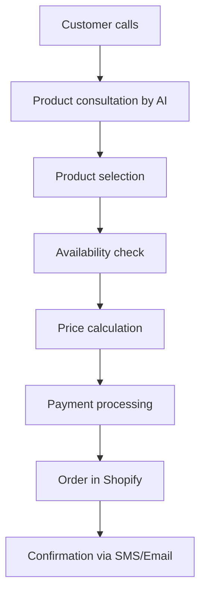

# Shopify Integration for AI Phone Assistants

Revolutionize your e-commerce customer service with intelligent phone assistants. Connect your Shopify store for automated order processing, proactive support, and phone-based upselling opportunities.

<Note>
**New**: Abandoned Cart Recovery via Phone – 3x higher conversion rate compared to email campaigns.
</Note>

## Why Shopify + AI Phone Assistant?

### 📞 Personal E-Commerce Service  
Deliver the service of a premium store – even with thousands of customers daily.

### 🛒 Phone-Based Order Processing  
Customers can place and pay for orders entirely by phone – no website needed.

### 📦 Proactive Customer Service  
Automatic notifications for shipping issues, delays, or inquiries.

### 💰 Upselling Automation  
AI detects cross-sell opportunities and suggests relevant products.

## Key Features of the Integration

### 1. Intelligent Order Processing

**Complete phone shopping experience:**

```mermaid
graph TD
    A[Customer calls] --> B[Product consultation by AI]
    B --> C[Product selection]
    C --> D[Availability check]  
    D --> E[Price calculation]
    E --> F[Payment processing]
    F --> G[Order in Shopify]
    G --> H[Confirmation via SMS/Email]
```

**Automated processes:**
- ✅ **Real-time Inventory**: Current availability of all products
- ✅ **Dynamic Pricing**: Automatic price calculation including discounts
- ✅ **Payment Processing**: Secure credit card handling over the phone
- ✅ **Order Creation**: Order directly created in Shopify Admin
- ✅ **Inventory Updates**: Automatic stock level adjustments

### 2. Proactive Customer Service

**Automated service calls:**

| Trigger                 | Automated Call                    | Success Rate       |
|-------------------------|---------------------------------|--------------------|
| 📦 Delayed delivery      | Apology call + solution          | 89% satisfaction   |
| ❌ Cancelled order       | Reason inquiry + alternative offer| 67% re-order      |
| 📱 Abandoned cart >€100  | Personal follow-up call          | 34% conversion     |
| ⭐ Negative review       | Proactive support call           | 78% review update  |
| 🔄 Returned item received| Feedback call + improvement offer| 56% retention      |

### 3. Abandoned Cart Recovery Revolution

**Phone beats email by far:**

```
Traditional email cart recovery: 3–5% conversion
Phone cart recovery with AI: 15–25% conversion

Sample workflow:
Cart value >€50 + abandoned >2h ago
→ AI assistant calls customer
→ "Hello [Name], I noticed you were interested in [Product]"
→ Personal advice + objection handling
→ Immediate phone order possible
```

**Recovery strategies:**
- 🎯 **High-Value Carts** (>€200): Immediate call within 30 minutes
- 💎 **VIP Customers**: Personalized service + exclusive offers
- 🏷️ **Price-Sensitive**: Limited-time discount offers
- ❓ **Undecided**: Product consultation + social proof

### 4. Intelligent Upselling & Cross-Selling

**AI-driven product recommendations:**

```python
# Upselling algorithm example
if customer.cart_value > 50:
    recommend_premium_version()
elif customer.previous_orders.include_category("electronics"):
    suggest_accessories()
elif customer.browsing_history.show_interest("sustainable"):
    offer_eco_products()
```

**Successful upselling scenarios:**
- **Accessory recommendations**: "For your camera, I recommend this bag..."
- **Bundle offers**: "Save €25 with this set..."  
- **Premium upgrades**: "The Pro version costs only €30 more..."
- **Volume discounts**: "Buy 2 items and receive 15% off..."

## E-Commerce Use Cases

### Fashion & Apparel

**Personalized style advice:**
```
Customer calls about a return:
"The dress doesn't fit..."

AI assistant:
→ Analyzes order history (sizes, style preferences)
→ "I see you like A-line dresses in size 38..."
→ Suggests 3 suitable alternatives
→ "The blue dress is currently 30% off..."
→ Exchanges order immediately

Result: Instead of return → increased order value
```

### Electronics & Tech

**Technical consultation:**
```
Customer unsure about laptop purchase:
"Which one is right for me?"

AI assistant conducts needs analysis:
→ "What will you mainly use the laptop for?"
→ "Gaming, office work, or creative software?"  
→ "How important is mobility to you?"

Based on answers:
→ Personalized recommendation from Shopify catalog
→ Comparison of top 3 models
→ Immediate order including setup service
```

### Home & Garden

**Seasonal proactivity:**
```
Spring approaching → AI identifies garden customers
Automated call: 
"Hello Mrs. Müller, spring is right around the corner. 
Based on your garden project last year, 
we have new seed kits that would be perfect..."

40% higher conversion than email campaigns
```

## Technical Integration

### Shopify App Installation

```bash
1. Shopify Admin → Apps → App Store
2. Search for "Famulor AI Phone Assistant"
3. Installation & permissions:
   ✅ Read products
   ✅ Create/edit orders  
   ✅ Read/edit customers
   ✅ Manage inventory
   ✅ Process payments
   ✅ Access analytics
```

### API Configuration

**Webhook setup for real-time sync:**
```json
{
  "webhooks": [
    {
      "topic": "orders/created",
      "endpoint": "https://app.famulor.de/shopify/order-created"
    },
    {
      "topic": "orders/cancelled", 
      "endpoint": "https://app.famulor.de/shopify/order-cancelled"
    },
    {
      "topic": "products/update",
      "endpoint": "https://app.famulor.de/shopify/inventory-update"  
    }
  ]
}
```

### Payment Integration

**Secure phone payments:**
- **PCI DSS Compliant**: Highest security standards
- **Tokenization**: Credit card tokens for repeat purchases
- **3D Secure**: Additional security for high-value transactions
- **Fraud Detection**: AI-based fraud identification

## ROI and Performance

### Measurable E-Commerce Improvements

| Metric                 | Without Phone Integration | With AI Phone    | Improvement       |
|------------------------|---------------------------|-----------------|-------------------|
| **Cart Recovery Rate** | 3.2% (Email)               | 18.7% (Phone)   | **+484% higher**  |
| **Average Order Value**| €67                        | €94             | **+40% AOV**      |
| **Customer Satisfaction**| 3.1/5                    | 4.6/5           | **+48% satisfaction** |
| **Return Rate**        | 12.3%                      | 6.8%            | **-45% returns**  |
| **Customer Lifetime Value**| €340                   | €520            | **+53% CLV**      |

### Revenue Impact

**Example: Online shop with 1,000 orders/month:**

```
Abandoned carts: 2,300/month (avg. €78)
Email recovery: 2,300 × 3.2% × €78 = €5,740
Phone recovery: 2,300 × 18.7% × €78 = €33,548

Additional revenue: €27,808/month
Annual impact: €333,696

Integration cost: €299/month  
ROI: 11,200% (first 12 months)
```

## Industry-Specific Solutions

### Fashion E-Commerce

**Style advice and size recommendations:**
- Size advice based on return history
- Style matching with AI algorithms
- Seasonal trend recommendations
- Virtual styling sessions via phone

### Food & Beverage

**Subscription and repeat orders:**
- Automatic reordering before stock runs out
- Seasonal menu suggestions
- Dietary restrictions management
- Bulk order discounts for restaurants

### Beauty & Cosmetics

**Personalized product recommendations:**
- Skin type analysis via phone questionnaire
- Allergy and intolerance considerations
- Color matching service
- Tutorial links for new products

## Success Stories

### Case Study: ModeBoutique Online

**Starting situation:**
- €2.3M annual revenue
- 23% cart abandonment rate  
- 89% of support requests via email
- 6.7% return rate

**Shopify + AI phone results (6 months):**
- ✅ **€680,000 additional revenue** from cart recovery
- ✅ **47% reduction** in return rates due to better advice
- ✅ **156% increase** in customer satisfaction
- ✅ **34% higher** average order value through upselling

*"The AI phone assistant gave our online shop the personal touch of a boutique store. Our customers love the personalized advice."* – Anna Weber, Managing Director

### Case Study: TechGadgets Store

**Challenge:** Complex products needing consultation

**Solution:** Technical AI assistants with Shopify integration

**Results:**
- ✅ **89% first-call resolution** on technical questions
- ✅ **€1.2M additional ARR** through better product advice
- ✅ **73% fewer** product returns through suitable recommendations

## Advanced Features

### Multi-Store Management

**Shopify Plus integration:**
- Central dashboard for multiple stores
- Cross-store inventory management
- Unified customer database
- Multi-currency support

### International Expansion

**Global e-commerce support:**
- Multi-language AI assistants (25+ languages)
- Real-time currency conversion
- Regional shipping logic
- Local payment methods

### B2B Wholesale Integration

**Shopify Plus B2B features:**
- Volume discount calculations
- Custom pricing tiers
- Purchase order processing
- Account-based selling

## Setup Guide

<Steps>
  <Step title="Install Shopify App">
    Install the Famulor app from the Shopify App Store
  </Step>
  <Step title="Grant Permissions">
    Grant API access for products, orders, and customers
  </Step>
  <Step title="Configure Payment Gateway">
    Set up secure phone payments (PCI DSS compliant)
  </Step>
  <Step title="Train AI Assistant">
    Upload your product catalog and configure recommendation logic
  </Step>
  <Step title="Activate Workflows">
    Enable cart recovery, support, and upselling workflows
  </Step>
</Steps>

## Frequently Asked Questions (FAQ)

<AccordionGroup>
  <Accordion title="Is phone payment secure?">
    Yes, all payments are PCI DSS Level 1 certified. Credit card data is tokenized and never stored.
  </Accordion>

  <Accordion title="Does it work with all Shopify themes?">
    The integration works with all Shopify themes since it operates via the API, not the frontend.
  </Accordion>

  <Accordion title="Can international orders be processed?">
    Yes, multi-currency and international shipping options are fully supported.
  </Accordion>

  <Accordion title="What happens during Shopify outages?">
    Offline mode allows order acceptance even during Shopify issues. Sync happens automatically after recovery.
  </Accordion>
</AccordionGroup>

## Get Started Now

<CardGroup cols={2}>
  <Card title="Install Shopify App" icon="shopping-cart" href="https://apps.shopify.com/famulor-ai-assistant">
    Install from the Shopify App Store
  </Card>
  <Card title="E-Commerce Demo" icon="play" href="https://calendly.com/famulor/ecommerce-demo">
    Watch a live demo for e-commerce
  </Card>
  <Card title="ROI Calculator" icon="calculator" href="https://roi.famulor.de/ecommerce">
    Calculate your e-commerce ROI
  </Card>
  <Card title="Industry Guide" icon="book" href="/automation-platform/integrations/ecommerce#shopify-best-practices">
    Best practices for e-commerce
  </Card>
</CardGroup>

## Related E-Commerce Integrations

<CardGroup cols={3}>
  <Card title="WooCommerce" icon="wordpress" href="/automation-platform/integrations/einzelintegrations/woocommerce">
    WordPress e-commerce alternative  
  </Card>
  <Card title="Stripe Payments" icon="credit-card" href="/automation-platform/integrations/einzelintegrations/stripe">
    Advanced payment processing
  </Card>
  <Card title="Mailchimp" icon="envelope" href="/automation-platform/integrations/einzelintegrations/mailchimp">
    Email marketing for e-commerce
  </Card>
</CardGroup>

---

**E-Commerce Support**: For Shopify-specific questions, contact our e-commerce experts at [ecommerce@famulor.de](mailto:ecommerce@famulor.de).

**Last updated**: January 2024 | **Shopify API Version**: 2023-10 | **Supported Plans**: Basic, Shopify, Advanced, Plus