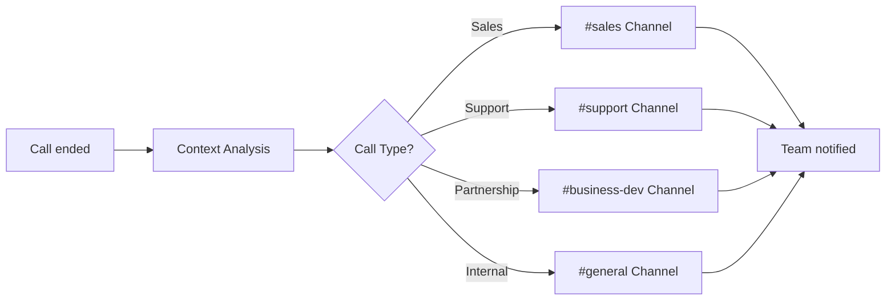

# Slack Integration with AI Phone Assistants

Revolutionize your team communication with intelligent phone assistants. Famulor Automation seamlessly connects your calls with Slack for instant team updates, automatic notifications, and efficient workflow coordination.

<Note>
**Instant Team Sync**: Slack integration ensures your entire team stays informed in real time about important call developments.
</Note>

## Why Slack + AI Phone Assistant?

### 💬 Immediate Team Notifications  
Key call updates are automatically posted in relevant Slack channels so the team is always informed.

### 🔄 Seamless Workflow Integration  
Call-based actions automatically trigger Slack workflows to keep everyone in the loop.

### 🎯 Intelligent Channel Routing  
AI detects the call context and posts updates to the right channels and appropriate team members.

### ⚡ Real-time Collaboration  
Teams can quickly respond to call insights and make collaborative decisions.

## Key Features of the Integration

### 1. Automatic Call Updates in Channels

**Intelligent Channel Routing:**


**Automatic Slack Posts:**  
- ✅ **Lead Updates:** New leads automatically posted in the sales channel  
- ✅ **Support Tickets:** Issues immediately sent to the support team  
- ✅ **Deal Progress:** Pipeline updates for account managers  
- ✅ **Escalations:** Urgent issues sent to the management channel  
- ✅ **Follow-ups:** Appointment reminders to relevant individuals  
- ✅ **Success Stories:** Celebrate won deals with the whole team

### 2. Rich Message Formatting with Call Details

**Structured Slack Messages:**

#### Sales Lead Notification:
```
🔥 New Qualified Lead

📞 Call Details:
├─ Contact: Max Mustermann (CEO, TechCorp AG)
├─ Interest: Enterprise solution for 500 employees
├─ Budget: €50,000-100,000
├─ Timeline: Q1 Implementation
└─ Lead Score: 94/100 (Hot!)

🎯 Next Steps:
• Demo scheduled within 24h (already planned)
• Prepare enterprise proposal
• Plan technical deep dive

👤 Responsible: @sarah.schmidt (Account Executive)
📅 Follow-up: Tomorrow at 10:00 AM
🔗 CRM Link: [View HubSpot deal]
```

#### Support Escalation:
```
⚠️ URGENT: Production Issue

🚨 Problem Details:
├─ Customer: BigClient GmbH (Enterprise account)
├─ Issue: API outages for 2 hours
├─ Impact: 5,000 users affected
├─ SLA: 4h response time (2h remaining)
└─ Priority: P1 - Service affecting

🔧 Technical Details:
• Error rate: 89% on /api/v2/users
• Server status: Partial outage
• Affected services: Authentication, User Management

👥 War Room:
• @dev-team @sre-team informed immediately
• Zoom meeting: [Join War Room]
• Status page: Updated

📞 Customer status: Informed, updates every 30min
```

### 3. Interactive Slack Workflows

**Action Buttons for Immediate Responses:**

| Call Type     | Slack Actions                     | Team Response          |
|---------------|---------------------------------|-----------------------|
| 🔥 **Hot Lead**    | [Book Demo] [Send Proposal] [Call Back] | Sales team activation   |
| 🐛 **Bug Report**  | [Investigate] [War Room] [Customer Update] | Dev team mobilization   |
| 💰 **Upselling**   | [Create Opportunity] [Schedule Call] [Send Pricing] | Account management      |
| 📞 **Callback Request** | [Schedule] [Assign] [Priority]           | Customer success        |

#### Interactive Sales Workflow:
```
Slack message with action buttons:
┌─────────────────────────────────────┐
│ 🎯 Qualified Lead: Enterprise Opportunity │
│                                     │
│ [🗓️ Book Demo]  [📧 Send Proposal]    │
│ [📞 Call Immediately]  [📊 Start Research] │
│                                     │
│ Clicked: @sarah.schmidt → Demo booked    │
│ ✅ Appointment: Tomorrow 2:00 PM          │
└─────────────────────────────────────┘
```

### 4. Team Member Tagging & Assignment

**Intelligent Person Assignment:**

```
Call Context Recognition → Smart Tagging:

Technical Issues → @dev-team @sre-lead
├─ API Issues → @backend-devs
├─ Frontend Bugs → @frontend-team
├─ Performance → @performance-team
└─ Security → @security-team

Sales Opportunities → @sales-team
├─ Enterprise Deals → @enterprise-ae
├─ SMB Leads → @smb-sales
├─ International → @global-sales
└─ Partnerships → @business-dev

Customer Success → @cs-team
├─ Onboarding → @onboarding-specialists
├─ Account Growth → @account-managers
├─ Churn Risk → @retention-team
└─ Support Escalation → @support-managers
```

## Use Cases: Slack Team Automation

### Example 1: Software-as-a-Service Company

**Scenario:** SaaS startup with multiple teams

**Multi-Team Coordination:**
```
Call: Enterprise customer reports critical bug

Automatic Slack cascade:
├─ #alerts → Immediate system warning
├─ #support → Ticket details + customer info
├─ #dev-team → Technical analysis request
├─ #management → Executive summary for C-level
└─ #customer-success → Account status + relationship impact

Parallel workflows:
🔧 Dev team: Bug investigation starts
📞 Support: Customer communication ongoing
📊 Management: Impact assessment
💼 CS: Account damage control

Result: Coordinated response within 15 minutes
```

### Example 2: Marketing Agency Client Management

**Scenario:** Agency managing multiple client accounts

**Client-specific Channel Automation:**
```
Client call from "BMW Campaign":

Smart channel routing:
├─ #client-bmw → Direct project updates
├─ #account-managers → AE for BMW informed
├─ #creative-team → If creative input needed
└─ #project-leads → Timeline impact assessment

BMW-specific workflow:
📊 Campaign performance shared automatically
📅 Next client meeting prep
💡 Creative briefing update
📈 Budget tracking alert for scope changes

Integration: Client Slack channel + internal workflows
```

### Example 3: E-Commerce Operations Management

**Scenario:** Online shop with support, fulfillment, and marketing teams

**Order Issue Escalation:**
```
Customer call: "Wrong order received, need immediate replacement"

Multi-department alert:
├─ #customer-support → Immediate response team
├─ #fulfillment → Warehouse check + new shipment
├─ #quality-control → Product issue investigation
├─ #marketing → Customer retention campaign
└─ #management → Customer satisfaction impact

Automated workflow:
🏃‍♂️ Express shipping for replacement order
📧 Proactive email updates to customer
💰 Discount code for inconvenience
📊 Issue tracking for pattern recognition

Timeline: Complete resolution within 4 hours
```

## Advanced Slack Features

### 1. Custom Slack App for Famulor

**Dedicated Famulor Bot Functions:**
```
/famulor-commands:
├─ /famulor status → Current call activity
├─ /famulor leads → Show today’s leads
├─ /famulor follow-up → Upcoming follow-ups
├─ /famulor metrics → Call performance today
├─ /famulor alerts → Critical issues
└─ /famulor schedule → Call schedule team-wide

Interactive Features:
🎯 Lead qualification directly from Slack
📞 Click-to-call for follow-ups
📊 Real-time dashboard integration
⚡ One-click escalation workflows
```

### 2. Slack Workflow Builder Integration

**No-Code Workflow Automation:**
```
Trigger: "New lead with score >80"
Workflow:
├─ Slack message to #sales with lead details
├─ Create Google Calendar event for demo
├─ Automatically create CRM opportunity
├─ Start email sequence for lead nurturing
└─ Manager notification for enterprise leads

Custom workflow templates:
📊 Lead-to-demo pipeline
🎯 Support escalation management
💰 Upselling opportunity tracking
📞 Callback request routing
```

### 3. Advanced Analytics Integration

**Slack Dashboard for Call Performance:**
```
Daily performance summary (daily at 9:00 AM):
┌─────────────────────────────────────┐
│ 📊 Famulor Daily Summary - March 15 │
│                                     │
│ 📞 Calls today: 47 (+12% vs yesterday) │
│ 🎯 Leads generated: 8 (average: 6)  │
│ 💰 Pipeline value: €156k (+€23k)    │
│ ⭐ Top performer: Sarah (12 calls)   │
│                                     │
│ 🔥 Hot leads: 3 [View details]       │
│ ⚠️ Escalations: 1 [Check status]     │
└─────────────────────────────────────┘
```

## Setup Guide: Slack Integration

### Step 1: Install Slack App
```
1. Slack Workspace → Apps & Integrations
2. Search and install "Famulor Automation"
3. Grant workspace permissions:
   ✅ Channels: Read, Write, Join
   ✅ Users: Read (for @mentions)
   ✅ Files: Upload (for call recordings)
   ✅ Workflows: Trigger (for automation)

OAuth Scopes:
├─ chat:write → Send messages
├─ channels:read → Access channel list
├─ users:read → Team member info
├─ files:write → File uploads
└─ workflow.steps:execute → Workflow triggers
```

### Step 2: Configure Channel Mapping
```
Call Type → Slack Channel Mapping:
📊 Sales calls → #sales-pipeline
🔧 Support calls → #customer-support
💼 Partnership calls → #business-development
🏢 Internal calls → #general-updates
⚠️ Escalations → #urgent-alerts

Custom channel rules:
├─ Enterprise deals (>€50k) → #enterprise-sales
├─ Technical issues (P1) → #dev-alerts
├─ Churn risk calls → #customer-success
└─ New signups → #growth-team
```

### Step 3: Notification Templates
```
Message templates by call type:
🎯 Lead notification:
"🔥 New lead: {contact_name} ({company})
💰 Estimated deal value: {estimated_value}
📞 Call summary: {call_summary}
👤 Responsible: {assigned_user}
🔗 [View CRM] [Book demo] [Follow-up]"

🐛 Support alert:
"⚠️ Support case: {issue_type}
👤 Customer: {customer_name} (Plan: {subscription_plan})
🚨 Priority: {priority_level}
📝 Issue: {issue_description}
🔗 [View ticket] [War Room] [Contact customer]"
```

### Step 4: Activate Team Workflows
```
Workflow automation:
🔄 On hot lead → Demo booking workflow
📊 On deal won → Team celebration message
⚠️ On escalation → Management alert chain
📞 On callback request → Assignment workflow

Integration triggers:
├─ CRM updates → Slack notifications
├─ Calendar events → Team reminders
├─ Support tickets → Team assignments
└─ Performance milestones → Achievement posts
```

## Best Practices for Slack + Voice Integration

### 1. Channel Organization Strategy
```
Recommended channel structure:
📊 #sales-pipeline → All sales-related calls
🔧 #support-queue → Customer issues & escalations
💡 #product-feedback → Feature requests from calls
📈 #call-analytics → Performance metrics & insights
⚠️ #urgent-alerts → P1 issues requiring immediate attention

Channel naming conventions:
├─ #team-[department] → Department-specific updates
├─ #client-[clientname] → Client-dedicated channels
├─ #project-[projectname] → Project-specific coordination
└─ #alerts-[priority] → Priority-based alert channels
```

### 2. @mention Strategy
```
Smart mention rules:
🎯 Hot leads → @sales-team + specific @account-executive
🔥 P1 issues → @dev-team + @sre-lead + @cto
💰 Large deals → @sales-manager + @ceo
📞 VIP customers → @customer-success + @account-manager

Mention etiquette:
├─ @here only for urgent issues
├─ @channel for team-wide announcements
├─ Specific @mentions for direct assignments
└─ @everyone only for company-wide criticals
```

### 3. Message Threading for Conversations
```
Thread organization:
Main message: Call summary with key facts
├─ Thread reply 1: Technical details (for devs)
├─ Thread reply 2: Business context (for sales)
├─ Thread reply 3: Action items (for all)
└─ Thread reply 4: Follow-up status

Benefits:
✅ Clean channel view
✅ Detailed context in threads
✅ Easy follow-up tracking
✅ Reduced notification noise
```

## Performance Tracking & ROI

### Slack Integration Metrics:

| KPI                      | Without Slack | With Slack + Voice | Improvement  |
|--------------------------|---------------|--------------------|--------------|
| **Team response time**    | 2-4 hours     | 15 minutes         | 85% faster   |
| **Information sharing**   | 45% of calls  | 98% of calls       | +118%        |
| **Cross-team collaboration** | 23% of cases  | 67% of cases       | +191%        |
| **Issue resolution speed**| 24 hours      | 6 hours            | 75% faster   |
| **Team satisfaction**     | 6.8 / 10      | 9.2 / 10           | +35%         |

### Productivity Impact:
```
Team efficiency gains:
├─ 67% less email overhead
├─ 89% better information transparency
├─ 45% faster decision-making
├─ 78% fewer update meetings needed
└─ 92% improved remote team coordination

ROI calculation (50-person team):
├─ Time saved: 3.5h/person/week
├─ Cost savings: €10,500/month
├─ Integration cost: €300/month
├─ Net ROI: €10,200/month (3400% ROI)
└─ Additional benefits: Improved team morale, less stress
```

## Troubleshooting & Support

### Common Challenges:

**Issue:** Too many Slack notifications  
**Solution:** Channel filtering and priority-based routing

**Issue:** Incorrect channel assignment  
**Solution:** Refine call context keywords

**Issue:** Team overwhelmed with messages  
**Solution:** Enable threading and digest mode

### Support Resources:
- 📚 **Slack Setup Guide:** Detailed configuration instructions  
- 🎥 **Team Workflow Videos:** Best practice tutorials  
- 💬 **Live Support:** Chat integration help  
- 📞 **Team Onboarding:** Personalized Slack workspace optimization

---

**Ready for team-wide call intelligence?**

<CardGroup cols={2}>
  <Card title="Start Slack Integration" icon="slack" href="https://app.famulor.de/integrations/slack">
    Connect Slack now with AI assistants
  </Card>
  <Card title="Book Team Demo" icon="users" href="https://cal.com/bek-group/demotermine">
    Live demo for your entire team
  </Card>
  <Card title="Workflow Templates" icon="diagram-project" href="/automation-platform/integrations/einzelintegrations/slack/workflows">
    Pre-built Slack automation workflows
  </Card>
  <Card title="Best Practices Guide" icon="lightbulb" href="/automation-platform/integrations/einzelintegrations/slack/best-practices">
    Optimal team communication strategies
  </Card>
</CardGroup>