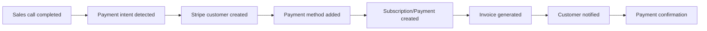

# Stripe Integration with AI Phone Assistants

Revolutionize your payment processing with intelligent phone assistants. Famulor Automation seamlessly connects your calls with Stripe for automatic payment processing, smart subscription management, and data-driven revenue optimization.

<Note>
**Revenue Excellence**: Stripe integration enables you to manage payments and subscriptions directly from sales conversations and automate the entire revenue lifecycle.
</Note>

## Why Stripe + AI Phone Assistant?

### 💳 Seamless Payment Integration
Automatic payment processing directly from sales calls with secure PCI-DSS compliant handling.

### 🔄 Intelligent Subscription Management
AI-driven subscription management with automatic upgrades, downgrades, and churn prevention.

### 📊 Revenue Intelligence Analytics
Real-time revenue tracking and forecasting based on call outcomes and payment data.

### ⚡ Automated Billing Workflows
Fully automated invoicing, dunning management, and revenue recognition from conversations.

## Key Features of the Integration

### 1. Automatic Payment Processing from Calls

**Voice-to-Payment Workflow:**


**Automatic Payment Scenarios:**
- ✅ **"I’d like to buy this"** → Immediate payment link generation
- ✅ **"Can we upgrade the subscription?"** → Subscription upgrade workflow
- ✅ **"Book this for next month"** → Scheduled payment setup
- ✅ **"We need more licenses"** → Automatic quantity adjustment
- ✅ **"Annual payment for discount"** → Billing cycle change
- ✅ **"Pause the subscription"** → Subscription pause management

### 2. Intelligent Subscription Lifecycle Management

**Automated Subscription Workflows:**

| Call Trigger          | Stripe Action              | Business Outcome       |
|-----------------------|----------------------------|-----------------------|
| 🚀 **Upgrade Request**   | Plan change + proration     | Revenue increase      |
| ⬇️ **Downgrade Request** | Plan reduction + credit     | Churn prevention      |
| ⏸️ **Pause Request**     | Subscription pause          | Retention strategy    |
| 🚫 **Cancel Request**    | Cancellation + win-back campaign | Save opportunity   |
| 💳 **Payment Failed**    | Dunning sequence + recovery call | Payment recovery    |
| 🔄 **Renewal Discussion** | Auto-renewal settings      | Retention automation  |

### 3. Revenue Intelligence and Forecasting

**Real-time Revenue Analytics:**
```
Revenue Tracking Dashboard:
📊 MRR (Monthly Recurring Revenue):
├─ New MRR from sales calls
├─ Expansion MRR from upgrades
├─ Contraction MRR from downgrades
├─ Churned MRR from cancellations
└─ Net MRR growth trends

💰 Revenue Predictions:
├─ Pipeline-to-revenue conversion
├─ Churn risk assessment
├─ Expansion opportunity scoring
├─ Seasonal revenue patterns
└─ Customer lifetime value projections
```

### 4. Advanced Billing Automation

**Intelligent Invoicing Workflows:**
```
Custom Billing Scenarios:
🏢 Enterprise Billing:
├─ Custom payment terms (Net-30, Net-60)
├─ Purchase order integration
├─ Multi-entity billing
├─ Currency conversion management
└─ Tax compliance automation

📱 Usage-Based Billing:
├─ Metered billing for API calls
├─ Overage charges automation
├─ Usage alerts and notifications
├─ Tiered pricing implementation
└─ Real-time usage tracking

💼 Professional Services:
├─ Time-based billing integration
├─ Project milestone payments
├─ Retainer management
├─ Expense reimbursement
└─ Multi-project billing consolidation
```

## Practical Examples: Stripe Voice Commerce

### Example 1: SaaS Subscription Management

**Scenario:** Software company with tiered pricing model

**Voice Subscription Automation:**
```
Customer Call: "Our team is growing, we need more licenses"

Automatic Stripe Integration:
💳 Current subscription analysis:
├─ Plan: Professional (50 users, €2,500/month)
├─ Usage: 47/50 users (94% utilization)
├─ Add-ons: Advanced Analytics, API Access
└─ Payment history: On time, good standing

🚀 Upgrade workflow:
├─ New plan: Professional (100 users, €4,500/month)
├─ Proration: €1,250 for remainder of billing period
├─ Effective date: Immediate
├─ New invoice: Automatically generated and sent
└─ Customer notification: Upgrade confirmation email

📊 Revenue impact:
├─ MRR increase: +€2,000/month
├─ Expansion revenue: €24,000/year
├─ Customer LTV: +€48,000 (projected)
└─ Churn risk: Reduced (higher engagement)
```

### Example 2: E-Commerce Payment Processing

**Scenario:** Online store with high-value B2B sales

**Enterprise Payment Workflow:**
```
B2B Sales Call: "We want to buy 1000 units but require 30-day payment terms"

Stripe Enterprise Processing:
🏢 Customer setup:
├─ Stripe customer: Enterprise account created
├─ Payment terms: Net-30 configured
├─ Credit limit: €50,000 approved
├─ Purchase order: PO-12345 referenced
└─ Tax calculation: EU B2B VAT reverse charge

💰 Order processing:
├─ Order value: €35,000 (1000 × €35)
├─ Payment method: Invoice (30 days)
├─ Invoice generation: Automatic PDF creation
├─ Delivery trigger: Warehouse notification
└─ Payment tracking: 30-day reminder sequence

📋 Compliance integration:
├─ VAT reporting: Automated for EU compliance
├─ Financial records: Automatic bookkeeping export
├─ Tax documentation: Complete audit trail
└─ Revenue recognition: GAAP-compliant timing
```

### Example 3: Professional Services Billing

**Scenario:** Consulting firm with project-based billing

**Project Billing Automation:**
```
Client Call: "Project is approved, we’ll start with 50% down payment"

Professional Services Billing:
📋 Project setup:
├─ Project: Digital transformation consulting
├─ Total value: €150,000 (6 months)
├─ Payment schedule: 50% start, 25% mid, 25% end
├─ Milestone tracking: 3 major deliverables
└─ Team allocation: 3 senior consultants

💳 Payment milestone automation:
├─ Invoice 1: €75,000 (project start) - Immediate
├─ Invoice 2: €37,500 (month 3) - Milestone triggered
├─ Invoice 3: €37,500 (project end) - Completion triggered
├─ Expense tracking: Separate travel and materials
└─ Time tracking integration: Consultant hours billing

📊 Project revenue management:
├─ Revenue recognition: Percentage-of-completion method
├─ Profitability tracking: Real-time margin analysis
├─ Scope change management: Additional work orders
├─ Client portal access: Invoice status and project progress
└─ Retention management: 10% held until final acceptance
```

## Advanced Stripe Features

### 1. Multi-Market Payment Support

**Global Payment Processing:**
```
International Business Support:
🌍 Geographic Payment Methods:
├─ EU: SEPA Direct Debit, iDEAL, Bancontact
├─ US: ACH, Credit Cards, Apple Pay, Google Pay
├─ UK: Bacs Direct Debit, Open Banking
├─ APAC: Alipay, WeChat Pay, Local Bank Transfers
└─ LATAM: OXXO, Boleto, Local Payment Methods

💱 Currency Management:
├─ Multi-currency pricing: Local currency display
├─ FX rate management: Real-time conversion
├─ Hedging strategies: Currency risk mitigation
├─ Local tax calculation: VAT, GST, sales tax
└─ Compliance management: Local regulations
```

### 2. Advanced Fraud Prevention

**AI-Powered Risk Management:**
```
Stripe Radar Integration:
🛡️ Fraud Detection:
├─ Machine learning models for transaction scoring
├─ Behavioral analysis for suspicious activity
├─ Device fingerprinting for account security
├─ Velocity checks for unusual patterns
└─ 3D Secure authentication for high-risk transactions

⚠️ Risk Management Workflows:
├─ High-risk calls: Additional verification required
├─ Chargeback prevention: Pre-transaction screening
├─ Account monitoring: Suspicious activity alerts
├─ Manual review workflows: Human oversight integration
└─ Compliance reporting: Regulatory documentation
```

### 3. Revenue Recovery Automation

**Intelligent Dunning Management:**
```
Failed Payment Recovery:
📧 Smart Dunning Sequences:
├─ Day 1: Friendly payment reminder (email)
├─ Day 3: Personal follow-up call (Famulor-triggered)
├─ Day 7: Account manager outreach (CRM integration)
├─ Day 14: Final notice before suspension
└─ Day 21: Service suspension with win-back offer

💡 Recovery Optimization:
├─ Payment method updates: Automatic card updater
├─ Payment timing optimization: Best success times
├─ Personalized recovery messages: Customer-specific content
├─ Alternative payment methods: Fallback options
└─ Retention campaigns: Discount offers for at-risk customers
```

## Setup Guide: Stripe Integration

### Step 1: Stripe Account Setup
```
Stripe Dashboard Configuration:
1. Stripe account → API keys
2. Copy publishable and secret keys
3. Configure webhook endpoints
4. Set up product catalog for subscriptions

Required Permissions:
✅ Payments: Create, read, update
✅ Customers: Create, read, update  
✅ Subscriptions: Create, read, update, cancel
✅ Invoices: Create, read, update, send
✅ Payment Methods: Create, read, update
✅ Webhooks: Receive events
```

### Step 2: Product Catalog Integration
```
Stripe Products Setup:
📦 Subscription Products:
├─ Basic plan: €29/month, Feature Set A
├─ Professional plan: €99/month, Feature Set B
├─ Enterprise plan: €299/month, Feature Set C
└─ Add-ons: À la carte features

💰 Pricing Models:
├─ Recurring subscriptions: Monthly/annual billing
├─ Usage-based pricing: Metered billing components
├─ Tiered pricing: Volume discounts
├─ One-time payments: Setup fees, professional services
└─ Freemium model: Free tier with upgrade path
```

### Step 3: Webhook Integration
```
Stripe Webhook Events:
Event Subscriptions:
✅ invoice.payment_succeeded → Success notifications
✅ invoice.payment_failed → Dunning workflows
✅ customer.subscription.created → Welcome sequences
✅ customer.subscription.updated → Plan change confirmations
✅ customer.subscription.deleted → Churn analysis
✅ charge.dispute.created → Chargeback management

Webhook URL: https://app.famulor.de/webhooks/stripe
Signing Secret: [Secure secret from Stripe]
```

### Step 4: Advanced Configuration
```
Enterprise Features:
🏢 Multi-Account Setup:
├─ Stripe Connect for multi-vendor scenarios
├─ Marketplace payments for platform businesses
├─ Split payments for partner revenue sharing
└─ Subsidiary account management

📊 Analytics Integration:
├─ Stripe Sigma for custom reports
├─ Data pipeline to data warehouse
├─ Real-time dashboards for revenue metrics
└─ Predictive analytics for churn prevention

🔐 Security Enhancements:
├─ PCI-DSS compliance validation
├─ Tokenization for secure card storage
├─ Encryption at rest for sensitive data
└─ Audit logs for compliance requirements
```

## Best Practices for Stripe + Voice Integration

### 1. Payment Security Optimization
```
Security Best Practices:
🔒 PCI Compliance:
├─ Never store card details in voice systems
├─ Use Stripe tokens for card references
├─ Secure API communication only
├─ Regular security audits
└─ Staff training for payment security

💳 Fraud Prevention:
├─ Address Verification Service (AVS)
├─ CVV verification for card transactions
├─ 3D Secure for high-value transactions
├─ Velocity limits for rapid transactions
└─ Geographic restrictions based on business model
```

### 2. Customer Experience Optimization
```
Payment UX Best Practices:
⚡ Seamless Payment Flow:
├─ One-click payment links from calls
├─ Mobile-optimized checkout pages
├─ Multiple payment method options
├─ Transparent pricing display
└─ Clear cancellation policies

📧 Communication Automation:
├─ Payment confirmation emails
├─ Invoice delivery automation
├─ Payment failure notifications
├─ Subscription renewal reminders
└─ Receipt management for tax purposes
```

### 3. Revenue Optimization Strategies
```
Growth Optimization:
📈 Revenue Expansion:
├─ Usage-based upselling triggers
├─ Feature adoption monitoring
├─ Expansion opportunity identification
├─ Cross-sell recommendation engine
└─ Customer success integration

🔄 Churn Reduction:
├─ Payment failure recovery optimization
├─ Subscription pause options
├─ Downgrade retention offers
├─ Win-back campaigns for cancelled customers
└─ Satisfaction survey integration
```

## ROI & Revenue Impact

### Stripe Integration Performance Metrics:

| KPI                       | Without Integration | With Stripe + Voice | Improvement  |
|---------------------------|---------------------|--------------------|--------------|
| **Payment Processing Time** | 15-30 minutes       | 2 minutes          | 93% faster   |
| **Subscription Conversion** | 12%                 | 34%                | +183%        |
| **Payment Failure Recovery**| 23%                 | 67%                | +191%        |
| **Customer LTV**            | €3,200              | €5,800             | +81%         |
| **Revenue per Call**         | €145                | €340               | +134%        |

### Financial Impact Analysis:
```
Monthly Revenue Impact (€1M ARR Business):
├─ Faster payment processing: €8,500/month (time savings)
├─ Higher conversion rates: €45,000/month (additional revenue)
├─ Better payment recovery: €12,000/month (dunning optimization)
├─ Reduced churn: €23,000/month (retention improvement)
├─ Upselling automation: €18,000/month (expansion revenue)

Total Monthly Benefit: €106,500
Integration Cost: €2,000/month
Net ROI: €104,500/month (5,225% ROI)
Break-even: 1 day
```

---

**Ready for intelligent payment automation?**

<CardGroup cols={2}>
  <Card title="Activate Stripe Integration" icon="credit-card" href="https://app.famulor.de/integrations/stripe">
    Connect Stripe now with your AI assistant
  </Card>
  <Card title="Book a Payment Demo" icon="calendar" href="https://cal.com/bek-group/demotermine">
    Live demo of the payment integration
  </Card>
  <Card title="Revenue Calculator" icon="calculator" href="/en/automation-platform/integrations/einzelintegrations/stripe/revenue-calculator">
    Calculate your revenue impact
  </Card>
  <Card title="Enterprise Setup" icon="building" href="/en/automation-platform/integrations/einzelintegrations/stripe/enterprise">
    Enterprise payment configuration
  </Card>
</CardGroup>