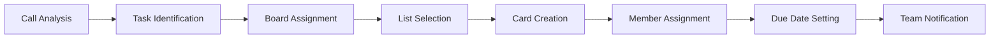

# Trello Integration with AI Phone Assistants

Optimize your visual project management with intelligent phone assistants. Famulor Automation seamlessly connects your calls with Trello for automatic card creation, board updates, and intuitive Kanban workflow automation.

<Note>
**Visual Productivity Boost**: The Trello integration automatically transforms every call into structured Kanban cards with accurate list assignments and team member allocations.
</Note>

## Why Trello + AI Phone Assistant?

### 📋 Automatic Kanban Card Creation  
Every call is automatically converted into visually organized Trello cards with correct board and list assignments.

### 🎯 Intuitive Workflow Visualization  
AI recognizes project context and assigns tasks to the appropriate Kanban columns for optimal workflow overview.

### 👥 Seamless Team Collaboration  
Automatic team member assignment and notifications enable efficient task coordination.

### 📈 Visual Progress Tracking  
Real-time project progress via automatic card movements between lists based on call updates.

## Main Features of the Integration

### 1. Intelligent Card Creation from Conversations

**Voice-to-Kanban Workflow:**


**Automatically Recognized Card Elements:**
- ✅ **Card Title**: Extracted from call context  
- ✅ **Description**: Detailed call notes  
- ✅ **List**: Intelligent workflow stage assignment  
- ✅ **Labels**: Automatic categorization  
- ✅ **Members**: Team member assignment  
- ✅ **Due Date**: Deadline detection from conversation  
- ✅ **Checklists**: Subtasks based on call details  

### 2. Smart Board Management

**Automatic Board Organization:**

| Call Context          | Trello Board           | List Assignment                           |
|-----------------------|-----------------------|------------------------------------------|
| 🎯 **New Project**      | Project Board created | Backlog → To Do → In Progress → Done    |
| 🔧 **Bug Report**       | Bug Tracking Board    | Reported → Investigating → Fixed → Verified |
| 💼 **Sales Lead**       | Sales Pipeline Board  | Lead → Qualified → Demo → Proposal → Won |
| 📞 **Support Ticket**   | Support Board         | New → In Progress → Waiting → Resolved  |
| 🎨 **Feature Request**  | Product Board         | Ideas → Backlog → Development → Testing → Released |

### 3. Dynamic Workflow Automation

**Kanban Flow Intelligence:**
```
Workflow State Management:
📋 List Progression Logic:
├─ Call: "Task has started" → Move to "In Progress"
├─ Call: "Need review" → Move to "Review"
├─ Call: "Problem blocking us" → Add "Blocked" label
├─ Call: "Done, ready to deploy" → Move to "Ready for Deploy"
└─ Call: "Project completed" → Move to "Done" + Archive

Dependency Management:
├─ Blocked Tasks: Dependency tracking in description
├─ Prerequisite Tasks: Checklists for sequential work
├─ Team Coordination: Cross-board references
└─ Resource Conflicts: Capacity management alerts
```

### 4. Advanced Team Coordination

**Collaborative Kanban Features:**
```
Team Assignment Intelligence:
👥 Smart Member Assignment:
├─ Skills-Based Matching: Task type to expert assignment
├─ Workload Balancing: Capacity-aware distribution
├─ Timezone Coordination: Global team handoffs
├─ Expertise Routing: Complex tasks to senior members
└─ Availability Checking: Vacation/out-of-office awareness

📧 Notification Strategies:
├─ @mentions for direct assignments
├─ Board activity digests for team updates
├─ Due date reminders for approaching deadlines
├─ Comment notifications for collaboration
└─ Workflow alerts for blocked/urgent tasks
```

## Use Cases: Trello Voice Productivity

### Example 1: Agile Software Development

**Scenario:** Development team using Scrum methodology

**Sprint Management Automation:**
```
Product Owner Call: "New user story: Social media login"

Automatic Trello Integration:
📋 Board: "Product Backlog"
🏷️ Card: "User Story: Social Media Login"
📝 Description: 
   "As a user, I want to log in with Google/Facebook 
    to simplify the registration process.
    
    Acceptance Criteria:
    - Google OAuth integration
    - Facebook login option
    - Existing account linking
    - Security testing required"

📊 Task Breakdown (Automatic Checklist):
├─ ☐ OAuth provider research (2 Story Points)
├─ ☐ Backend API implementation (5 Story Points)
├─ ☐ Frontend integration (3 Story Points)
├─ ☐ Security review (2 Story Points)
├─ ☐ Testing & QA (3 Story Points)
└─ ☐ Documentation update (1 Story Point)

👥 Assignment: @backend-dev, @frontend-dev, @security-expert
📅 Sprint Planning: Next sprint (2 weeks)
🏷️ Labels: "Feature", "High Priority", "Security Review Required"
```

### Example 2: Marketing Campaign Management

**Scenario:** Marketing team coordinating multi-channel campaign

**Campaign Workflow Automation:**
```
Marketing Director Call: "Q2 campaign is launching, coordinate all channels"

Campaign Board Setup:
📋 Board: "Q2 Product Launch Campaign"
📊 Lists: Strategy → Creative → Production → Review → Launch → Analysis

🎯 Campaign Tasks (Auto-generated):
├─ Card: "Target Audience Research"
│   ├─ List: Strategy
│   ├─ Member: @market-researcher
│   ├─ Due: 1 week
│   └─ Checklist: Demographics, Psychographics, Competitor Analysis

├─ Card: "Creative Concept Development"
│   ├─ List: Creative
│   ├─ Member: @creative-director
│   ├─ Due: 2 weeks
│   └─ Checklist: Visual Identity, Copy Strategy, Brand Guidelines

├─ Card: "Social Media Content Creation"
│   ├─ List: Production
│   ├─ Member: @social-media-manager
│   ├─ Due: 3 weeks
│   └─ Checklist: Instagram Posts, Facebook Ads, LinkedIn Content

└─ Card: "Performance Tracking Setup"
    ├─ List: Launch
    ├─ Member: @analytics-specialist
    ├─ Due: 4 weeks
    └─ Checklist: KPI Definition, Dashboard Setup, Reporting Schedule

Cross-Board Dependencies:
🔗 Sales Board: Lead capture process update
🔗 Product Board: Feature highlight coordination
🔗 Support Board: FAQ update for campaign questions
```

### Example 3: Event Management Coordination

**Scenario:** Event agency organizing corporate conference

**Event Planning Workflow:**
```
Client Call: "Corporate conference for 500 participants, 3 months timeline"

Event Management Board:
📋 Board: "Corporate Conference 2024"
📊 Lists: Planning → Vendor Coordination → Marketing → Execution → Post-Event

🎪 Event Task Breakdown:
├─ Venue Selection (Planning)
│   ├─ Capacity: 500+ people
│   ├─ Location: Central, parking
│   ├─ Technical: A/V equipment, WiFi
│   ├─ Catering: Space for lunch/coffee breaks
│   └─ Budget: €15,000 maximum

├─ Speaker Coordination (Vendor Coordination)
│   ├─ Keynote speaker: Industry expert
│   ├─ Panel discussions: 3 sessions
│   ├─ Workshop leaders: 6 parallel sessions
│   ├─ Travel/accommodation: Arrangements
│   └─ Technical requirements: Presentation setup

├─ Marketing Campaign (Marketing)
│   ├─ Registration website: Custom landing page
│   ├─ Social media: LinkedIn, Twitter promotion
│   ├─ Email campaign: Target audience outreach
│   ├─ Print materials: Brochures, banners
│   └─ Press release: Industry publications

└─ Day of Execution (Execution)
    ├─ Setup crew: 6:00 AM start
    ├─ Registration desk: Check-in process
    ├─ Technical support: A/V monitoring
    ├─ Catering coordination: Meal service management
    └─ Cleanup crew: Post-event teardown

Timeline Management:
⏰ 12 weeks before event: Venue + speaker bookings  
⏰ 8 weeks before event: Marketing launch  
⏰ 4 weeks before event: Final confirmations  
⏰ 1 week before event: Final preparations  
⏰ Event day: Execution coordination  
⏰ 1 week after event: Post-event analysis
```

## Advanced Trello Features

### 1. Power-Ups Integration

**Enhanced Functionality through Trello Power-Ups:**
```
Productivity Power-Ups:
📅 Calendar Power-Up:
├─ Deadline visualization in calendar view
├─ Milestone tracking for project phases
├─ Team schedule coordination
└─ Sprint planning calendar integration

📊 Dashboard Power-Up:
├─ Burndown charts for agile teams
├─ Team velocity tracking
├─ Project progress visualization
└─ KPI monitoring dashboards

🔗 Integration Power-Ups:
├─ GitHub integration for code commits
├─ Slack notifications for team updates
├─ Google Drive for document attachments
└─ Time tracking for productivity analysis
```

### 2. Automation Rules (Butler)

**Trello Butler Integration:**
```
Custom Automation Rules:
🤖 Workflow Automation:
├─ Rule: "When card moved to 'Done' → Mark due date complete + archive after 7 days"
├─ Rule: "When due date in 2 days → Add 'Urgent' label + notify assignee"
├─ Rule: "When comment contains '@review' → Move to 'Review' list"
└─ Rule: "When all checklist items checked → Move to next list"

📧 Notification Automation:
├─ Daily stand-up summaries for team
├─ Weekly progress reports for management
├─ Overdue task alerts for assignees
└─ Milestone achievement celebrations
```

### 3. Multi-Board Coordination

**Enterprise Board Management:**
```
Board Hierarchy Management:
🏢 Organization Level:
├─ Master Board: High-level project overview
├─ Department Boards: Team-specific workflows
├─ Project Boards: Individual project management
└─ Archive Boards: Completed project storage

🔄 Cross-Board Dependencies:
├─ Reference Cards: Links between related tasks
├─ Template Boards: Standardized workflow starting points
├─ Reporting Boards: Aggregated progress tracking
└─ Resource Planning Boards: Team capacity management
```

## Setup Guide: Trello Integration

### Step 1: Trello API Access
```
Trello Developer Setup:
1. Trello → Settings → Developer API Keys
2. Generate API key and token
3. Famulor → Integrations → Trello
4. Enter credentials and test connection

Required Permissions:
✅ Boards: Read, Write, Create  
✅ Lists: Read, Write, Create  
✅ Cards: Read, Write, Create, Delete  
✅ Members: Read, Assign  
✅ Labels: Read, Write, Create  
✅ Comments: Read, Write  
✅ Attachments: Read, Write
```

### Step 2: Board Structure Setup
```
Board Organization Strategy:
📋 Project Management Boards:
├─ Development Projects
├─ Marketing Campaigns  
├─ Sales Pipeline
├─ Customer Support
└─ Internal Operations

📊 Standard List Templates:
├─ Kanban Flow: Backlog → To Do → In Progress → Review → Done
├─ Bug Tracking: Reported → Investigating → In Progress → Testing → Resolved
├─ Sales Process: Lead → Qualified → Proposal → Negotiation → Won/Lost
└─ Support Flow: New → Assigned → In Progress → Waiting → Resolved
```

### Step 3: Automation Rules Configuration
```
Voice-Triggered Automations:
🎯 Call-to-Card Mappings:
├─ "Bug Report" → Bug Tracking Board + "Reported" list
├─ "Feature Request" → Product Board + "Backlog" list
├─ "Sales Lead" → Sales Board + "New Lead" list
├─ "Support Issue" → Support Board + "New" list
└─ "Project Task" → Relevant Project Board + "To Do" list

⚡ Workflow Triggers:
├─ "Task started" → Move to "In Progress"
├─ "Need help" → Add "Help Needed" label + notify team
├─ "Blocked" → Add "Blocked" label + escalate to manager
├─ "Ready for review" → Move to "Review" + assign reviewer
└─ "Completed" → Move to "Done" + update due date
```

### Step 4: Team Integration Setup
```
Team Collaboration Configuration:
👥 Member Assignment Rules:
├─ Development Tasks → @dev-team
├─ Design Tasks → @design-team
├─ Marketing Tasks → @marketing-team
├─ Support Tasks → @support-team
└─ Management Tasks → @management-team

🔔 Notification Preferences:
├─ Immediate: @mentions, due date approaching
├─ Daily Digest: board activity, new assignments
├─ Weekly Summary: completed tasks, overdue items
└─ Monthly Report: team productivity, project progress
```

## Best Practices for Trello + Voice Integration

### 1. Kanban Workflow Optimization
```
Efficient Kanban Design:
📋 List Structure Best Practices:
✅ Limit Work in Progress: Max tasks per list
✅ Clear Definition of Done: Criteria for list movement
✅ Regular Board Grooming: Archive completed cards
✅ Consistent Labeling: Standardized color coding
✅ Due Date Management: Realistic timeline setting

🎯 Workflow Efficiency:
├─ Single Responsibility: One task per card
├─ Granular Tasks: Break down large items
├─ Clear Descriptions: Detailed task requirements
├─ Regular Updates: Progress communication
└─ Dependency Tracking: Link related cards
```

### 2. Team Productivity Optimization
```
Collaboration Excellence:
👥 Team Coordination:
├─ Daily Stand-ups: Board review meetings
├─ Sprint Planning: Backlog grooming sessions
├─ Retrospectives: Workflow improvement discussions
├─ Capacity Planning: Workload distribution reviews
└─ Knowledge Sharing: Best-practice documentation

📊 Performance Tracking:
├─ Velocity Metrics: Cards completed per sprint
├─ Cycle Time: Average time in progress
├─ Lead Time: Backlog-to-done duration
├─ Throughput: Daily/weekly completion rates
└─ Quality Metrics: Defect rates, rework frequency
```

### 3. Scaling Strategies
```
Enterprise Trello Management:
🏢 Organization Scaling:
├─ Team Workspaces: Department isolation
├─ Cross-Team Boards: Collaboration spaces
├─ Template Libraries: Standardized workflows
├─ Governance Policies: Consistent usage guidelines
└─ Training Programs: Team onboarding processes

📈 Growth Management:
├─ Board Archival Strategies: Historical data management
├─ Performance Monitoring: Usage analytics tracking
├─ Integration Health: System reliability monitoring
└─ Continuous Improvement: Workflow optimization cycles
```

## ROI & Productivity Metrics

### Trello Integration Performance Indicators:

| KPI                         | Without Integration | With Trello + Voice | Improvement    |
|-----------------------------|---------------------|--------------------|----------------|
| **Task Creation Time**       | 5-8 minutes         | 30 seconds         | 90% reduction  |
| **Project Transparency**     | 45% team visibility | 95% team visibility | +111%          |
| **Task Completion Rate**     | 67%                 | 89%                | +33%           |
| **Team Coordination Efficiency** | 6.2/10          | 9.1/10             | +47%           |
| **Project Delivery Time**    | 87% on-time         | 96% on-time        | +10%           |

### Productivity ROI Calculation:
```
Monthly Productivity Impact (25-Person Team):
├─ Task Management Efficiency: 75 hours/month saved
├─ Improved Coordination: 45 hours/month fewer meetings
├─ Better Visibility: 32 hours/month fewer status updates
├─ Reduced Rework: 28 hours/month due to better clarity

Financial Impact:
├─ Productivity Savings: €13,500/month (at €75/h average)
├─ Faster Project Delivery: €8,200/month (time-to-market)
├─ Improved Quality: €5,100/month (less rework)
├─ Integration Cost: €400/month
├─ Net ROI: €26,400/month (6,600% ROI)
└─ Payback Period: 1 day
```

---

**Ready for visual project management?**

<CardGroup cols={2}>
  <Card title="Activate Trello Integration" icon="table-columns" href="https://app.famulor.de/integrations/trello">
    Connect Trello now with AI assistants
  </Card>
  <Card title="Book Kanban Demo" icon="calendar" href="https://cal.com/bek-group/demotermine">
    Live demo of the Trello integration
  </Card>
  <Card title="Board Templates" icon="clone" href="/automation-platform/integrations/einzelintegrations/trello/templates">
    Preconfigured Kanban board setups
  </Card>
  <Card title="Workflow Guide" icon="diagram-project" href="/automation-platform/integrations/einzelintegrations/trello/workflows">
    Optimal Kanban workflow strategies
  </Card>
</CardGroup>