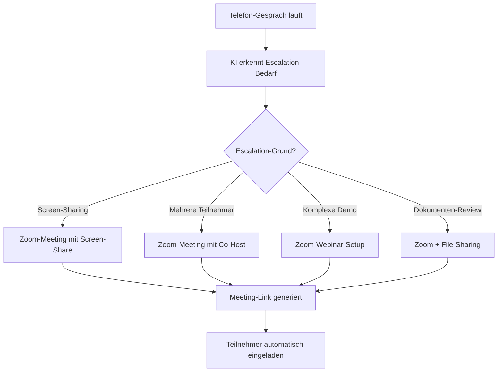

# Zoom Integration mit KI-Telefonassistenten

Revolutionieren Sie Ihre Video-Kommunikation mit intelligenten Telefonassistenten. Famulor Automation verbindet Ihre Anrufe nahtlos mit Zoom für automatische Meeting-Erstellung, intelligente Teilnehmer-Koordination und optimierte Hybrid-Workflows.

<Note>
**Hybrid-Communication-Excellence**: Zoom-Integration ermöglicht nahtlose Übergänge zwischen Telefon- und Video-Gesprächen für optimale Kommunikationserfahrungen.
</Note>

## Warum Zoom + KI-Telefonassistent?

### 🎥 Seamless Phone-to-Video-Transition
Automatische Eskalation von Telefongesprächen zu Video-Meetings wenn komplexere Diskussionen oder Screen-Sharing benötigt wird.

### 📅 Intelligente Meeting-Orchestrierung
Automatische Zoom-Meeting-Erstellung mit optimalen Einstellungen basierend auf Gesprächskontext und Teilnehmer-Anforderungen.

### 🔄 Unified Communication-Experience
Kombinieren Sie Telefon-Intelligence mit Video-Meeting-Insights für comprehensive Kommunikations-Analytics.

### 👥 Advanced Participant-Management
Intelligente Teilnehmer-Einladungen, Rollen-Zuweisung und Meeting-Koordination basierend auf Anruf-Kontext.

## Hauptfunktionen der Integration

### 1. Automatic Phone-to-Video-Escalation

**Intelligente Escalation-Triggers:**


**Escalation-Scenarios:**
- ✅ **"Können Sie das zeigen?"** → Instant-Screen-Share-Meeting
- ✅ **"Lass uns das Team dazuholen"** → Multi-Participant-Meeting
- ✅ **"Ich zeige Ihnen die Software"** → Demo-optimiertes-Meeting
- ✅ **"Schauen wir uns das Dokument an"** → File-Sharing-Meeting
- ✅ **"Das ist komplex zu erklären"** → Video-Enhanced-Explanation
- ✅ **"Meeting mit mehreren Standorten"** → Multi-Location-Conference

### 2. Kontext-Aware Meeting-Creation

**Automatische Meeting-Konfiguration:**

| Anruf-Kontext | Zoom-Meeting-Setup | Automatische Features |
|---------------|-------------------|----------------------|
| 🎯 **Sales-Demo** | Recording aktiviert, Screen-Share, 60min | Demo-Template, Follow-up geplant |
| 🔧 **Technical-Support** | Co-Host für Experte, Recording, Screen-Control | Breakout-Rooms, File-Transfer |
| 💼 **Executive-Briefing** | Waiting-Room, Custom-Background, Auto-Record | Executive-Template, Security-Enhanced |
| 🎓 **Training-Session** | Webinar-Mode, Breakout-Rooms, Polls | Training-Tools, Attendance-Tracking |
| 📊 **Project-Review** | Whiteboard, Recording, File-Share | Collaboration-Tools, Action-Items |

### 3. Smart Participant-Management

**Intelligente Einladungs-Automation:**
```
Anruf: "Ich brauche ein Meeting mit dem ganzen Team"

Automatische Participant-Logic:
🔍 Team-Identification:
├─ CRM-Integration: Team-Members aus Account
├─ Calendar-Integration: Verfügbarkeits-Check
├─ Org-Chart-Integration: Hierarchie-basierte Einladungen
└─ Previous-Meeting-Analysis: Häufige Teilnehmer

👥 Role-Assignment:
├─ Host: Call-Initiator oder Account-Owner
├─ Co-Host: Technical-Expert oder Manager
├─ Participants: Team-Members basierend auf Kontext
└─ Optional-Attendees: Stakeholder je nach Topic

⚙️ Meeting-Permissions:
├─ Screen-Share: Basierend auf Role und Meeting-Type
├─ Recording: Automatic für wichtige Business-Meetings
├─ Chat: Moderiert bei großen Meetings
└─ Breakout-Rooms: Auto-konfiguriert für Workshops
```

### 4. Advanced Meeting-Intelligence

**Pre-Meeting-Preparation:**
```
Zoom-Meeting-Enhancement:
📋 Agenda-Generation: Basierend auf Anruf-Kontext
📁 Document-Preparation: Relevante Files automatisch attached
👤 Participant-Briefing: Background-Info für alle Teilnehmer
🎯 Objective-Setting: Clear-Meeting-Goals definiert
⏰ Time-Management: Agenda-Items mit Zeit-Slots

Meeting-Optimization:
├─ Optimal-Time-Slot: Timezone und Preference-aware
├─ Room-Capacity: Participant-Count-optimized
├─ Technical-Requirements: Screen-Share, Recording, etc.
├─ Security-Settings: Waiting-Room, Password, etc.
└─ Follow-up-Planning: Next-Steps bereits geplant
```

## Praxisbeispiele: Zoom Voice Automation

### Beispiel 1: Software-Demo-Automation

**Szenario:** SaaS-Unternehmen mit komplexen Produkt-Demos

**Demo-Workflow-Automation:**
```
Prospect-Call: "Können Sie mir die Software zeigen?"

Automatische Demo-Orchestrierung:
🎯 Demo-Meeting-Creation:
├─ Zoom-Meeting: 60min, Recording aktiviert
├─ Screen-Share: Optimiert für Software-Demo
├─ Demo-Environment: Test-Account vorbereitet
└─ Demo-Script: Personalisiert für Prospect-Needs

👥 Team-Coordination:
├─ Sales-Engineer: Als Co-Host eingeladen
├─ Account-Executive: Meeting-Owner
├─ Technical-Expert: On-Standby für Q&A
└─ Manager: Optional bei Enterprise-Deals

📋 Demo-Preparation:
├─ Prospect-Research: Company-Background geladen
├─ Use-Case-Scenarios: Relevant für deren Branche
├─ Competitive-Differentiation: Key-Points vorbereitet
└─ ROI-Calculator: Mit deren Daten vorbefüllt

Post-Demo-Automation:
├─ Recording: Automatisch an Prospect gesendet
├─ Follow-up-Meeting: Bereits für nächste Woche geplant
├─ Proposal-Preparation: Template mit Demo-Insights
└─ Internal-Debrief: Sales-Team-Meeting geplant
```

### Beispiel 2: Customer-Support-Escalation

**Szenario:** Technical-Support mit komplexen System-Problemen

**Support-Escalation-Workflow:**
```
Support-Call: "Das Problem ist kompliziert, können Sie sich einloggen?"

Technical-Support-Meeting-Automation:
🔧 Technical-Meeting-Setup:
├─ Zoom-Meeting: Screen-Control für Support-Agent
├─ Recording: Für Documentation und Training
├─ Breakout-Rooms: Falls mehrere Experten nötig
└─ File-Transfer: Für Log-Files und Screenshots

👨‍💻 Expert-Assembly:
├─ L2-Support: Primary-Technical-Resolver
├─ Product-Engineer: Bei Product-Issues
├─ Security-Expert: Bei Security-related-Problems
└─ Customer-Success: Für Relationship-Management

🛠️ Technical-Workflow:
├─ Screen-Share: Customer zeigt Problem
├─ Remote-Control: Support löst Problem direkt
├─ Documentation: Steps automatisch dokumentiert
└─ Knowledge-Base: Solution in KB gespeichert

Resolution-Follow-up:
├─ Solution-Documentation: Automatisch erstellt
├─ Customer-Satisfaction-Survey: Nach 24h gesendet
├─ Internal-Review: Problem-Prevention-Meeting
└─ Knowledge-Update: Für künftige ähnliche Cases
```

### Beispiel 3: Executive-Briefing-Coordination

**Szenario:** Executive-Team mit Strategic-Decision-Meetings

**Executive-Meeting-Automation:**
```
Executive-Assistant-Call: "CEO braucht Emergency-Board-Meeting"

Executive-Meeting-Orchestration:
💼 Executive-Meeting-Setup:
├─ Zoom-Meeting: Waiting-Room, Password-protected
├─ Recording: Auto-start mit Executive-Permissions
├─ Custom-Background: Professional-Corporate-Branding
└─ Security-Enhanced: End-to-End-Encryption

👔 Stakeholder-Coordination:
├─ Board-Members: International-Timezone-optimized
├─ C-Level-Executives: Calendar-Priority-Override
├─ Legal-Counsel: Als Optional-Attendee
└─ Executive-Assistants: Meeting-Coordination-Support

📊 Executive-Briefing-Preparation:
├─ Board-Package: Automatisch aus verschiedenen Systemen
├─ Financial-Dashboard: Real-time-KPIs prepared
├─ Decision-Templates: Voting und Approval-Workflows
└─ Action-Items-Tracking: Automatic-Follow-up-System

Post-Meeting-Executive-Workflow:
├─ Meeting-Minutes: AI-generated für Board-Records
├─ Action-Items: Assigned mit Deadlines und Owners
├─ Decision-Documentation: Legal-compliant-Records
└─ Stakeholder-Communication: Key-Decisions-Summary
```

## Advanced Zoom-Features

### 1. Zoom-Phone-Integration

**Unified-Communications-Platform:**
```
Zoom-Phone + Famulor-Integration:
📞 Inbound-Calls: Zoom-Phone → Famulor-Intelligence
🎥 Auto-Escalation: Phone → Video bei Bedarf
📱 Mobile-Seamless: App-to-App-Transitions
☁️ Cloud-Recording: Unified-Storage für alle Communications

Advanced-Call-Features:
├─ Call-Queue-Intelligence: Smart-Routing basierend auf Skills
├─ Voicemail-Transcription: AI-powered-Message-Analysis
├─ Call-Analytics: Performance-Metrics für Phone+Video
└─ Omnichannel-Experience: Consistent across all Touchpoints
```

### 2. Zoom-Webinar-Automation

**Large-Scale-Event-Management:**
```
Webinar-Use-Cases:
🎓 Product-Training-Webinars:
├─ Automatic-Registration aus CRM-Segmenten
├─ Personalized-Invitations basierend auf Interesse
├─ Interactive-Polls für Engagement-Tracking
└─ Follow-up-Automation für Leads aus Webinar

📊 Industry-Briefings:
├─ Thought-Leadership-Content-Delivery
├─ Q&A-Session-Management mit Expert-Panel
├─ Breakout-Sessions für specialized Topics
└─ Lead-Scoring basierend auf Participation-Level

💼 Customer-Success-Webinars:
├─ Feature-Update-Announcements
├─ Best-Practice-Sharing-Sessions
├─ User-Community-Building
└─ Feedback-Collection für Product-Development
```

### 3. Zoom-App-Marketplace-Integration

**Custom-App-Development:**
```
Famulor-Zoom-App-Features:
📱 In-Meeting-Dashboard:
├─ Real-time-Call-Metrics während Video-Meetings
├─ Participant-Intelligence: Background-Info zu Attendees
├─ Meeting-Outcome-Prediction basierend auf Engagement
└─ Action-Item-Generation aus Meeting-Content

🔧 Admin-Features:
├─ Meeting-Policy-Enforcement für Enterprise-Compliance
├─ Usage-Analytics für Optimization-Insights
├─ Security-Monitoring für suspicious Activities
└─ Integration-Health-Monitoring für IT-Teams

📊 Analytics-Integration:
├─ Meeting-ROI-Calculation basierend auf Outcomes
├─ Team-Productivity-Metrics über Phone+Video
├─ Customer-Engagement-Scores für Relationship-Health
└─ Forecasting-Accuracy-Improvement durch Meeting-Intelligence
```

## Setup-Guide: Zoom-Integration

### Schritt 1: Zoom-App-Marketplace-Registration
```
Zoom-Developer-Portal:
1. Zoom-Marketplace → Create-App
2. App-Type: "OAuth" für User-Authorization
3. App-Name: "Famulor-Automation"
4. App-Category: "Productivity" + "Communications"

Required-Scopes:
✅ meeting:write → Meeting-Creation
✅ meeting:read → Meeting-Information
✅ user:read → User-Profile-Access
✅ recording:read → Recording-Access
✅ webinar:write → Webinar-Management
✅ phone:read → Phone-Integration (if applicable)
✅ chat_message:write → Chat-Integration
```

### Schritt 2: Meeting-Templates-Konfiguration
```
Template-Library-Setup:
🎯 Sales-Demo-Template:
├─ Duration: 60 minutes
├─ Features: Screen-share, Recording, Waiting-room
├─ Security: Password-protected, Authenticated-users
└─ Follow-up: Automatic-recording-distribution

🔧 Support-Session-Template:
├─ Duration: 45 minutes  
├─ Features: Remote-control, File-transfer, Breakout-rooms
├─ Permissions: Co-host-controls for technical-experts
└─ Documentation: Auto-generated-resolution-notes

💼 Executive-Meeting-Template:
├─ Duration: 90 minutes
├─ Security: Waiting-room, End-to-end-encryption
├─ Features: Custom-background, Auto-recording
└─ Access-Control: Restricted-to-executive-accounts
```

### Schritt 3: Webhook-Integration-Setup
```
Zoom-Webhook-Configuration:
Event-Subscriptions:
✅ meeting.started → Meeting-Intelligence-Activation
✅ meeting.ended → Post-Meeting-Automation
✅ meeting.participant_joined → Attendance-Tracking
✅ recording.completed → Auto-Distribution-Workflow
✅ webinar.registration_created → Lead-Capture-Automation

Webhook-URL: https://app.famulor.de/webhooks/zoom
Verification-Token: [Secure-Token-from-Famulor]
```

### Schritt 4: Advanced-Features-Activation
```
Enterprise-Features:
🏢 Single-Sign-On (SSO):
├─ SAML-Integration für Enterprise-Authentication
├─ Azure-AD / Okta-Integration
├─ Automatic-User-Provisioning
└─ Role-based-Access-Control

📊 Analytics-Integration:
├─ Custom-Dashboard für Meeting-Performance
├─ ROI-Tracking für Video-Communications
├─ Team-Productivity-Metrics
└─ Customer-Engagement-Analytics

🔐 Security-Enhancements:
├─ Advanced-Encryption-Standards
├─ Compliance-Reporting (GDPR, HIPAA)
├─ Data-Retention-Policies
└─ Audit-Logs für Enterprise-Governance
```

## Best Practices für Zoom+Voice Integration

### 1. Meeting-Quality-Optimization
```
Technical-Best-Practices:
🎥 Video-Quality-Settings:
├─ Auto-HD for Sales-Demos
├─ Bandwidth-Optimization für Remote-Participants
├─ Background-Noise-Suppression für better Audio
└─ Automatic-Speaker-View für Presentation-Mode

📱 Mobile-Optimization:
├─ Responsive-Meeting-Controls für Mobile-Users
├─ Touch-Optimized-Interfaces für Tablet-Users
├─ Offline-Capabilities für unreliable Connections
└─ Data-Usage-Optimization für limited Bandwidth
```

### 2. Security-Implementation
```
Enterprise-Security-Standards:
🔐 Access-Control:
├─ Waiting-Room-Policies für External-Participants
├─ Password-Requirements für Sensitive-Meetings
├─ Meeting-Encryption for Confidential-Discussions
└─ Recording-Permissions basierend auf Meeting-Type

🛡️ Data-Protection:
├─ GDPR-Compliant-Recording-Policies
├─ Data-Retention-Automation
├─ Secure-File-Transfer-Protocols
└─ Audit-Trail-Generation für Compliance
```

### 3. User-Experience-Optimization
```
UX-Best-Practices:
⚡ Seamless-Transitions:
├─ One-Click-Escalation from Phone-to-Video
├─ Auto-Join-Features für Frequent-Participants
├─ Meeting-Context-Preservation during Transitions
└─ Unified-Interface für alle Communication-Channels

📋 Meeting-Preparation:
├─ Auto-Generated-Agendas basierend auf Call-Context
├─ Pre-Meeting-Briefings für alle Participants
├─ Resource-Preparation (Documents, Presentations)
└─ Technical-Check-Automation vor wichtigen Meetings
```

## ROI & Performance Metrics

### Zoom-Integration-Performance-Indicators:

| KPI | Ohne Integration | Mit Zoom+Voice | Verbesserung |
|-----|------------------|----------------|--------------|
| **Meeting-Setup-Zeit** | 8-12 Minuten | 30 Sekunden | 95% Reduktion |
| **Demo-Conversion-Rate** | 23% | 67% | +191% |
| **Support-Resolution-Zeit** | 45 Minuten | 18 Minuten | 60% schneller |
| **Meeting-Produktivität** | 6.2/10 | 9.1/10 | +47% |
| **Customer-Satisfaction** | 7.8/10 | 9.6/10 | +23% |

### Business-Impact-Calculation:
```
Monthly-ROI-Analysis (100 Meetings/Monat):
├─ Time-Savings: 13 Stunden/Monat (Setup-Automation)
├─ Improved-Conversions: +44 zusätzliche Deals
├─ Faster-Resolutions: 45 Support-Hours gespart
├─ Better-Customer-Experience: +18% Retention-Rate

Financial-Impact:
├─ Zusätzlicher-Revenue: €67,000/Monat
├─ Cost-Savings: €8,500/Monat
├─ Integration-Cost: €800/Monat
├─ Net-ROI: €74,700/Monat (9,338% ROI)
└─ Payback-Period: 1 Tag
```

---

**Bereit für intelligente Video-Communication?**

<CardGroup cols={2}>
  <Card title="Zoom Integration aktivieren" icon="video" href="https://app.famulor.de/integrations/zoom">
    Zoom jetzt mit KI-Assistenten verbinden
  </Card>
  <Card title="Video-Demo buchen" icon="calendar" href="https://cal.com/bek-group/demotermine">
    Live-Demo der Zoom-Integration erleben
  </Card>
  <Card title="Meeting-Templates" icon="template" href="/automation-platform/integrations/einzelintegrations/zoom/templates">
    Vorgefertigte Meeting-Konfigurationen
  </Card>
  <Card title="Enterprise-Setup" icon="building" href="/automation-platform/integrations/einzelintegrations/zoom/enterprise">
    Zoom Enterprise-Integration-Guide
  </Card>
</CardGroup>