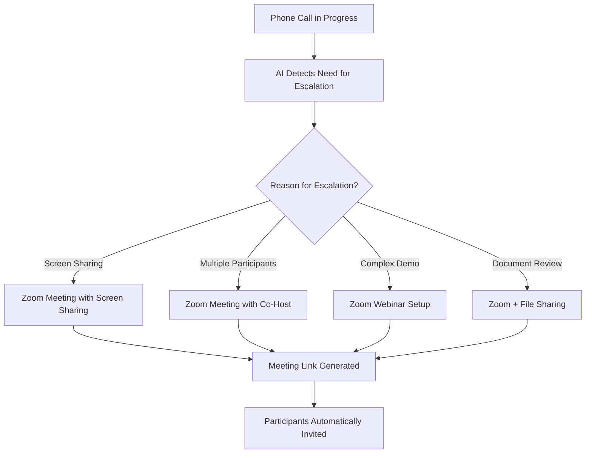

# Zoom Integration with AI Phone Assistants

Revolutionize your video communication with intelligent phone assistants. Famulor Automation seamlessly connects your calls with Zoom for automatic meeting creation, smart participant coordination, and optimized hybrid workflows.

<Note>
**Hybrid Communication Excellence**: Zoom integration enables smooth transitions between phone and video calls for optimal communication experiences.
</Note>

## Why Zoom + AI Phone Assistant?

### 🎥 Seamless Phone-to-Video Transition
Automatically escalate phone calls to video meetings when more complex discussions or screen sharing are needed.

### 📅 Intelligent Meeting Orchestration
Auto-create Zoom meetings with optimal settings based on call context and participant requirements.

### 🔄 Unified Communication Experience
Combine phone intelligence with video meeting insights for comprehensive communication analytics.

### 👥 Advanced Participant Management
Smart participant invitations, role assignments, and meeting coordination based on call context.

## Key Features of the Integration

### 1. Automatic Phone-to-Video Escalation

**Intelligent Escalation Triggers:**

```mermaid
graph TD
    A[Phone Call in Progress] --> B[AI Detects Need for Escalation]
    B --> C{Reason for Escalation?}
    C -->|Screen Sharing| D[Zoom Meeting with Screen Sharing]
    C -->|Multiple Participants| E[Zoom Meeting with Co-Host]
    C -->|Complex Demo| F[Zoom Webinar Setup]
    C -->|Document Review| G[Zoom + File Sharing]
    D --> H[Meeting Link Generated]
    E --> H
    F --> H
    G --> H
    H --> I[Participants Automatically Invited]
```

**Escalation Scenarios:**
- ✅ **"Can you show me that?"** → Instant screen-sharing meeting
- ✅ **"Let's get the team involved"** → Multi-participant meeting
- ✅ **"I'll demonstrate the software"** → Demo-optimized meeting
- ✅ **"Let's review the document"** → File-sharing meeting
- ✅ **"This is complex to explain"** → Video-enhanced explanation
- ✅ **"Meeting with multiple locations"** → Multi-location conference

### 2. Context-Aware Meeting Creation

**Automatic Meeting Configuration:**

| Call Context       | Zoom Meeting Setup                          | Automatic Features            |
|--------------------|--------------------------------------------|------------------------------|
| 🎯 **Sales Demo**      | Recording enabled, Screen Share, 60min      | Demo template, Scheduled follow-up |
| 🔧 **Technical Support** | Co-host for expert, Recording, Screen Control | Breakout rooms, File transfer |
| 💼 **Executive Briefing** | Waiting room, Custom background, Auto-record | Executive template, Enhanced security |
| 🎓 **Training Session** | Webinar mode, Breakout rooms, Polls          | Training tools, Attendance tracking |
| 📊 **Project Review**    | Whiteboard, Recording, File share             | Collaboration tools, Action items |

### 3. Smart Participant Management

**Intelligent Invitation Automation:**
```
Call: "I need a meeting with the whole team"

Automatic Participant Logic:
🔍 Team Identification:
├─ CRM Integration: Team members from account
├─ Calendar Integration: Availability check
├─ Org Chart Integration: Hierarchy-based invitations
└─ Previous Meeting Analysis: Frequent participants

👥 Role Assignment:
├─ Host: Call initiator or account owner
├─ Co-Host: Technical expert or manager
├─ Participants: Team members based on context
└─ Optional Attendees: Stakeholders depending on topic

⚙️ Meeting Permissions:
├─ Screen Share: Based on role and meeting type
├─ Recording: Automatic for important business meetings
├─ Chat: Moderated in large meetings
└─ Breakout Rooms: Auto-configured for workshops
```

### 4. Advanced Meeting Intelligence

**Pre-Meeting Preparation:**
```
Zoom Meeting Enhancement:
📋 Agenda Generation: Based on call context
📁 Document Preparation: Relevant files auto-attached
👤 Participant Briefing: Background info for all attendees
🎯 Objective Setting: Clear meeting goals defined
⏰ Time Management: Agenda items with time slots

Meeting Optimization:
├─ Optimal Time Slot: Timezone and preference-aware
├─ Room Capacity: Participant count optimized
├─ Technical Requirements: Screen share, recording, etc.
├─ Security Settings: Waiting room, password, etc.
└─ Follow-up Planning: Next steps pre-planned
```

## Use Cases: Zoom Voice Automation

### Example 1: Software Demo Automation

**Scenario:** SaaS company with complex product demos

**Demo Workflow Automation:**
```
Prospect Call: "Can you show me the software?"

Automatic Demo Orchestration:
🎯 Demo Meeting Creation:
├─ Zoom Meeting: 60 min, recording enabled
├─ Screen Share: Optimized for software demo
├─ Demo Environment: Test account prepared
└─ Demo Script: Personalized for prospect needs

👥 Team Coordination:
├─ Sales Engineer: Invited as co-host
├─ Account Executive: Meeting owner
├─ Technical Expert: On standby for Q&A
└─ Manager: Optional for enterprise deals

📋 Demo Preparation:
├─ Prospect Research: Company background loaded
├─ Use Case Scenarios: Relevant to their industry
├─ Competitive Differentiation: Key points prepared
└─ ROI Calculator: Pre-filled with their data

Post-Demo Automation:
├─ Recording: Automatically sent to prospect
├─ Follow-up Meeting: Already scheduled for next week
├─ Proposal Preparation: Template with demo insights
└─ Internal Debrief: Sales team meeting scheduled
```

### Example 2: Customer Support Escalation

**Scenario:** Technical support with complex system issues

**Support Escalation Workflow:**
```
Support Call: "The problem is complicated, can you log in?"

Technical Support Meeting Automation:
🔧 Technical Meeting Setup:
├─ Zoom Meeting: Screen control for support agent
├─ Recording: For documentation and training
├─ Breakout Rooms: When multiple experts are needed
└─ File Transfer: For log files and screenshots

👨‍💻 Expert Assembly:
├─ L2 Support: Primary technical resolver
├─ Product Engineer: For product-related issues
├─ Security Expert: For security-related problems
└─ Customer Success: For relationship management

🛠️ Technical Workflow:
├─ Screen Share: Customer shows the issue
├─ Remote Control: Support fixes issue directly
├─ Documentation: Steps automatically recorded
└─ Knowledge Base: Solution saved in KB

Resolution Follow-up:
├─ Solution Documentation: Automatically created
├─ Customer Satisfaction Survey: Sent after 24h
├─ Internal Review: Problem prevention meeting
└─ Knowledge Update: For future similar cases
```

### Example 3: Executive Briefing Coordination

**Scenario:** Executive team with strategic decision meetings

**Executive Meeting Automation:**
```
Executive Assistant Call: "CEO needs emergency board meeting"

Executive Meeting Orchestration:
💼 Executive Meeting Setup:
├─ Zoom Meeting: Waiting room, password protected
├─ Recording: Auto-start with executive permissions
├─ Custom Background: Professional corporate branding
└─ Security Enhanced: End-to-end encryption

👔 Stakeholder Coordination:
├─ Board Members: Optimized for international timezones
├─ C-Level Executives: Calendar priority override
├─ Legal Counsel: As optional attendee
└─ Executive Assistants: Meeting coordination support

📊 Executive Briefing Preparation:
├─ Board Package: Automatically compiled from systems
├─ Financial Dashboard: Real-time KPIs prepared
├─ Decision Templates: Voting and approval workflows
└─ Action Items Tracking: Automated follow-up system

Post-Meeting Executive Workflow:
├─ Meeting Minutes: AI-generated for board records
├─ Action Items: Assigned with deadlines and owners
├─ Decision Documentation: Legal-compliant records
└─ Stakeholder Communication: Key decisions summary
```

## Advanced Zoom Features

### 1. Zoom Phone Integration

**Unified Communications Platform:**
```
Zoom Phone + Famulor Integration:
📞 Inbound Calls: Zoom Phone → Famulor Intelligence
🎥 Auto Escalation: Phone → Video when needed
📱 Mobile Seamless: App-to-app transitions
☁️ Cloud Recording: Unified storage for all communications

Advanced Call Features:
├─ Call Queue Intelligence: Smart routing based on skills
├─ Voicemail Transcription: AI-powered message analysis
├─ Call Analytics: Performance metrics for phone + video
└─ Omnichannel Experience: Consistent across all touchpoints
```

### 2. Zoom Webinar Automation

**Large-Scale Event Management:**
```
Webinar Use Cases:
🎓 Product Training Webinars:
├─ Automatic registration from CRM segments
├─ Personalized invitations based on interest
├─ Interactive polls for engagement tracking
└─ Follow-up automation for leads from webinar

📊 Industry Briefings:
├─ Thought leadership content delivery
├─ Q&A session management with expert panel
├─ Breakout sessions for specialized topics
└─ Lead scoring based on participation level

💼 Customer Success Webinars:
├─ Feature update announcements
├─ Best practice sharing sessions
├─ User community building
└─ Feedback collection for product development
```

### 3. Zoom App Marketplace Integration

**Custom App Development:**
```
Famulor Zoom App Features:
📱 In-Meeting Dashboard:
├─ Real-time call metrics during video meetings
├─ Participant Intelligence: Background info on attendees
├─ Meeting Outcome Prediction based on engagement
└─ Action Item Generation from meeting content

🔧 Admin Features:
├─ Meeting Policy Enforcement for enterprise compliance
├─ Usage Analytics for optimization insights
├─ Security Monitoring for suspicious activities
└─ Integration Health Monitoring for IT teams

📊 Analytics Integration:
├─ Meeting ROI calculation based on outcomes
├─ Team productivity metrics across phone + video
├─ Customer engagement scores for relationship health
└─ Forecasting accuracy improvement through meeting intelligence
```

## Setup Guide: Zoom Integration

### Step 1: Zoom App Marketplace Registration
```
Zoom Developer Portal:
1. Zoom Marketplace → Create App
2. App Type: "OAuth" for user authorization
3. App Name: "Famulor Automation"
4. App Category: "Productivity" + "Communications"

Required Scopes:
✅ meeting:write → Meeting creation
✅ meeting:read → Meeting information
✅ user:read → User profile access
✅ recording:read → Recording access
✅ webinar:write → Webinar management
✅ phone:read → Phone integration (if applicable)
✅ chat_message:write → Chat integration
```

### Step 2: Meeting Templates Configuration
```
Template Library Setup:
🎯 Sales Demo Template:
├─ Duration: 60 minutes
├─ Features: Screen share, recording, waiting room
├─ Security: Password protected, authenticated users
└─ Follow-up: Automatic recording distribution

🔧 Support Session Template:
├─ Duration: 45 minutes  
├─ Features: Remote control, file transfer, breakout rooms
├─ Permissions: Co-host controls for technical experts
└─ Documentation: Auto-generated resolution notes

💼 Executive Meeting Template:
├─ Duration: 90 minutes
├─ Security: Waiting room, end-to-end encryption
├─ Features: Custom background, auto recording
└─ Access Control: Restricted to executive accounts
```

### Step 3: Webhook Integration Setup
```
Zoom Webhook Configuration:
Event Subscriptions:
✅ meeting.started → Meeting intelligence activation
✅ meeting.ended → Post-meeting automation
✅ meeting.participant_joined → Attendance tracking
✅ recording.completed → Auto distribution workflow
✅ webinar.registration_created → Lead capture automation

Webhook URL: https://app.famulor.de/webhooks/zoom
Verification Token: [Secure Token from Famulor]
```

### Step 4: Advanced Features Activation
```
Enterprise Features:
🏢 Single Sign-On (SSO):
├─ SAML integration for enterprise authentication
├─ Azure AD / Okta integration
├─ Automatic user provisioning
└─ Role-based access control

📊 Analytics Integration:
├─ Custom dashboard for meeting performance
├─ ROI tracking for video communications
├─ Team productivity metrics
└─ Customer engagement analytics

🔐 Security Enhancements:
├─ Advanced encryption standards
├─ Compliance reporting (GDPR, HIPAA)
├─ Data retention policies
└─ Audit logs for enterprise governance
```

## Best Practices for Zoom + Voice Integration

### 1. Meeting Quality Optimization
```
Technical Best Practices:
🎥 Video Quality Settings:
├─ Auto-HD for sales demos
├─ Bandwidth optimization for remote participants
├─ Background noise suppression for better audio
└─ Automatic speaker view for presentation mode

📱 Mobile Optimization:
├─ Responsive meeting controls for mobile users
├─ Touch-optimized interfaces for tablet users
├─ Offline capabilities for unreliable connections
└─ Data usage optimization for limited bandwidth
```

### 2. Security Implementation
```
Enterprise Security Standards:
🔐 Access Control:
├─ Waiting room policies for external participants
├─ Password requirements for sensitive meetings
├─ Meeting encryption for confidential discussions
└─ Recording permissions based on meeting type

🛡️ Data Protection:
├─ GDPR-compliant recording policies
├─ Data retention automation
├─ Secure file transfer protocols
└─ Audit trail generation for compliance
```

### 3. User Experience Optimization
```
UX Best Practices:
⚡ Seamless Transitions:
├─ One-click escalation from phone to video
├─ Auto-join features for frequent participants
├─ Meeting context preservation during transitions
└─ Unified interface across all communication channels

📋 Meeting Preparation:
├─ Auto-generated agendas based on call context
├─ Pre-meeting briefings for all participants
├─ Resource preparation (documents, presentations)
└─ Technical check automation before key meetings
```

## ROI & Performance Metrics

### Zoom Integration Performance Indicators:

| KPI                     | Without Integration | With Zoom + Voice | Improvement  |
|-------------------------|---------------------|-------------------|--------------|
| **Meeting Setup Time**   | 8–12 minutes        | 30 seconds        | 95% reduction|
| **Demo Conversion Rate** | 23%                 | 67%               | +191%        |
| **Support Resolution Time** | 45 minutes      | 18 minutes        | 60% faster   |
| **Meeting Productivity** | 6.2 / 10            | 9.1 / 10          | +47%         |
| **Customer Satisfaction**| 7.8 / 10            | 9.6 / 10          | +23%         |

### Business Impact Calculation:
```
Monthly ROI Analysis (100 meetings/month):
├─ Time Savings: 13 hours/month (setup automation)
├─ Improved Conversions: +44 additional deals
├─ Faster Resolutions: 45 support hours saved
├─ Better Customer Experience: +18% retention rate

Financial Impact:
├─ Additional Revenue: €67,000/month
├─ Cost Savings: €8,500/month
├─ Integration Cost: €800/month
├─ Net ROI: €74,700/month (9338% ROI)
└─ Payback Period: 1 day
```

---

**Ready for intelligent video communication?**

<CardGroup cols={2}>
  <Card title="Activate Zoom Integration" icon="video" href="https://app.famulor.de/integrations/zoom">
    Connect Zoom now with AI assistants
  </Card>
  <Card title="Book Video Demo" icon="calendar" href="https://cal.com/bek-group/demotermine">
    Experience a live demo of the Zoom integration
  </Card>
  <Card title="Meeting Templates" icon="clone" href="/en/automation-platform/integrations/einzelintegrations/zoom/templates">
    Preconfigured meeting setups
  </Card>
  <Card title="Enterprise Setup" icon="building" href="/en/automation-platform/integrations/einzelintegrations/zoom/enterprise">
    Zoom enterprise integration guide
  </Card>
</CardGroup>