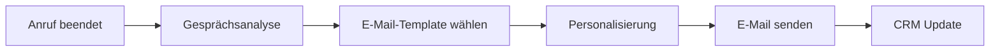
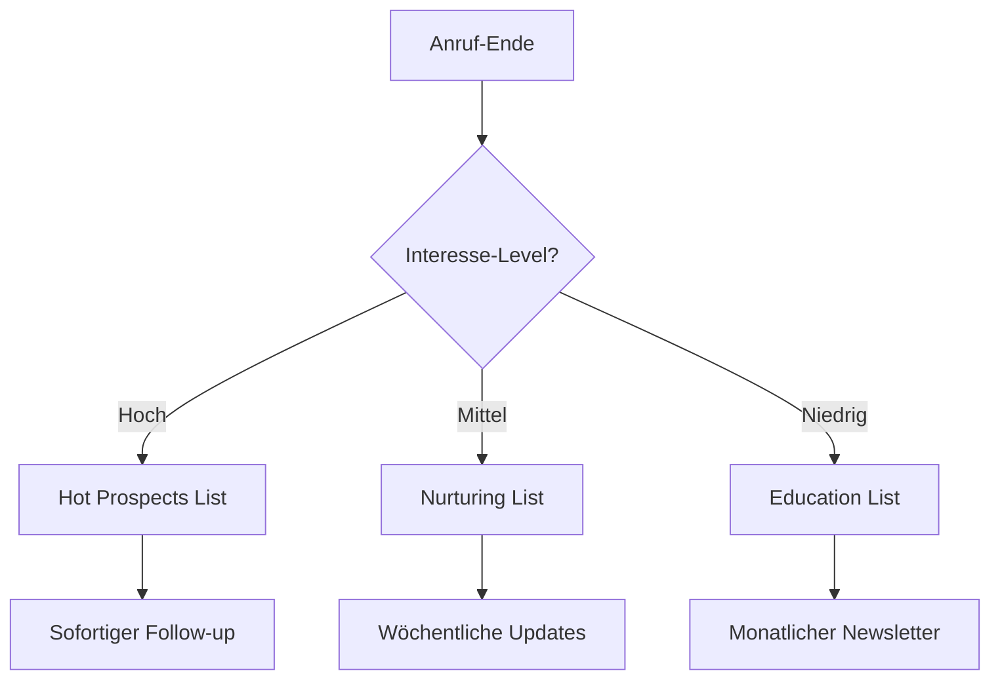

# E-Mail Marketing & Kommunikations-Integrationen

Verwandeln Sie jede Telefoninteraktion in eine Gelegenheit für gezieltes E-Mail-Marketing und Follow-up-Kommunikation. Famulor Automation verbindet Ihre KI-Telefonassistenten nahtlos mit führenden E-Mail-Plattformen für personalisierte, datengesteuerte Kommunikation.

## Gmail Integration

### Überblick
Gmail ist der weltweit am häufigsten verwendete E-Mail-Dienst. Die Integration mit Famulor Automation ermöglicht es, professionelle E-Mail-Workflows direkt aus Telefoninteraktionen zu erstellen.

### Integrationsfähigkeiten
- **E-Mail senden und empfangen**
- **Kontakt-Management**
- **Label- und Organisationssysteme**
- **Rich HTML E-Mail Formatting**
- **Anhang-Management**

### KI-Telefonassistent Anwendungsfälle

#### 📧 Automatisierte Follow-up E-Mails
**Beschreibung**: Senden Sie personalisierte Follow-up E-Mails sofort nach Anrufen mit relevanten Anhängen und Informationen.

**E-Mail-Typen**:
- **Dankeschön-E-Mails**: Nach erfolgreichen Verkaufsgesprächen
- **Information Follow-ups**: Mit angeforderten Dokumenten oder Preislisten
- **Terminbestätigungen**: Nach vereinbarten Meetings oder Demos
- **Support-Dokumentation**: Nach technischen Support-Anrufen

**Automatisierungs-Workflow**:


**Personalisierungs-Elemente**:
- Kundenname und Unternehmensdetails
- Gesprächsspezifische Referenzen
- Erwähnte Produkte oder Services
- Vereinbarte nächste Schritte
- Relevante Anhänge und Dokumente

#### 📅 Terminbestätigungs-E-Mails
**Beschreibung**: Senden Sie automatisch Kalendereinladungen und Bestätigungs-E-Mails für während Anrufen vereinbarte Termine.

**Termintypen**:
- **Verkaufsdemos**: Mit Agenda und Teilnehmerinformationen
- **Beratungsgespräche**: Mit Vorbereitung-Checklisten
- **Support-Sessions**: Mit technischen Anforderungen
- **Follow-up Calls**: Mit Erinnerungen an vorherige Gespräche

#### 🎯 Lead-Nurturing-Sequenzen
**Beschreibung**: Triggern Sie automatische E-Mail-Sequenzen basierend auf Interesse-Level, das während Anrufen geäußert wurde.

**Sequenz-Strategien**:
- **Hot Leads**: Sofortiger Follow-up mit Angebot
- **Warm Leads**: Bildungs-orientierte E-Mail-Serie
- **Cold Leads**: Langzeit-Nurturing mit wertvollen Inhalten
- **Unqualified**: Höfliche Ablehnung mit zukünftigen Kontaktoptionen

### Einrichtung
1. Gmail API-Zugang über Google Cloud Console aktivieren
2. OAuth 2.0 Authentifizierung konfigurieren
3. E-Mail-Templates für verschiedene Anruftypen erstellen
4. Automatisierungs-Workflows in Famulor Automation builder

---

## Mailchimp Integration

### Überblick
Mailchimp ist eine der beliebtesten All-in-One Marketing-Plattformen für E-Mail-Marketing, Zielgruppen-Management und Marketing-Automatisierung.

### Integrationsfähigkeiten
- **E-Mail-Kampagnen-Management**
- **Zielgruppen-Segmentierung**
- **Marketing-Automatisierung**
- **A/B Testing**
- **Erweiterte Analytics**

### KI-Telefonassistent Anwendungsfälle

#### 🎯 Zielgruppen-Segmentierung basierend auf Anrufen
**Beschreibung**: Segmentieren Sie automatisch E-Mail-Listen basierend auf Telefongespräch-Themen und -Ergebnissen.

**Segmentierungs-Kriterien**:
- **Produktinteresse**: Spezifische Produkte oder Services erwähnt
- **Kaufbereitschaft**: Budget und Zeitrahmen diskutiert
- **Unternehmensgröße**: Mitarbeiterzahl oder Umsatz erwähnt
- **Geografie**: Standort oder regionale Präferenzen
- **Engagement-Level**: Gesprächsdauer und Interaktionsqualität

**Automatische List-Updates**:


#### 🚀 Verhaltens-getriggerte Kampagnen
**Beschreibung**: Starten Sie E-Mail-Kampagnen automatisch, wenn bestimmte Keywords oder Phrasen während Anrufen erwähnt werden.

**Trigger-Beispiele**:
- **"Preise"** → Preis-Guide E-Mail Serie
- **"Demo"** → Product Demo Follow-up Sequenz
- **"Konkurrenz"** → Competitive Advantage Kampagne
- **"Budget"** → ROI Calculator und Case Studies

#### 📊 Kampagnen-Performance-Tracking
**Beschreibung**: Messen Sie, wie Telefonanrufe E-Mail-Engagement und Conversion-Raten beeinflussen.

**Tracking-Metriken**:
- Öffnungsraten nach Anruf-Typ
- Klickraten basierend auf Gesprächsinhalt
- Conversion-Raten von Anruf zu E-Mail
- Langzeit-Engagement von Telefon-Leads

### Mailchimp Automation Features
- **Drip Campaigns**: Zeitbasierte E-Mail-Sequenzen
- **Behavioral Triggers**: Reaktion auf Kundenaktionen
- **Dynamic Content**: Personalisierte Inhalte basierend auf Anrufdaten
- **Advanced Segmentation**: Multi-dimensionale Kundensegmentierung

---

## ActiveCampaign Integration

### Überblick
ActiveCampaign kombiniert E-Mail-Marketing, Marketing-Automatisierung und CRM-Funktionen in einer einheitlichen Plattform.

### Integrationsfähigkeiten
- **Erweiterte E-Mail-Automatisierung**
- **CRM und Sales-Automatisierung**
- **Verhaltens-Tracking**
- **Lead-Scoring Integration**
- **Site-Tracking und Event-Tracking**

### KI-Telefonassistent Anwendungsfälle

#### 🎨 Dynamische Content-Personalisierung
**Beschreibung**: Nutzen Sie Anruf-Erkenntnisse, um zukünftige E-Mail-Inhalte und Angebote zu personalisieren.

**Personalisierungs-Dimensionen**:
- **Industrie-spezifische Inhalte**: Basierend auf Firmen-Informationen
- **Rolle-basierte Messaging**: Angepasst an Entscheidungsträger-Level
- **Pain Point Addressing**: Adressierung spezifischer Herausforderungen
- **Solution Matching**: Passende Lösungen für geäußerte Bedürfnisse

#### 🔢 Lead-Scoring Integration
**Beschreibung**: Kombinieren Sie Telefoninteraktions-Daten mit E-Mail-Engagement für umfassendes Lead-Scoring.

**Scoring-Faktoren**:
- **Anruf-Qualität**: Gesprächsdauer und Engagement-Level
- **Interesse-Indikatoren**: Spezifische Fragen oder Anfragen
- **Budget-Qualifikation**: Preis-Diskussionen und Budget-Bestätigung
- **Timeline-Urgency**: Geäußerte Zeitrahmen für Entscheidungen
- **Decision Authority**: Bestätigte Entscheidungsbefugnis

#### 🌍 Cross-Channel Customer Journey Mapping
**Beschreibung**: Erstellen Sie einheitliche Customer Journeys, die Telefonanrufe und E-Mail-Interaktionen umfassen.

**Journey-Touchpoints**:
1. **Erste Aufmerksamkeit**: E-Mail oder Anzeige
2. **Information Gathering**: Website-Besuch
3. **Direct Engagement**: Telefonanruf
4. **Nurturing**: Follow-up E-Mail-Sequenz
5. **Decision Support**: Weitere Anrufe oder Meetings
6. **Conversion**: Kauf oder Vertragsabschluss
7. **Onboarding**: Willkommens-E-Mails und Setup-Anrufe

### ActiveCampaign Automation Examples

#### Anruf-zu-E-Mail Journey
```
Trigger: Anruf beendet (Interesse gezeigt)
Day 0: Sofortige Dankeschön-E-Mail mit Ressourcen
Day 1: Produktinformation basierend auf Gesprächsthemen
Day 3: Case Study relevanter Kundengruppe
Day 7: Follow-up Anruf anbieten
Day 14: Limited-time Angebot (wenn qualifiziert)
```

---

## Microsoft Outlook Integration

### Überblick
Microsoft Outlook ist der Standard für Enterprise-E-Mail-Kommunikation und integriert sich nahtlos in das Microsoft 365-Ecosystem.

### Integrationsfähigkeiten
- **Enterprise E-Mail-Management**
- **Kalender-Integration**
- **Contact und Global Address List**
- **Rules und Automatic Processing**
- **Office 365 Ecosystem Integration**

### KI-Telefonassistent Anwendungsfälle

#### 🏢 Enterprise-Meeting-Koordination
**Beschreibung**: Planen Sie komplexe Multi-Party-Meetings, die während Verkaufsgesprächen diskutiert wurden.

**Meeting-Orchestration**:
- Automatische Verfügbarkeitsprüfung aller Teilnehmer
- Konferenzraum-Buchung basierend auf Meeting-Größe
- Equipment-Reservierung (Beamer, Video-Konferenz)
- Catering-Anfragen für längere Sessions

#### 📚 Ressourcen-Zuordnung
**Beschreibung**: Buchen Sie Ressourcen und Equipment automatisch, wenn Kunden On-site-Besuche planen.

#### 🔔 Reminder-Automatisierung
**Beschreibung**: Setzen Sie automatische Erinnerungen für wichtige Kundenverpflichtungen, die während Anrufen gemacht wurden.

---

## SendGrid Integration

### Überblick
SendGrid ist ein cloud-basierter E-Mail-Delivery-Service, der für hohe Volumen und Transaktions-E-Mails optimiert ist.

### KI-Telefonassistent Anwendungsfälle

#### ⚡ Transaktionale E-Mails
**Beschreibung**: Senden Sie sofortige Transaktions-E-Mails basierend auf Anrufergebnissen.

**Transaktions-Typen**:
- Anruf-Bestätigungen und Zusammenfassungen
- Service-Requests und Ticket-Erstellung
- Appointment-Buchungen und Bestätigungen
- Document-Delivery nach Anrufen

#### 📈 High-Volume Follow-ups
**Beschreibung**: Verwalten Sie große Mengen von Follow-up E-Mails für Outbound-Kampagnen.

---

## E-Mail Integration Best Practices

### 🎯 Personalisierung
- **Dynamische Inhalte**: Nutzen Sie Anrufdaten für relevante Personalisierung
- **Timing Optimization**: Senden Sie E-Mails zum optimalen Zeitpunkt
- **Frequency Capping**: Vermeiden Sie E-Mail-Überflutung
- **Preference Centers**: Respektieren Sie Kundenpräferenzen

### 📊 Performance Monitoring
- **Delivery Rates**: Überwachen Sie Zustellbarkeit
- **Engagement Metrics**: Verfolgen Sie Öffnungs- und Klickraten
- **Conversion Tracking**: Messen Sie E-Mail-zu-Sale Conversions
- **List Health**: Überwachen Sie Bounce-Raten und Unsubscribes

### 🔒 Compliance & Deliverability
- **DSGVO Compliance**: Stellen Sie Einverständnis und Opt-out Optionen sicher
- **CAN-SPAM Act**: Befolgen Sie Anti-Spam-Gesetze
- **Authentication**: Implementieren Sie SPF, DKIM, und DMARC
- **Reputation Management**: Überwachen Sie Sender-Reputation

### 🔄 Automation Optimization
- **A/B Testing**: Testen Sie verschiedene E-Mail-Varianten
- **Segmentation**: Verfeinern Sie Zielgruppen-Segmentierung kontinuierlich
- **Journey Optimization**: Optimieren Sie Customer Journey Flows
- **Content Refresh**: Aktualisieren Sie E-Mail-Templates regelmäßig

## Erweiterte E-Mail-Marketing-Szenarien

### Multi-Touch Attribution
- **Anruf-zu-E-Mail Attribution**: Verfolgen Sie komplette Customer Journeys
- **Cross-Channel Analytics**: Verstehen Sie Channel-Synergien
- **Lifetime Value Calculation**: Berechnen Sie LTV über alle Touchpoints
- **ROI Optimization**: Optimieren Sie Budget-Allocation

### AI-Enhanced Email Marketing
- **Predictive Send Times**: KI-optimierte Versendzeiten
- **Dynamic Subject Lines**: Anruf-basierte Subject Line Generation
- **Content Optimization**: KI-gesteuerte Content-Personalisierung
- **Sentiment-Based Messaging**: E-Mail-Ton basierend auf Anruf-Sentiment

## Erste Schritte

<Steps>
  <Step title="E-Mail-Plattform wählen">
    Wählen Sie Ihre primäre E-Mail-Marketing-Plattform
  </Step>
  <Step title="API-Integration">
    Konfigurieren Sie API-Zugang und Authentifizierung
  </Step>
  <Step title="Template-Erstellung">
    Erstellen Sie E-Mail-Templates für verschiedene Anruftypen
  </Step>
  <Step title="Automation Workflows">
    Bauen Sie Automation-Workflows im Visual Builder
  </Step>
  <Step title="Testing & Optimization">
    Testen Sie Workflows und optimieren Sie Performance
  </Step>
</Steps>

## Nächste Schritte

<CardGroup cols={2}>
  <Card title="CRM-Integration" icon="users" href="/automation-platform/integrations/crm">
    Verbinden Sie E-Mail-Daten mit Ihrem CRM-System
  </Card>
  <Card title="Analytics" icon="chart-line" href="/automation-platform/integrations/analytics">
    Erweiterte E-Mail-Performance-Analyse
  </Card>
  <Card title="Kommunikationstools" icon="comments" href="/automation-platform/integrations/communication">
    Team-Benachrichtigungen über E-Mail-Performance
  </Card>
  <Card title="Kalender-Integration" icon="calendar" href="/automation-platform/integrations/calendar">
    Meeting-Planung basierend auf E-Mail-Engagement
  </Card>
</CardGroup>

---

**Support**: Für detaillierte Hilfe bei E-Mail-Integrationen kontaktieren Sie unser Support-Team über [support@famulor.de](mailto:support@famulor.de).