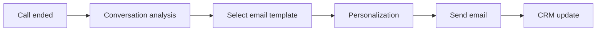
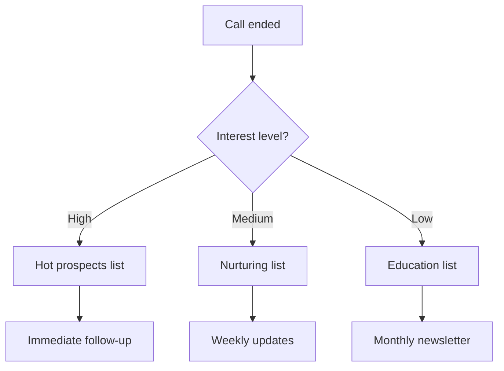

# Email Marketing & Communication Integrations

Turn every phone interaction into an opportunity for targeted email marketing and follow-up communication. Famulor Automation seamlessly connects your AI phone assistants with leading email platforms for personalized, data-driven communication.

## Gmail Integration

### Overview
Gmail is the world's most widely used email service. Integration with Famulor Automation enables the creation of professional email workflows directly from phone interactions.

### Integration Capabilities
- **Send and receive emails**
- **Contact management**
- **Label and organization systems**
- **Rich HTML email formatting**
- **Attachment management**

### AI Phone Assistant Use Cases

#### 📧 Automated Follow-up Emails
**Description**: Send personalized follow-up emails immediately after calls with relevant attachments and information.

**Email Types**:
- **Thank-you emails**: After successful sales calls
- **Information follow-ups**: With requested documents or price lists
- **Appointment confirmations**: After scheduled meetings or demos
- **Support documentation**: After technical support calls

**Automation Workflow**:

```mermaid
graph LR
    A[Call ended] --> B[Conversation analysis]
    B --> C[Select email template]
    C --> D[Personalization]
    D --> E[Send email]
    E --> F[CRM update]
```

**Personalization Elements**:
- Customer name and company details
- Call-specific references
- Mentioned products or services
- Agreed next steps
- Relevant attachments and documents

#### 📅 Appointment Confirmation Emails
**Description**: Automatically send calendar invitations and confirmation emails for appointments scheduled during calls.

**Appointment Types**:
- **Sales demos**: With agenda and participant information
- **Consultation calls**: With preparation checklists
- **Support sessions**: With technical requirements
- **Follow-up calls**: With reminders of previous conversations

#### 🎯 Lead Nurturing Sequences
**Description**: Trigger automated email sequences based on interest levels expressed during calls.

**Sequence Strategies**:
- **Hot leads**: Immediate follow-up with an offer
- **Warm leads**: Educational email series
- **Cold leads**: Long-term nurturing with valuable content
- **Unqualified**: Polite rejection with future contact options

### Setup
1. Enable Gmail API access via Google Cloud Console
2. Configure OAuth 2.0 authentication
3. Create email templates for different call types
4. Build automation workflows in Famulor Automation builder

---

## Mailchimp Integration

### Overview
Mailchimp is one of the most popular all-in-one marketing platforms for email marketing, audience management, and marketing automation.

### Integration Capabilities
- **Email campaign management**
- **Audience segmentation**
- **Marketing automation**
- **A/B testing**
- **Advanced analytics**

### AI Phone Assistant Use Cases

#### 🎯 Audience Segmentation Based on Calls
**Description**: Automatically segment email lists based on phone call topics and outcomes.

**Segmentation Criteria**:
- **Product interest**: Specific products or services mentioned
- **Purchase readiness**: Budget and timeframe discussed
- **Company size**: Number of employees or revenue mentioned
- **Geography**: Location or regional preferences
- **Engagement level**: Call duration and interaction quality

**Automatic List Updates**:

```mermaid
graph TB
    A[Call ended] --> B{Interest level?}
    B -->|High| C[Hot prospects list]
    B -->|Medium| D[Nurturing list]
    B -->|Low| E[Education list]
    C --> F[Immediate follow-up]
    D --> G[Weekly updates]
    E --> H[Monthly newsletter]
```

#### 🚀 Behavior-Triggered Campaigns
**Description**: Start email campaigns automatically when specific keywords or phrases are mentioned during calls.

**Trigger Examples**:
- **"Prices"** → Price guide email series
- **"Demo"** → Product demo follow-up sequence
- **"Competitor"** → Competitive advantage campaign
- **"Budget"** → ROI calculator and case studies

#### 📊 Campaign Performance Tracking
**Description**: Measure how phone calls influence email engagement and conversion rates.

**Tracking Metrics**:
- Open rates by call type
- Click rates based on call content
- Conversion rates from call to email
- Long-term engagement from phone leads

### Mailchimp Automation Features
- **Drip campaigns**: Time-based email sequences
- **Behavioral triggers**: Reactions to customer actions
- **Dynamic content**: Personalized content based on call data
- **Advanced segmentation**: Multi-dimensional customer segmentation

---

## ActiveCampaign Integration

### Overview
ActiveCampaign combines email marketing, marketing automation, and CRM features in a unified platform.

### Integration Capabilities
- **Advanced email automation**
- **CRM and sales automation**
- **Behavioral tracking**
- **Lead scoring integration**
- **Site tracking and event tracking**

### AI Phone Assistant Use Cases

#### 🎨 Dynamic Content Personalization
**Description**: Use call insights to personalize future email content and offers.

**Personalization Dimensions**:
- **Industry-specific content**: Based on company information
- **Role-based messaging**: Tailored to decision-maker level
- **Pain point addressing**: Targeting specific challenges
- **Solution matching**: Relevant solutions for expressed needs

#### 🔢 Lead Scoring Integration
**Description**: Combine phone interaction data with email engagement for comprehensive lead scoring.

**Scoring Factors**:
- **Call quality**: Call duration and engagement level
- **Interest indicators**: Specific questions or requests
- **Budget qualification**: Price discussions and budget confirmation
- **Timeline urgency**: Expressed decision timeframes
- **Decision authority**: Confirmed decision-making power

#### 🌍 Cross-Channel Customer Journey Mapping
**Description**: Create unified customer journeys encompassing phone calls and email interactions.

**Journey Touchpoints**:
1. **Initial awareness**: Email or ad
2. **Information gathering**: Website visit
3. **Direct engagement**: Phone call
4. **Nurturing**: Follow-up email sequence
5. **Decision support**: Additional calls or meetings
6. **Conversion**: Purchase or contract closure
7. **Onboarding**: Welcome emails and setup calls

### ActiveCampaign Automation Examples

#### Call-to-Email Journey
```
Trigger: Call ended (interest shown)
Day 0: Immediate thank-you email with resources
Day 1: Product information based on call topics
Day 3: Case study of relevant customer group
Day 7: Offer follow-up call
Day 14: Limited-time offer (if qualified)
```

---

## Microsoft Outlook Integration

### Overview
Microsoft Outlook is the enterprise standard for email communication and integrates seamlessly into the Microsoft 365 ecosystem.

### Integration Capabilities
- **Enterprise email management**
- **Calendar integration**
- **Contact and global address list**
- **Rules and automatic processing**
- **Office 365 ecosystem integration**

### AI Phone Assistant Use Cases

#### 🏢 Enterprise Meeting Coordination
**Description**: Schedule complex multi-party meetings discussed during sales calls.

**Meeting Orchestration**:
- Automatic availability checks for all participants
- Conference room booking based on meeting size
- Equipment reservations (projector, video conferencing)
- Catering requests for longer sessions

#### 📚 Resource Allocation
**Description**: Automatically book resources and equipment when customers plan on-site visits.

#### 🔔 Reminder Automation
**Description**: Set automatic reminders for important customer commitments made during calls.

---

## SendGrid Integration

### Overview
SendGrid is a cloud-based email delivery service optimized for high volume and transactional emails.

### AI Phone Assistant Use Cases

#### ⚡ Transactional Emails
**Description**: Send immediate transactional emails based on call outcomes.

**Transaction Types**:
- Call confirmations and summaries
- Service requests and ticket creations
- Appointment bookings and confirmations
- Document delivery after calls

#### 📈 High-Volume Follow-ups
**Description**: Manage large volumes of follow-up emails for outbound campaigns.

---

## Email Integration Best Practices

### 🎯 Personalization
- **Dynamic content**: Use call data for relevant personalization
- **Timing optimization**: Send emails at optimal times
- **Frequency capping**: Avoid email overload
- **Preference centers**: Respect customer preferences

### 📊 Performance Monitoring
- **Delivery rates**: Monitor deliverability
- **Engagement metrics**: Track open and click rates
- **Conversion tracking**: Measure email-to-sale conversions
- **List health**: Monitor bounce rates and unsubscribes

### 🔒 Compliance & Deliverability
- **GDPR compliance**: Ensure consent and opt-out options
- **CAN-SPAM Act**: Follow anti-spam laws
- **Authentication**: Implement SPF, DKIM, and DMARC
- **Reputation management**: Monitor sender reputation

### 🔄 Automation Optimization
- **A/B testing**: Test different email variants
- **Segmentation**: Continuously refine audience segmentation
- **Journey optimization**: Optimize customer journey flows
- **Content refresh**: Regularly update email templates

## Advanced Email Marketing Scenarios

### Multi-Touch Attribution
- **Call-to-email attribution**: Track complete customer journeys
- **Cross-channel analytics**: Understand channel synergies
- **Lifetime value calculation**: Calculate LTV across all touchpoints
- **ROI optimization**: Optimize budget allocation

### AI-Enhanced Email Marketing
- **Predictive send times**: AI-optimized send times
- **Dynamic subject lines**: Call-based subject line generation
- **Content optimization**: AI-driven content personalization
- **Sentiment-based messaging**: Email tone based on call sentiment

## Getting Started

<Steps>
  <Step title="Select Email Platform">
    Choose your primary email marketing platform
  </Step>
  <Step title="API Integration">
    Configure API access and authentication
  </Step>
  <Step title="Template Creation">
    Create email templates for different call types
  </Step>
  <Step title="Automation Workflows">
    Build automation workflows in the visual builder
  </Step>
  <Step title="Testing & Optimization">
    Test workflows and optimize performance
  </Step>
</Steps>

## Next Steps

<CardGroup cols={2}>
  <Card title="CRM Integration" icon="users" href="/en/automation-platform/integrations/crm">
    Connect email data with your CRM system
  </Card>
  <Card title="Analytics" icon="chart-line" href="/en/automation-platform/integrations/analytics">
    Advanced email performance analytics
  </Card>
  <Card title="Communication Tools" icon="comments" href="/en/automation-platform/integrations/communication">
    Team notifications on email performance
  </Card>
  <Card title="Calendar Integration" icon="calendar" href="/en/automation-platform/integrations/calendar">
    Meeting scheduling based on email engagement
  </Card>
</CardGroup>

---

**Support**: For detailed help with email integrations, please contact our support team at [support@famulor.io](mailto:support@famulor.io).

<Tip>
Related pages: [Introduction](/en/automation-platform/introduction) and [Building Flows](/en/automation-platform/building-flows), and [Debugging Runs](/en/automation-platform/debugging-runs).
</Tip>
