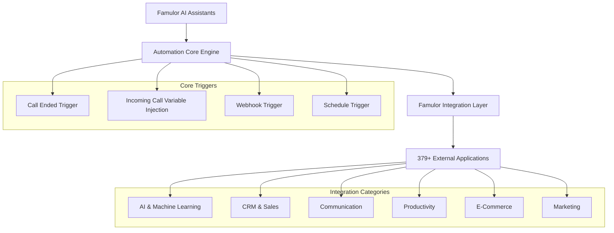

# Famulor Automation Platform - Comprehensive Integrations Database

This database serves as the central reference for all available integrations on the Famulor Automation Platform. Each integration includes detailed information on available actions and triggers that seamlessly work with your AI phone assistants.

## Integration Engine Architecture

## Complete Integrations Database

### **A**

---
**Acumbamail**
* **Description:** Email marketing platform for newsletters and campaign management
* **Actions:**
    * **Remove Subscriber:** Remove a subscriber from an Acumbamail list
    * **Search Subscriber:** Search for a subscriber in an Acumbamail list by email
    * **Duplicate Template:** Duplicate an existing email template
    * **Add/Update Subscriber:** Add a new subscriber or update an existing one
    * **Create Subscriber List:** Create a new subscriber list
    * **Delete Subscriber List:** Delete a subscriber list
    * **Unsubscribe Subscriber:** Unsubscribe a subscriber from a list

---
**Actual Budget**
* **Description:** Open-source budgeting and financial management tool
* **Actions:**
    * **Get Budget:** Retrieve budget overview for a specific month and year
    * **Get Accounts:** List all accounts configured in Actual Budget
    * **Get Categories:** Retrieve categories defined in Actual Budget
    * **Import Transaction:** Import a single transaction
    * **Import Transactions:** Bulk import multiple transactions

---
**ActiveCampaign**
* **Description:** All-in-one marketing automation and CRM platform
* **Actions:**
    * **Create Account:** Create a new account in ActiveCampaign
    * **Create Contact:** Create a new contact in ActiveCampaign
    * **Update Account:** Update an existing ActiveCampaign account
    * **Update Contact:** Update an existing contact in ActiveCampaign
    * **Add Tag to Contact:** Add a tag to an ActiveCampaign contact
    * **Add Contact to Account:** Add a contact to an ActiveCampaign account
    * **Subscribe or Unsubscribe Contact From List:** Subscribe or unsubscribe a contact from a list

---
**Afforai**
* **Description:** AI-powered chatbot for document-based responses
* **Actions:**
    * **Ask Chatbot:** Generate an answer from an Afforai chatbot by sending a question

---
**Airtable**
* **Description:** AI-native app building platform for custom business apps without code
* **Actions:**
    * **Custom API Call:** Make a custom API request to Airtable
    * **Find Airtable Record:** Find a record in an Airtable base
    * **Create Airtable Record:** Create a new record in an Airtable table
    * **Delete Airtable Record:** Delete a record from an Airtable table
    * **Update Airtable Record:** Update an existing record in Airtable
    * **Upload File to Column:** Upload a file to an attachment column of an Airtable record

---
**AITable**
* **Description:** AI-powered spreadsheet and database platform
* **Actions:**
    * **Custom API Call:** Make a custom API request to a specific AITable endpoint
    * **Find Records:** Find records in a datasheet
    * **Create Record:** Create a new record in an AITable datasheet
    * **Update Record:** Update an existing record in an AITable datasheet

---
**Airparser**
* **Description:** Document analysis tool for automatic data extraction
* **Actions:**
    * **Upload Document:** Upload a document for analysis to an Airparser inbox
    * **Get Data from Document:** Retrieve parsed JSON data from a specific document in Airparser

---
**Amazon S3**
* **Description:** Cloud storage service from Amazon Web Services
* **Actions:**
    * **Read File:** Read a file from an Amazon S3 bucket
    * **Upload File:** Upload a file to an Amazon S3 bucket

---
**Amazon SQS**
* **Description:** Amazon’s message queue service for asynchronous communication
* **Actions:**
    * **Send Message:** Send a message to an Amazon SQS queue

---
**Aminos**
* **Description:** User and identity management platform
* **Actions:**
    * **Create User on Aminos One:** Create a new user in Aminos One

---
**AnyHook GraphQL**
* **Description:** GraphQL webhook service for real-time data transmission
* **Actions:**
    * **Execute GraphQL Query:** Execute a GraphQL query on any endpoint
    * **Subscribe to GraphQL Subscription:** Manage real-time data subscriptions via GraphQL

---
**AnyHook Websocket**
* **Description:** WebSocket service for bidirectional real-time communication
* **Actions:**
    * **Send WebSocket Message:** Send a message over a WebSocket connection
    * **Listen to WebSocket Events:** Process incoming WebSocket messages

---
**Anthropic Claude**
* **Description:** Advanced AI language model for natural language processing
* **Actions:**
    * **Generate Text:** Generate text with Claude AI
    * **Chat Completion:** Create conversation-based AI responses
    * **Text Analysis:** Analyze and understand text content
    * **Content Moderation:** Check content for safety and appropriateness

---
**Apify**
* **Description:** Web scraping and data extraction platform
* **Actions:**
    * **Get user's Actors:** Retrieve list of Apify actors available to the user
    * **Get last run details:** Retrieve details of the last run of a specific Apify actor
    * **Start an Apify Actor:** Start an Apify actor web scraper
    * **Get Dataset Items:** Retrieve dataset items from a completed Apify actor run

---
**Apollo**
* **Description:** Sales intelligence and lead generation platform
* **Actions:**
    * **Search People:** Search for people based on specific criteria
    * **Search Companies:** Find companies in the Apollo database
    * **Add Contact to Sequence:** Add a contact to an email sequence
    * **Create Contact:** Create a new contact in Apollo
    * **Update Contact:** Update existing contact information
    * **Export Search Results:** Export search results as CSV

---
**Approval**
* **Description:** Workflow approval system for business processes
* **Actions:**
    * **Send for Approval:** Submit an item for approval
    * **Approve Item:** Approve an item requiring approval
    * **Reject Item:** Reject an item requiring approval
    * **Get Approval Status:** Retrieve approval request status
* **Triggers:**
    * **Approval Requested:** Fired when a new approval is requested
    * **Approval Granted:** Fired when an approval is granted
    * **Approval Rejected:** Fired when an approval is rejected

---
**Asana**
* **Description:** Project management and team collaboration platform
* **Actions:**
    * **Create Task:** Create a new task in a project
    * **Update Task:** Update an existing task
    * **Delete Task:** Delete a task from a project
    * **Add Comment to Task:** Add a comment to a task
    * **Create Project:** Create a new project
    * **Add User to Project:** Add a user to a project
    * **Set Task Due Date:** Set a due date for a task
    * **Assign Task:** Assign a task to a team member
    * **Custom API Call:** Execute custom API calls to Asana
* **Triggers:**
    * **New Task Created:** Fired when a new task is created
    * **Task Updated:** Fired when a task is updated
    * **Task Completed:** Fired when a task is marked completed

---
**AssemblyAI**
* **Description:** AI-powered audio transcription and analysis platform
* **Actions:**
    * **Transcribe Audio:** Transcribe audio files into text
    * **Analyze Audio Content:** Analyze audio content for sentiment and topics
    * **Real-time Transcription:** Transcribe live audio streams
    * **Extract Audio Insights:** Extract key information from audio files
    * **Language Detection:** Detect spoken language in audio files

---
**Azure Communication Services**
* **Description:** Microsoft Azure’s cloud communications platform
* **Actions:**
    * **Send SMS:** Send SMS messages via Azure
    * **Make Voice Call:** Initiate voice calls via Azure
    * **Send Email:** Send emails via Azure Communication Services
    * **Create Chat Thread:** Create a new chat thread
    * **Add Participant to Chat:** Add a participant to a chat

---
**Azure OpenAI**
* **Description:** OpenAI services integrated into Microsoft Azure cloud
* **Actions:**
    * **Generate Text Completion:** Text completion with Azure OpenAI
    * **Create Chat Completion:** Generate chat-based AI responses
    * **Generate Embeddings:** Create text embeddings for semantic search
    * **Analyze Text:** Analyze text content using OpenAI models
    * **Custom Model Inference:** Perform custom model inference

### **B**

---
**Bannerbear**
* **Description:** Automated image and video generation API
* **Actions:**
    * **Create Image:** Create dynamic images based on templates
    * **Create Video:** Generate automated videos
    * **Generate Screenshot:** Create screenshots of websites
    * **Bulk Image Generation:** Generate multiple images simultaneously
    * **Get Template List:** Retrieve available templates

---
**Baserow**
* **Description:** Open-source alternative to Airtable for database management
* **Actions:**
    * **Create Row:** Create a new row in a Baserow table
    * **Update Row:** Update an existing row
    * **Delete Row:** Delete a row from a table
    * **Get Rows:** Retrieve rows based on filter criteria
    * **List Tables:** List all tables in a database

---
**Beamer**
* **Description:** Changelog and update communication tool
* **Actions:**
    * **Create Post:** Create a new changelog entry
    * **Update Post:** Update an existing post
    * **Publish Post:** Publish a draft post
    * **Get Post Statistics:** Retrieve statistics for a post
    * **Notify Subscribers:** Notify subscribers about updates

---
**Bettermode**
* **Description:** Community management and engagement platform
* **Actions:**
    * **Assign Badge to Member:** Assign a badge to a member in Bettermode
    * **Revoke Badge from Member:** Remove a badge from a member
    * **Create Question Post:** Create a question post in Bettermode
    * **Custom API Call:** Execute a custom GraphQL API call to Bettermode
    * **Create Discussion Post:** Publish a discussion post in Bettermode

---
**Binance**
* **Description:** Leading cryptocurrency exchange platform
* **Actions:**
    * **Fetch Pair Price:** Retrieve current price for a cryptocurrency pair on Binance
    * **Get Account Balance:** Retrieve account balances in different cryptocurrencies
    * **Place Order:** Create buy or sell orders
    * **Get Order History:** Retrieve trade history
    * **Get Market Data:** Retrieve market data and price trends

---
**Blackbaud**
* **Description:** Nonprofit management and fundraising software
* **Actions:**
    * **Create Gift:** Create a gift record in Blackbaud
    * **Get Gift Subtypes:** Retrieve available gift subtypes
    * **Get Fundraising List:** Retrieve details of a fundraising list
    * **Search Contacts After Date:** Search contacts added after a specific date
    * **Upsert Contact on Email:** Create or update a contact based on email address

---
**Blockscout**
* **Description:** Blockchain explorer for Ethereum-based networks
* **Actions:**
    * **Get Transaction Details:** Retrieve blockchain transaction details
    * **Get Address Balance:** Query blockchain address balance
    * **Get Block Information:** Retrieve information about a specific block
    * **Verify Smart Contract:** Verify and validate smart contracts
    * **Search Tokens:** Search token information on the blockchain

---
**Bloomerang**
* **Description:** Donor management and fundraising CRM for nonprofits
* **Actions:**
    * **Create Constituent:** Create a new donor or contact
    * **Update Constituent:** Update donor information
    * **Record Donation:** Record and process a donation
    * **Create Interaction:** Document an interaction with a donor
    * **Generate Report:** Generate fundraising reports

---
**Bonjoro**
* **Description:** Personalized video messaging platform for customer engagement
* **Actions:**
    * **Send Video Message:** Send a personalized video message
    * **Create Task:** Create a new task for video outreach
    * **Update Contact:** Update contact information
    * **Track Video Views:** Track video views and engagement
    * **Schedule Video:** Schedule a video for later sending

---
**Box**
* **Description:** Enterprise cloud content management and collaboration
* **Actions:**
    * **Upload File:** Upload a file to Box
    * **Download File:** Download a file from Box
    * **Create Folder:** Create a new folder
    * **Share File:** Share a file with other users
    * **Move File:** Move a file to another folder
    * **Delete File:** Permanently delete a file

---
**Brevo**
* **Description:** All-in-one digital marketing platform (formerly Sendinblue)
* **Actions:**
    * **Send Email:** Send emails via Brevo
    * **Create Contact:** Add a new contact to the list
    * **Update Contact:** Update contact information
    * **Send SMS:** Send SMS messages
    * **Create Email Campaign:** Create and schedule email campaigns
    * **Get Campaign Statistics:** Retrieve campaign performance data

---
**Brilliant Directories**
* **Description:** Software for creating and managing online directories
* **Actions:**
    * **Create Listing:** Create a new directory listing
    * **Update Listing:** Update an existing listing
    * **Delete Listing:** Remove a listing from the directory
    * **Search Listings:** Search listings based on criteria
    * **Moderate Listing:** Review and approve listings for publication

---
**Bubble**
* **Description:** No-code platform for web app development
* **Actions:**
    * **Create Database Entry:** Create a new database entry in Bubble
    * **Update Database Entry:** Update an existing entry
    * **Delete Database Entry:** Delete an entry from the database
    * **Search Database:** Search database entries based on criteria
    * **Trigger Workflow:** Trigger a Bubble workflow from external sources

## Next Steps

<CardGroup cols={2}>
  <Card title="CRM Integrations" icon="users" href="/en/automation-platform/integrations/crm">
    Connect your customer data with call automation
  </Card>
  <Card title="AI & Machine Learning" icon="brain" href="/en/automation-platform/integrations/ai-machine-learning">
    Advanced AI features for your phone assistants
  </Card>
  <Card title="Communication Platforms" icon="comments" href="/en/automation-platform/integrations/communication">
    Seamless team communication and notifications
  </Card>
  <Card title="Email Marketing" icon="envelope" href="/en/automation-platform/integrations/email-marketing">
    Automated email workflows triggered by calls
  </Card>
</CardGroup>

<Note>
**Complete Integrations Database**: This page shows the first two sections (A-B) of the comprehensive integrations database. The full list with over 379 integrations covers all categories from C to Z and is continuously expanding.

For a complete list of all available integrations or special implementation requests, please contact our support team.
</Note>

---

**Note**: All integrations are immediately available and can be set up without technical knowledge. Our support team is available for special requirements.