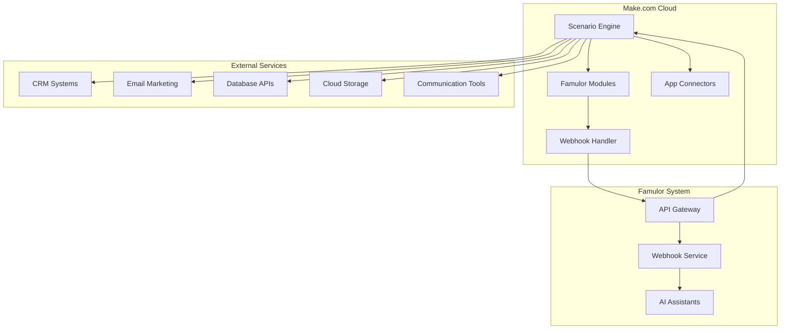
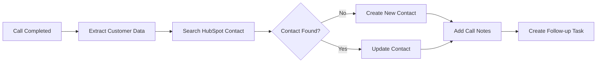

# Make.com Integration

**Cloud-based alternative to Famulor Automation**: If you prefer not to use the native Famulor Automation Platform, Make.com offers a powerful, user-friendly alternative to automate your workflows.

Seamlessly connect Famulor with **Make.com** using our official Make.com app. Automate workflows between your AI telephony platform and over **1000 available apps**—ranging from CRM systems to cloud services.

<Card title="Official Famulor Make.com App" icon="puzzle-piece" href="https://www.make.com/en/hq/app-invitation/5dc7ab8bf7bbe546f4ad7eb1483a820f">
  Install our official Make.com app directly via this link
</Card>

## When should you choose Make.com?

<CardGroup cols={2}>
  <Card title="✅ Use Make.com if" icon="check-circle" color="green">
    - You want a user-friendly, visual interface  
    - You prefer cloud-hosted workflows  
    - You don’t want to manage technical infrastructure  
    - You want to start quickly without setup  
    - You want access to over 1000 ready-made app integrations  
    - You need a proven, professional tool
  </Card>
  <Card title="⚡ Use Famulor Automation if" icon="wand-magic-sparkles" color="blue">
    - You want native Famulor integration  
    - You want to start immediately without external accounts  
    - You require deeper Famulor feature integration  
    - You prefer an all-in-one solution  
    - You need direct support from Famulor
  </Card>
</CardGroup>

## Make.com vs. Famulor Automation Platform

Both solutions have their specific strengths. Here’s a detailed comparison:

| Feature | Make.com | Famulor Automation |
|---------|----------|-------------------|
| **Setup Complexity** | ✅ Instantly available, no setup needed | ✅ Instantly available, no setup needed |
| **Available Integrations** | ✅ 1000+ apps + webhooks | ⚠️ Limited selection |
| **Workflow Complexity** | ✅ Very complex, advanced logic | ✅ Branching, complex logic |
| **Cost** | ⚠️ Starting at €9/month (after free tier) | ✅ Included at no extra cost |
| **Hosting** | ✅ Fully managed | ✅ Fully managed |
| **User-friendliness** | ✅ Drag & drop, visual editor | ✅ Simple flow builder |
| **Enterprise Features** | ✅ Teams, roles, advanced features | ⚠️ Basic features |
| **Community** | ✅ Large Make.com community | ✅ Direct Famulor support |

### Practical use cases for Make.com

**✅ Ideal for Make.com:**
- **Multi-app integration**: Connecting to CRMs, marketing tools, databases  
- **E-commerce**: Shopify, WooCommerce, Stripe integrations  
- **Marketing automation**: MailChimp, HubSpot, ActiveCampaign  
- **Data processing**: Google Sheets, Airtable, Notion  
- **Team collaboration**: Slack, Microsoft Teams, Trello  

**⚡ Better with Famulor Automation:**
- **Simple workflows**: Quick, straightforward automations  
- **Native features**: Deep Famulor ecosystem integration  
- **Free usage**: No additional monthly fees  
- **Support**: Direct support from Famulor team  

## Installing the Famulor Make.com App

<Steps>
  <Step title="Create Make.com Account">
    If you don’t have one yet, create a free account at [Make.com](https://www.make.com)
  </Step>
  <Step title="Install Famulor App">
    Click on our installation link:
    
    <Card title="Install Famulor App" icon="external-link" href="https://www.make.com/en/hq/app-invitation/5dc7ab8bf7bbe546f4ad7eb1483a820f">
      Go directly to the Make.com app installation
    </Card>
  </Step>
  <Step title="Add API Key">
    Connect your Famulor account using your API key from the [Famulor dashboard](https://app.famulor.de)
  </Step>
  <Step title="Create your first workflow">
    Build your first scenario using Famulor modules
  </Step>
</Steps>

<Note>
**Tip**: You can find your Famulor API key in your dashboard under Settings → API Key.
</Note>

## Architecture Overview

The Make.com integration enables bidirectional communication between Famulor and any cloud services via the Make.com platform.



## Available Modules

### Triggers

| Trigger | Description | Available Data |
|---------|-------------|----------------|
| **Call Completed** | Triggered when an AI call ends | `call_id`, `duration`, `transcript`, `extracted_variables`, `customer_phone`, `status` |
| **Watch Ended Phone Call** | Alternative name for Call Completed | Identical data as Call Completed |

### Actions

| Action | Description | Required Parameters |
|--------|-------------|---------------------|
| **Make Call** | Initiates an outgoing AI call | `phone_number`, `assistant_id`, `variables` (optional) |
| **Make API Call** | Universal API call for all Famulor endpoints | `url`, `method`, `headers`, `body` |

### Search

| Search | Description | Parameters |
|--------|-------------|------------|
| **Get Assistants** | Lists all available AI assistants | `limit` (optional) |

## Popular Workflow Examples

### CRM Integration with HubSpot


### Lead Notification via Slack


### Email Follow-up Automation


## Advanced Features

### Webhook Integration
Make.com supports both outgoing and incoming webhooks for maximum flexibility:

```json
{
  "webhook_url": "https://hook.eu1.make.com/xyz123...",
  "triggers": [
    "call_completed",
    "call_started"
  ],
  "authentication": "Bearer YOUR_API_KEY"
}
```

### Data Processing
Leverage Make.com’s powerful data processing tools:

- **Filter**: Process only relevant calls  
- **Router**: Branch workflows based on call outcomes  
- **Aggregator**: Combine multiple calls  
- **Iterator**: Process lists of data  
- **Text/JSON Parser**: Analyze transcripts and metadata  

### Error Handling
Make.com offers robust error handling:

- **Retry Mechanism**: Automatic retries on temporary errors  
- **Error Handling**: Dedicated paths for error cases  
- **Fallback Actions**: Alternative actions on failures  
- **Monitoring**: Detailed logs and notifications  

## Authentication & Security

The Make.com integration implements proven security standards:

- **OAuth 2.0 & API key**: Flexible authentication options  
- **HTTPS Encryption**: All data transfers are encrypted  
- **Webhook Verification**: Signature-based webhook validation  
- **Rate Limiting**: Automatic protection against overload  

## Pricing

### Make.com Pricing
- **Free**: 1,000 operations/month  
- **Core**: €9/month (10,000 operations)  
- **Pro**: €16/month (40,000 operations)  
- **Teams**: €29/month (100,000 operations)  
- **Enterprise**: Custom pricing  

### What counts as an operation?
- Each trigger call = 1 operation  
- Each action execution = 1 operation  
- Each API call = 1 operation  

<Note>
**Tip**: For high volume, using native Famulor Automation may be more cost-effective.
</Note>

## Best Practices

### Workflow Optimization
- **Batch processing**: Collect multiple calls before triggering actions  
- **Conditional logic**: Use filters to avoid unnecessary operations  
- **Caching**: Avoid repeated API calls for the same data  

### Error Handling
- **Retry logic**: Implement retries for temporary errors  
- **Error paths**: Set up alternative routes for errors  
- **Notifications**: Configure alerts for critical failures  

### Security
- **API key management**: Rotate your API keys regularly  
- **Webhook security**: Use HTTPS for all webhook endpoints  
- **Data privacy**: Do not log sensitive customer data  

### Performance
- **Scenario scheduling**: Use scheduled scenarios for non-critical tasks  
- **Data minimization**: Transmit only required data fields  
- **Connection reuse**: Use one connection for multiple modules  

## Why Make.com is an excellent alternative

### 🎨 User-friendliness
Visual drag & drop editor makes complex automations accessible to everyone.

### ☁️ Cloud-native
No infrastructure management — everything runs reliably in the Make.com cloud.

### 🔗 Massive ecosystem
Over 1000 prebuilt app integrations cover almost every use case.

### 📊 Advanced features
Teams, role management, detailed analytics, and enterprise features.

### 🚀 Scalable
From small workflows up to enterprise-wide automations.

### 💪 Robust & reliable
Proven platform with 99.9% uptime and professional support.

## Common Use Cases

### Sales & Marketing
- **Lead routing**: Automatically forward qualified leads to sales teams  
- **Follow-up sequences**: Multi-touch email campaigns triggered by call outcomes  
- **CRM synchronization**: Automatic data updates in Salesforce, HubSpot, Pipedrive  

### Customer Support
- **Ticket creation**: Automatic support tickets for unresolved customer calls  
- **Escalation**: Forward complex cases to human agents  
- **Satisfaction tracking**: Follow-up surveys after support calls  

### E-Commerce
- **Order processing**: Call-based order handling  
- **Inventory updates**: Stock adjustments triggered by calls  
- **Customer journey**: Personalized communication throughout buying process  

### Healthcare
- **Appointment scheduling**: Automated booking and reminders  
- **Patient follow-up**: Post-care calls and health check-ins  
- **HIPAA-compliant**: Secure processing of sensitive health data  

### Real Estate
- **Lead qualification**: Automatic scoring of property prospects  
- **Property matching**: Recommended listings based on customer requests  
- **Viewing coordination**: Automated scheduling of viewing appointments  

## Support and Resources

<CardGroup cols={2}>
  <Card title="Famulor Make.com App" icon="puzzle-piece" href="https://www.make.com/en/hq/app-invitation/5dc7ab8bf7bbe546f4ad7eb1483a820f">
    Install our official Make.com app
  </Card>
  <Card title="Make.com Academy" icon="graduation-cap" href="https://www.make.com/en/academy">
    Learn Make.com with free courses and tutorials
  </Card>
  <Card title="Famulor API Documentation" icon="book" href="/api-reference/introduction">
    Complete API reference for advanced integrations
  </Card>
  <Card title="Make.com Community" icon="users" href="https://community.make.com/">
    Connect with other Make.com users
  </Card>
  <Card title="Famulor Support" icon="life-ring" href="mailto:support@famulor.de">
    Need help with the integration? Contact us
  </Card>
  <Card title="Template Gallery" icon="clone" href="#workflow-templates">
    Prebuilt workflow templates for a quick start
  </Card>
</CardGroup>

## Workflow Templates

Use our prebuilt templates for common use cases:

### CRM Integration Templates
- **HubSpot Lead Sync**: Sync call data with HubSpot CRM  
- **Salesforce Opportunity**: Auto-create opportunities from qualified leads  
- **Pipedrive Deal Flow**: Manage deal pipeline based on call outcomes  

### Marketing Automation Templates  
- **MailChimp Follow-up**: Email sequences based on call results  
- **ActiveCampaign Tagging**: Auto tag contacts for segmentation  
- **Google Ads Conversion**: Conversion tracking for call-based leads  

### Productivity Templates
- **Slack Notifications**: Team alerts for important calls  
- **Google Sheets Logging**: Automatic logging of all calls  
- **Calendar Scheduling**: Follow-up appointments based on call results  

<Warning>
**Important note**: Make.com is a third-party SaaS tool with its own pricing and privacy policies. Please review the [Make.com Privacy Policy](https://www.make.com/en/privacy-notice) for details on data processing.
</Warning>

## Migration from Other Platforms

### From Zapier to Make.com
Make.com offers enhanced features such as visual workflows, better error handling, and more cost-effective pricing.

### From Integromat to Make.com  
Make.com is the new version of Integromat with an improved user interface and expanded capabilities.

### From Microsoft Power Automate
Make.com offers more app integrations and a more user-friendly workflow builder.

---

**Conclusion**: Make.com is an excellent alternative to the Famulor Automation Platform, especially if you need extensive app integrations, a user-friendly interface, and professional enterprise features. Combining Famulor’s AI telephony with Make.com’s automation power unlocks limitless possibilities for your business.