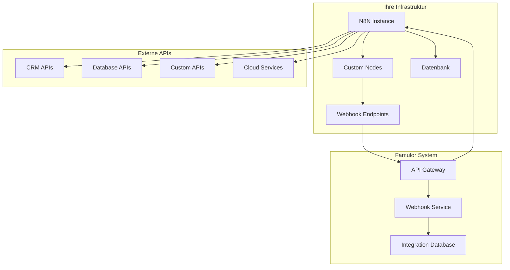
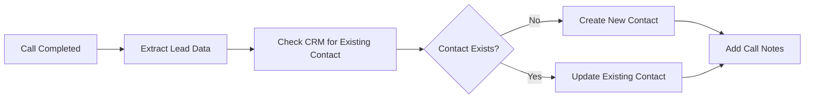

# N8N Integration

**Open-Source Alternative zu Famulor Automation**: Falls Sie die native Famulor Automation Platform nicht nutzen möchten, bietet N8N eine leistungsstarke, open-source Alternative für die Automatisierung Ihrer Workflows.

Verbinden Sie Famulor nahtlos mit **N8N** durch unseren offiziellen N8N-Node. Automatisieren Sie Workflows zwischen Ihrer KI-Telefonie-Plattform und über **400 verfügbaren Nodes** - von CRM-Systemen bis hin zu selbst entwickelten APIs.

<Card title="Offizieller Famulor N8N-Node" icon="github" href="https://github.com/bekservice/n8n-famulor">
  Installieren Sie unseren offiziellen N8N-Node direkt von GitHub
</Card>

## Wann sollten Sie N8N wählen?

<CardGroup cols={2}>
  <Card title="✅ N8N verwenden wenn" icon="check-circle" color="green">
    - Sie open-source Lösungen bevorzugen
    - Sie vollständige Kontrolle über Ihre Daten wünschen
    - Sie eigene Nodes entwickeln möchten
    - Sie kostenlosen, selbst-gehosteten Betrieb benötigen
    - Sie komplexe, verzweigte Workflows erstellen wollen
    - Sie bereits N8N für andere Integrationen nutzen
  </Card>
  <Card title="⚡ Famulor Automation verwenden wenn" icon="wand-magic-sparkles" color="blue">
    - Sie eine gehostete, wartungsfreie Lösung wünschen
    - Sie sofort ohne Setup beginnen möchten
    - Sie native Famulor-Features bevorzugen
    - Sie die volle Integration ins Famulor-Ökosystem wollen
    - Sie direkten Support von Famulor benötigen
  </Card>
</CardGroup>

## N8N vs. Famulor Automation Platform

Beiden Lösungen haben ihre spezifischen Stärken. Hier ist ein detaillierter Vergleich:

| Feature | N8N | Famulor Automation |
|---------|-----|-------------------|
| **Setup-Komplexität** | ⚠️ Erfordert Installation & Hosting | ✅ Sofort verfügbar, kein Setup |
| **Verfügbare Integrationen** | ✅ 400+ Nodes + Custom Nodes | ⚠️ Begrenzte Auswahl |
| **Workflow-Komplexität** | ✅ Sehr komplex, erweiterte Logik | ✅ Verzweigt, komplexe Logik |
| **Kosten** | ✅ Open-Source, kostenlos | ✅ Kostenlos enthalten |
| **Hosting** | ⚠️ Selbst-gehostet erforderlich | ✅ Vollständig gemanagt |
| **Custom Code** | ✅ JavaScript/Python/SQL Support | ✅ JavaScript/Python Support |
| **Datenkontrolle** | ✅ Vollständige Datenkontrolle | ⚠️ Famulor-gehostet |
| **Community** | ✅ Große Open-Source-Community | ✅ Direkte Famulor-Unterstützung |

### Praktische Anwendungsfälle für N8N

**✅ Ideal für N8N:**
- **Custom Workflows**: Komplexe, mehrstufige Automatisierungen
- **Datenverarbeitung**: Erweiterte Datenmanipulation und -transformation
- **API-Integrationen**: Verbindung zu beliebigen REST/GraphQL APIs
- **Datenschutz**: Vollständige Kontrolle über Ihre Daten
- **Enterprise-Integration**: Integration in bestehende IT-Infrastruktur

**⚡ Besser mit Famulor Automation:**
- **Schneller Start**: Sofort ohne Installation loslegen
- **Wartungsfrei**: Keine Server-Wartung oder Updates erforderlich
- **Native Features**: Tiefe Integration in Famulor-Features
- **Support**: Direkter Support vom Famulor-Team
- **Einfachheit**: Plug-and-Play ohne technische Komplexität

## Installation des Famulor N8N-Nodes

<Steps>
  <Step title="N8N-Installation">
    Falls noch nicht installiert, installieren Sie N8N:
    ```bash
    npm install n8n -g
    ```
  </Step>
  <Step title="Famulor-Node installieren">
    Klonen Sie unser Repository und installieren Sie den Node:
    ```bash
    git clone https://github.com/bekservice/n8n-famulor.git
    cd n8n-famulor
    npm install
    npm run build
    ```
  </Step>
  <Step title="Node zu N8N hinzufügen">
    Kopieren Sie den gebauten Node in Ihr N8N-Custom-Nodes-Verzeichnis oder verwenden Sie npm link
  </Step>
  <Step title="N8N neu starten">
    Starten Sie N8N neu, damit der neue Node erkannt wird
  </Step>
</Steps>

<Note>
**Tipp**: Detaillierte Installationsanweisungen finden Sie in der [README des GitHub-Repositories](https://github.com/bekservice/n8n-famulor).
</Note>

## Architektur-Übersicht

Die N8N-Integration ermöglicht bidirektionale Kommunikation zwischen Famulor und beliebigen Anwendungen über selbst-gehostete N8N-Instanzen.



## Verfügbare Trigger

Der Famulor N8N-Node unterstützt folgende Trigger-Events:

### Anruf-basierte Trigger

| Trigger | Beschreibung | Payload-Felder |
|---------|-------------|----------------|
| `call_started` | KI-Anruf begonnen | `caller_id`, `assistant_id`, `phone_number`, `timestamp` |
| `call_completed` | KI-Anruf beendet | `duration`, `transcript`, `caller_id`, `assistant_id`, `timestamp` |
| `call_failed` | Anruf fehlgeschlagen | `caller_id`, `error_reason`, `timestamp` |
| `voicemail_received` | Voicemail empfangen | `caller_id`, `duration`, `audio_url`, `timestamp` |

### SMS-basierte Trigger

| Trigger | Beschreibung | Payload-Felder |
|---------|-------------|----------------|
| `sms_received` | SMS empfangen | `sender`, `message`, `phone_number`, `timestamp` |
| `sms_sent` | SMS versendet | `recipient`, `message`, `status`, `timestamp` |

## Verfügbare Actions

Der N8N-Node unterstützt auch Actions für ausgehende Operationen:

### KI-Assistant Actions

| Action | Beschreibung | Erforderliche Felder |
|--------|-------------|---------------------|
| `make_call` | Ausgehenden Anruf starten | `phone_number`, `assistant_id`, `context` |
| `send_sms` | SMS versenden | `phone_number`, `message` |
| `create_assistant` | Neuen KI-Assistenten erstellen | `name`, `prompt`, `voice_id` |
| `update_assistant` | Assistenten-Konfiguration ändern | `assistant_id`, `prompt`, `settings` |

### Lead-Management Actions

| Action | Beschreibung | Erforderliche Felder |
|--------|-------------|---------------------|
| `create_lead` | Neuen Lead erstellen | `phone_number`, `name`, `source` |
| `update_lead` | Lead-Informationen aktualisieren | `lead_id`, `data` |
| `get_lead` | Lead-Informationen abrufen | `lead_id` oder `phone_number` |

## Authentifizierung & Sicherheit

Der N8N-Node implementiert robuste Sicherheitsmaßnahmen:

- **API-Key-Authentifizierung**: Sichere Verbindung mit Ihrem Famulor-Account
- **Webhook-Signatur-Verifizierung**: Verifizierung aller eingehenden Webhooks
- **HTTPS-Verschlüsselung**: Alle Datenübertragungen sind verschlüsselt
- **Rate Limiting**: Schutz vor API-Missbrauch

## Beliebte Workflow-Beispiele

### CRM-Synchronisation


### Lead-Qualifizierung


### Multi-Channel-Follow-up


## Erweiterte Konfiguration

### Webhook-Konfiguration
```json
{
  "webhook_url": "https://your-n8n.domain.com/webhook/famulor",
  "secret": "your-webhook-secret",
  "events": [
    "call_completed",
    "call_started",
    "sms_received"
  ]
}
```

### Custom Node Development
Der Famulor N8N-Node ist erweiterbar. Sie können eigene Nodes für spezifische Anwendungsfälle entwickeln:

```javascript
import {
  IExecuteFunctions,
  INodeType,
  INodeTypeDescription,
} from 'n8n-workflow';

export class FamulorCustom implements INodeType {
  description: INodeTypeDescription = {
    displayName: 'Famulor Custom',
    name: 'famulor-custom',
    group: ['transform'],
    version: 1,
    description: 'Custom Famulor integration',
    // ... weitere Konfiguration
  };
}
```

## Best Practices

### Performance-Optimierung
- Verwenden Sie Webhook-Filter um unnötige Trigger zu vermeiden
- Implementieren Sie Batch-Verarbeitung für hochvolumige Workflows
- Nutzen Sie N8Ns Queue-Mode für ressourcenintensive Operationen

### Sicherheit
- Verwenden Sie starke Webhook-Secrets
- Implementieren Sie IP-Whitelisting wenn möglich
- Loggen Sie sensible Daten nicht in N8N-Logs

### Monitoring
- Nutzen Sie N8Ns integriertes Monitoring
- Implementieren Sie Health-Checks für kritische Workflows
- Richten Sie Alerts für fehlgeschlagene Executions ein

## Warum N8N eine ausgezeichnete Alternative ist

### 🔓 Vollständige Kontrolle
N8N ist open-source und selbst-gehostet. Sie behalten die vollständige Kontrolle über Ihre Daten und Workflows.

### 🛠️ Unendliche Erweiterbarkeit
Mit der Möglichkeit, eigene Nodes zu entwickeln, sind Sie nicht auf vorgefertigte Integrationen beschränkt.

### 💰 Kosteneffizient
Keine monatlichen Gebühren - nur Ihre Hosting-Kosten. Ideal für Unternehmen mit hohem Workflow-Volumen.

### 🎯 Perfekt für Entwickler
N8N bietet alle Tools, die Entwickler benötigen: Code-Nodes, Git-Integration, und vollständige API-Kontrolle.

### 🏢 Enterprise-Ready
Self-hosted Deployment, RBAC, und Integration in bestehende IT-Landschaften.

<Warning>
**Wichtiger Hinweis**: N8N erfordert technisches Know-how für Installation, Wartung und Betrieb. Für einfache Workflows ohne technische Ressourcen ist die Famulor Automation Platform oft die bessere Wahl.
</Warning>

## Support und Ressourcen

<CardGroup cols={2}>
  <Card title="N8N-Node auf GitHub" icon="github" href="https://github.com/bekservice/n8n-famulor">
    Quellcode, Dokumentation und Issues des offiziellen Famulor N8N-Nodes
  </Card>
  <Card title="N8N Dokumentation" icon="book" href="https://docs.n8n.io/">
    Offizielle N8N-Dokumentation für erweiterte Workflows
  </Card>
  <Card title="Famulor Automation Platform" icon="wand-magic-sparkles" href="/automation-platform/introduction">
    Vergleichen Sie mit unserer nativen Automatisierungsplattform
  </Card>
  <Card title="Support kontaktieren" icon="life-ring" href="mailto:support@famulor.io">
    Benötigen Sie Hilfe mit der Integration? Kontaktieren Sie uns
  </Card>
</CardGroup>

## Contribution & Community

Unser N8N-Node ist open-source und wir freuen uns über Beiträge:

- **Bug Reports**: Melden Sie Probleme über GitHub Issues
- **Feature Requests**: Schlagen Sie neue Features vor
- **Pull Requests**: Tragen Sie Code-Verbesserungen bei
- **Dokumentation**: Helfen Sie bei der Verbesserung der Docs

<Note>
Folgen Sie unserem [GitHub-Repository](https://github.com/bekservice/n8n-famulor) für Updates und neue Features.
</Note>

---

**Fazit**: N8N ist eine ausgezeichnete Alternative zur Famulor Automation Platform, besonders wenn Sie vollständige Kontrolle über Ihre Workflows und Daten wünschen. Für Entwickler und Enterprise-Umgebungen bietet N8N unschlagbare Flexibilität und Anpassungsmöglichkeiten.
