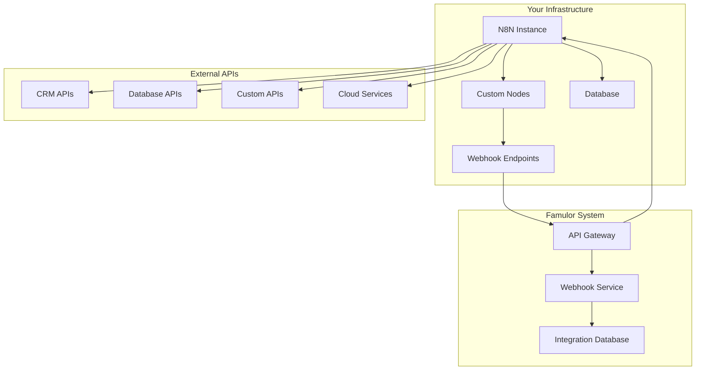
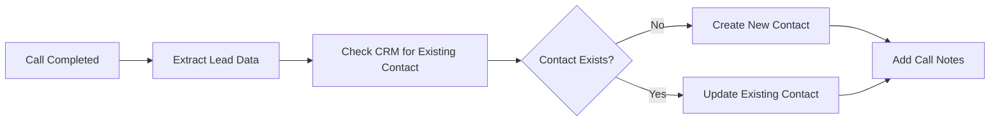
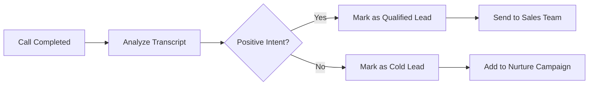

# N8N Integration

**Open-Source Alternative to Famulor Automation**: If you prefer not to use the native Famulor Automation Platform, N8N offers a powerful open-source alternative to automate your workflows.

Seamlessly connect Famulor with **N8N** using our official N8N node. Automate workflows between your AI telephony platform and over **400 available nodes** – from CRM systems to custom-built APIs.

<Card title="Official Famulor N8N Node" icon="github" href="https://github.com/bekservice/n8n-famulor">
  Install our official N8N node directly from GitHub
</Card>

## When Should You Choose N8N?

<CardGroup cols={2}>
  <Card title="✅ Use N8N if" icon="check-circle" color="green">
    - You prefer open-source solutions  
    - You want full control over your data  
    - You want to develop custom nodes  
    - You need free, self-hosted operation  
    - You want to build complex, branched workflows  
    - You already use N8N for other integrations  
  </Card>
  <Card title="⚡ Use Famulor Automation if" icon="wand-magic-sparkles" color="blue">
    - You want a hosted, maintenance-free solution  
    - You want to start immediately without setup  
    - You prefer native Famulor features  
    - You want full integration into the Famulor ecosystem  
    - You require direct support from Famulor  
  </Card>
</CardGroup>

## N8N vs. Famulor Automation Platform

Both solutions have their specific strengths. Here's a detailed comparison:

| Feature                  | N8N                                  | Famulor Automation                  |
|--------------------------|-------------------------------------|-----------------------------------|
| **Setup Complexity**      | ⚠️ Requires installation & hosting  | ✅ Ready to use, no setup needed   |
| **Available Integrations**| ✅ 400+ nodes + custom nodes         | ⚠️ Limited selection               |
| **Workflow Complexity**   | ✅ Highly complex, advanced logic    | ✅ Branched, complex logic         |
| **Cost**                 | ✅ Open-source, free                 | ✅ Included for free               |
| **Hosting**               | ⚠️ Requires self-hosting             | ✅ Fully managed                   |
| **Custom Code**           | ✅ JavaScript/Python/SQL support     | ✅ JavaScript/Python support       |
| **Data Control**          | ✅ Full data control                 | ⚠️ Famulor-hosted                 |
| **Community**             | ✅ Large open-source community       | ✅ Direct Famulor support          |

### Practical Use Cases for N8N

**✅ Ideal for N8N:**
- **Custom Workflows**: Complex, multi-step automations  
- **Data Processing**: Advanced data manipulation and transformation  
- **API Integrations**: Connect to arbitrary REST/GraphQL APIs  
- **Privacy**: Full control over your data  
- **Enterprise Integration**: Integration into existing IT infrastructure  

**⚡ Better with Famulor Automation:**
- **Quick Start**: Begin immediately without installation  
- **Maintenance-Free**: No server upkeep or updates required  
- **Native Features**: Deep integration with Famulor features  
- **Support**: Direct support from the Famulor team  
- **Simplicity**: Plug-and-play without technical complexity  

## Installing the Famulor N8N Node

<Steps>
  <Step title="Install N8N">
    If not installed yet, install N8N:
    ```bash
    npm install n8n -g
    ```
  </Step>
  <Step title="Install Famulor Node">
    Clone our repository and install the node:
    ```bash
    git clone https://github.com/bekservice/n8n-famulor.git
    cd n8n-famulor
    npm install
    npm run build
    ```
  </Step>
  <Step title="Add Node to N8N">
    Copy the built node into your N8N custom nodes directory or use npm link  
  </Step>
  <Step title="Restart N8N">
    Restart N8N so the new node is recognized  
  </Step>
</Steps>

<Note>
**Tip**: Detailed installation instructions can be found in the [GitHub repository README](https://github.com/bekservice/n8n-famulor).
</Note>

## Architecture Overview

The N8N integration enables bidirectional communication between Famulor and any applications via self-hosted N8N instances.


```mermaid
graph TB
    subgraph "Your Infrastructure"
        A[N8N Instance]
        B[Custom Nodes]
        C[Webhook Endpoints]
        D[Database]
    end
    
    subgraph "Famulor System"
        E[API Gateway]
        F[Webhook Service]
        G[Integration Database]
    end
    
    subgraph "External APIs"
        H[CRM APIs]
        I[Database APIs]
        J[Custom APIs]
        K[Cloud Services]
    end
    
    A --> B
    B --> C
    A --> D
    C --> E
    E --> F
    F --> G
    
    A --> H
    A --> I
    A --> J
    A --> K
    
    E --> A
```

## Available Triggers

The Famulor N8N node supports the following trigger events:

### Call-based Triggers

| Trigger           | Description           | Payload Fields                                  |
|-------------------|-----------------------|------------------------------------------------|
| `call_started`    | AI call started       | `caller_id`, `assistant_id`, `phone_number`, `timestamp` |
| `call_completed`  | AI call ended         | `duration`, `transcript`, `caller_id`, `assistant_id`, `timestamp` |
| `call_failed`     | Call failed           | `caller_id`, `error_reason`, `timestamp`       |
| `voicemail_received` | Voicemail received | `caller_id`, `duration`, `audio_url`, `timestamp` |

### SMS-based Triggers

| Trigger      | Description    | Payload Fields                          |
|--------------|----------------|----------------------------------------|
| `sms_received` | SMS received | `sender`, `message`, `phone_number`, `timestamp` |
| `sms_sent`    | SMS sent      | `recipient`, `message`, `status`, `timestamp`  |

## Available Actions

The N8N node also supports actions for outgoing operations:

### AI Assistant Actions

| Action           | Description              | Required Fields                  |
|------------------|--------------------------|--------------------------------|
| `make_call`      | Initiate outgoing call    | `phone_number`, `assistant_id`, `context` |
| `send_sms`       | Send SMS                 | `phone_number`, `message`       |
| `create_assistant`| Create new AI assistant  | `name`, `prompt`, `voice_id`   |
| `update_assistant`| Change assistant config  | `assistant_id`, `prompt`, `settings` |

### Lead Management Actions

| Action       | Description                 | Required Fields                |
|--------------|-----------------------------|-------------------------------|
| `create_lead`| Create new lead             | `phone_number`, `name`, `source` |
| `update_lead`| Update lead information     | `lead_id`, `data`              |
| `get_lead`   | Retrieve lead information   | `lead_id` or `phone_number`   |

## Authentication & Security

The N8N node implements robust security measures:

- **API Key Authentication**: Secure connection to your Famulor account  
- **Webhook Signature Verification**: Verifies all incoming webhooks  
- **HTTPS Encryption**: All data transmissions are encrypted  
- **Rate Limiting**: Protects against API abuse  

## Popular Workflow Examples

### CRM Synchronization

```mermaid
flowchart LR
    A[Call Completed] --> B[Extract Lead Data]
    B --> C[Check CRM for Existing Contact]
    C --> D{Contact Exists?}
    D -->|No| E[Create New Contact]
    D -->|Yes| F[Update Existing Contact]
    E --> G[Add Call Notes]
    F --> G[Add Call Notes]
```

### Lead Qualification

```mermaid
flowchart LR
    A[Call Completed] --> B[Analyze Transcript]
    B --> C{Positive Intent?}
    C -->|Yes| D[Mark as Qualified Lead]
    C -->|No| E[Mark as Cold Lead]
    D --> F[Send to Sales Team]
    E --> G[Add to Nurture Campaign]
```

### Multi-Channel Follow-up

```mermaid
flowchart LR
    A[Call Completed] --> B[Wait 1 Hour]
    B --> C[Send Follow-up SMS]
    C --> D[Wait 24 Hours]
    D --> E[Send Email Summary]
    E --> F[Create Calendar Reminder]
```

## Advanced Configuration

### Webhook Configuration
```json
{
  "webhook_url": "https://your-n8n.domain.com/webhook/famulor",
  "secret": "your-webhook-secret",
  "events": [
    "call_completed",
    "call_started",
    "sms_received"
  ]
}
```

### Custom Node Development
The Famulor N8N node is extensible. You can develop your own nodes for specific use cases:

```javascript
import {
  IExecuteFunctions,
  INodeType,
  INodeTypeDescription,
} from 'n8n-workflow';

export class FamulorCustom implements INodeType {
  description: INodeTypeDescription = {
    displayName: 'Famulor Custom',
    name: 'famulor-custom',
    group: ['transform'],
    version: 1,
    description: 'Custom Famulor integration',
    // ... additional configuration
  };
}
```

## Best Practices

### Performance Optimization
- Use webhook filters to avoid unnecessary triggers  
- Implement batch processing for high-volume workflows  
- Use N8N’s queue mode for resource-intensive operations  

### Security
- Use strong webhook secrets  
- Implement IP whitelisting where possible  
- Avoid logging sensitive data in N8N logs  

### Monitoring
- Use N8N’s built-in monitoring  
- Implement health checks for critical workflows  
- Set up alerts for failed executions  

## Why N8N Is an Excellent Alternative

### 🔓 Full Control
N8N is open-source and self-hosted. You retain complete control over your data and workflows.

### 🛠️ Infinite Extensibility
With the ability to develop custom nodes, you’re not limited to pre-built integrations.

### 💰 Cost Effective
No monthly fees – only your hosting costs. Ideal for companies with high workflow volumes.

### 🎯 Perfect for Developers
N8N offers all the tools developers need: code nodes, Git integration, and full API control.

### 🏢 Enterprise Ready
Self-hosted deployment, RBAC, and integration into existing IT environments.

<Warning>
**Important Note**: N8N requires technical expertise for installation, maintenance, and operation. For simple workflows without technical resources, the Famulor Automation Platform is often the better choice.
</Warning>

## Support & Resources

<CardGroup cols={2}>
  <Card title="N8N Node on GitHub" icon="github" href="https://github.com/bekservice/n8n-famulor">
    Source code, documentation, and issues for the official Famulor N8N node  
  </Card>
  <Card title="N8N Documentation" icon="book" href="https://docs.n8n.io/">
    Official N8N documentation for advanced workflows  
  </Card>
  <Card title="Famulor Automation Platform" icon="wand-magic-sparkles" href="/en/automation-platform/introduction">
    Compare with our native automation platform  
  </Card>
  <Card title="Contact Support" icon="life-ring" href="mailto:support@famulor.io">
    Need help with integration? Contact us  
  </Card>
</CardGroup>

## Contribution & Community

Our N8N node is open-source and we welcome contributions:

- **Bug Reports**: Report issues via GitHub Issues  
- **Feature Requests**: Suggest new features  
- **Pull Requests**: Contribute code improvements  
- **Documentation**: Help improve the docs  

<Note>
Follow our [GitHub repository](https://github.com/bekservice/n8n-famulor) for updates and new features.
</Note>

---

**Summary**: N8N is an excellent alternative to the Famulor Automation Platform, especially if you want full control over your workflows and data. For developers and enterprise environments, N8N offers unmatched flexibility and customization options.