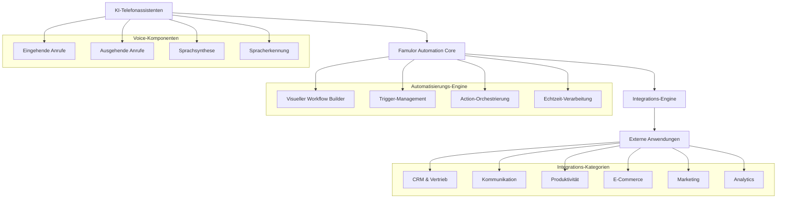

# Famulor Automation - Integrationen Übersicht

Famulor Automation ist eine umfassende No-Code-Automatisierungsplattform, die Ihre KI-Telefonassistenten mit über **379 externen Anwendungen und Diensten** verbindet. Die Plattform ermöglicht es Unternehmen, anspruchsvolle Anruf-Automatisierungs-Workflows zu erstellen, ohne Code zu schreiben, und integriert Sprachinteraktionen mit externen Systemen, um Abläufe zu optimieren und Kundenerlebnisse zu verbessern.

## Architektur-Übersicht

Die Famulor Automation Plattform folgt einer modularen Architektur, die KI-Assistenten nahtlos mit Workflow-Orchestrierung und externen Integrationen verbindet.

## Kern-Automatisierungs-Trigger

### Anruf-basierte Trigger

#### Anruf Beendet Trigger
- Aktiviert sich sofort, wenn ein KI-Anruf beendet wird
- Bietet Zugang zu vollständiger Gesprächstranskription und KI-Antworten
- Umfasst Anrufdauer, Status und detaillierte Metadaten
- Ermöglicht Post-Call-Automatisierung wie CRM-Updates und Follow-up-Aktionen

#### Eingehender Anruf Variable Injection
- Aktiviert sich, bevor der KI-Assistent einen eingehenden Anruf annimmt
- Reichert KI-Kontext mit Echtzeit-Kundendaten an
- Passt Gesprächsfluss basierend auf Anruferinformationen an
- Ermöglicht personalisierte Interaktionen vom ersten Moment an

## Integrations-Kategorien

### 🤖 Künstliche Intelligenz & Machine Learning
- **OpenAI** - Erweiterte Textverarbeitung und Analyse
- **Anthropic Claude** - Natürliches Sprachverständnis und -generierung
- **Google AI** - Multimodale KI-Funktionen
- **Cohere** - Enterprise-KI-Lösungen

### 📊 Customer Relationship Management (CRM)
- **HubSpot** - Kontakt- und Lead-Management
- **Salesforce** - Umfassende CRM-Operationen
- **Zoho CRM** - Lead-Management und Scoring
- **Pipedrive** - Visuelles Pipeline-Management
- **Microsoft Dynamics** - Enterprise CRM-Lösung

### 💬 Kommunikationsplattformen
- **Slack** - Channel-Messaging und Benachrichtigungen
- **Microsoft Teams** - Team-Zusammenarbeit und Messaging
- **Discord** - Community-Messaging und Voice
- **Telegram** - Instant Messaging
- **WhatsApp Business** - Business-Kommunikation

### 📧 E-Mail Marketing & Kommunikation
- **Gmail** - E-Mail senden und empfangen
- **Mailchimp** - E-Mail-Kampagnen-Management
- **ActiveCampaign** - Erweiterte E-Mail-Automatisierung
- **Outlook** - Enterprise E-Mail-Lösung
- **SendGrid** - E-Mail-Delivery-Service

### 📈 Produktivität & Projektmanagement
- **Google Sheets** - Tabellenkalkulations-Datenmanagement
- **Notion** - Wissensbasis-Management
- **ClickUp** - Task- und Projektmanagement
- **Airtable** - Datenbank- und Tabellenkalkulations-Hybrid
- **Asana** - Team-Projektmanagement

### 📅 Kalender & Terminplanung
- **Google Calendar** - Event-Erstellung und -Management
- **Calendly** - Automatisierte Terminplanung
- **Microsoft Outlook Calendar** - Enterprise-Kalender-Management
- **Cal.com** - Open-Source-Terminplanung

### 🛒 E-Commerce & Zahlungsabwicklung
- **Shopify** - Produktkatalog-Management
- **WooCommerce** - WordPress E-Commerce-Integration
- **Stripe** - Zahlungsabwicklung
- **PayPal** - Online-Zahlungen
- **Square** - Point-of-Sale-Lösungen

### 📊 Marketing & Analytics
- **Google Analytics** - Website-Traffic-Analyse
- **Facebook/Meta Ads** - Anzeigenkampagnen-Management
- **Mixpanel** - Event-Tracking und Analytics
- **HubSpot Marketing** - Marketing-Automatisierung
- **Zapier** - Workflow-Automatisierung

### 📋 Formulare & Umfrage-Plattformen
- **Typeform** - Interaktive Formular-Erstellung
- **JotForm** - Formular-Erstellung und -Hosting
- **Google Forms** - Einfache Umfrage-Erstellung
- **SurveyMonkey** - Professionelle Umfragen

### 📁 Dateispeicherung & -Management
- **Google Drive** - Cloud-Dateispeicherung und -freigabe
- **Dropbox** - Dateisynchronisation und -freigabe
- **OneDrive** - Microsoft Cloud-Speicher
- **Box** - Enterprise Content Management

### 🎫 Kundensupport
- **Zendesk** - Ticket-Management und -verfolgung
- **Freshdesk** - Cloud-basierter Helpdesk
- **Intercom** - Kundenkommunikations-Plattform
- **Help Scout** - E-Mail-basierter Helpdesk

## Hauptvorteile von Famulor Automation

### ⚡ Echtzeit-Integration
- Sofortige Datenübertragung zwischen Anrufen und externen Systemen
- Nulllatenz bei kritischen Geschäftsoperationen
- Live-Daten-Injection für personalisierte Gespräche

### 🎯 Intelligente Automatisierung
- KI-gesteuerte Entscheidungsfindung basierend auf Gesprächsinhalten
- Dynamische Workflow-Anpassung je nach Anrufverlauf
- Prädiktive Aktionen basierend auf Kundendaten

### 🔄 Bidirektionale Datenflows
- Daten fließen sowohl zu als auch von externen Systemen
- Automatische Datensynchronisation zwischen Plattformen
- Konsistente Informationen über alle Touchpoints

### 🛡️ Enterprise-Sicherheit
- End-to-End-Verschlüsselung aller Datenübertragungen
- SOC 2 Type II Compliance
- GDPR/DSGVO-konforme Datenverarbeitung

## Erste Schritte

1. **Integration auswählen** - Wählen Sie aus über 379 verfügbaren Integrationen
2. **Authentifizierung einrichten** - Verbinden Sie Ihre Konten sicher
3. **Workflow erstellen** - Nutzen Sie den visuellen Builder für Ihre Automatisierung
4. **Testen & Bereitstellen** - Validieren Sie Ihre Flows vor der Produktionsfreigabe

## Nächste Schritte

<CardGroup cols={2}>
  <Card title="KI & Machine Learning" icon="brain" href="/automation-platform/integrations/ai-machine-learning">
    Erweiterte KI-Funktionen für Ihre Telefonassistenten
  </Card>
  <Card title="CRM-Integrationen" icon="users" href="/automation-platform/integrations/crm">
    Verbinden Sie Ihre Kundendaten mit Anruf-Automatisierung
  </Card>
  <Card title="Kommunikationsplattformen" icon="comments" href="/automation-platform/integrations/communication">
    Nahtlose Team-Kommunikation und Benachrichtigungen
  </Card>
  <Card title="E-Mail Marketing" icon="envelope" href="/automation-platform/integrations/email-marketing">
    Automatisierte E-Mail-Workflows nach Anrufen
  </Card>
</CardGroup>

---

**Hinweis**: Alle Integrationen sind sofort verfügbar und können ohne technische Kenntnisse eingerichtet werden. Für spezielle Anforderungen steht unser Support-Team zur Verfügung.