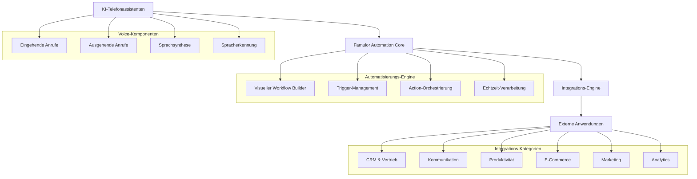

# Famulor Automation - Integrations Overview

Famulor Automation is a comprehensive no-code automation platform that connects your AI phone assistants with over **379 external applications and services**. The platform allows businesses to create advanced call automation workflows without writing code, integrating voice interactions with external systems to optimize processes and enhance customer experiences.

## Architecture Overview

The Famulor Automation platform follows a modular architecture that seamlessly connects AI assistants with workflow orchestration and external integrations.

```mermaid
graph TB
    A[KI-Telefonassistenten] --> B[Famulor Automation Core]
    B --> C[Integrations-Engine]
    C --> D[Externe Anwendungen]
    
    subgraph "Voice-Komponenten"
        A1[Eingehende Anrufe]
        A2[Ausgehende Anrufe]
        A3[Sprachsynthese]
        A4[Spracherkennung]
    end
    
    subgraph "Automatisierungs-Engine"
        B1[Visueller Workflow Builder]
        B2[Trigger-Management]
        B3[Action-Orchestrierung]
        B4[Echtzeit-Verarbeitung]
    end
    
    subgraph "Integrations-Kategorien"
        D1[CRM & Vertrieb]
        D2[Kommunikation]
        D3[Produktivität]
        D4[E-Commerce]
        D5[Marketing]
        D6[Analytics]
    end
    
    A --> A1
    A --> A2
    A --> A3
    A --> A4
    B --> B1
    B --> B2
    B --> B3
    B --> B4
    D --> D1
    D --> D2
    D --> D3
    D --> D4
    D --> D5
    D --> D6
```

## Core Automation Triggers

### Call-Based Triggers

#### Call Ended Trigger
- Activates immediately when an AI call ends
- Provides access to full call transcription and AI responses
- Includes call duration, status, and detailed metadata
- Enables post-call automation such as CRM updates and follow-up actions

#### Incoming Call Variable Injection
- Activates before the AI assistant answers an incoming call
- Enriches AI context with real-time customer data
- Adjusts call flow based on caller information
- Enables personalized interactions from the very first moment

## Integration Categories

### 🤖 Artificial Intelligence & Machine Learning
- **OpenAI** - Advanced text processing and analysis
- **Anthropic Claude** - Natural language understanding and generation
- **Google AI** - Multimodal AI capabilities
- **Cohere** - Enterprise AI solutions

### 📊 Customer Relationship Management (CRM)
- **HubSpot** - Contact and lead management
- **Salesforce** - Comprehensive CRM operations
- **Zoho CRM** - Lead management and scoring
- **Pipedrive** - Visual pipeline management
- **Microsoft Dynamics** - Enterprise CRM solution

### 💬 Communication Platforms
- **Slack** - Channel messaging and notifications
- **Microsoft Teams** - Team collaboration and messaging
- **Discord** - Community messaging and voice
- **Telegram** - Instant messaging
- **WhatsApp Business** - Business communication

### 📧 Email Marketing & Communication
- **Gmail** - Sending and receiving email
- **Mailchimp** - Email campaign management
- **ActiveCampaign** - Advanced email automation
- **Outlook** - Enterprise email solution
- **SendGrid** - Email delivery service

### 📈 Productivity & Project Management
- **Google Sheets** - Spreadsheet data management
- **Notion** - Knowledge base management
- **ClickUp** - Task and project management
- **Airtable** - Hybrid database and spreadsheet
- **Asana** - Team project management

### 📅 Calendar & Scheduling
- **Google Calendar** - Event creation and management
- **Calendly** - Automated appointment scheduling
- **Microsoft Outlook Calendar** - Enterprise calendar management
- **Cal.com** - Open-source scheduling

### 🛒 E-Commerce & Payment Processing
- **Shopify** - Product catalog management
- **WooCommerce** - WordPress e-commerce integration
- **Stripe** - Payment processing
- **PayPal** - Online payments
- **Square** - Point-of-sale solutions

### 📊 Marketing & Analytics
- **Google Analytics** - Website traffic analysis
- **Facebook/Meta Ads** - Ad campaign management
- **Mixpanel** - Event tracking and analytics
- **HubSpot Marketing** - Marketing automation
- **Zapier** - Workflow automation

### 📋 Forms & Survey Platforms
- **Typeform** - Interactive form creation
- **JotForm** - Form creation and hosting
- **Google Forms** - Simple survey creation
- **SurveyMonkey** - Professional surveys

### 📁 File Storage & Management
- **Google Drive** - Cloud file storage and sharing
- **Dropbox** - File synchronization and sharing
- **OneDrive** - Microsoft cloud storage
- **Box** - Enterprise content management

### 🎫 Customer Support
- **Zendesk** - Ticket management and tracking
- **Freshdesk** - Cloud-based helpdesk
- **Intercom** - Customer communication platform
- **Help Scout** - Email-based helpdesk

## Key Benefits of Famulor Automation

### ⚡ Real-Time Integration
- Instant data transfer between calls and external systems
- Zero latency in critical business operations
- Live data injection for personalized conversations

### 🎯 Intelligent Automation
- AI-driven decision-making based on call content
- Dynamic workflow adjustment according to call progress
- Predictive actions based on customer data

### 🔄 Bidirectional Data Flows
- Data flows to and from external systems
- Automatic data synchronization across platforms
- Consistent information across all touchpoints

### 🛡️ Enterprise Security
- End-to-end encryption of all data transmissions
- SOC 2 Type II compliance
- GDPR-compliant data processing

## Getting Started

1. **Select an integration** - Choose from over 379 available integrations
2. **Set up authentication** - Securely connect your accounts
3. **Build your workflow** - Use the visual builder to create your automation
4. **Test & deploy** - Validate your flows before going live

## Next Steps

<CardGroup cols={2}>
  <Card title="AI & Machine Learning" icon="brain" href="/en/automation-platform/integrations/ai-machine-learning">
    Advanced AI features for your phone assistants
  </Card>
  <Card title="CRM Integrations" icon="users" href="/en/automation-platform/integrations/crm">
    Connect your customer data with call automation
  </Card>
  <Card title="Communication Platforms" icon="comments" href="/en/automation-platform/integrations/communication">
    Seamless team communication and notifications
  </Card>
  <Card title="Email Marketing" icon="envelope" href="/en/automation-platform/integrations/email-marketing">
    Automated email workflows triggered by calls
  </Card>
</CardGroup>

---

**Note**: All integrations are immediately available and can be set up without technical expertise. For special requirements, our support team is available to assist.