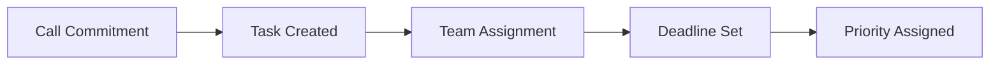

# Productivity & Project Management Integrations

Transform every phone interaction into actionable tasks and organized workflows. Famulor Automation connects your AI phone assistants with leading productivity tools for seamless workflow automation.

## Google Sheets Integration

### Overview
Google Sheets offers powerful spreadsheet and data management capabilities with real-time collaboration.

### AI Phone Assistant Use Cases

#### 📊 Automatic Call Logging
**Description**: Automatically populate spreadsheets with call details, outcomes, and next steps.

**Logging Data**:
- Date and time of the call
- Customer contact information
- Call duration and topics
- Outcomes and sentiment analysis
- Follow-up actions and deadlines

#### 📈 Lead Tracking Dashboard
**Description**: Manage real-time lead status updates based on phone conversations.

**Dashboard Elements**:
- Lead pipeline visualization
- Conversion tracking by call source
- Team performance metrics
- Forecast calculations

#### 📋 Performance Analytics
**Description**: Track call metrics and conversion rates for team performance analysis.

---

## Notion Integration

### Overview
Notion combines notes, databases, wikis, and project management into a unified workspace.

### AI Phone Assistant Use Cases

#### 📚 Customer Knowledge Base
**Description**: Build comprehensive customer profiles including call history and preferences.

**Knowledge Base Structure**:
- Customer profile pages with call history
- Product interest tracking
- Communication preferences
- Project status and milestones

#### 🚀 Project Initiation
**Description**: Automatically create new project pages when customers request services during calls.

**Automatic Project Creation**:
- Project template based on service type
- Stakeholder assignment from call data
- Timeline and milestone planning
- Resource allocation

#### 🤝 Team Collaboration
**Description**: Share call insights and action items with project teams via Notion pages.

---

## ClickUp Integration

### Overview
ClickUp is an all-in-one productivity platform for task, project, and team management.

### AI Phone Assistant Use Cases

#### ✅ Automatic Task Creation
**Description**: Generate tasks for team members based on commitments made during calls.

**Task Generation**:

#### 📊 Project Status Updates
**Description**: Update project progress as customers provide feedback during check-in calls.

#### 📋 Customer Request Tracking
**Description**: Convert customer requests into trackable tasks with automatic assignment.

---

## Airtable Integration

### Overview
Airtable combines the user-friendliness of spreadsheets with the power of databases.

### AI Phone Assistant Use Cases

#### 🔗 Customer Journey Mapping
**Description**: Link complete customer journeys with connected records across touchpoints.

#### 📦 Inventory Management
**Description**: Update product availability when customers inquire about specific items.

#### 🎫 Service Request Management
**Description**: Create and track service requests with detailed call context.

---

## Asana Integration

### Overview
Asana is a powerful project management tool for team coordination and workflow automation.

### AI Phone Assistant Use Cases

#### 🎯 Milestone Tracking
**Description**: Track project milestones based on customer feedback during calls.

#### 👥 Team Workload Management
**Description**: Balance team workloads via intelligent task distribution from calls.

#### 📈 Goal Tracking
**Description**: Link call outcomes to company goals and OKRs.

---

## Monday.com Integration

### AI Phone Assistant Use Cases

#### 📊 Visual Project Boards
**Description**: Visualize call-based projects on color-coded boards.

#### ⏰ Time Tracking
**Description**: Track time spent on call-generated tasks.

---

## Trello Integration

### AI Phone Assistant Use Cases

#### 📋 Kanban Workflow
**Description**: Move call tasks through Kanban boards for visual management.

#### 🏷️ Label System
**Description**: Categorize tasks based on call type and priority.

---

## Best Practices for Productivity Integrations

### 🎯 Task Management
- **Clear Task Descriptions**: Use call context to create detailed task descriptions
- **Priority System**: Implement priorities based on customer importance
- **Deadline Management**: Set realistic deadlines informed by customer needs
- **Progress Tracking**: Monitor task progress and completion rates

### 📊 Data Organization
- **Standardized Fields**: Use consistent data fields across all tools
- **Categorization**: Implement clear categorization systems
- **Search Optimization**: Structure data for easy searchability
- **Archiving**: Develop strategies for archiving old data

### 🔄 Workflow Automation
- **Trigger Events**: Define clear triggers for automations
- **Conditional Logic**: Implement intelligent conditional workflows
- **Error Handling**: Develop robust error handling
- **Performance Optimization**: Optimize workflows for speed

## Getting Started

<Steps>
  <Step title="Select Tools">
    Choose your primary productivity tools
  </Step>
  <Step title="Configure Integration">
    Set up API access and permissions
  </Step>
  <Step title="Create Workflows">
    Build automation workflows in the visual builder
  </Step>
  <Step title="Team Training">
    Train your team on new workflows
  </Step>
</Steps>

## Next Steps

<CardGroup cols={2}>
  <Card title="CRM Integration" icon="users" href="/en/automation-platform/integrations/crm">
    Connect productivity tools with customer data
  </Card>
  <Card title="Calendar" icon="calendar" href="/en/automation-platform/integrations/calendar">
    Automated scheduling from tasks
  </Card>
  <Card title="Email Marketing" icon="envelope" href="/en/automation-platform/integrations/email-marketing">
    Email updates on task progress
  </Card>
  <Card title="Analytics" icon="chart-line" href="/en/automation-platform/integrations/analytics">
    Analyze the performance of your workflows
  </Card>
</CardGroup>